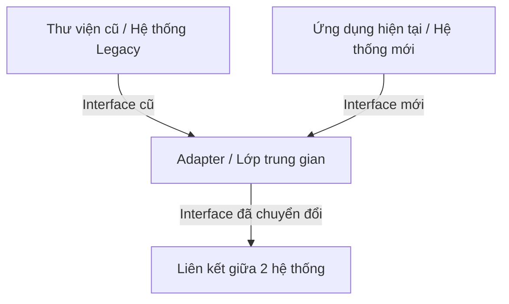
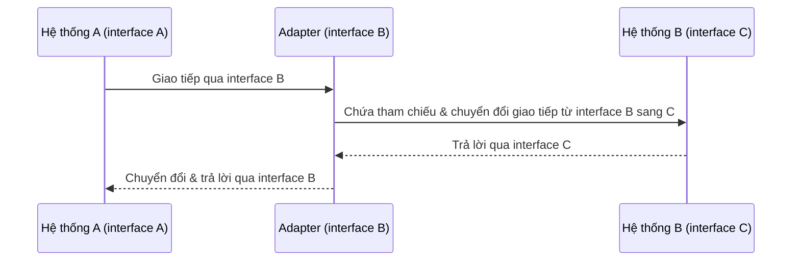
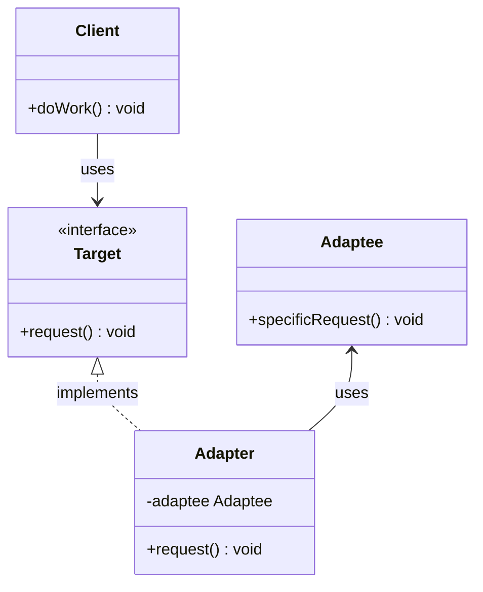

# Adapter

## Giới thiệu

### Định nghĩa

Adapter Pattern là một mẫu thiết kế thuộc loại cấu trúc (Structural Patterns) . Nó giúp kết nối giữa hai interface không tương thích sao cho chúng có thể làm việc cùng nhau mà không cần sửa đổi. Để thực hiện điều này, Adapter Pattern sử dụng một lớp trung gian (gọi là adapter) để chuyển đổi interface của lớp này thành một interface khác.

### Mục đích:

- Giúp kết nối giữa các đối tượng hoặc hệ thống với nhau mà không cần phải sửa đổi chúng, dựa trên nguyên tắc "kết nối chứ không là để sửa đổi".
- Tích hợp hoặc kết nối các hệ thống có sẵn, thư viện, modules có giao diện không tương thích.
- Cung cấp một giải pháp linh hoạt để mở rộng và tái sử dụng mã nguồn.

### Ý tưởng chính của Pattern

Adapter Pattern dựa trên một ý tưởng đơn giản nhưng mạnh mẽ: Thay vì thay đổi các đối tượng hoặc hệ thống để chúng tương thích với nhau, chúng ta sẽ tạo ra một "bộ chuyển đổi" (adapter) để làm cầu nối giữa chúng. Trong ngữ cảnh thiết kế phần mềm, Adapter thực sự giống như một bộ chuyển đổi cắm điện: Nó cho phép hai đầu kết nối không tương thích có thể hoạt động cùng nhau mà không cần phải thay đổi bất kì đầu nào.

## Đặt vấn đề

Trong quá trình phát triển phần mềm, chúng ta thường gặp phải tình huống mà hai hệ thống hoặc thư viện có sẵn không thể nối tiếp với nhau trực tiếp bởi vì chúng có những interface khác biệt.

Ví dụ:



- Muốn tích hợp một thư viện cũ vào ứng dụng hiện tại nhưng interface không tương thích.
- Muốn kết nối một hệ thống legacy với hệ thống mới nhưng hai bên có interface khác biệt.

Lúc này, ta cần một lớp trung gian đóng vai trò nối kết, chuyển đổi interface giữa chúng.

## Giải pháp

Giải pháp đề xuất ở đây là sử dụng một "Adapter" - một lớp trung gian để "dịch" hoặc "chuyển đổi" interface từ hệ thống này sang hệ thống kia, giúp chúng có thể làm việc chung mà không gặp vấn đề.

Adapter Pattern được áp dụng như sau:



- Xác định hai hệ thống (object) có interface khác biệt cần tương tác.
- Tạo một lớp Adapter triển khai interface mà hệ thống sử dụng cần.
- Adapter sẽ chứa tham chiếu tới object kia và thực hiện chuyển đổi interface.
- Hệ thống sẽ giao tiếp với Adapter thay vì object kia.

Với cách này, ta tránh sửa đổi hai hệ thống hiện có mà vẫn kết nối được chúng.

## Cấu Trúc

Các thành phần trong Adapter Pattern:



- Target: interface mà client sử dụng.
- Adapter: lớp trung gian, triển khai interface Target và gọi tới Adaptee.
- Adaptee: lớp cần được adapt để phù hợp với interface Target.
- Client: tương tác với Target interface.

## Triển khai Adapter Pattern

Adapter Pattern cho phép bạn "đóng gói" một interface không tương thích vào một lớp adapter để làm cho nó tương thích với interface khác. Để triển khai Adapter Pattern, chúng ta sẽ tạo ra một lớp adapter, nó sẽ kết hợp giữa interface cũ và interface mới.

### 1. Định nghĩa interface cần phục vụ

Đầu tiên, bạn cần xác định rõ interface mà ứng dụng hiện tại hoặc client muốn sử dụng. Đây chính là interface mà lớp adapter sẽ phải triển khai.

```java
public interface NewInterface {
    void newMethod();
}
```

### 2. Tạo lớp adapter

Lớp adapter này sẽ triển khai (implement) interface mới và có tham chiếu đến đối tượng của lớp cũ (hoặc interface cũ).

```java
public class Adapter implements NewInterface {
    private OldClass oldObject;

    public Adapter(OldClass oldObject) {
        this.oldObject = oldObject;
    }

    @Override
    public void newMethod() {
        oldObject.oldMethod();
    }
}
```

Trong ví dụ trên, `OldClass` là một lớp mà bạn muốn tích hợp vào hệ thống hiện tại. Hàm `newMethod` của `NewInterface` được "đóng gói" bằng cách sử dụng hàm `oldMethod` của `OldClass`.

### 3. Sử dụng lớp adapater

Khi muốn sử dụng lớp cũ trong ứng dụng của bạn, thay vì tạo một instance của `OldClass`, bạn sẽ tạo một instance của `Adapter`.

```java
public class Client {
    public static void main(String[] args) {
        NewInterface target = new Adapter(new OldClass());
        target.newMethod();
    }
}
```

Bằng cách này, lớp `Client` có thể sử dụng được lớp `OldClass` mà không cần phải biết đến chi tiết bên trong nó. Mọi tương tác đều diễn ra thông qua `NewInterface`.

## Ví dụ áp dụng Adapter Pattern

Xét một ví dụ thực tế: Bạn muốn sử dụng một bóng đèn led cần điện áp 3v, nhưng nguồn điện ở nhà bạn lại là 220v. Để bóng đèn hoạt động đúng và không bị cháy, bạn cần một thiết bị chuyển đổi từ 220v xuống 3v. Ở đây, thiết bị chuyển đổi đóng vai trò như một Adapter.

- Hiệu điện thế lớn hơn 3v bóng đèn sẽ cháy.
- Hiệu điện thế nhỏ hơn 3v bóng sáng mờ hoặc không phát sáng (Trong trường hợp này ta quy ước nó không phát sáng).
- Hiệu điện thế bằng 3v bóng đèn phát sáng

Như vậy ta cần một adapter chuyển từ 220v sáng 3v. Mô hình thể hiện như sau:


LedInterFace.java

```java
public interface LedInterFace {
    int connect();
}
```

VietNamPower.java

```java
public class VietNamPower {

    private int electric = 220;

    public int getElectric() {
        return this.electric;
    }
}
```

AdapterElectric.java

```java
public class AdapterElectric implements LedInterFace{
    VietNamPower adaptee;

    public AdapterElectric(VietNamPower adaptee) {
        this.adaptee = adaptee;
    }


    @Override
    public int connect() {
        int electric = this.downElectric(this.adaptee.getElectric());
        // Hiệu điện thế lớn hơn 3v bóng đèn sẽ cháy.
        if (electric > 3)
            return -1;
        //Hiệu điện thế bằng 3v bóng đèn phát sáng.
        if (electric == 3)
            return 1;
        // Đén không phát sáng.
        return 0;
    }

    private int downElectric(int electric) {
        return electric - 217;
    }
}
```

Led.java

```java
public class Led {
    public static void main(String[] args) {
        LedInterFace led = new AdapterElectric(new VietNamPower());

        switch (led.connect()) {
            // Nếu hiệu điện thế lớn 3v kết quả trả về -1
            case -1:
            {
                System.out.println("Crash");
                break;
            }
            // Nếu hiệu điện thế nhỏ hơn 3v kết quả trả về 0
            case 0:
            {
                System.out.println("Not Thing");
                break;
            }
            // Nếu hiệu điện thế bằng 3v kết quả trả về 1
            case 1:
            {
                System.out.println("Light");
                break;
            }
        }
    }
}
```

Kết quả:

```
Light
```

## So sánh

### 1. Adapter vs Bridge

- **Adapter**: Mục tiêu chính của Adapter là biến đổi một interface của lớp này thành interface mong muốn của lớp khác. Nó giúp hai lớp hoạt động cùng nhau mặc dù chúng có những interface không tương thích.

- **Bridge**: Bridge tạo ra một cầu nối giữa abstractions và implementations, giúp cả hai có thể thay đổi một cách độc lập.

### 2. Adapter vs Decorator

- **Adapter**: Như đã nói ở trên, Adapter thay đổi interface của một đối tượng để phù hợp với một interface khác.

- **Decorator**: Decorator thêm các trách nhiệm hoặc chức năng vào một đối tượng mà không cần sửa đổi mã nguồn của nó. Nó giữ nguyên interface của đối tượng và thêm chức năng mở rộng.

### 3. Adapter vs Facade

- **Adapter**: Adapter chuyển đổi một interface này sang một interface khác.

- **Facade**: Facade cung cấp một giao diện đơn giản hoá cho một nhóm các giao diện trong một hệ thống con. Mẫu Facade giúp giảm sự phức tạp khi giao tiếp với các hệ thống phức tạp.

### 4. Adapter vs Proxy

- **Adapter**: Điều chỉnh interfaces giữa hai lớp hoặc đối tượng.

- **Proxy**: Proxy không chỉ giữ nguyên interface, mà còn kiểm soát và quản lý việc truy cập đến đối tượng thực.

## Lưu ý khi áp dụng Adapter Pattern

Khi áp dụng Adapter Pattern trong thiết kế phần mềm, có một số lưu ý quan trọng mà bạn cần xem xét:

### 1. **Đừng lạm dụng**

Adapter Pattern hữu ích khi bạn cần tích hợp một thư viện hoặc một hệ thống cũ mà không thể (hoặc không nên) thay đổi. Tuy nhiên, bạn không nên sử dụng nó chỉ vì muốn giữ lại tất cả mã nguồn cũ mà không có lý do chính đáng. Nên xác định rõ ràng vấn đề cần giải quyết và xem xét liệu Adapter Pattern có phải là giải pháp tốt nhất hay không.

### 2. **Hiệu năng có thể bị ảnh hưởng**

Mặc dù hiệu suất không phải luôn là vấn đề chính, nhưng thêm một lớp trung gian giữa hai hệ thống có thể làm giảm hiệu năng. Trong một số trường hợp đặc biệt, việc này có thể tạo ra một chi phí không mong muốn.

### 3. **Bảo trì mã**

Khi bạn thêm một lớp adapter, bạn thêm một điểm cần phải bảo trì. Nếu thư viện hoặc hệ thống cũ được cập nhật, adapter cũng cần phải được xem xét và cập nhật.

### 4. **Nhất quán**

Nếu bạn cần nhiều adapter, hãy đảm bảo rằng chúng đều tuân thủ một quy ước đặt tên và phong cách thiết kế nhất quán để dễ dàng cho việc bảo trì và hiểu biết.

### 5. **Sử dụng Composition thay vì Inheritance**

Điều này thường được xem xét là một nguyên tắc tốt trong OOP. Trong Adapter Pattern, bạn nên sử dụng composition (tức là chứa một instance của lớp cần adapt) thay vì kế thừa từ nó.

### 6. **Chú ý đến việc tái sử dụng**

Trong một số trường hợp, bạn có thể tìm thấy rằng một adapter đã được viết trước đó có thể phục vụ cho mục đích hiện tại của bạn. Điều này có thể giúp bạn tiết kiệm thời gian và công sức.

### 7. **Kiểm tra kỹ lưỡng**

Khi viết một adapter, đặc biệt quan trọng là thực hiện các bài kiểm tra kỹ lưỡng để đảm bảo rằng nó hoạt động chính xác và không gây ra các vấn đề tiềm ẩn.

## Kết luận

Adapter Pattern là một mẫu thiết kế hữu ích, giúp tích hợp và tái sử dụng mã nguồn một cách linh hoạt hơn. Đặc biệt trong các tình huống cần phải kết nối các hệ thống có sẵn với nhau mà không muốn hay không thể sửa đổi chúng. Mặc dù việc thêm một lớp trung gian có thể làm tăng độ phức tạp, nhưng lợi ích mà nó mang lại là không thể phủ nhận.