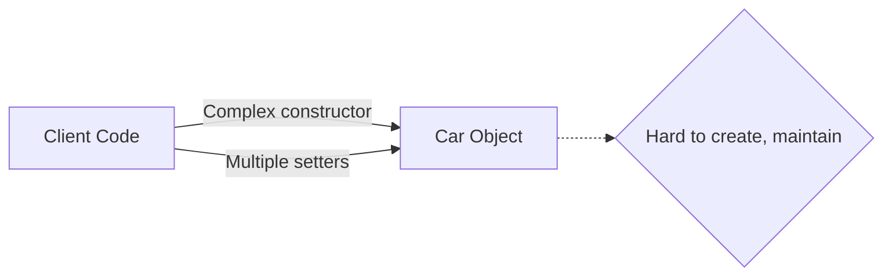
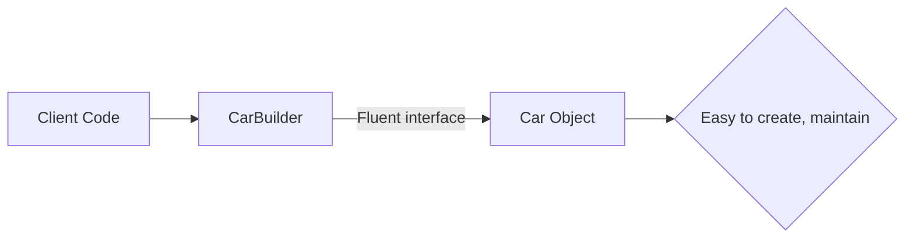
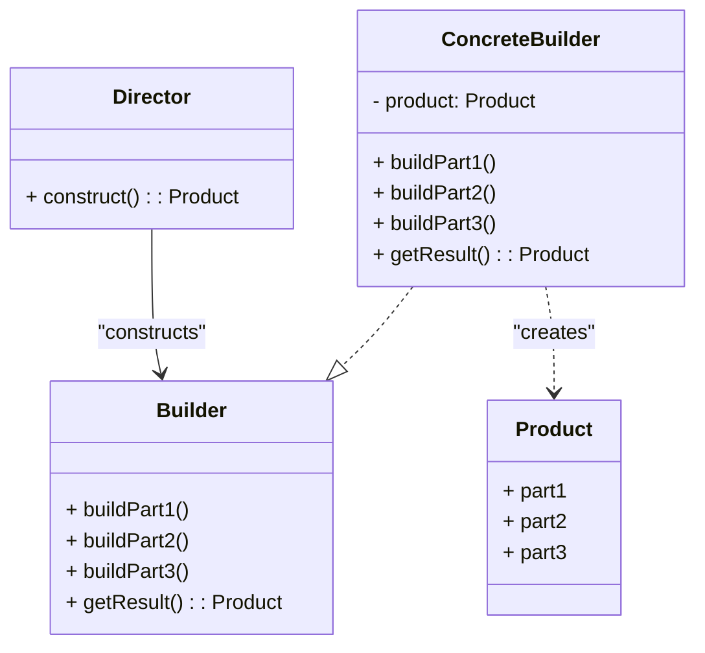
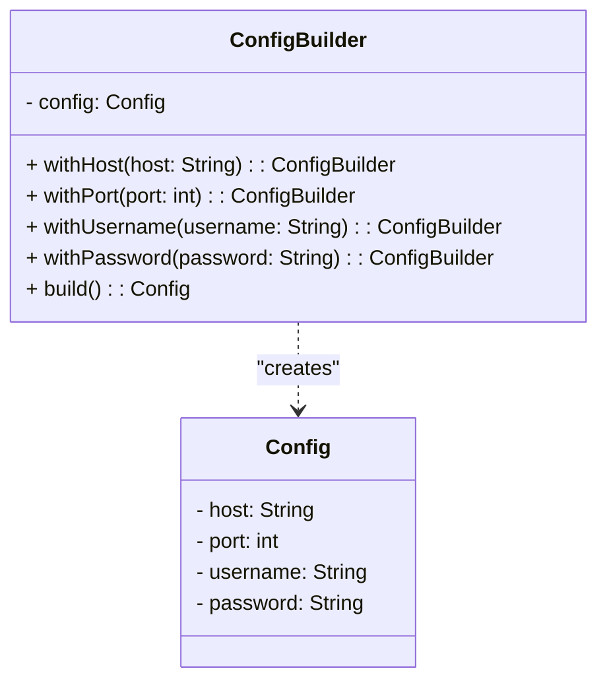
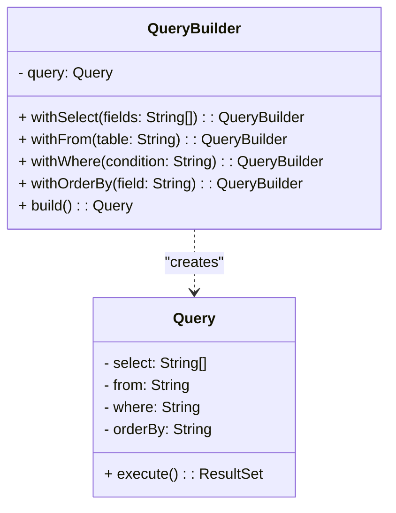
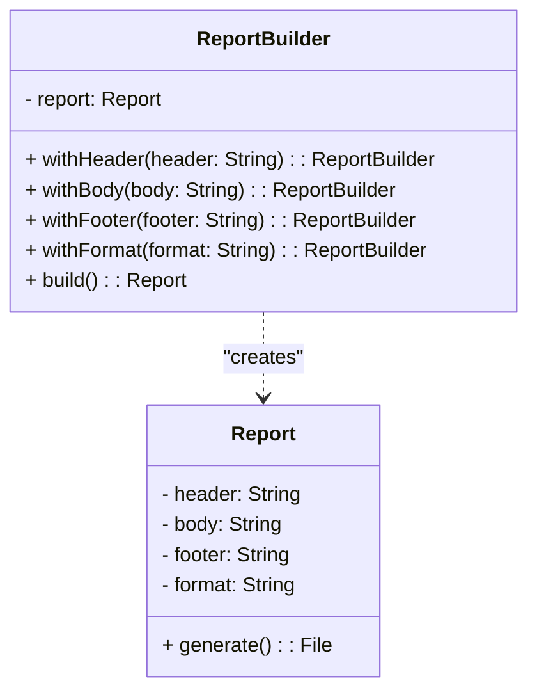

# Builder : Xây dựng đối tượng phức tạp

## Giới thiệu

Trong lập trình hướng đối tượng, Builder là một mẫu thiết kế thuộc nhóm Creational Patterns. Mục đích chính của Builder là tách rời quá trình xây dựng một đối tượng phức tạp khỏi biểu diễn của nó, cho phép cùng một quá trình xây dựng có thể tạo ra các biểu diễn khác nhau. Builder giúp giải quyết các vấn đề liên quan đến việc khởi tạo đối tượng có nhiều thuộc tính hoặc có quá trình khởi tạo phức tạp.

## Đặt vấn đề

Trong quá trình phát triển phần mềm, chúng ta thường gặp phải các đối tượng có nhiều thuộc tính và quá trình khởi tạo phức tạp. Ví dụ, chúng ta có một lớp `Car` đại diện cho một chiếc xe hơi với nhiều thuộc tính như `brand`, `model`, `color`, `engineType`, `transmission`, `numDoors`, `hasNavigationSystem`, `hasSunroof`, `wheelSize`, và `interiorMaterial`.

```java
public class Car {
    private String brand;
    private String model;
    private String color;
    private String engineType;
    private String transmission;
    private int numDoors;
    private boolean hasNavigationSystem;
    private boolean hasSunroof;
    private int wheelSize;
    private String interiorMaterial;

    public Car() {
        // Default constructor
    }

    public Car(String brand, String model, String color, String engineType, String transmission,
               int numDoors, boolean hasNavigationSystem, boolean hasSunroof, int wheelSize,
               String interiorMaterial) {
        this.brand = brand;
        this.model = model;
        this.color = color;
        this.engineType = engineType;
        this.transmission = transmission;
        this.numDoors = numDoors;
        this.hasNavigationSystem = hasNavigationSystem;
        this.hasSunroof = hasSunroof;
        this.wheelSize = wheelSize;
        this.interiorMaterial = interiorMaterial;
    }

    // Getters and setters
}
```

Nếu chúng ta sử dụng constructor để khởi tạo đối tượng `Car`, chúng ta có hai lựa chọn:

1. Sử dụng constructor mặc định không có đối số và sau đó sử dụng các phương thức setter để thiết lập các thuộc tính:

```java
public static void main(String[] args) {
  Car car = new Car();
  car.setBrand("Toyota");
  car.setModel("Camry");
  car.setColor("Red");
  car.setEngineType("2.5L");
  car.setTransmission("Automatic");
  car.setNumDoors(4);
  car.setHasNavigationSystem(true);
  car.setHasSunroof(false);
  car.setWheelSize(17);
  car.setInteriorMaterial("Leather");
}
```

Tuy nhiên, việc sử dụng multiple setters như trên làm cho mã nguồn trở nên dài dòng, khó đọc và dễ gây nhầm lẫn.

2. Sử dụng constructor với nhiều tham số để khởi tạo đối tượng `Car` với các giá trị cụ thể:

```java
Car car = new Car("Toyota", "Camry", "Red", "2.5L", "Automatic", 4, true, false, 17, "Leather");
```

Trong trường hợp này, constructor trở nên rất phức tạp với nhiều tham số. Điều này làm cho việc khởi tạo đối tượng `Car` trở nên khó đọc và dễ gây nhầm lẫn. Nếu chúng ta muốn tạo nhiều đối tượng `Car` với các cấu hình khác nhau, việc sử dụng constructor này sẽ trở nên rất khó khăn.



Như minh họa trong sơ đồ trên, khi client code cần khởi tạo một đối tượng `Car` phức tạp, nó phải sử dụng constructor phức tạp với nhiều tham số hoặc gọi nhiều phương thức setter. Điều này làm cho việc khởi tạo và duy trì mã nguồn trở nên khó khăn và dễ gây ra lỗi.

Vấn đề này đòi hỏi một giải pháp để đơn giản hóa quá trình khởi tạo đối tượng phức tạp và cung cấp một cách linh hoạt và dễ đọc để tạo ra các đối tượng với các cấu hình khác nhau.

## Giải pháp

Builder Pattern giải quyết vấn đề của việc khởi tạo đối tượng phức tạp bằng cách tách rời quá trình xây dựng của đối tượng thành các bước riêng biệt. Thay vì sử dụng constructor với nhiều tham số hoặc multiple setters, Builder Pattern cung cấp một cách linh hoạt và dễ đọc để xây dựng đối tượng.

Hãy xem xét ví dụ về việc xây dựng một đối tượng `Car` bằng cách sử dụng Builder Pattern:

```java
public class CarBuilder {
    private String brand;
    private String model;
    private String color;
    private String engineType;
    private String transmission;
    private int numDoors;
    private boolean hasNavigationSystem;
    private boolean hasSunroof;
    private int wheelSize;
    private String interiorMaterial;

    public CarBuilder setBrand(String brand) {
        this.brand = brand;
        return this;
    }

    public CarBuilder setModel(String model) {
        this.model = model;
        return this;
    }

    public CarBuilder setColor(String color) {
        this.color = color;
        return this;
    }

    // Other setter methods...

    public Car build() {
        return new Car(brand, model, color, engineType, transmission,
                       numDoors, hasNavigationSystem, hasSunroof, wheelSize,
                       interiorMaterial);
    }
}
```

Với Builder Pattern, chúng ta tạo một lớp `CarBuilder` riêng biệt để xây dựng đối tượng `Car`. Lớp `CarBuilder` chứa các phương thức setter tương ứng với các thuộc tính của đối tượng `Car`. Mỗi phương thức setter đều trả về chính đối tượng `CarBuilder`, cho phép chúng ta gọi các phương thức setter một cách liên tiếp (method chaining).

Khi sử dụng `CarBuilder`, việc khởi tạo đối tượng `Car` trở nên dễ đọc và linh hoạt hơn:

```java
Car car = new CarBuilder()
    .setBrand("Toyota")
    .setModel("Camry")
    .setColor("Red")
    .setEngineType("2.5L")
    .setTransmission("Automatic")
    .setNumDoors(4)
    .setHasNavigationSystem(true)
    .setHasSunroof(false)
    .setWheelSize(17)
    .setInteriorMaterial("Leather")
    .build();
```

Với cách tiếp cận này, mã nguồn trở nên rõ ràng và dễ hiểu hơn. Chúng ta có thể dễ dàng xây dựng các đối tượng `Car` với các cấu hình khác nhau bằng cách gọi các phương thức setter tương ứng.



Như minh họa trong sơ đồ trên, với Builder Pattern, client code tương tác với `CarBuilder` để xây dựng đối tượng `Car`. `CarBuilder` cung cấp một giao diện linh hoạt (fluent interface) cho phép chuỗi các phương thức setter, giúp mã nguồn trở nên dễ đọc và dễ bảo trì. Kết quả là một đối tượng `Car` được xây dựng một cách dễ dàng và rõ ràng.

Builder Pattern còn cho phép chúng ta thêm các phương thức xây dựng đặc biệt để tạo ra các cấu hình phổ biến của đối tượng. Ví dụ:

```java
public class CarBuilder {
    // ...

    public Car buildSportsCar() {
        return new CarBuilder()
            .setBrand("Porsche")
            .setModel("911")
            .setColor("Red")
            .setEngineType("3.8L")
            .setTransmission("Manual")
            .setNumDoors(2)
            .setHasNavigationSystem(true)
            .setHasSunroof(true)
            .setWheelSize(20)
            .setInteriorMaterial("Alcantara")
            .build();
    }

    public Car buildFamilyCar() {
        return new CarBuilder()
            .setBrand("Honda")
            .setModel("Odyssey")
            .setColor("White")
            .setEngineType("3.5L")
            .setTransmission("Automatic")
            .setNumDoors(4)
            .setHasNavigationSystem(true)
            .setHasSunroof(false)
            .setWheelSize(18)
            .setInteriorMaterial("Cloth")
            .build();
    }
}
```

Với các phương thức `buildSportsCar()` và `buildFamilyCar()`, chúng ta có thể dễ dàng tạo ra các đối tượng `Car` với cấu hình phổ biến mà không cần phải thiết lập từng thuộc tính một cách thủ công.

Builder Pattern giúp giải quyết vấn đề của constructor phức tạp và multiple setters bằng cách cung cấp một cách tiếp cận linh hoạt, dễ đọc và dễ bảo trì để xây dựng đối tượng. Nó cho phép chúng ta tạo ra các đối tượng với các cấu hình khác nhau một cách dễ dàng và rõ ràng.

## Cấu trúc

Để triển khai Builder Pattern, chúng ta cần có các thành phần sau:



1. Product: Đại diện cho đối tượng phức tạp cần được xây dựng. Nó định nghĩa các thành phần và thuộc tính của đối tượng.

2. Builder: Định nghĩa giao diện chung cho việc xây dựng các thành phần của Product. Nó khai báo các phương thức để xây dựng từng phần của đối tượng.

3. ConcreteBuilder: Triển khai giao diện Builder và cung cấp cách triển khai cụ thể cho việc xây dựng các thành phần của Product. Nó lưu trữ kết quả xây dựng và cung cấp phương thức để truy xuất kết quả cuối cùng.

4. Director: Định nghĩa trình tự và cách thức xây dựng Product bằng cách sử dụng giao diện Builder. Nó chỉ đạo ConcreteBuilder để xây dựng các phần khác nhau của Product.

Với cấu trúc này, Builder Pattern cho phép xây dựng các đối tượng phức tạp từng bước một, đồng thời tách rời quá trình xây dựng khỏi biểu diễn của đối tượng. Client code chỉ cần tương tác với Director và ConcreteBuilder để tạo ra đối tượng mong muốn.

## Cách triển khai

Dưới đây là một ví dụ về cách triển khai Builder Pattern trong Java để xây dựng một đối tượng phức tạp:

```java
// Product
class House {
    private String foundation;
    private String walls;
    private String roof;

    public void setFoundation(String foundation) {
        this.foundation = foundation;
    }

    public void setWalls(String walls) {
        this.walls = walls;
    }

    public void setRoof(String roof) {
        this.roof = roof;
    }

    @Override
    public String toString() {
        return "House{" +
                "foundation='" + foundation + '\'' +
                ", walls='" + walls + '\'' +
                ", roof='" + roof + '\'' +
                '}';
    }
}

// Builder
interface HouseBuilder {
    void buildFoundation();
    void buildWalls();
    void buildRoof();
    House getResult();
}

// ConcreteBuilder
class ConcreteHouseBuilder implements HouseBuilder {
    private House house;

    public ConcreteHouseBuilder() {
        this.house = new House();
    }

    @Override
    public void buildFoundation() {
        house.setFoundation("Concrete");
    }

    @Override
    public void buildWalls() {
        house.setWalls("Brick");
    }

    @Override
    public void buildRoof() {
        house.setRoof("Tile");
    }

    @Override
    public House getResult() {
        return house;
    }
}

// Director
class Director {
    private HouseBuilder builder;

    public Director(HouseBuilder builder) {
        this.builder = builder;
    }

    public House construct() {
        builder.buildFoundation();
        builder.buildWalls();
        builder.buildRoof();
        return builder.getResult();
    }
}

// Client code
public class Main {
    public static void main(String[] args) {
        HouseBuilder builder = new ConcreteHouseBuilder();
        Director director = new Director(builder);
        House house = director.construct();
        System.out.println(house);
    }
}
```

Trong ví dụ trên, chúng ta có:
- `House`: Đại diện cho đối tượng phức tạp cần xây dựng, bao gồm các thuộc tính như foundation, walls và roof.
- `HouseBuilder`: Định nghĩa giao diện cho việc xây dựng các thành phần của House.
- `ConcreteHouseBuilder`: Triển khai cụ thể của HouseBuilder, cung cấp cách triển khai để xây dựng từng thành phần của House.
- `Director`: Định nghĩa trình tự và cách thức xây dựng House bằng cách sử dụng HouseBuilder.

Trong phần client code, chúng ta tạo một đối tượng `ConcreteHouseBuilder`, truyền nó vào `Director`, và gọi phương thức `construct()` để xây dựng đối tượng House hoàn chỉnh. Cuối cùng, chúng ta in ra kết quả của đối tượng House đã được xây dựng.

Builder Pattern cho phép xây dựng các đối tượng phức tạp một cách linh hoạt, dễ mở rộng và dễ bảo trì. Nó tách rời quá trình xây dựng khỏi biểu diễn của đối tượng, cho phép tái sử dụng và thay đổi cách xây dựng mà không ảnh hưởng đến đối tượng cuối cùng.

## Ứng dụng thực tế

Builder Pattern được ứng dụng rộng rãi trong nhiều lĩnh vực của phát triển phần mềm. Dưới đây là một số ví dụ điển hình về việc áp dụng Builder trong thực tế.

### 1. Xây dựng đối tượng cấu hình

Trong các ứng dụng, thường có các đối tượng cấu hình phức tạp với nhiều thuộc tính và tùy chọn. Việc sử dụng constructor với nhiều tham số hoặc các phương thức setter có thể gây khó khăn cho việc khởi tạo và duy trì mã nguồn. Builder Pattern giúp giải quyết vấn đề này bằng cách cung cấp một cách linh hoạt và dễ đọc để xây dựng đối tượng cấu hình.



Trong ví dụ trên, lớp `ConfigBuilder` cung cấp các phương thức để thiết lập từng thuộc tính của đối tượng `Config`. Client code có thể sử dụng `ConfigBuilder` để xây dựng đối tượng cấu hình một cách dễ dàng và linh hoạt.

### 2. Xây dựng đối tượng truy vấn

Trong các ứng dụng làm việc với cơ sở dữ liệu, việc xây dựng các truy vấn phức tạp với nhiều điều kiện và tham số có thể gây khó khăn và dễ gây ra lỗi. Builder Pattern cho phép xây dựng các đối tượng truy vấn một cách rõ ràng và dễ đọc.



Trong ví dụ trên, lớp `QueryBuilder` cung cấp các phương thức để xây dựng từng phần của đối tượng `Query`. Client code có thể sử dụng `QueryBuilder` để tạo ra các truy vấn phức tạp một cách dễ dàng và dễ hiểu.

### 3. Xây dựng đối tượng báo cáo

Trong các ứng dụng báo cáo, việc tạo ra các báo cáo phức tạp với nhiều phần và định dạng khác nhau có thể là một thách thức. Builder Pattern cho phép xây dựng các đối tượng báo cáo từng bước một, tách biệt quá trình xây dựng khỏi biểu diễn của báo cáo.



Trong ví dụ trên, lớp `ReportBuilder` cung cấp các phương thức để xây dựng từng phần của đối tượng `Report`. Client code có thể sử dụng `ReportBuilder` để tạo ra các báo cáo tùy chỉnh với các định dạng khác nhau.

Trên đây là một số ví dụ về việc áp dụng Builder Pattern trong thực tế. Builder giúp xây dựng các đối tượng phức tạp một cách linh hoạt, dễ đọc và dễ bảo trì. Nó tách rời quá trình xây dựng khỏi biểu diễn của đối tượng, cho phép tái sử dụng và thay đổi cách xây dựng mà không ảnh hưởng đến đối tượng cuối cùng.

## So sánh

Builder Pattern có thể được so sánh với một số Design Pattern tương tự, bao gồm:

- **Factory Pattern**: Builder Pattern tập trung vào xây dựng một đối tượng phức tạp bằng cách tạo và cấu hình từng phần, trong khi Factory Pattern tập trung vào việc tạo đối tượng duy nhất và trả về nó.
- **Abstract Factory Pattern**: Cả Builder Pattern và Abstract Factory Pattern đều giúp trong việc tạo đối tượng phức tạp, nhưng Abstract Factory tạo ra một tập hợp các đối tượng có liên quan và cung cấp một giao diện chung để tạo chúng, trong khi Builder tập trung vào việc xây dựng một đối tượng duy nhất.
- **Singleton Pattern**: Singleton Pattern chỉ đảm bảo rằng một lớp chỉ có một đối tượng duy nhất và cung cấp một điểm truy cập đến nó. Builder Pattern không liên quan đến việc tạo đối tượng duy nhất mà tập trung vào việc xây dựng đối tượng phức tạp.

## Kết luận

Builder Pattern là một Design Pattern hữu ích trong những trường hợp cần xây dựng các đối tượng phức tạp. Builder Pattern giúp việc xây dựng các đối tượng phức tạp trở nên dễ dàng hơn và ít xảy ra lỗi hơn.

- Nên sử dụng Builder Pattern khi:
    - Đối tượng phức tạp có nhiều thuộc tính hoặc thành phần.
    - Cần xây dựng nhiều phiên bản khác nhau của đối tượng phức tạp.
    - Cần dễ dàng kiểm tra đối tượng phức tạp.
- Không nên sử dụng Builder Pattern khi:
    - Đối tượng phức tạp không có nhiều thuộc tính hoặc thành phần.
    - Chỉ cần xây dựng một phiên bản duy nhất của đối tượng phức tạp.
    - Không cần dễ dàng kiểm tra đối tượng phức tạp.

Tôi hy vọng bài viết này đã giúp bạn hiểu rõ về Builder Pattern.