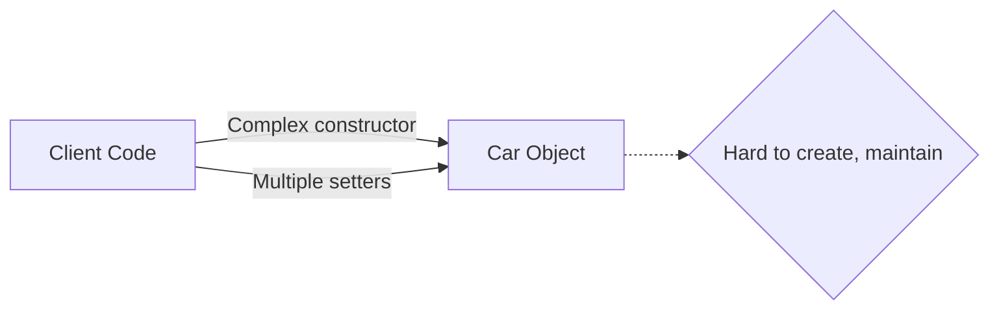
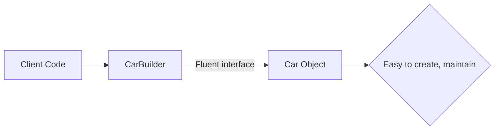
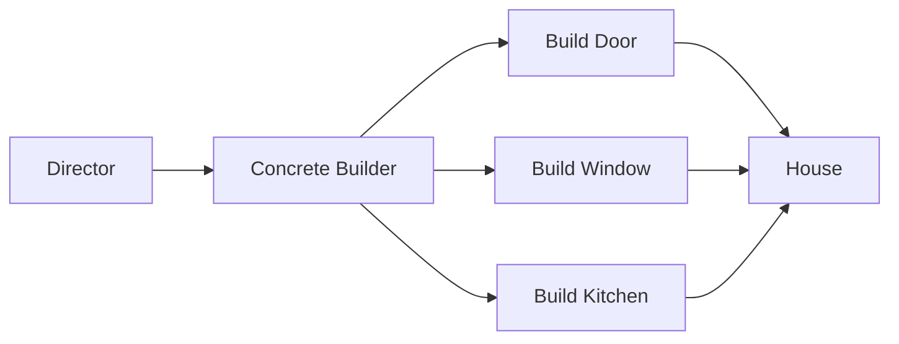
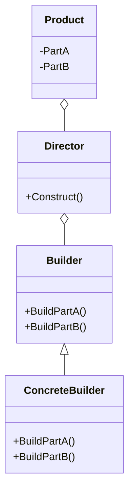

# Builder : Xây dựng đối tượng phức tạp

## Giới thiệu

Trong lập trình hướng đối tượng, Builder là một mẫu thiết kế thuộc nhóm Creational Patterns. Mục đích chính của Builder là tách rời quá trình xây dựng một đối tượng phức tạp khỏi biểu diễn của nó, cho phép cùng một quá trình xây dựng có thể tạo ra các biểu diễn khác nhau. Builder giúp giải quyết các vấn đề liên quan đến việc khởi tạo đối tượng có nhiều thuộc tính hoặc có quá trình khởi tạo phức tạp.

### Đặt vấn đề

Trong quá trình phát triển phần mềm, chúng ta thường gặp phải các đối tượng có nhiều thuộc tính và quá trình khởi tạo phức tạp. Ví dụ, chúng ta có một lớp `Car` đại diện cho một chiếc xe hơi với nhiều thuộc tính như `brand`, `model`, `color`, `engineType`, `transmission`, `numDoors`, `hasNavigationSystem`, `hasSunroof`, `wheelSize`, và `interiorMaterial`.

```java
public class Car {
    private String brand;
    private String model;
    private String color;
    private String engineType;
    private String transmission;
    private int numDoors;
    private boolean hasNavigationSystem;
    private boolean hasSunroof;
    private int wheelSize;
    private String interiorMaterial;

    public Car() {
        // Default constructor
    }

    public Car(String brand, String model, String color, String engineType, String transmission,
               int numDoors, boolean hasNavigationSystem, boolean hasSunroof, int wheelSize,
               String interiorMaterial) {
        this.brand = brand;
        this.model = model;
        this.color = color;
        this.engineType = engineType;
        this.transmission = transmission;
        this.numDoors = numDoors;
        this.hasNavigationSystem = hasNavigationSystem;
        this.hasSunroof = hasSunroof;
        this.wheelSize = wheelSize;
        this.interiorMaterial = interiorMaterial;
    }

    // Getters and setters
}
```

Nếu chúng ta sử dụng constructor để khởi tạo đối tượng `Car`, chúng ta có hai lựa chọn:

1. Sử dụng constructor mặc định không có đối số và sau đó sử dụng các phương thức setter để thiết lập các thuộc tính:

```java
public static void main(String[] args) {
  Car car = new Car();
  car.setBrand("Toyota");
  car.setModel("Camry");
  car.setColor("Red");
  car.setEngineType("2.5L");
  car.setTransmission("Automatic");
  car.setNumDoors(4);
  car.setHasNavigationSystem(true);
  car.setHasSunroof(false);
  car.setWheelSize(17);
  car.setInteriorMaterial("Leather");
}
```

Tuy nhiên, việc sử dụng multiple setters như trên làm cho mã nguồn trở nên dài dòng, khó đọc và dễ gây nhầm lẫn.

2. Sử dụng constructor với nhiều tham số để khởi tạo đối tượng `Car` với các giá trị cụ thể:

```java
Car car = new Car("Toyota", "Camry", "Red", "2.5L", "Automatic", 4, true, false, 17, "Leather");
```

Trong trường hợp này, constructor trở nên rất phức tạp với nhiều tham số. Điều này làm cho việc khởi tạo đối tượng `Car` trở nên khó đọc và dễ gây nhầm lẫn. Nếu chúng ta muốn tạo nhiều đối tượng `Car` với các cấu hình khác nhau, việc sử dụng constructor này sẽ trở nên rất khó khăn.



Như minh họa trong sơ đồ trên, khi client code cần khởi tạo một đối tượng `Car` phức tạp, nó phải sử dụng constructor phức tạp với nhiều tham số hoặc gọi nhiều phương thức setter. Điều này làm cho việc khởi tạo và duy trì mã nguồn trở nên khó khăn và dễ gây ra lỗi.

Vấn đề này đòi hỏi một giải pháp để đơn giản hóa quá trình khởi tạo đối tượng phức tạp và cung cấp một cách linh hoạt và dễ đọc để tạo ra các đối tượng với các cấu hình khác nhau.

### Giải pháp

Builder Pattern giải quyết vấn đề của việc khởi tạo đối tượng phức tạp bằng cách tách rời quá trình xây dựng của đối tượng thành các bước riêng biệt. Thay vì sử dụng constructor với nhiều tham số hoặc multiple setters, Builder Pattern cung cấp một cách linh hoạt và dễ đọc để xây dựng đối tượng.

Hãy xem xét ví dụ về việc xây dựng một đối tượng `Car` bằng cách sử dụng Builder Pattern:

```java
public class CarBuilder {
    private String brand;
    private String model;
    private String color;
    private String engineType;
    private String transmission;
    private int numDoors;
    private boolean hasNavigationSystem;
    private boolean hasSunroof;
    private int wheelSize;
    private String interiorMaterial;

    public CarBuilder setBrand(String brand) {
        this.brand = brand;
        return this;
    }

    public CarBuilder setModel(String model) {
        this.model = model;
        return this;
    }

    public CarBuilder setColor(String color) {
        this.color = color;
        return this;
    }

    // Other setter methods...

    public Car build() {
        return new Car(brand, model, color, engineType, transmission,
                       numDoors, hasNavigationSystem, hasSunroof, wheelSize,
                       interiorMaterial);
    }
}
```

Với Builder Pattern, chúng ta tạo một lớp `CarBuilder` riêng biệt để xây dựng đối tượng `Car`. Lớp `CarBuilder` chứa các phương thức setter tương ứng với các thuộc tính của đối tượng `Car`. Mỗi phương thức setter đều trả về chính đối tượng `CarBuilder`, cho phép chúng ta gọi các phương thức setter một cách liên tiếp (method chaining).

Khi sử dụng `CarBuilder`, việc khởi tạo đối tượng `Car` trở nên dễ đọc và linh hoạt hơn:

```java
Car car = new CarBuilder()
    .setBrand("Toyota")
    .setModel("Camry")
    .setColor("Red")
    .setEngineType("2.5L")
    .setTransmission("Automatic")
    .setNumDoors(4)
    .setHasNavigationSystem(true)
    .setHasSunroof(false)
    .setWheelSize(17)
    .setInteriorMaterial("Leather")
    .build();
```

Với cách tiếp cận này, mã nguồn trở nên rõ ràng và dễ hiểu hơn. Chúng ta có thể dễ dàng xây dựng các đối tượng `Car` với các cấu hình khác nhau bằng cách gọi các phương thức setter tương ứng.



Như minh họa trong sơ đồ trên, với Builder Pattern, client code tương tác với `CarBuilder` để xây dựng đối tượng `Car`. `CarBuilder` cung cấp một giao diện linh hoạt (fluent interface) cho phép chuỗi các phương thức setter, giúp mã nguồn trở nên dễ đọc và dễ bảo trì. Kết quả là một đối tượng `Car` được xây dựng một cách dễ dàng và rõ ràng.

Builder Pattern còn cho phép chúng ta thêm các phương thức xây dựng đặc biệt để tạo ra các cấu hình phổ biến của đối tượng. Ví dụ:

```java
public class CarBuilder {
    // ...

    public Car buildSportsCar() {
        return new CarBuilder()
            .setBrand("Porsche")
            .setModel("911")
            .setColor("Red")
            .setEngineType("3.8L")
            .setTransmission("Manual")
            .setNumDoors(2)
            .setHasNavigationSystem(true)
            .setHasSunroof(true)
            .setWheelSize(20)
            .setInteriorMaterial("Alcantara")
            .build();
    }

    public Car buildFamilyCar() {
        return new CarBuilder()
            .setBrand("Honda")
            .setModel("Odyssey")
            .setColor("White")
            .setEngineType("3.5L")
            .setTransmission("Automatic")
            .setNumDoors(4)
            .setHasNavigationSystem(true)
            .setHasSunroof(false)
            .setWheelSize(18)
            .setInteriorMaterial("Cloth")
            .build();
    }
}
```

Với các phương thức `buildSportsCar()` và `buildFamilyCar()`, chúng ta có thể dễ dàng tạo ra các đối tượng `Car` với cấu hình phổ biến mà không cần phải thiết lập từng thuộc tính một cách thủ công.

Builder Pattern giúp giải quyết vấn đề của constructor phức tạp và multiple setters bằng cách cung cấp một cách tiếp cận linh hoạt, dễ đọc và dễ bảo trì để xây dựng đối tượng. Nó cho phép chúng ta tạo ra các đối tượng với các cấu hình khác nhau một cách dễ dàng và rõ ràng.

#### Ví dụ minh hoạ

Để hiểu rõ hơn, hãy xem ví dụ sau:



- Director (Quản lý) gọi Concrete Builder (Xây dựng cụ thể) để bắt đầu xây dựng ngôi nhà.

- Concrete Builder (Xây dựng cụ thể) thực hiện công việc của mình, ví dụ: xây dựng cửa, cửa sổ và nhà bếp.

- Các phần này được kết hợp lại để tạo thành ngôi nhà hoàn chỉnh.

Kết quả là, người dùng ngôi nhà không cần quan tâm đến chi tiết cụ thể của quá trình xây dựng, mà chỉ cần sử dụng ngôi nhà đã hoàn thành một cách dễ dàng.

### Cấu trúc

Builder Pattern có cấu trúc đơn giản, bao gồm các thành phần sau:



- **Builder**: Định nghĩa phương thức xây dựng chung.
- **ConcreteBuilder**: Triển khai chi tiết các bước xây dựng cụ thể.
- **Director**: Sử dụng Builder để xây dựng sản phẩm.
- **Product**: Là sản phẩm được tạo ra, chứa các phần do Builder tạo.

Như vậy Builder tách rời quá trình xây dựng phức tạp thành nhiều bước đơn giản, từng bước tập trung vào một khía cạnh riêng lẻ.

## Cách triển khai

Builder Pattern có thể được triển khai theo nhiều cách khác nhau. Trong Java, có một số cách triển khai phổ biến như sau:

**Định nghĩa Product**: Chúng ta bắt đầu bằng việc định nghĩa lớp `Product` để lưu trữ thông tin đối tượng cuối cùng:

```java
class Product {
    private String partA;
    private String partB;

    public void setPartA(String partA) {
        this.partA = partA;
    }

    public void setPartB(String partB) {
        this.partB = partB;
    }

    public void show() {
        System.out.println("Product Parts: " + partA + " and " + partB);
    }
}

```

**Định nghĩa Builder** : Sau đó, chúng ta định nghĩa lớp `Builder` với các phương thức xây dựng, nhưng với Builder, mỗi phương thức xây dựng trả về chính builder, cho phép chúng ta gọi tiếp theo một cách liền mạch:

```java
class Builder {
    private Product product = new Product();

    public Builder buildPartA(String partA) {
        product.setPartA(partA);
        return this;
    }

    public Builder buildPartB(String partB) {
        product.setPartB(partB);
        return this;
    }

    public Product getResult() {
        return product;
    }
}
```

Bây giờ, chúng ta có thể sử dụng Builder để xây dựng sản phẩm một cách dễ đọc và gần gũi:

```java
public class Main {
    public static void main(String[] args) {
        // Sử dụng Builder để xây dựng sản phẩm
        Product product = new Builder()
            .buildPartA("Part A")
            .buildPartB("Part B")
            .getResult();
        
        // Hiển thị sản phẩm
        product.show();
    }
}
```

Giải thích

- Chúng ta đã tạo một lớp `Builder` với các phương thức xây dựng trả về chính builder. Điều này cho phép chúng ta gọi tiếp các phương thức một cách liền mạch, tạo một chuỗi dễ đọc để xây dựng sản phẩm.
- Khi sử dụng Builder, các phương thức xây dựng có thể được gọi nối tiếp trên một đối tượng builder duy nhất, giúp giảm bớt sự phức tạp trong mã nguồn và làm cho mã trở nên rõ ràng hơn.
- Cuối cùng, chúng ta gọi `getResult()` để lấy đối tượng Product đã được xây dựng và hiển thị nó.

## Ví dụ minh họa

Dưới đây là một ví dụ minh họa về Builder Pattern trong Java:

```java
// Đối tượng Product: Nhà
class House {
  private String foundation;
  private String walls;
  private String roof;
  private String interior;

  public void setFoundation(String foundation) {
    this.foundation = foundation;
  }

  public void setWalls(String walls) {
    this.walls = walls;
  }

  public void setRoof(String roof) {
    this.roof = roof;
  }

  public void setInterior(String interior) {
    this.interior = interior;
  }

  public void showHouseDetails() {
    System.out.println("House Details:");
    System.out.println("Foundation: " + foundation);
    System.out.println("Walls: " + walls);
    System.out.println("Roof: " + roof);
    System.out.println("Interior: " + interior);
  }
}

// Builder Interface: Builder
interface HouseBuilder {
  void buildFoundation();
  void buildWalls();
  void buildRoof();
  void buildInterior();
  House getResult();
}

// Concrete Builder: ConcreteHouseBuilder
class ConcreteHouseBuilder implements HouseBuilder {
  private House house = new House();

  public void buildFoundation() {
    house.setFoundation("Concrete Foundation");
  }

  public void buildWalls() {
    house.setWalls("Concrete Walls");
  }

  public void buildRoof() {
    house.setRoof("Concrete Roof");
  }

  public void buildInterior() {
    house.setInterior("Modern Interior");
  }

  public House getResult() {
    return house;
  }
}

// Director: HouseDirector
class HouseDirector {
  private HouseBuilder builder;

  public HouseDirector(HouseBuilder builder) {
    this.builder = builder;
  }

  public void constructHouse() {
    builder.buildFoundation();
    builder.buildWalls();
    builder.buildRoof();
    builder.buildInterior();
  }
}

// Main class
public class Main {
  public static void main(String[] args) {
    // Tạo một đối tượng ConcreteHouseBuilder
    HouseBuilder builder = new ConcreteHouseBuilder();

    // Tạo một đối tượng HouseDirector và kết nối với builder
    HouseDirector director = new HouseDirector(builder);

    // Xây dựng nhà
    director.constructHouse();

    // Lấy kết quả
    House house = builder.getResult();

    // Hiển thị thông tin về nhà
    house.showHouseDetails();
  }
}
```

Trong ví dụ này, chúng ta sử dụng phương pháp Builder để xây dựng một đối tượng `House`, đại diện cho một ngôi nhà. Ví dụ này tách rời quá trình xây dựng ngôi nhà thành nhiều bước riêng biệt, và mỗi bước tập trung vào xây dựng một phần cụ thể của ngôi nhà.

1. **Đối tượng Product: Nhà (House)**:
- Trong ví dụ này, `House` là đối tượng mà chúng ta muốn xây dựng.
- `House` có các thuộc tính như `foundation`, `walls`, `roof`, và `interior`, đại diện cho các phần cấu trúc và nội thất của ngôi nhà.
- Chúng ta định nghĩa các phương thức `setPart` để thiết lập các phần của ngôi nhà và `showHouseDetails` để hiển thị thông tin chi tiết của ngôi nhà.

2. **Builder Interface: Builder**:
- `HouseBuilder` là một giao diện định nghĩa các phương thức để xây dựng một đối tượng `House`.
- Các phương thức trong `HouseBuilder` bao gồm `buildFoundation`, `buildWalls`, `buildRoof`, và `buildInterior`, mỗi phương thức tương ứng với việc xây dựng một phần cụ thể của ngôi nhà.
- `getResult` để lấy đối tượng `House` đã hoàn thành.

3. **Concrete Builder: ConcreteHouseBuilder**:
- `ConcreteHouseBuilder` là lớp cụ thể triển khai `HouseBuilder`.
- Các phương thức của `ConcreteHouseBuilder` được triển khai để xây dựng các phần của ngôi nhà. Ví dụ, `buildFoundation` thiết lập phần nền móng của ngôi nhà là "Concrete Foundation".
- Mỗi phương thức trả về chính đối tượng `ConcreteHouseBuilder` để cho phép chuỗi gọi phương thức (method chaining).

4. **Director: HouseDirector**:
- `HouseDirector` là lớp chịu trách nhiệm hướng dẫn quá trình xây dựng ngôi nhà.
- Nó chấp nhận một đối tượng `HouseBuilder` (ở đây là `ConcreteHouseBuilder`) thông qua hàm tạo và sẽ sử dụng nó để xây dựng ngôi nhà.
- `constructHouse` phương thức của `HouseDirector` gọi các phương thức xây dựng trên builder để xây dựng các phần khác nhau của ngôi nhà theo đúng thứ tự.

5. **Main class**:
- Trong hàm `main`, chúng ta bắt đầu bằng việc tạo một đối tượng `ConcreteHouseBuilder`.
- Sau đó, chúng ta tạo một đối tượng `HouseDirector` và kết nối nó với `ConcreteHouseBuilder`.
- Gọi `constructHouse` để bắt đầu quá trình xây dựng ngôi nhà.
- Cuối cùng, sử dụng `getResult` để nhận đối tượng `House` đã hoàn thành và gọi `showHouseDetails` để hiển thị thông tin chi tiết về ngôi nhà.

Kết quả là, chúng ta đã xây dựng một đối tượng ngôi nhà một cách dễ dàng và linh hoạt, trong đó mỗi phần của ngôi nhà được xây dựng bằng cách sử dụng Builder Pattern. Điều này giúp giảm sự phức tạp và làm cho mã nguồn trở nên rõ ràng hơn.

## So sánh

Builder Pattern có thể được so sánh với một số Design Pattern tương tự, bao gồm:

- **Factory Pattern**: Builder Pattern tập trung vào xây dựng một đối tượng phức tạp bằng cách tạo và cấu hình từng phần, trong khi Factory Pattern tập trung vào việc tạo đối tượng duy nhất và trả về nó.
- **Abstract Factory Pattern**: Cả Builder Pattern và Abstract Factory Pattern đều giúp trong việc tạo đối tượng phức tạp, nhưng Abstract Factory tạo ra một tập hợp các đối tượng có liên quan và cung cấp một giao diện chung để tạo chúng, trong khi Builder tập trung vào việc xây dựng một đối tượng duy nhất.
- **Singleton Pattern**: Singleton Pattern chỉ đảm bảo rằng một lớp chỉ có một đối tượng duy nhất và cung cấp một điểm truy cập đến nó. Builder Pattern không liên quan đến việc tạo đối tượng duy nhất mà tập trung vào việc xây dựng đối tượng phức tạp.

## Kết luận

Builder Pattern là một Design Pattern hữu ích trong những trường hợp cần xây dựng các đối tượng phức tạp. Builder Pattern giúp việc xây dựng các đối tượng phức tạp trở nên dễ dàng hơn và ít xảy ra lỗi hơn.

- Nên sử dụng Builder Pattern khi:
    - Đối tượng phức tạp có nhiều thuộc tính hoặc thành phần.
    - Cần xây dựng nhiều phiên bản khác nhau của đối tượng phức tạp.
    - Cần dễ dàng kiểm tra đối tượng phức tạp.
- Không nên sử dụng Builder Pattern khi:
    - Đối tượng phức tạp không có nhiều thuộc tính hoặc thành phần.
    - Chỉ cần xây dựng một phiên bản duy nhất của đối tượng phức tạp.
    - Không cần dễ dàng kiểm tra đối tượng phức tạp.

Tôi hy vọng bài viết này đã giúp bạn hiểu rõ về Builder Pattern.