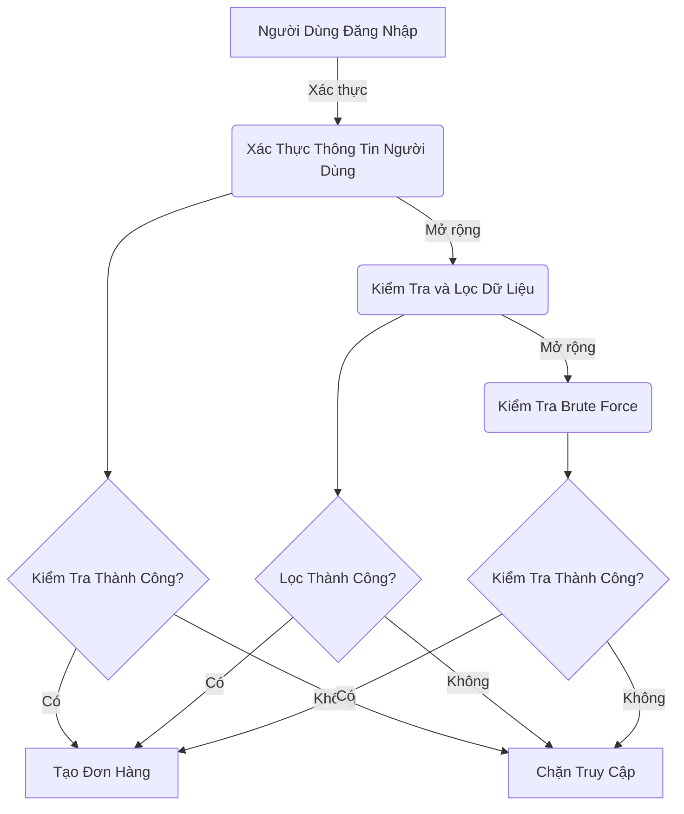
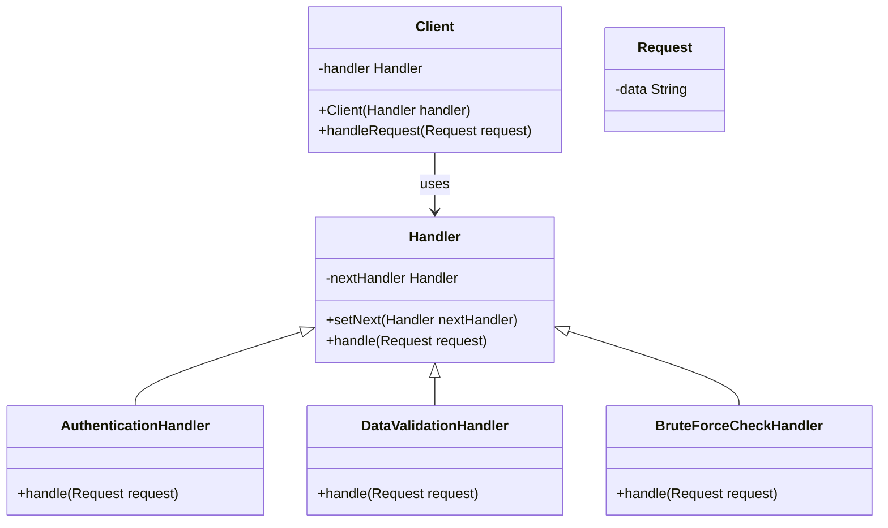
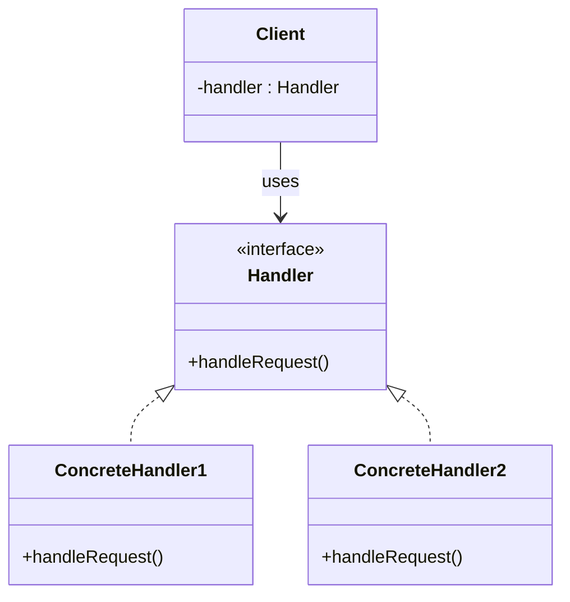
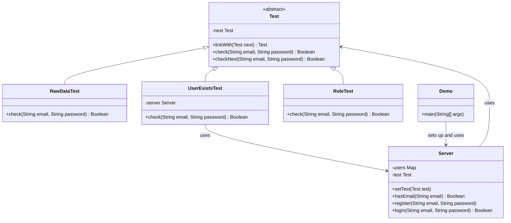

# Chain of Responsibility

## Khái Niệm

Trong phát triển phần mềm, việc quản lý không hiệu quả các yêu cầu đa dạng và phức tạp có thể dẫn đến mã lập trình rối rắm, khó bảo trì. Nếu một đối tượng hoặc lớp đảm nhiệm quá nhiều nhiệm vụ, điều này tạo ra sự phụ thuộc lẫn nhau cao và làm giảm khả năng mở rộng của hệ thống, cũng như làm tăng độ phức tạp trong quản lý. Chain of Responsibility giải quyết vấn đề này bằng cách phân tán trách nhiệm xử lý yêu cầu qua một chuỗi các đối tượng, giúp giảm sự phụ thuộc và tăng tính linh hoạt.
### Tổng quan

- **Định Nghĩa của Pattern:** Chain of Responsibility Pattern cho phép một yêu cầu được chuyển qua một chuỗi các bộ xử lý. Mỗi bộ xử lý quyết định xử lý yêu cầu hoặc chuyển nó đến bộ xử lý tiếp theo trong chuỗi.

- **Mục Đích:** Mẫu thiết kế này giúp loại bỏ sự cứng nhắc trong việc chỉ định chính xác đối tượng xử lý một yêu cầu cụ thể. Nó giúp phân tán trách nhiệm xử lý và giảm sự phụ thuộc lẫn nhau giữa các đối tượng.

- **Ý Tưởng Cốt Lõi:** Trong Chain of Responsibility, không có đối tượng cụ thể nào được chỉ định trước để xử lý một yêu cầu. Thay vào đó, mỗi đối tượng trong chuỗi có thể xử lý yêu cầu hoặc chuyển nó đến đối tượng tiếp theo. Điều này tạo ra một hệ thống linh hoạt, nơi xử lý yêu cầu không phụ thuộc vào một đối tượng cố định.

## Đặt vấn đề

Bây giờ, hãy tưởng tượng bạn là một lập trình viên đang phát triển một hệ thống đặt hàng trực tuyến. Mục tiêu của bạn là hạn chế quyền truy cập vào hệ thống, chỉ cho phép những người đã xác thực mới có thể tạo đơn hàng. Đối với admin, họ có quyền truy cập toàn diện đến mọi đơn hàng.

Sau một thời gian, bạn nhận ra rằng các thao tác xác thực cần được thực hiện theo một trình tự nhất định. Hệ thống sẽ xác thực thông tin người dùng khi họ đăng nhập, nhưng nếu quá trình này thất bại, không cần thiết phải tiến hành các bước tiếp theo.

Một vài tháng sau, bạn cần phải thêm vào một số bước kiểm tra xác thực mới:

- Một đồng nghiệp gợi ý: "Em ơi, việc truyền dữ liệu trực tiếp vào cơ sở dữ liệu có thể rất nguy hiểm." Dựa trên lời khuyên này, bạn thêm một bước kiểm tra và lọc dữ liệu.
- Sau đó, một hacker mũ trắng chỉ ra rằng hệ thống của bạn dễ dàng bị tấn công bằng brute force. Nhận ra điều này, bạn nhanh chóng thêm một lớp kiểm tra để chặn các yêu cầu đăng nhập liên tiếp không thành công từ cùng một IP.



Tuy nhiên, theo thời gian, lớp xác thực của bạn trở nên phức tạp và khó quản lý. Điều này đặc biệt rắc rối khi các phần khác của hệ thống cần sử dụng một số chức năng cụ thể trong lớp xác thực lớn này.

## Giải pháp

Chain of Responsibility dựa vào việc chuyển đổi các hành vi cụ thể thành các đối tượng hoạt động lập gọi là handlers. Trong vấn đề trên, với hoạt động kiểm thử bạn nên đổi chúng thành một lớp đối tượng cụ thể với một phương thức duy nhất là kiểm tra.



Mô hình gợi ý bạn liên kết các handlers lại thành một chuỗi. Như vậy, mỗi handlers phải lưu trữ tham chiếu đến handler tiếp theo, ngoài việc xử lý yêu cầu handlers còn có nhiệm vụ chuyện đến các handers tiếp theo. Yêu cầu sẽ chuyển theo hết chuỗi hoặc có thể kết thúc bật kì handlers nào.

## Cấu Trúc



- Handler: Định nghĩa 1 interface để xử lý các yêu cầu.
- ConcreteHandler: Implement phương thức từ handler.
- Client: Tạo ra các yêu cầu và yêu cầu đó sẽ được gửi đến các đối tượng tiếp nhận.

## Cách triển khai

### Bước 1: Tạo Interface Handler

```java
interface Handler {
    void handleRequest(String request);
    void setNext(Handler nextHandler);
}
```

### Bước 2: Tạo Concrete Handlers

Mỗi `ConcreteHandler` sẽ triển khai `Handler` và quyết định liệu nó có thể xử lý yêu cầu hay chuyển nó đến handler tiếp theo.

```java
class ConcreteHandler1 implements Handler {
    private Handler next;

    @Override
    public void handleRequest(String request) {
        if (request.equals("Handler1")) {
            System.out.println("ConcreteHandler1 đã xử lý yêu cầu.");
        } else if (next != null) {
            next.handleRequest(request);
        }
    }

    @Override
    public void setNext(Handler nextHandler) {
        this.next = nextHandler;
    }
}

class ConcreteHandler2 implements Handler {
    private Handler next;

    @Override
    public void handleRequest(String request) {
        if (request.equals("Handler2")) {
            System.out.println("ConcreteHandler2 đã xử lý yêu cầu.");
        } else if (next != null) {
            next.handleRequest(request);
        }
    }

    @Override
    public void setNext(Handler nextHandler) {
        this.next = nextHandler;
    }
}
```

### Bước 3: Tạo Client Class

Client sẽ tạo yêu cầu và gửi chúng qua chuỗi các handler.

```java
class Client {
    private Handler handler;

    public Client(Handler handler) {
        this.handler = handler;
    }

    public void makeRequest(String request) {
        handler.handleRequest(request);
    }
}
```

### Bước 4: Thiết lập và Sử dụng Chain of Responsibility

Ở đây, chúng ta tạo các handler, thiết lập chuỗi trách nhiệm và sau đó là thực thi yêu cầu thông qua client.

```java
public class Main {
    public static void main(String[] args) {
        Handler handler1 = new ConcreteHandler1();
        Handler handler2 = new ConcreteHandler2();

        handler1.setNext(handler2);

        Client client = new Client(handler1);
        client.makeRequest("Handler1");
        client.makeRequest("Handler2");
        client.makeRequest("Unknown"); // Sẽ không được xử lý bởi bất kỳ handler nào
    }
}
```


## Ví dụ áp dụng Chain of Responsibility

Trong ví dụ này, mô hình Chain of Responsibility được áp dụng để xử lý quá trình xác thực và kiểm tra trong một hệ thống giả lập. Cụ thể, chúng ta có một số lớp con của `Test`, mỗi lớp thực hiện một kiểm tra cụ thể trong chuỗi xác thực:

1. **RawDataTest**: Kiểm tra dữ liệu thô, ví dụ kiểm tra định dạng email.
2. **UserExistsTest**: Kiểm tra xem người dùng có tồn tại trong hệ thống không.
3. **RoleTest**: Kiểm tra quyền của người dùng, ví dụ nhận diện admin.

Mỗi lớp này kế thừa từ `Test` và định nghĩa phương thức `check`, thực hiện kiểm tra riêng của mình và chuyển đến kiểm tra tiếp theo nếu cần.

Cách thức hoạt động:

- **Server**: Lưu trữ thông tin người dùng và quản lý chuỗi xác thực.
- **Demo**: Tạo và liên kết các kiểm tra, sau đó yêu cầu `Server` thực hiện quá trình đăng nhập, qua đó sử dụng chuỗi xác thực.



Test.java

```java
public abstract class Test {
    private Test next;

    public Test linkWith(Test next) {
        this.next = next;
        return next;
    }

    public abstract boolean check(String email, String password);

    
    protected boolean checkNext(String email, String password) {
        if (this.next == null) {
            return true;
        }
        return next.check(email, password);
    }
}
```

RawDataTest.java

```java
public class RawDataTest extends Test{
    @Override
    public boolean check(String email, String password) {
        System.out.println("Raw Data");
        if (!email.contains("@")) {
            System.out.println("Email Valid");
            return false;
        }
        return this.checkNext(email,password);
    }
}
```

RoleTest.java

```java
public class RoleTest extends Test {
    @Override
    public boolean check(String email, String password) {
        System.out.println("Role Data");
        if (email.equals("admin@example.com")) {
            System.out.println("Hello, admin!");
            return true;
        }
        System.out.println("Hello, user!");
        return checkNext(email, password);
    }
}
```

UserExistsTest.java

```java
public class UserExistsTest extends Test{
    private Server server;

    public UserExistsTest(Server server) {
        this.server = server;
    }

    public boolean check(String email, String password) {
        System.out.println("User Exist");
        if (!server.hasEmail(email)) {
            System.out.println("This email is not registered!");
            return false;
        }

        return checkNext(email, password);
    }
}
```

Server.java

```java
import java.util.HashMap;
import java.util.Map;

public class Server {
    private Map<String, String> users = new HashMap<>();
    private Test test;

    public void setTest(Test test) {
        this.test = test;
    }

    public boolean hasEmail(String email) {
        return users.containsKey(email);
    }

    public void register(String email, String password) {
        users.put(email, password);
    }

    public boolean logIn(String email, String password) {
        if (this.test.check(email, password)) {
            System.out.println("Authorization have been successful!");

            // Do something useful here for authorized users.

            return true;
        }
        System.out.println("Authorization have been fail!");
        return false;
    }
}
```

Demo.java

```java
public class Demo {
    public static void main(String[] args) {
        Server server = new Server();
        server.register("admin@example.com", "admin_pass");
        server.register("phuc@xample.com", "user_pass");

        Test test = new RawDataTest();
        test.linkWith(new UserExistsTest(server)).linkWith(new RoleTest());

        server.setTest(test);

        server.logIn("phuc@xample.com","user_pass");
        System.out.println();
        server.logIn("phucxample.com","user_pass");
        System.out.println();
        server.logIn("admin@example.com", "admin_pass");

    }
}
```

## Khi nào áp dụng Chain-Of-Responsibility Pattern

Mẫu thiết kế Chain-Of-Responsibility nên được áp dụng trong các tình huống sau:

1. **Xử lý Nhiều Loại Yêu Cầu Khác Nhau**: Khi chương trình của bạn cần xử lý nhiều loại yêu cầu khác nhau và bạn không thể hoặc không muốn xác định trước loại yêu cầu cụ thể cũng như thứ tự xử lý của chúng, mẫu này sẽ rất hữu ích. Nó cho phép bạn tổ chức một chuỗi các đối tượng xử lý, mỗi đối tượng sẽ xử lý một loại yêu cầu cụ thể hoặc chuyển nó đến đối tượng tiếp theo trong chuỗi.

2. **Xử lý Tuần Tự**: Mẫu này cũng thích hợp khi một tác vụ cần được xử lý một cách tuần tự. Trong trường hợp này, mỗi đối tượng trong chuỗi sẽ thực hiện một phần của tác vụ hoặc quyết định xem liệu có nên chuyển tác vụ đó đến đối tượng tiếp theo trong chuỗi hay không.

3. **Phân Cấp Trách Nhiệm**: Khi bạn muốn phân cấp trách nhiệm xử lý yêu cầu, mẫu này cũng rất hữu ích. Nó cho phép từng đối tượng trong chuỗi tập trung vào một phần nhỏ của tác vụ, làm cho việc xử lý trở nên quản lý và bảo trì dễ dàng hơn.

4. **Linh Hoạt trong Xử lý Yêu Cầu**: Cuối cùng, mẫu Chain-Of-Responsibility tạo điều kiện cho sự linh hoạt trong việc xử lý yêu cầu. Bạn có thể dễ dàng thay đổi hoặc mở rộng chuỗi xử lý mà không cần thay đổi mã nguồn của các đối tượng xử lý hiện có.

Kết hợp những điểm trên, Chain-Of-Responsibility là một lựa chọn tuyệt vời cho các ứng dụng cần một cách tiếp cận linh hoạt và mở rộng trong việc xử lý một loạt yêu cầu khác nhau, đồng thời giữ cho mã nguồn trở nên gọn gàng và dễ quản lý.


