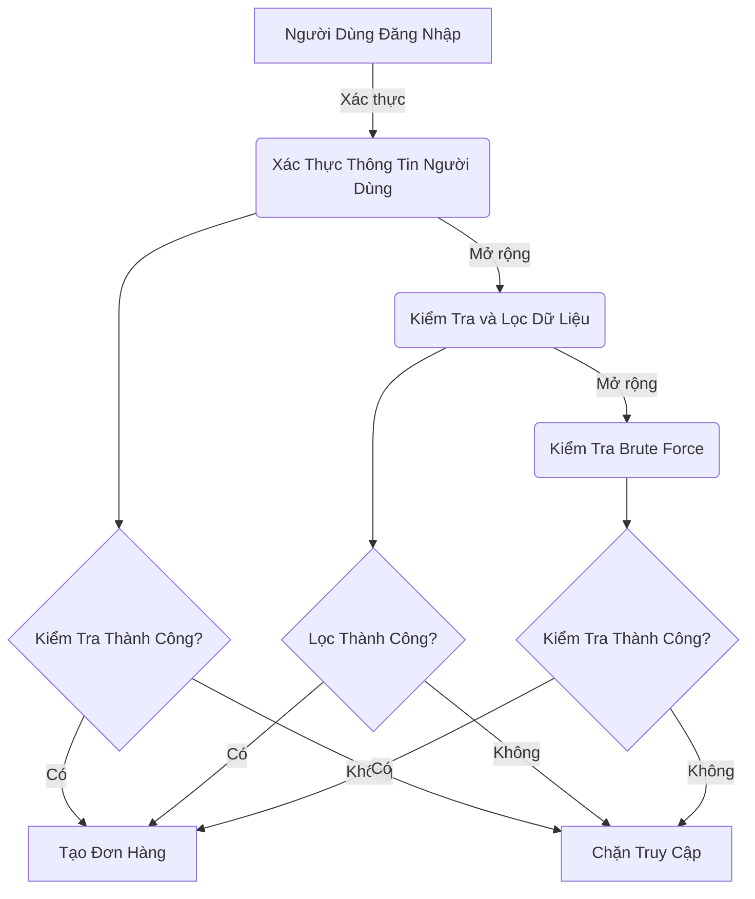
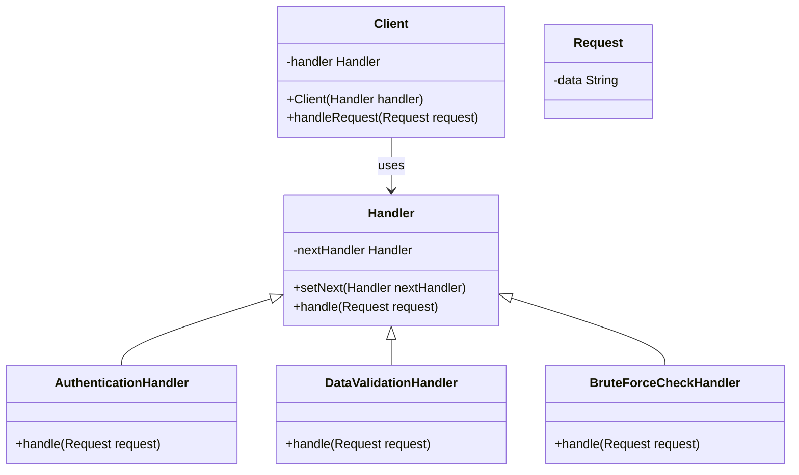
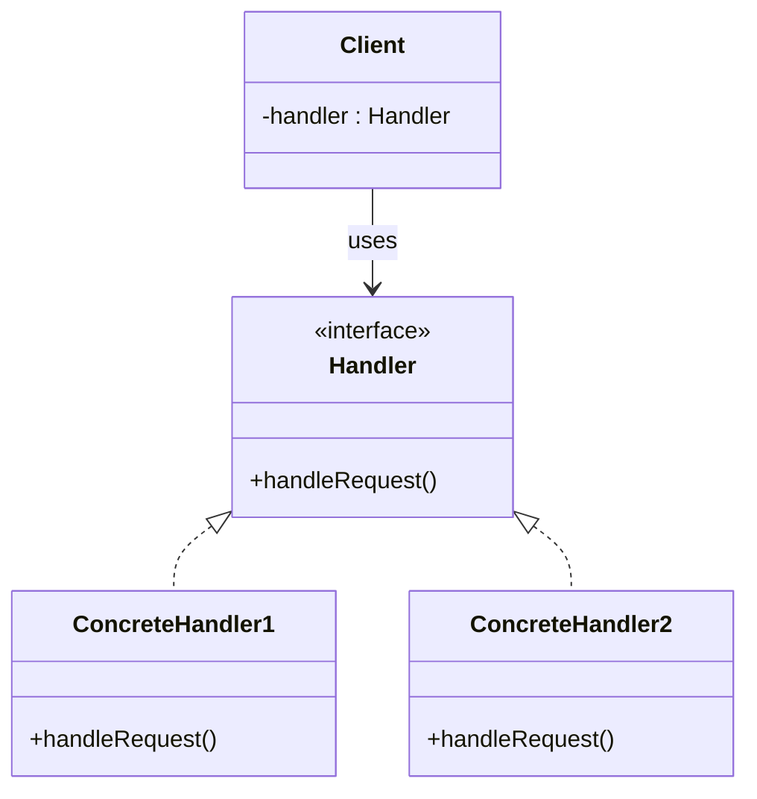

# Chain of Responsibility

## Tổng quan

**Chain of Responsibility** là Pattern thuộc nhóm hành vi (behavioral). Nó cho phép bản chuyển các yêu câu dọc theo chuỗi xử lý. Khi nhận được yêu cầu, mỗi trình xử lý sẽ quyết định xử lý yêu cầu hoặc chuyển cho trình xử lý khác.

## Đặt vấn đề

Bây giờ, hãy tưởng tượng bạn là một lập trình viên đang phát triển một hệ thống đặt hàng trực tuyến. Mục tiêu của bạn là hạn chế quyền truy cập vào hệ thống, chỉ cho phép những người đã xác thực mới có thể tạo đơn hàng. Đối với admin, họ có quyền truy cập toàn diện đến mọi đơn hàng.

Sau một thời gian, bạn nhận ra rằng các thao tác xác thực cần được thực hiện theo một trình tự nhất định. Hệ thống sẽ xác thực thông tin người dùng khi họ đăng nhập, nhưng nếu quá trình này thất bại, không cần thiết phải tiến hành các bước tiếp theo.

Một vài tháng sau, bạn cần phải thêm vào một số bước kiểm tra xác thực mới:

- Một đồng nghiệp gợi ý: "Em ơi, việc truyền dữ liệu trực tiếp vào cơ sở dữ liệu có thể rất nguy hiểm." Dựa trên lời khuyên này, bạn thêm một bước kiểm tra và lọc dữ liệu.
- Sau đó, một hacker mũ trắng chỉ ra rằng hệ thống của bạn dễ dàng bị tấn công bằng brute force. Nhận ra điều này, bạn nhanh chóng thêm một lớp kiểm tra để chặn các yêu cầu đăng nhập liên tiếp không thành công từ cùng một IP.



Tuy nhiên, theo thời gian, lớp xác thực của bạn trở nên phức tạp và khó quản lý. Điều này đặc biệt rắc rối khi các phần khác của hệ thống cần sử dụng một số chức năng cụ thể trong lớp xác thực lớn này.

## Giải pháp

Chain of Responsibility dựa vào việc chuyển đổi các hành vi cụ thể thành các đối tượng hoạt động lập gọi là handlers. Trong vấn đề trên, với hoạt động kiểm thử bạn nên đổi chúng thành một lớp đối tượng cụ thể với một phương thức duy nhất là kiểm tra.



Mô hình gợi ý bạn liên kết các handlers lại thành một chuỗi. Như vậy, mỗi handlers phải lưu trữ tham chiếu đến handler tiếp theo, ngoài việc xử lý yêu cầu handlers còn có nhiệm vụ chuyện đến các handers tiếp theo. Yêu cầu sẽ chuyển theo hết chuỗi hoặc có thể kết thúc bật kì handlers nào.

## Cấu Trúc



- Handler: Định nghĩa 1 interface để xử lý các yêu cầu.
- ConcreteHandler: Implement phương thức từ handler.
- Client: Tạo ra các yêu cầu và yêu cầu đó sẽ được gửi đến các đối tượng tiếp nhận.

## Ví dụ áp dụng Chain of Responsibility

Test.java

```java
public abstract class Test {
    private Test next;

    public Test linkWith(Test next) {
        this.next = next;
        return next;
    }

    public abstract boolean check(String email, String password);

    
    protected boolean checkNext(String email, String password) {
        if (this.next == null) {
            return true;
        }
        return next.check(email, password);
    }
}
```

RawDataTest.java

```java
public class RawDataTest extends Test{
    @Override
    public boolean check(String email, String password) {
        System.out.println("Raw Data");
        if (!email.contains("@")) {
            System.out.println("Email Valid");
            return false;
        }
        return this.checkNext(email,password);
    }
}
```

RoleTest.java

```java
public class RoleTest extends Test {
    @Override
    public boolean check(String email, String password) {
        System.out.println("Role Data");
        if (email.equals("admin@example.com")) {
            System.out.println("Hello, admin!");
            return true;
        }
        System.out.println("Hello, user!");
        return checkNext(email, password);
    }
}
```

UserExistsTest.java

```java
public class UserExistsTest extends Test{
    private Server server;

    public UserExistsTest(Server server) {
        this.server = server;
    }

    public boolean check(String email, String password) {
        System.out.println("User Exist");
        if (!server.hasEmail(email)) {
            System.out.println("This email is not registered!");
            return false;
        }

        return checkNext(email, password);
    }
}
```

Server.java

```java
import java.util.HashMap;
import java.util.Map;

public class Server {
    private Map<String, String> users = new HashMap<>();
    private Test test;

    public void setTest(Test test) {
        this.test = test;
    }

    public boolean hasEmail(String email) {
        return users.containsKey(email);
    }

    public void register(String email, String password) {
        users.put(email, password);
    }

    public boolean logIn(String email, String password) {
        if (this.test.check(email, password)) {
            System.out.println("Authorization have been successful!");

            // Do something useful here for authorized users.

            return true;
        }
        System.out.println("Authorization have been fail!");
        return false;
    }
}
```

Demo.java

```java
public class Demo {
    public static void main(String[] args) {
        Server server = new Server();
        server.register("admin@example.com", "admin_pass");
        server.register("phuc@xample.com", "user_pass");

        Test test = new RawDataTest();
        test.linkWith(new UserExistsTest(server)).linkWith(new RoleTest());

        server.setTest(test);

        server.logIn("phuc@xample.com","user_pass");
        System.out.println();
        server.logIn("phucxample.com","user_pass");
        System.out.println();
        server.logIn("admin@example.com", "admin_pass");

    }
}
```

## Khi nào áp dụng

Sử dụng khi chương trình của bạn cần sử nhiều loại yêu cầu khác nhau, nhưng bạn chưa chưa xác định được loại yêu cầu và cách sắp xếp tuần tự của nó.

Áp dụng khi một tác vụ nào đó cần sử lý tuần tự.


