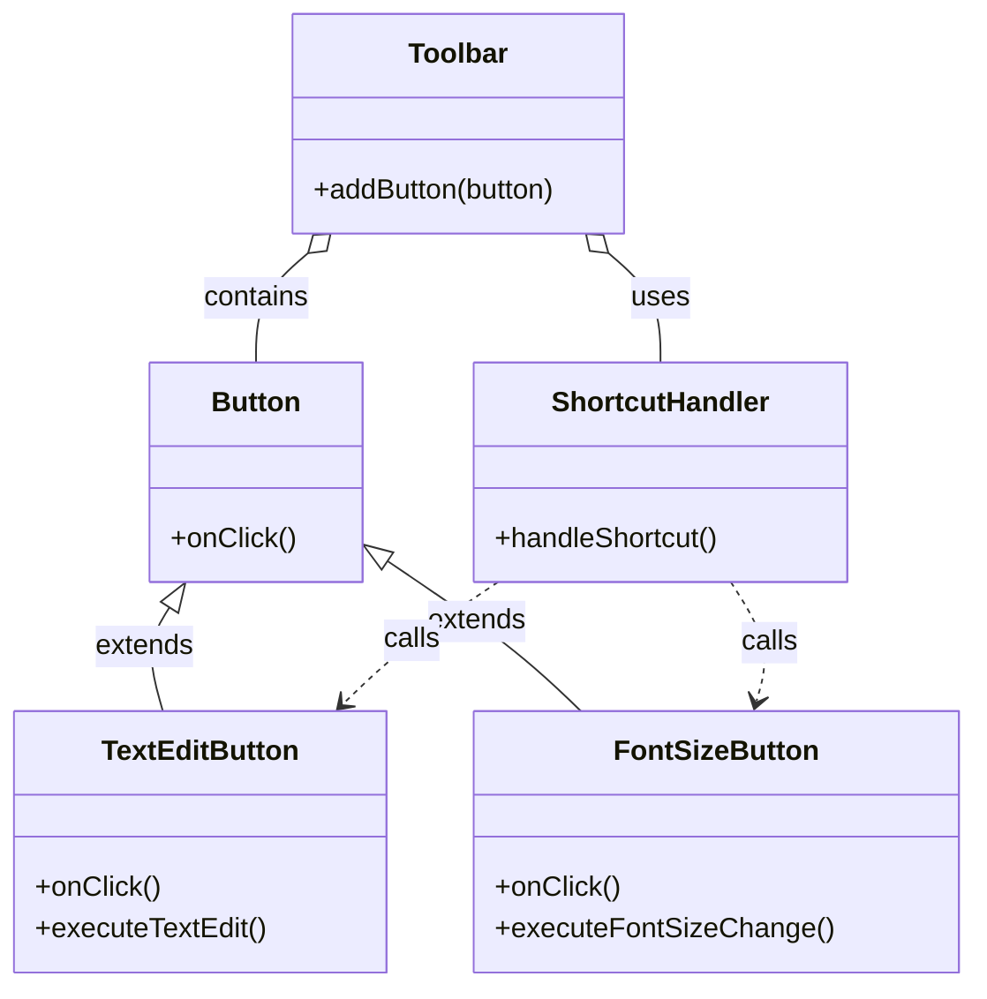
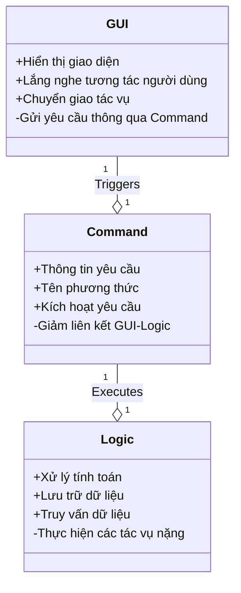
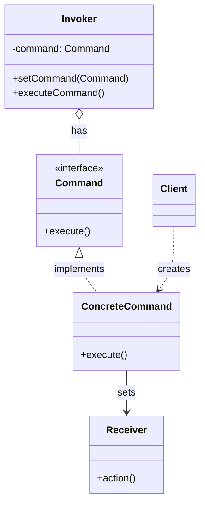
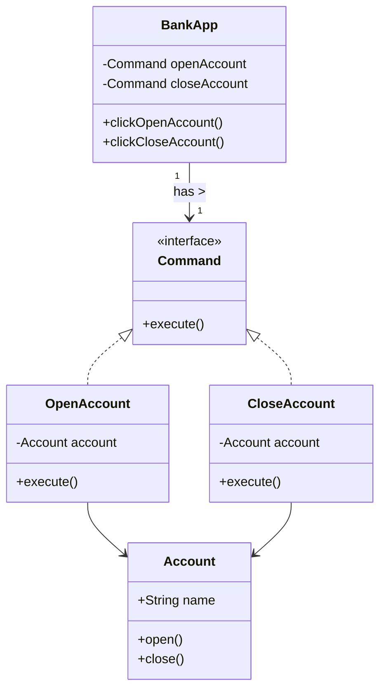

# Command

## Khái Niệm

**Command** trong phát triển phần mềm, đóng vai trò như một mẫu thiết kế hành vi, giúp chuyển đổi một yêu cầu thành một đối tượng độc lập chứa đầy đủ thông tin về yêu cầu đó. Cách tiếp cận này tạo ra một cấu trúc cho phép các yêu cầu được gửi, xử lý, và lưu trữ dưới dạng các đối tượng Command. Điều này cung cấp sự linh hoạt cao trong việc quản lý yêu cầu, cũng như trong việc thực thi các hành động phức tạp.

### Tổng quan

- **Định Nghĩa của Pattern:** Command Pattern cho phép đóng gói thông tin cần thiết để thực hiện một hành động hoặc kích hoạt một sự kiện vào trong một đối tượng đơn lẻ. Điều này bao gồm thông tin về phương thức nào được gọi, người gọi, và các tham số của phương thức.

- **Mục Đích:** Mục đích chính của mẫu thiết kế này là tách rời người phát ra yêu cầu (sender) khỏi đối tượng thực hiện yêu cầu (receiver). Điều này giúp giảm sự phụ thuộc giữa các lớp gọi và lớp nhận, từ đó tăng tính mô-đun và khả năng mở rộng của ứng dụng.

- **Ý Tưởng Cốt Lõi:** Trong Command Pattern, mỗi yêu cầu hoặc hành động được đóng gói thành một đối tượng Command riêng biệt. Điều này cho phép lưu trữ, xếp hàng, và kiểm soát các yêu cầu một cách linh hoạt. Nó cũng hỗ trợ hoạt động hoãn hành, undo/redo, hoặc ghi nhật ký các thao tác.

## Đặt vấn đề

Giả sử bạn đang làm việc trên một ứng dụng soạn thảo văn bản mới. Công việc hiện tại của bạn là tạo một thanh công cụ (toolbar) với vài nút (button) để chỉnh sửa. Bạn bắt đầu bằng cách tạo một lớp cơ sở `Button` để sử dụng cho các nút trên toolbar.

Các nút này có vẻ rất giống nhau, nhưng sự kiện xử lý của mỗi nút lại khác biệt. Làm sao để gán sự kiện cho mỗi nút button? Cách đơn giản nhất là tạo các lớp riêng biệt cho từng sự kiện và kế thừa lớp cơ sở `Button`.

Sau một thời gian, bạn nhận ra rằng phương pháp này có nhiều hạn chế. Đầu tiên, sự gia tăng của lớp con khiến kiến trúc trở nên phức tạp. Hơn nữa, mỗi khi lớp cơ sở `Button` thay đổi, việc bảo trì mã nguồn trở nên khó khăn.



Vấn đề trở nên nghiêm trọng hơn khi ứng dụng phát triển: người dùng không chỉ muốn thao tác thông qua các nút mà còn muốn sử dụng phím tắt hoặc các thao tác kéo thả. Điều này đòi hỏi bạn phải tạo thêm lớp để xử lý sự kiện từ phím tắt, và sau đó, phải sao chép toàn bộ chức năng đã được triển khai trong các nút button. Điều này không những tốn công mà còn gây khó khăn khi cần cập nhật chức năng, vì bạn phải thực hiện thay đổi ở nhiều nơi.

## Giải pháp




Để giải quyết vấn đề này, chúng ta cần phân tách giao diện người dùng và logic nền tảng thành hai lớp riêng biệt. Lớp GUI (Giao Diện Người Dùng) chịu trách nhiệm hiển thị giao diện trực quan và thân thiện cho người dùng, đồng thời lắng nghe và phản ứng với các tương tác từ phía người dùng. Tuy nhiên, khi đến phần xử lý tính toán, lưu trữ, và truy vấn dữ liệu, thì lớp GUI nên chuyển giao nhiệm vụ này cho lớp logic.

Có thể bạn sẽ nghĩ chỉ cần tạo ra một lớp logic để nhận và xử lý các sự kiện từ nút `Button` là đủ. Tuy nhiên, theo Command Pattern, tôi khuyến nghị không nên để GUI gọi trực tiếp các yêu cầu. Thay vào đó, bạn nên tạo một lớp đặc biệt, trong đó chứa thông tin và yêu cầu cần thiết, cùng với tên phương thức sẽ được gọi và một phương thức để kích hoạt yêu cầu đó.

Nhờ cách làm này, sự liên kết chặt chẽ giữa GUI và Logic sẽ được giảm bớt, giúp bạn có thêm sự linh hoạt trong quá trình sử dụng và phát triển phần mềm.

## Cấu Trúc



1. **Command (Interface):**
    - Đây là một interface hoặc abstract class định nghĩa phương thức `execute()`.
    - Mục đích là để tạo một giao diện chung cho tất cả các lệnh cụ thể.

2. **ConcreteCommand:**
    - Là một lớp cụ thể thực hiện interface `Command`.
    - Trong phương thức `execute()`, nó gọi phương thức tương ứng của Receiver.

3. **Invoker:**
    - Lưu trữ một tham chiếu đến một đối tượng `Command`.
    - Gọi phương thức `execute()` trên đối tượng `Command` để thực hiện yêu cầu.

4. **Receiver:**
    - Biết cách thực hiện các hoạt động cần thiết để thực hiện yêu cầu.
    - Mỗi `ConcreteCommand` sẽ liên kết với một `Receiver`.

5. **Client:**
    - Tạo ra một đối tượng `ConcreteCommand` và thiết lập receiver của nó.
    - Có thể giao `Command` cho `Invoker` để thực hiện.


## Cách triển khai

### 1. Command Interface

Đầu tiên, chúng ta cần định nghĩa interface `Command` với phương thức `execute()`.

```java
public interface Command {
    void execute();
}
```

### 2. ConcreteCommand

Tiếp theo, tạo các lớp `ConcreteCommand` thực thi interface `Command`. Mỗi `ConcreteCommand` sẽ chứa một tham chiếu đến `Receiver` và gọi phương thức của `Receiver` trong `execute()`.

```java
public class ConcreteCommand implements Command {
    private Receiver receiver;

    public ConcreteCommand(Receiver receiver){
        this.receiver = receiver;
    }

    @Override
    public void execute() {
        receiver.action();
    }
}
```

### 3. Receiver

Lớp `Receiver` biết cách thực hiện các hoạt động thực sự.

```java
public class Receiver {
    public void action() {
        System.out.println("Action performed by Receiver");
    }
}
```

### 4. Invoker

`Invoker` lưu trữ một tham chiếu đến `Command` và gọi `execute()` trên nó.

```java
public class Invoker {
    private Command command;

    public void setCommand(Command command){
        this.command = command;
    }

    public void executeCommand(){
        command.execute();
    }
}
```

### 5. Client

Cuối cùng, `Client` tạo `ConcreteCommand` và thiết lập `Receiver` của nó. Nó cũng có thể giao `Command` cho `Invoker`.

```java
public class Client {
    public static void main(String[] args) {
        Receiver receiver = new Receiver();
        Command command = new ConcreteCommand(receiver);
        Invoker invoker = new Invoker();

        invoker.setCommand(command);
        invoker.executeCommand();
    }
}
```

## Ví dụ áp dụng Command Pattern

Trong ví dụ này, mẫu Command Pattern được triển khai để mô phỏng hoạt động của một ứng dụng ngân hàng quản lý các thao tác liên quan đến tài khoản như mở và đóng tài khoản. Mẫu này tách biệt đối tượng gọi thao tác (lớp `BankApp`) với đối tượng biết cách thực hiện nó (lớp `Account`). Dưới đây là phần phân tích các thành phần:



1. **Tài khoản (Account.kt):** Lớp này đại diện cho một tài khoản ngân hàng với các chức năng cơ bản để mở và đóng tài khoản. Các phương thức `open()` và `close()` in ra các thông báo chỉ ra trạng thái của tài khoản.

2. **Lệnh (Command.kt):** Đây là một giao diện với một phương thức duy nhất `execute()`. Nó là trung tâm của Command Pattern, cho phép các lớp lệnh cụ thể triển khai phương thức này.

3. **Mở Tài Khoản (OpenAccount.kt):** Một lớp lệnh cụ thể triển khai giao diện `Command`. Nó đóng gói hành động `open()` của một `Account`.

4. **Đóng Tài Khoản (CloseAccount.kt):** Một lớp lệnh cụ thể khác triển khai giao diện `Command`. Nó đóng gói hành động `close()` của một `Account`.

5. **Ứng Dụng Ngân Hàng (BankApp.kt):** Lớp này đóng vai trò như một người gọi. Nó có các phương thức (`clickOpenAccount()` và `clickCloseAccount()`) thực thi các lệnh tương ứng.

6. **Chính (main.kt):** Điểm nhập của chương trình, nơi một `Account` được tạo, các đối tượng lệnh để mở và đóng tài khoản được khởi tạo, và `BankApp` được sử dụng để thực thi các lệnh này.


Account.kt

```kotlin
class Account {
    var name : String

    constructor(name: String) {
        this.name = name
    }

    fun open() {
        println("Account $name Opened")
    }

    fun close() {
        println("Account $name Closed")
    }

}
```

Command.kt

```kotlin
interface Command {
    fun execute()
}
```

OpenAccount.kt

```kotlin
class OpenAccount : Command{
    var account: Account

    constructor(account: Account) {
        this.account = account
    }

    override fun execute() {
        account.open()
    }
}
```

CloseAccount.kt

```kotlin
class CloseAccount : Command {
    var account: Account

    constructor(account: Account) {
        this.account = account
    }


    override fun execute() {
        account.close()
    }
}
```

BankApp.kt

```kotlin
class BankApp {
    private var openAccount: Command? = null
    private var closeAccount: Command? = null

    constructor(openAccount: Command?, closeAccount: Command?) {
        this.openAccount = openAccount
        this.closeAccount = closeAccount
    }


    fun clickOpenAccount() {
        println("User click open an account")
        openAccount!!.execute()
    }

    fun clickCloseAccount() {
        println("User click close an account")
        closeAccount!!.execute()
    }
}
```

main.kt

```kotlin
fun main(args: Array<String>) {
    var account : Account = Account("NickSeven")

    var openAccount : Command = OpenAccount(account)

    var closeAccount : Command = CloseAccount(account)

    var bankApp : BankApp = BankApp(openAccount,closeAccount)

    bankApp.clickOpenAccount()

    bankApp.clickCloseAccount()
}
```

Kết quả

```
User click open an account
Account NickSeven Opened
User click close an account
Account NickSeven Closed

Process finished with exit code 0
```

## Khi nào áp dụng

Khi cần tham số hóa các đối tượng theo một hành động thực hiện.

Khi cần tạo và thực thi các yêu cầu vào các thời điểm khác nhau.
