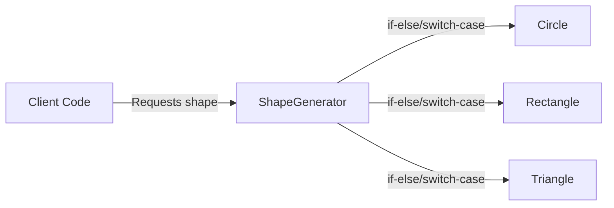
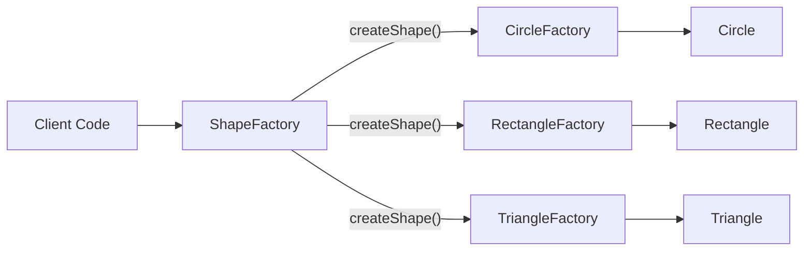
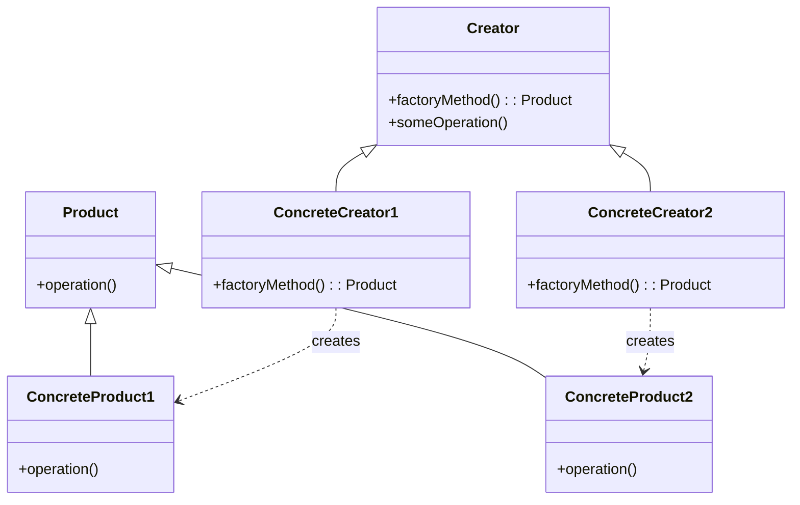

# Factory Method :  Tạo đối tượng mà không chỉ định class cụ thể

## Giới thiệu

Trong lập trình hướng đối tượng, Factory Method là một mẫu thiết kế thuộc nhóm Creational Patterns. Mục đích chính của Factory Method là định nghĩa một interface hoặc lớp trừu tượng để tạo ra một đối tượng, nhưng để cho các lớp con quyết định lớp cụ thể nào sẽ được khởi tạo. Factory Method cho phép một lớp ủy quyền việc khởi tạo đối tượng cho các lớp con.

## Đặt vấn đề

Giả sử chúng ta đang xây dựng một ứng dụng vẽ hình. Ứng dụng này hỗ trợ việc vẽ các hình dạng khác nhau như hình tròn, hình chữ nhật và hình tam giác. Chúng ta có một lớp `Shape` là lớp cha và các lớp con tương ứng cho từng loại hình dạng.

```java
public abstract class Shape {
    public abstract void draw();
}

public class Circle extends Shape {
    @Override
    public void draw() {
        System.out.println("Drawing a circle");
    }
}

public class Rectangle extends Shape {
    @Override
    public void draw() {
        System.out.println("Drawing a rectangle");
    }
}

public class Triangle extends Shape {
    @Override
    public void draw() {
        System.out.println("Drawing a triangle");
    }
}
```

Bây giờ, chúng ta muốn tạo một đối tượng `Shape` dựa trên loại hình dạng được chỉ định bởi người dùng. Cách tiếp cận thông thường là sử dụng các câu lệnh `if-else` hoặc `switch-case` để xác định loại hình dạng và khởi tạo đối tượng tương ứng.

```java
public class ShapeGenerator {
    public Shape createShape(String shapeType) {
        if (shapeType.equalsIgnoreCase("circle")) {
            return new Circle();
        } else if (shapeType.equalsIgnoreCase("rectangle")) {
            return new Rectangle();
        } else if (shapeType.equalsIgnoreCase("triangle")) {
            return new Triangle();
        }
        return null;
    }
}
```

Tuy nhiên, cách tiếp cận này có một số hạn chế:
- Mã nguồn của `ShapeGenerator` phải được sửa đổi mỗi khi có một loại hình dạng mới được thêm vào.
- Vi phạm nguyên tắc Open/Closed Principle (OCP) vì lớp `ShapeGenerator` cần phải được sửa đổi khi mở rộng.
- Khó bảo trì và mở rộng khi số lượng các loại hình dạng tăng lên.



Như minh họa trong sơ đồ trên, khi client code yêu cầu một hình dạng cụ thể, `ShapeGenerator` sử dụng các câu lệnh `if-else` hoặc `switch-case` để xác định và khởi tạo đối tượng hình dạng tương ứng. Điều này dẫn đến sự phụ thuộc chặt chẽ giữa `ShapeGenerator` và các lớp hình dạng cụ thể, làm cho mã nguồn khó bảo trì và mở rộng.

Vấn đề này đòi hỏi một giải pháp để tách biệt việc khởi tạo đối tượng khỏi lớp `ShapeGenerator` và cho phép dễ dàng mở rộng khi có các loại hình dạng mới.

## Giải pháp

Factory Method Pattern giải quyết vấn đề trên bằng cách định nghĩa một phương thức trừu tượng (factory method) trong lớp cha `ShapeFactory` để tạo ra đối tượng, nhưng để cho các lớp con cụ thể quyết định lớp nào sẽ được khởi tạo. Các lớp con sẽ ghi đè (override) phương thức này để tạo ra đối tượng cụ thể.

```java
public abstract class ShapeFactory {
    public abstract Shape createShape();

    public void drawShape() {
        Shape shape = createShape();
        shape.draw();
    }
}

public class CircleFactory extends ShapeFactory {
    @Override
    public Shape createShape() {
        return new Circle();
    }
}

public class RectangleFactory extends ShapeFactory {
    @Override
    public Shape createShape() {
        return new Rectangle();
    }
}

public class TriangleFactory extends ShapeFactory {
    @Override
    public Shape createShape() {
        return new Triangle();
    }
}
```

Với Factory Method Pattern, chúng ta định nghĩa một lớp trừu tượng `ShapeFactory` với phương thức trừu tượng `createShape()`. Mỗi lớp con cụ thể như `CircleFactory`, `RectangleFactory`, và `TriangleFactory` sẽ ghi đè phương thức này để tạo ra đối tượng hình dạng tương ứng.

Khi client code muốn tạo một đối tượng hình dạng, nó chỉ cần tương tác với lớp `ShapeFactory` tương ứng và gọi phương thức `createShape()`. Lớp con cụ thể sẽ tạo ra đối tượng hình dạng thích hợp.

```java
public class Client {
    public static void main(String[] args) {
        ShapeFactory circleFactory = new CircleFactory();
        circleFactory.drawShape();

        ShapeFactory rectangleFactory = new RectangleFactory();
        rectangleFactory.drawShape();

        ShapeFactory triangleFactory = new TriangleFactory();
        triangleFactory.drawShape();
    }
}
```

Kết quả:
```
Drawing a circle
Drawing a rectangle
Drawing a triangle
```



Như minh họa trong sơ đồ trên, với Factory Method Pattern, client code tương tác với lớp trừu tượng `ShapeFactory` và các lớp con cụ thể như `CircleFactory`, `RectangleFactory`, và `TriangleFactory`. Mỗi lớp con ghi đè phương thức `createShape()` để tạo ra đối tượng hình dạng tương ứng. Điều này giúp tách biệt việc khởi tạo đối tượng khỏi client code và cho phép dễ dàng mở rộng khi có các loại hình dạng mới.

Factory Method Pattern giúp giải quyết vấn đề của việc khởi tạo đối tượng phụ thuộc vào lớp cụ thể bằng cách ủy quyền việc khởi tạo cho các lớp con. Nó tách biệt việc khởi tạo đối tượng khỏi mã nguồn client, làm cho mã nguồn trở nên linh hoạt, dễ bảo trì và mở rộng.

## Cấu trúc

Để triển khai Factory Method Pattern, chúng ta cần có các thành phần sau:



1. Product: Định nghĩa giao diện chung cho các đối tượng mà factory method tạo ra.

2. ConcreteProduct: Triển khai giao diện Product và đại diện cho các đối tượng cụ thể được tạo ra bởi factory method.

3. Creator: Khai báo phương thức factory method trừu tượng để trả về một đối tượng của kiểu Product. Creator cũng có thể chứa các phương thức khác sử dụng đối tượng được tạo ra bởi factory method.

4. ConcreteCreator: Ghi đè phương thức factory method để trả về một thể hiện của ConcreteProduct tương ứng.

Với cấu trúc này, Factory Method Pattern cho phép tạo ra các đối tượng mà không chỉ định lớp cụ thể của chúng. Client code chỉ tương tác với Creator và ConcreteCreator để tạo ra đối tượng mong muốn.

## Cách triển khai

Để triển khai Factory Method Pattern, ta cần:

- Xác định Interface/ Lớp trừu tượng cho sản phẩm:

```java
// Định nghĩa giao diện Product
interface Product {
    void doSomething();
}

// Các lớp cụ thể triển khai giao diện Product
class ProductA implements Product {
    @Override
    public void doSomething() {
        System.out.println("ProductA is doing something.");
    }
}

class ProductB implements Product {
    @Override
    public void doSomething() {
        System.out.println("ProductB is doing something.");
    }
}
```

- Xác định lớp Creator trừu tượng với phương thức factory method:

```java
// Định nghĩa lớp Creator và phương thức factoryMethod
abstract class Creator {
    public abstract Product factoryMethod();

    public void anOperation() {
        Product product = factoryMethod();
        product.doSomething();
    }
}

// Các lớp ConcreteCreator triển khai factoryMethod để tạo Product tương ứng
class ConcreteCreatorA extends Creator {
    @Override
    public Product factoryMethod() {
        return new ProductA();
    }
}

class ConcreteCreatorB extends Creator {
    @Override
    public Product factoryMethod() {
        return new ProductB();
    }
}
```

- Sử dụng Creator và ConcreteCreator để lấy ra sản phẩm:

```java
public class Main {
    public static void main(String[] args) {
        // Sử dụng ConcreteCreatorA để tạo ProductA
        Creator creatorA = new ConcreteCreatorA();
        Product productA = creatorA.factoryMethod();
        productA.doSomething();

        // Sử dụng ConcreteCreatorB để tạo ProductB
        Creator creatorB = new ConcreteCreatorB();
        Product productB = creatorB.factoryMethod();
        productB.doSomething();
    }
}
```

## Ví dụ

Dưới đây là một ví dụ minh họa về Factory Method trong Java:

```java
// Định nghĩa lớp hình học cơ bản
interface Shape {
    void draw();
}

// Triển khai lớp Circle
class Circle implements Shape {
    @Override
    public void draw() {
        System.out.println("Drawing a Circle");
    }
}

// Triển khai lớp Rectangle
class Rectangle implements Shape {
    @Override
    public void draw() {
        System.out.println("Drawing a Rectangle");
    }
}

// Lớp cơ sở ShapeFactory khai báo một phương thức factory method
// Mọi lớp con của ShapeFactory cần triển khai phương thức này để tạo đối tượng hình học cụ thể.
public abstract class ShapeFactory {

    // Factory Method: Một phương thức abstract để tạo đối tượng hình học.
    public abstract Shape createShape();
}

// Lớp CircleFactory là một lớp con của ShapeFactory
public class CircleFactory extends ShapeFactory {

    // Triển khai factory method để tạo đối tượng Circle.
    @Override
    public Shape createShape() {
        return new Circle();
    }
}

// Lớp RectangleFactory cũng là một lớp con của ShapeFactory
public class RectangleFactory extends ShapeFactory {

    // Triển khai factory method để tạo đối tượng Rectangle.
    @Override
    public Shape createShape() {
        return new Rectangle();
    }
}


public class Main {

    public static void main(String[] args) {
        ShapeFactory circleFactory = new CircleFactory();
        Shape circle = circleFactory.createShape();
        circle.draw(); // Output: Drawing a Circle

        ShapeFactory rectangleFactory = new RectangleFactory();
        Shape rectangle = rectangleFactory.createShape();
        rectangle.draw(); // Output: Drawing a Rectangle
    }
}

```

Trong ví dụ này, chúng ta đã triển khai các lớp Circle và Rectangle để thực hiện phương thức draw(), và sau đó gọi phương thức này từ đối tượng Shape được tạo bởi các Factory tương ứng. Điều này cho phép bạn tạo các đối tượng hình học mà không cần quan tâm đến việc cụ thể chúng là hình tròn hay hình chữ nhật.

## So sánh

Factory Method có thể được so sánh với một số Design Pattern tương tự như sau:

- Builder Pattern: Cả Builder Pattern và Factory Method đều cung cấp cách tạo ra các đối tượng một cách linh hoạt. Tuy nhiên, Builder Pattern tách biệt quá trình xây dựng đối tượng với biểu diễn của nó, trong khi Factory Method vẫn kết hợp hai khía cạnh này.

- Abstract Factory Pattern: Abstract Factory cung cấp interface để tạo ra các họ đối tượng liên quan nhau, trong khi Factory Method chỉ tập trung vào việc tạo một lớp đối tượng cụ thể.

- Prototype Pattern: Prototype tạo ra đối tượng bằng cách clone một đối tượng đã tồn tại, trong khi Factory Method tạo ra đối tượng mới mỗi lần được gọi.

- Singleton Pattern: Singleton chỉ cho phép tạo một thể hiện của lớp, còn Factory Method cho phép tạo nhiều thể hiện khác nhau của lớp.

Như vậy, mặc dù có một số điểm tương đồng, Factory Method vẫn có những đặc điểm riêng biệt so với các Pattern khác.

## Kết Luận

Factory Pattern thường được sử dụng trong các trường hợp sau:

- Khi có nhu cầu tạo ra các đối tượng phức tạp với nhiều bước xử lý khác nhau hoặc phụ thuộc vào điều kiện cụ thể nào đó. Factory Method cho phép tách quá trình khởi tạo phức tạp ra khỏi business logic chính.

- Khi muốn mở rộng để thêm các lớp con mới mà không làm ảnh hưởng đến code hiện tại. Factory Method cho phép mở rộng dễ dàng hơn so với khởi tạo trực tiếp.

- Khi muốn đóng gói hoặc che giấu logic khởi tạo của hệ thống.

- Khi muốn tạo ra các đối tượng theo cách chung chung mà không cần chỉ định lớp cụ thể.

Như vậy, Factory Pattern là một pattern hữu ích giúp tăng tính linh hoạt và khả năng mở rộng cho hệ thống bằng cách tách biệt quá trình khởi tạo đối tượng. Pattern này được sử dụng rộng rãi trong thiết kế phần mềm.