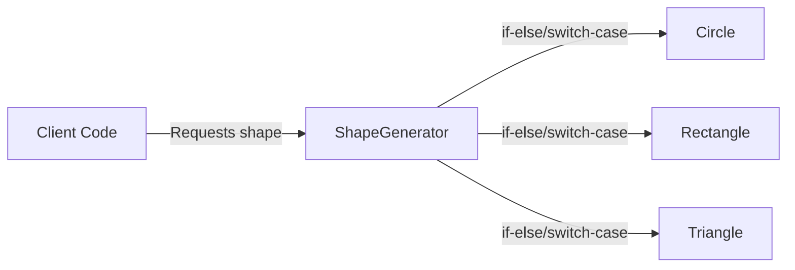
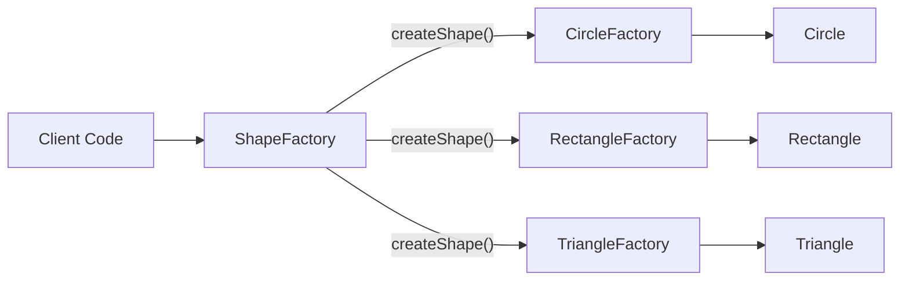
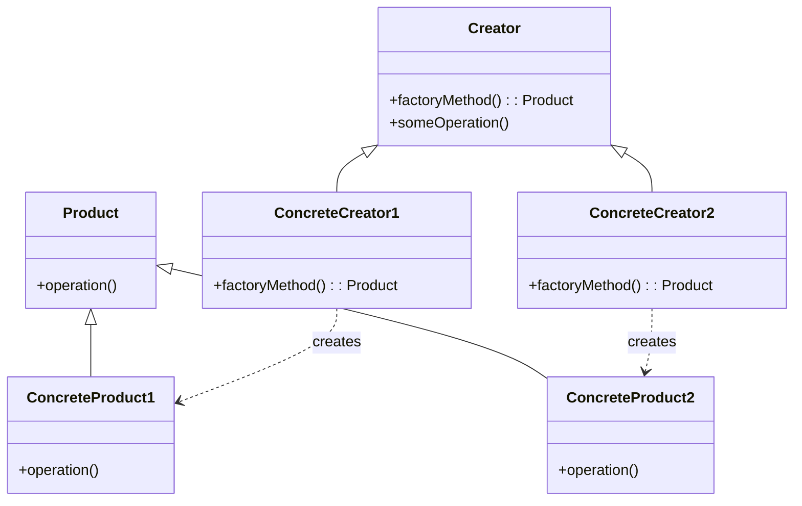

# Factory Method :  Tạo đối tượng mà không chỉ định class cụ thể

## Giới thiệu

Factory Method là một mẫu thiết kế thuộc nhóm Creational Patterns. Mục đích chính của Factory Method là định nghĩa một interface hoặc lớp trừu tượng để tạo ra một đối tượng, nhưng để cho các lớp con quyết định lớp cụ thể nào sẽ được khởi tạo. Factory Method cho phép một lớp ủy quyền việc khởi tạo đối tượng cho các lớp con.

## Đặt vấn đề

Giả sử chúng ta đang xây dựng một ứng dụng vẽ hình. Ứng dụng này hỗ trợ việc vẽ các hình dạng khác nhau như hình tròn, hình chữ nhật và hình tam giác. Chúng ta có một lớp `Shape` là lớp cha và các lớp con tương ứng cho từng loại hình dạng.

```java
public abstract class Shape {
    public abstract void draw();
}

public class Circle extends Shape {
    @Override
    public void draw() {
        System.out.println("Drawing a circle");
    }
}

public class Rectangle extends Shape {
    @Override
    public void draw() {
        System.out.println("Drawing a rectangle");
    }
}

public class Triangle extends Shape {
    @Override
    public void draw() {
        System.out.println("Drawing a triangle");
    }
}
```

Bây giờ, chúng ta muốn tạo một đối tượng `Shape` dựa trên loại hình dạng được chỉ định bởi người dùng. Cách tiếp cận thông thường là sử dụng các câu lệnh `if-else` hoặc `switch-case` để xác định loại hình dạng và khởi tạo đối tượng tương ứng.

```java
public class ShapeGenerator {
    public Shape createShape(String shapeType) {
        if (shapeType.equalsIgnoreCase("circle")) {
            return new Circle();
        } else if (shapeType.equalsIgnoreCase("rectangle")) {
            return new Rectangle();
        } else if (shapeType.equalsIgnoreCase("triangle")) {
            return new Triangle();
        }
        return null;
    }
}
```

Tuy nhiên, cách tiếp cận này có một số hạn chế:
- Mã nguồn của `ShapeGenerator` phải được sửa đổi mỗi khi có một loại hình dạng mới được thêm vào.
- Vi phạm nguyên tắc Open/Closed Principle (OCP) vì lớp `ShapeGenerator` cần phải được sửa đổi khi mở rộng.
- Khó bảo trì và mở rộng khi số lượng các loại hình dạng tăng lên.



Như minh họa trong sơ đồ trên, khi client code yêu cầu một hình dạng cụ thể, `ShapeGenerator` sử dụng các câu lệnh `if-else` hoặc `switch-case` để xác định và khởi tạo đối tượng hình dạng tương ứng. Điều này dẫn đến sự phụ thuộc chặt chẽ giữa `ShapeGenerator` và các lớp hình dạng cụ thể, làm cho mã nguồn khó bảo trì và mở rộng.

Vấn đề này đòi hỏi một giải pháp để tách biệt việc khởi tạo đối tượng khỏi lớp `ShapeGenerator` và cho phép dễ dàng mở rộng khi có các loại hình dạng mới.

## Giải pháp

Factory Method Pattern giải quyết vấn đề trên bằng cách định nghĩa một phương thức trừu tượng (factory method) trong lớp cha `ShapeFactory` để tạo ra đối tượng, nhưng để cho các lớp con cụ thể quyết định lớp nào sẽ được khởi tạo. Các lớp con sẽ ghi đè (override) phương thức này để tạo ra đối tượng cụ thể.

```java
public abstract class ShapeFactory {
    public abstract Shape createShape();

    public void drawShape() {
        Shape shape = createShape();
        shape.draw();
    }
}

public class CircleFactory extends ShapeFactory {
    @Override
    public Shape createShape() {
        return new Circle();
    }
}

public class RectangleFactory extends ShapeFactory {
    @Override
    public Shape createShape() {
        return new Rectangle();
    }
}

public class TriangleFactory extends ShapeFactory {
    @Override
    public Shape createShape() {
        return new Triangle();
    }
}
```

Với Factory Method Pattern, chúng ta định nghĩa một lớp trừu tượng `ShapeFactory` với phương thức trừu tượng `createShape()`. Mỗi lớp con cụ thể như `CircleFactory`, `RectangleFactory`, và `TriangleFactory` sẽ ghi đè phương thức này để tạo ra đối tượng hình dạng tương ứng.

Khi client code muốn tạo một đối tượng hình dạng, nó chỉ cần tương tác với lớp `ShapeFactory` tương ứng và gọi phương thức `createShape()`. Lớp con cụ thể sẽ tạo ra đối tượng hình dạng thích hợp.

```java
public class Client {
    public static void main(String[] args) {
        ShapeFactory circleFactory = new CircleFactory();
        circleFactory.drawShape();

        ShapeFactory rectangleFactory = new RectangleFactory();
        rectangleFactory.drawShape();

        ShapeFactory triangleFactory = new TriangleFactory();
        triangleFactory.drawShape();
    }
}
```

Kết quả:
```
Drawing a circle
Drawing a rectangle
Drawing a triangle
```



Như minh họa trong sơ đồ trên, với Factory Method Pattern, client code tương tác với lớp trừu tượng `ShapeFactory` và các lớp con cụ thể như `CircleFactory`, `RectangleFactory`, và `TriangleFactory`. Mỗi lớp con ghi đè phương thức `createShape()` để tạo ra đối tượng hình dạng tương ứng. Điều này giúp tách biệt việc khởi tạo đối tượng khỏi client code và cho phép dễ dàng mở rộng khi có các loại hình dạng mới.

Factory Method Pattern giúp giải quyết vấn đề của việc khởi tạo đối tượng phụ thuộc vào lớp cụ thể bằng cách ủy quyền việc khởi tạo cho các lớp con. Nó tách biệt việc khởi tạo đối tượng khỏi mã nguồn client, làm cho mã nguồn trở nên linh hoạt, dễ bảo trì và mở rộng.

## Cấu trúc

Để triển khai Factory Method Pattern, chúng ta cần có các thành phần sau:



1. Product: Định nghĩa giao diện chung cho các đối tượng mà factory method tạo ra.

2. ConcreteProduct: Triển khai giao diện Product và đại diện cho các đối tượng cụ thể được tạo ra bởi factory method.

3. Creator: Khai báo phương thức factory method trừu tượng để trả về một đối tượng của kiểu Product. Creator cũng có thể chứa các phương thức khác sử dụng đối tượng được tạo ra bởi factory method.

4. ConcreteCreator: Ghi đè phương thức factory method để trả về một thể hiện của ConcreteProduct tương ứng.

Với cấu trúc này, Factory Method Pattern cho phép tạo ra các đối tượng mà không chỉ định lớp cụ thể của chúng. Client code chỉ tương tác với Creator và ConcreteCreator để tạo ra đối tượng mong muốn.

## Cách triển khai

Dưới đây là một ví dụ về cách triển khai Factory Method Pattern trong Java để tạo ra các đối tượng đồ uống khác nhau:

```java
// Product
public abstract class Drink {
    public abstract void prepare();
}

// ConcreteProduct
public class Coffee extends Drink {
    @Override
    public void prepare() {
        System.out.println("Preparing coffee");
    }
}

public class Tea extends Drink {
    @Override
    public void prepare() {
        System.out.println("Preparing tea");
    }
}

// Creator
public abstract class DrinkFactory {
    public abstract Drink createDrink();

    public void serveDrink() {
        Drink drink = createDrink();
        drink.prepare();
        System.out.println("Serving the drink");
    }
}

// ConcreteCreator
public class CoffeeFactory extends DrinkFactory {
    @Override
    public Drink createDrink() {
        return new Coffee();
    }
}

public class TeaFactory extends DrinkFactory {
    @Override
    public Drink createDrink() {
        return new Tea();
    }
}

// Client code
public class Client {
    public static void main(String[] args) {
        DrinkFactory coffeeFactory = new CoffeeFactory();
        coffeeFactory.serveDrink();

        DrinkFactory teaFactory = new TeaFactory();
        teaFactory.serveDrink();
    }
}
```

Trong ví dụ trên, chúng ta có:
- `Drink`: Đại diện cho giao diện chung cho các đối tượng đồ uống.
- `Coffee` và `Tea`: Các lớp cụ thể triển khai giao diện `Drink`, đại diện cho các loại đồ uống khác nhau.
- `DrinkFactory`: Lớp trừu tượng định nghĩa phương thức factory method `createDrink()` để tạo ra đối tượng đồ uống.
- `CoffeeFactory` và `TeaFactory`: Các lớp cụ thể kế thừa từ `DrinkFactory` và ghi đè phương thức `createDrink()` để tạo ra đối tượng đồ uống tương ứng.

Trong phần client code, chúng ta tạo các đối tượng factory tương ứng với loại đồ uống mong muốn (`CoffeeFactory` hoặc `TeaFactory`), và gọi phương thức `serveDrink()` để chuẩn bị và phục vụ đồ uống.

Factory Method Pattern cho phép tạo ra các đối tượng đồ uống một cách linh hoạt, dễ mở rộng và dễ bảo trì. Khi có một loại đồ uống mới, chúng ta chỉ cần tạo một lớp cụ thể mới kế thừa từ `DrinkFactory` và ghi đè phương thức `createDrink()` để tạo ra đối tượng đồ uống mới, mà không cần sửa đổi mã nguồn hiện có.

## Ứng dụng thực tế

Factory Method Pattern được ứng dụng rộng rãi trong nhiều lĩnh vực của phát triển phần mềm. Dưới đây là một số ví dụ điển hình về việc áp dụng Factory Method trong thực tế.

### 1. Frameworks và thư viện

Nhiều frameworks và thư viện sử dụng Factory Method Pattern để cung cấp một cách linh hoạt và mở rộng để tạo ra các đối tượng. Ví dụ:

- Trong Java Swing, lớp `UIManager` sử dụng Factory Method Pattern để tạo ra các thành phần giao diện người dùng như nút, hộp thoại, vv. Các lớp con cụ thể của `UIManager` ghi đè phương thức factory để tạo ra các thành phần tương ứng với giao diện người dùng cụ thể.

```java
UIManager.setLookAndFeel(new MetalLookAndFeel());
JButton button = (JButton) UIManager.getUI(new JButton());
```

- Trong .NET Framework, lớp `DbProviderFactory` là một ví dụ của Factory Method Pattern. Nó định nghĩa một giao diện chung cho việc tạo ra các đối tượng truy cập cơ sở dữ liệu, và các lớp con cụ thể như `SqlClientFactory`, `OracleClientFactory` ghi đè phương thức factory để tạo ra các đối tượng tương ứng với từng loại cơ sở
  dữ liệu.

```csharp
DbProviderFactory factory = DbProviderFactories.GetFactory("System.Data.SqlClient");
DbConnection connection = factory.CreateConnection();
```

### 2. Logging frameworks

Các frameworks ghi log như Log4j, SLF4J sử dụng Factory Method Pattern để tạo ra các đối tượng logger tương ứng với các cấu hình và ngữ cảnh khác nhau. Ví dụ:

```java
Logger logger = LoggerFactory.getLogger(MyClass.class);
logger.info("This is a log message");
```

Trong đoạn mã trên, `LoggerFactory` là một factory class sử dụng Factory Method Pattern để tạo ra đối tượng `Logger` tương ứng với lớp `MyClass`. Điều này cho phép linh hoạt trong việc cấu hình và sử dụng các logger khác nhau trong ứng dụng.

### 3. Mẫu thiết kế khác

Factory Method Pattern cũng được sử dụng làm cơ sở cho nhiều mẫu thiết kế khác như Abstract Factory, Builder, Prototype. Những mẫu thiết kế này sử dụng Factory Method Pattern để tạo ra các đối tượng một cách linh hoạt và có thể mở rộng.

Ví dụ, trong Abstract Factory Pattern, Factory Method được sử dụng để tạo ra các đối tượng sản phẩm cụ thể từ các factory tương ứng:

```java
public abstract class GUIFactory {
    public abstract Button createButton();
    public abstract Checkbox createCheckbox();
}

public class WindowsFactory extends GUIFactory {
    @Override
    public Button createButton() {
        return new WindowsButton();
    }

    @Override
    public Checkbox createCheckbox() {
        return new WindowsCheckbox();
    }
}
```

Trong ví dụ trên, `GUIFactory` là một abstract factory class sử dụng Factory Method Pattern để định nghĩa các phương thức tạo ra các thành phần giao diện người dùng như `Button` và `Checkbox`. Lớp con cụ thể `WindowsFactory` ghi đè các phương thức này để tạo ra các thành phần tương ứng với giao diện người dùng Windows.

## So sánh

Factory Method có thể được so sánh với một số Design Pattern tương tự như sau:

- Builder Pattern: Cả Builder Pattern và Factory Method đều cung cấp cách tạo ra các đối tượng một cách linh hoạt. Tuy nhiên, Builder Pattern tách biệt quá trình xây dựng đối tượng với biểu diễn của nó, trong khi Factory Method vẫn kết hợp hai khía cạnh này.

- Abstract Factory Pattern: Abstract Factory cung cấp interface để tạo ra các họ đối tượng liên quan nhau, trong khi Factory Method chỉ tập trung vào việc tạo một lớp đối tượng cụ thể.

- Prototype Pattern: Prototype tạo ra đối tượng bằng cách clone một đối tượng đã tồn tại, trong khi Factory Method tạo ra đối tượng mới mỗi lần được gọi.

- Singleton Pattern: Singleton chỉ cho phép tạo một thể hiện của lớp, còn Factory Method cho phép tạo nhiều thể hiện khác nhau của lớp.

Như vậy, mặc dù có một số điểm tương đồng, Factory Method vẫn có những đặc điểm riêng biệt so với các Pattern khác.

## Kết Luận

Factory Pattern thường được sử dụng trong các trường hợp sau:

- Khi có nhu cầu tạo ra các đối tượng phức tạp với nhiều bước xử lý khác nhau hoặc phụ thuộc vào điều kiện cụ thể nào đó. Factory Method cho phép tách quá trình khởi tạo phức tạp ra khỏi business logic chính.

- Khi muốn mở rộng để thêm các lớp con mới mà không làm ảnh hưởng đến code hiện tại. Factory Method cho phép mở rộng dễ dàng hơn so với khởi tạo trực tiếp.

- Khi muốn đóng gói hoặc che giấu logic khởi tạo của hệ thống.

- Khi muốn tạo ra các đối tượng theo cách chung chung mà không cần chỉ định lớp cụ thể.

Như vậy, Factory Pattern là một pattern hữu ích giúp tăng tính linh hoạt và khả năng mở rộng cho hệ thống bằng cách tách biệt quá trình khởi tạo đối tượng. Pattern này được sử dụng rộng rãi trong thiết kế phần mềm.