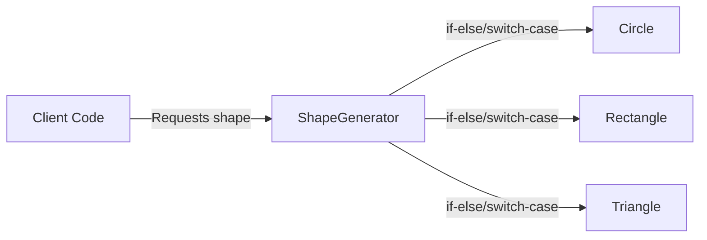
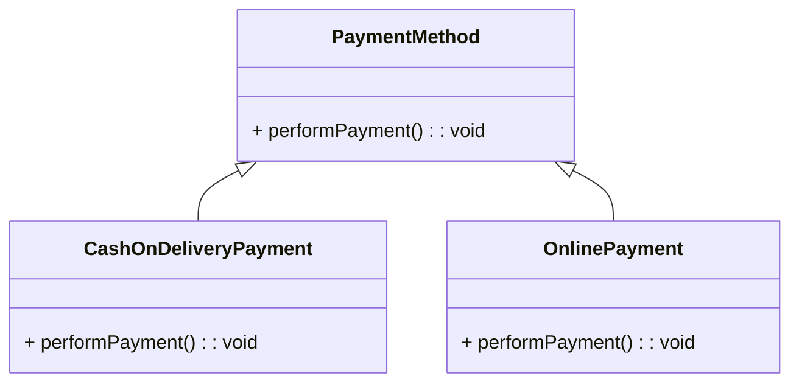
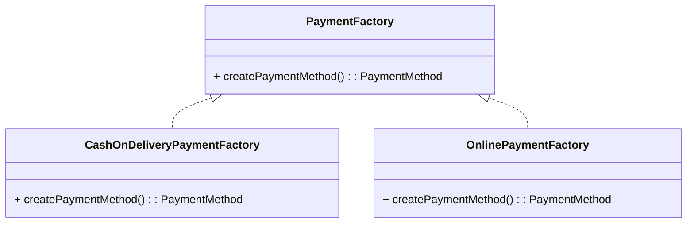
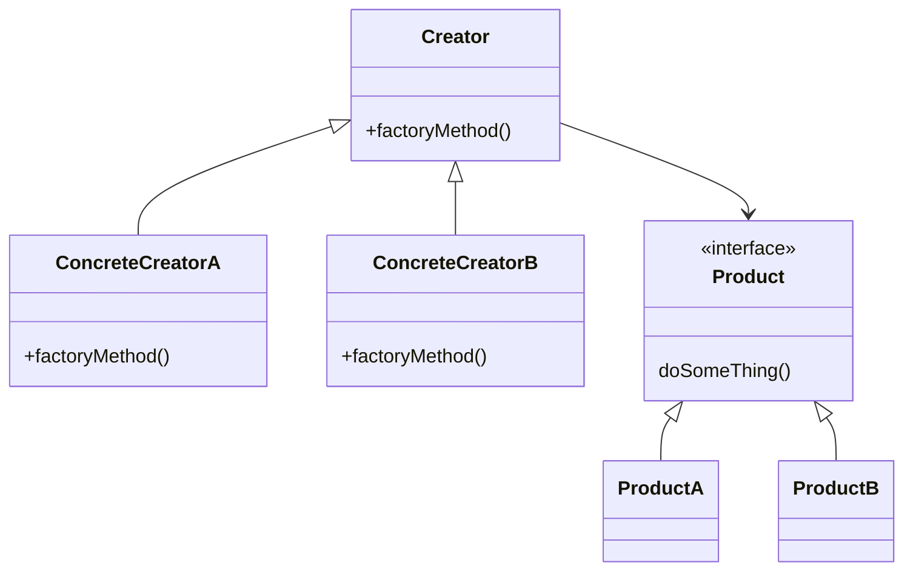

# Factory Method :  Tạo đối tượng mà không chỉ định class cụ thể

## Giới thiệu

Trong lập trình hướng đối tượng, Factory Method là một mẫu thiết kế thuộc nhóm Creational Patterns. Mục đích chính của Factory Method là định nghĩa một interface hoặc lớp trừu tượng để tạo ra một đối tượng, nhưng để cho các lớp con quyết định lớp cụ thể nào sẽ được khởi tạo. Factory Method cho phép một lớp ủy quyền việc khởi tạo đối tượng cho các lớp con.

## Đặt vấn đề

Giả sử chúng ta đang xây dựng một ứng dụng vẽ hình. Ứng dụng này hỗ trợ việc vẽ các hình dạng khác nhau như hình tròn, hình chữ nhật và hình tam giác. Chúng ta có một lớp `Shape` là lớp cha và các lớp con tương ứng cho từng loại hình dạng.

```java
public abstract class Shape {
    public abstract void draw();
}

public class Circle extends Shape {
    @Override
    public void draw() {
        System.out.println("Drawing a circle");
    }
}

public class Rectangle extends Shape {
    @Override
    public void draw() {
        System.out.println("Drawing a rectangle");
    }
}

public class Triangle extends Shape {
    @Override
    public void draw() {
        System.out.println("Drawing a triangle");
    }
}
```

Bây giờ, chúng ta muốn tạo một đối tượng `Shape` dựa trên loại hình dạng được chỉ định bởi người dùng. Cách tiếp cận thông thường là sử dụng các câu lệnh `if-else` hoặc `switch-case` để xác định loại hình dạng và khởi tạo đối tượng tương ứng.

```java
public class ShapeGenerator {
    public Shape createShape(String shapeType) {
        if (shapeType.equalsIgnoreCase("circle")) {
            return new Circle();
        } else if (shapeType.equalsIgnoreCase("rectangle")) {
            return new Rectangle();
        } else if (shapeType.equalsIgnoreCase("triangle")) {
            return new Triangle();
        }
        return null;
    }
}
```

Tuy nhiên, cách tiếp cận này có một số hạn chế:
- Mã nguồn của `ShapeGenerator` phải được sửa đổi mỗi khi có một loại hình dạng mới được thêm vào.
- Vi phạm nguyên tắc Open/Closed Principle (OCP) vì lớp `ShapeGenerator` cần phải được sửa đổi khi mở rộng.
- Khó bảo trì và mở rộng khi số lượng các loại hình dạng tăng lên.



Như minh họa trong sơ đồ trên, khi client code yêu cầu một hình dạng cụ thể, `ShapeGenerator` sử dụng các câu lệnh `if-else` hoặc `switch-case` để xác định và khởi tạo đối tượng hình dạng tương ứng. Điều này dẫn đến sự phụ thuộc chặt chẽ giữa `ShapeGenerator` và các lớp hình dạng cụ thể, làm cho mã nguồn khó bảo trì và mở rộng.

Vấn đề này đòi hỏi một giải pháp để tách biệt việc khởi tạo đối tượng khỏi lớp `ShapeGenerator` và cho phép dễ dàng mở rộng khi có các loại hình dạng mới.

## Giải quyết

Mẫu thiết kế `Factory Method` đề xuất bạn thay thế việc tạo đối tượng trực tiếp bằng cách gọi đến một phương thức factory đặc biệt. Đừng lo lắng: các đối tượng vẫn được tạo ra bằng toán tử new, nhưng điều này được thực hiện từ bên trong phương thức factory. Các đối tượng được trả về bởi một phương thức factory thường được gọi là sản phẩm (products).

Ở cái nhìn đầu tiên, thay đổi này có vẻ không có ý nghĩa: chúng ta chỉ di chuyển cuộc gọi hàm khởi tạo từ một phần của chương trình sang phần khác. Tuy nhiên, hãy xem xét điều này: bây giờ bạn có thể ghi đè phương thức factory trong một lớp con và thay đổi lớp của các sản phẩm được tạo ra bởi phương thức đó.

Tuy nhiên, có một hạn chế nhỏ: các lớp con chỉ có thể trả về các loại sản phẩm khác nhau nếu những sản phẩm này có một Base Class hoặc Interface chung. Ngoài ra, phương thức factory trong Base Class nên có kiểu trả về được khai báo là Interface hoặc Base Class đó.

Ví dụ, trong bài toán thanh toán ở Việt Nam, bạn có thể tạo một giao diện (interface) có tên là `PaymentMethod` với một phương thức chung là `performPayment` (thực hiện thanh toán). Sau đó, bạn tạo hai lớp cụ thể, ví dụ: `CashOnDeliveryPayment` và `OnlinePayment`, và cả hai lớp này đều triển khai giao diện `PaymentMethod`.



Lớp `CashOnDeliveryPayment` có thể triển khai phương thức `performPayment` để xử lý thanh toán bằng tiền mặt khi nhận hàng, trong khi lớp `OnlinePayment` triển khai phương thức đó để xử lý thanh toán trực tuyến.

Tiếp theo, bạn tạo một lớp `PaymentFactory` với một phương thức `createPaymentMethod`, và các lớp cụ thể `CashOnDeliveryPaymentFactory` và `OnlinePaymentFactory` kế thừa từ lớp này.



Lớp `CashOnDeliveryPaymentFactory` sẽ triển khai phương thức `createPaymentMethod` để trả về một đối tượng `CashOnDeliveryPayment`, trong khi `OnlinePaymentFactory` sẽ trả về một đối tượng `OnlinePayment`.

Với cách làm này, mã nguồn sử dụng phương thức nhà máy (factory method) không phát hiện sự khác biệt giữa các phương thức thanh toán khác nhau. Khách hàng (client) xem xét tất cả các phương thức thanh toán như là đối tượng `PaymentMethod` trừu tượng và biết rằng tất cả các đối tượng này đều có thể thực hiện phương thức `performPayment`, nhưng cụ thể cách mỗi phương thức hoạt động không quan trọng đối với khách hàng.

## Cấu trúc

Factory Method có cấu trúc đơn giản, bao gồm các thành phần sau:

- Lớp cha: Lớp cha chứa phương thức trừu tượng để tạo các đối tượng của lớp.
- Lớp con: Các lớp con triển khai phương thức trừu tượng của lớp cha để tạo các đối tượng của lớp theo cách tùy ý.



## Cách triển khai

Để triển khai Factory Method Pattern, ta cần:

- Xác định Interface/ Lớp trừu tượng cho sản phẩm:

```java
// Định nghĩa giao diện Product
interface Product {
    void doSomething();
}

// Các lớp cụ thể triển khai giao diện Product
class ProductA implements Product {
    @Override
    public void doSomething() {
        System.out.println("ProductA is doing something.");
    }
}

class ProductB implements Product {
    @Override
    public void doSomething() {
        System.out.println("ProductB is doing something.");
    }
}
```

- Xác định lớp Creator trừu tượng với phương thức factory method:

```java
// Định nghĩa lớp Creator và phương thức factoryMethod
abstract class Creator {
    public abstract Product factoryMethod();

    public void anOperation() {
        Product product = factoryMethod();
        product.doSomething();
    }
}

// Các lớp ConcreteCreator triển khai factoryMethod để tạo Product tương ứng
class ConcreteCreatorA extends Creator {
    @Override
    public Product factoryMethod() {
        return new ProductA();
    }
}

class ConcreteCreatorB extends Creator {
    @Override
    public Product factoryMethod() {
        return new ProductB();
    }
}
```

- Sử dụng Creator và ConcreteCreator để lấy ra sản phẩm:

```java
public class Main {
    public static void main(String[] args) {
        // Sử dụng ConcreteCreatorA để tạo ProductA
        Creator creatorA = new ConcreteCreatorA();
        Product productA = creatorA.factoryMethod();
        productA.doSomething();

        // Sử dụng ConcreteCreatorB để tạo ProductB
        Creator creatorB = new ConcreteCreatorB();
        Product productB = creatorB.factoryMethod();
        productB.doSomething();
    }
}
```

## Ví dụ

Dưới đây là một ví dụ minh họa về Factory Method trong Java:

```java
// Định nghĩa lớp hình học cơ bản
interface Shape {
    void draw();
}

// Triển khai lớp Circle
class Circle implements Shape {
    @Override
    public void draw() {
        System.out.println("Drawing a Circle");
    }
}

// Triển khai lớp Rectangle
class Rectangle implements Shape {
    @Override
    public void draw() {
        System.out.println("Drawing a Rectangle");
    }
}

// Lớp cơ sở ShapeFactory khai báo một phương thức factory method
// Mọi lớp con của ShapeFactory cần triển khai phương thức này để tạo đối tượng hình học cụ thể.
public abstract class ShapeFactory {

    // Factory Method: Một phương thức abstract để tạo đối tượng hình học.
    public abstract Shape createShape();
}

// Lớp CircleFactory là một lớp con của ShapeFactory
public class CircleFactory extends ShapeFactory {

    // Triển khai factory method để tạo đối tượng Circle.
    @Override
    public Shape createShape() {
        return new Circle();
    }
}

// Lớp RectangleFactory cũng là một lớp con của ShapeFactory
public class RectangleFactory extends ShapeFactory {

    // Triển khai factory method để tạo đối tượng Rectangle.
    @Override
    public Shape createShape() {
        return new Rectangle();
    }
}


public class Main {

    public static void main(String[] args) {
        ShapeFactory circleFactory = new CircleFactory();
        Shape circle = circleFactory.createShape();
        circle.draw(); // Output: Drawing a Circle

        ShapeFactory rectangleFactory = new RectangleFactory();
        Shape rectangle = rectangleFactory.createShape();
        rectangle.draw(); // Output: Drawing a Rectangle
    }
}

```

Trong ví dụ này, chúng ta đã triển khai các lớp Circle và Rectangle để thực hiện phương thức draw(), và sau đó gọi phương thức này từ đối tượng Shape được tạo bởi các Factory tương ứng. Điều này cho phép bạn tạo các đối tượng hình học mà không cần quan tâm đến việc cụ thể chúng là hình tròn hay hình chữ nhật.

## So sánh

Factory Method có thể được so sánh với một số Design Pattern tương tự như sau:

- Builder Pattern: Cả Builder Pattern và Factory Method đều cung cấp cách tạo ra các đối tượng một cách linh hoạt. Tuy nhiên, Builder Pattern tách biệt quá trình xây dựng đối tượng với biểu diễn của nó, trong khi Factory Method vẫn kết hợp hai khía cạnh này.

- Abstract Factory Pattern: Abstract Factory cung cấp interface để tạo ra các họ đối tượng liên quan nhau, trong khi Factory Method chỉ tập trung vào việc tạo một lớp đối tượng cụ thể.

- Prototype Pattern: Prototype tạo ra đối tượng bằng cách clone một đối tượng đã tồn tại, trong khi Factory Method tạo ra đối tượng mới mỗi lần được gọi.

- Singleton Pattern: Singleton chỉ cho phép tạo một thể hiện của lớp, còn Factory Method cho phép tạo nhiều thể hiện khác nhau của lớp.

Như vậy, mặc dù có một số điểm tương đồng, Factory Method vẫn có những đặc điểm riêng biệt so với các Pattern khác.

## Kết Luận

Factory Pattern thường được sử dụng trong các trường hợp sau:

- Khi có nhu cầu tạo ra các đối tượng phức tạp với nhiều bước xử lý khác nhau hoặc phụ thuộc vào điều kiện cụ thể nào đó. Factory Method cho phép tách quá trình khởi tạo phức tạp ra khỏi business logic chính.

- Khi muốn mở rộng để thêm các lớp con mới mà không làm ảnh hưởng đến code hiện tại. Factory Method cho phép mở rộng dễ dàng hơn so với khởi tạo trực tiếp.

- Khi muốn đóng gói hoặc che giấu logic khởi tạo của hệ thống.

- Khi muốn tạo ra các đối tượng theo cách chung chung mà không cần chỉ định lớp cụ thể.

Như vậy, Factory Pattern là một pattern hữu ích giúp tăng tính linh hoạt và khả năng mở rộng cho hệ thống bằng cách tách biệt quá trình khởi tạo đối tượng. Pattern này được sử dụng rộng rãi trong thiết kế phần mềm.