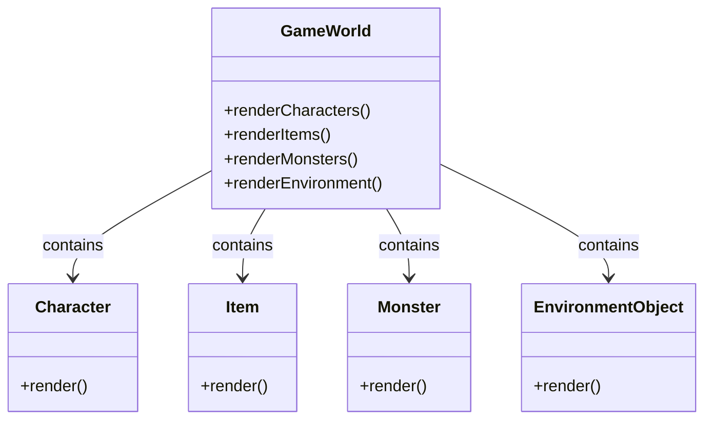
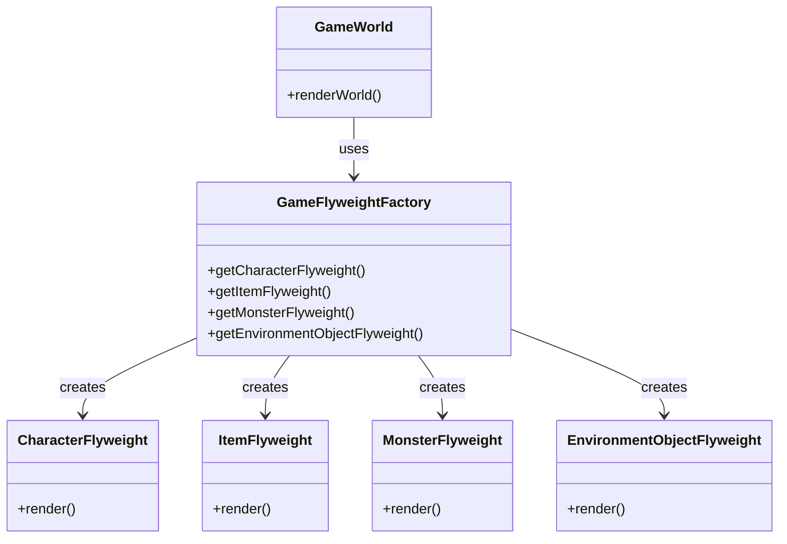
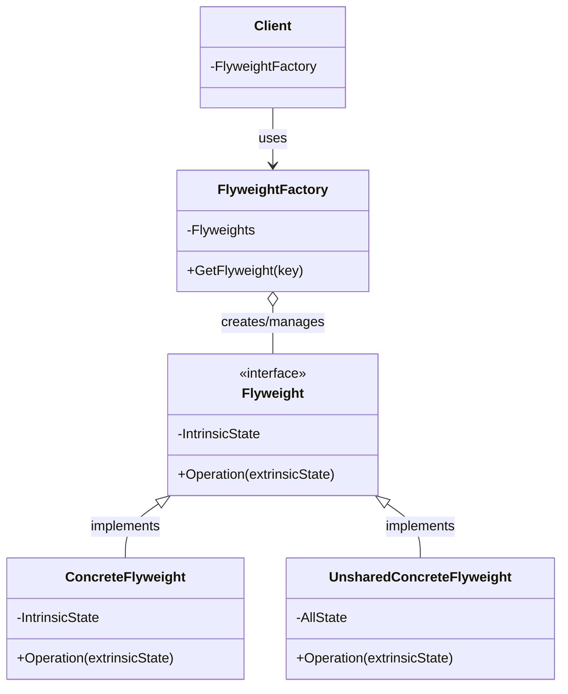
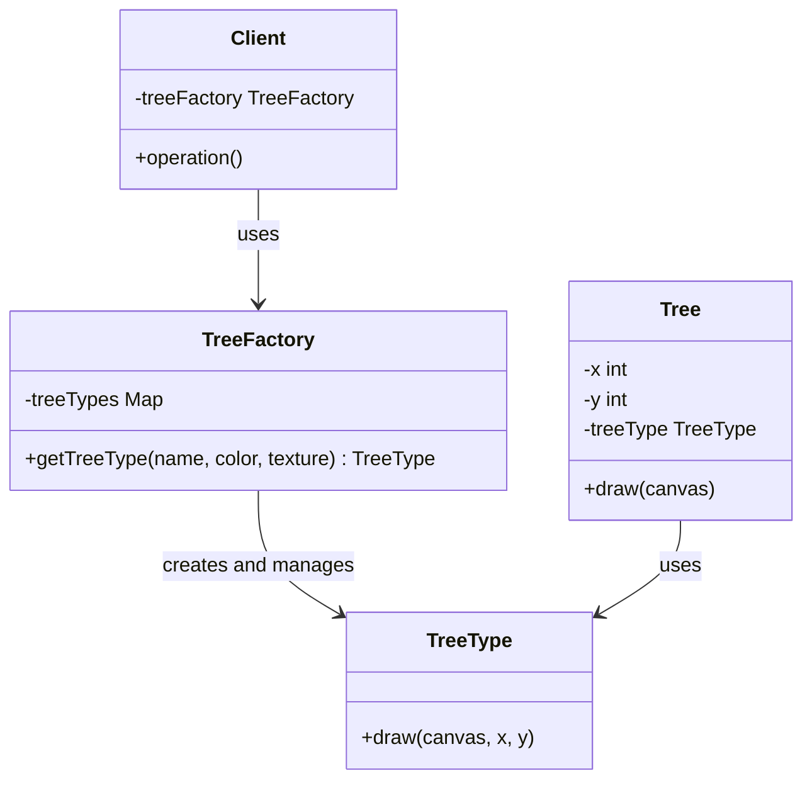

# Flyweight

## Khái Niệm

Khi làm việc với các hệ thống phần mềm lớn và phức tạp, việc quản lý hiệu quả bộ nhớ và tài nguyên là vô cùng quan trọng. Đây là nơi mà mẫu thiết kế Flyweight, một mẫu thiết kế cấu trúc, thể hiện vai trò của mình. Flyweight Pattern giúp giảm bớt lượng bộ nhớ cần thiết cho ứng dụng bằng cách chia sẻ những đối tượng tương tự nhau đến mức tối đa.

### Tổng quan

- **Định Nghĩa của Pattern:** Flyweight Pattern là một mẫu thiết kế sử dụng chia sẻ để hỗ trợ một lượng lớn đối tượng nhỏ mà không làm giảm hiệu suất. Mẫu này giúp giảm thiểu việc sử dụng bộ nhớ bằng cách chia sẻ càng nhiều trạng thái giữa các đối tượng càng tốt.

- **Mục Đích:** Mẫu thiết kế này hữu ích khi cần tạo ra một số lượng lớn đối tượng nhỏ trong một hệ thống, nơi mà việc sử dụng bộ nhớ và tài nguyên là một vấn đề cần được xem xét kỹ lưỡng.

- **Ý Tưởng Cốt Lõi:** Flyweight Pattern tập trung vào việc tạo ra các đối tượng "flyweight" mà chia sẻ trạng thái chung để giảm thiểu việc sử dụng bộ nhớ. Trong mô hình này, mỗi đối tượng flyweight đều có thể đại diện cho nhiều đối tượng khác, giúp tiết kiệm tài nguyên mà không ảnh hưởng đến tính toàn vẹn và hiệu suất của ứng dụng.

## Đặt vấn đề

Hãy tưởng tượng bạn đang phát triển một trò chơi trực tuyến đa người chơi (MMO) với một thế giới rộng lớn, nơi người chơi có thể tương tác với nhau và môi trường xung quanh. Trong trò chơi này, có hàng ngàn đối tượng khác nhau như nhân vật, vật phẩm, quái vật, và các yếu tố môi trường (cây, đá, nhà cửa).



Ban đầu, mỗi đối tượng trong trò chơi này được xử lý như một thực thể riêng biệt. Mỗi nhân vật, vật phẩm, quái vật, và yếu tố môi trường đều có bộ dữ liệu riêng, bao gồm hình ảnh, vị trí, và trạng thái. Điều này làm cho hệ thống yêu cầu một lượng lớn bộ nhớ và tài nguyên xử lý để duy trì trạng thái và hiển thị của hàng ngàn đối tượng cùng một lúc.

- Các nhân vật có thể chia sẻ nhiều thuộc tính chung như hình dáng cơ bản, bộ kỹ năng, và trang bị.
- Vật phẩm và quái vật cũng tương tự, với nhiều đặc điểm chung nhưng lại được biểu diễn như các đối tượng độc lập.
- Các yếu tố môi trường như cây cối, đá, và nhà cửa có thể xuất hiện nhiều lần trong trò chơi, nhưng mỗi lần lại được tải như một đối tượng riêng.

Vấn đề này gây ra sự chậm trễ trong quá trình tải trò chơi và cả trong lúc chơi, ảnh hưởng đến trải nghiệm người chơi. Đặc biệt trong môi trường MMO, nơi sự mượt mà và phản hồi nhanh là yếu tố quan trọng, việc tối ưu hóa hiệu suất và bộ nhớ trở thành một yêu cầu cấp thiết.

Đây chính là lúc Flyweight Pattern có thể được áp dụng. Mẫu thiết kế này giúp tối ưu hóa việc sử dụng bộ nhớ bằng cách chia sẻ các đối tượng có thuộc tính chung, giảm bớt số lượng đối tượng cần tải và quản lý. Điều này không chỉ giúp tăng cường hiệu suất mà còn cải thiện trải nghiệm người chơi, đặc biệt trong một môi trường trực tuyến đa người chơi.

## Giải pháp


Để giải quyết những thách thức trong quản lý trò chơi trực tuyến đa người chơi, việc sử dụng Flyweight Pattern là một lựa chọn hợp lý. Mô hình này tập trung vào việc tối ưu hóa bộ nhớ và hiệu suất bằng cách chia sẻ các đối tượng chung giữa nhiều thực thể. Cách thức áp dụng Flyweight Pattern như sau:

1. **Xác định Đối tượng Flyweight**: Phân tích và xác định những phần thông tin có thể được chia sẻ giữa các đối tượng. Trong trò chơi MMO, điều này có thể bao gồm dữ liệu về hình ảnh, animations, bản đồ, đặc điểm của nhân vật, vật phẩm, và yếu tố môi trường.

2. **Tạo Flyweight Factory**: Xây dựng một `GameFlyweightFactory` để quản lý việc tạo và tái sử dụng các đối tượng Flyweight. Factory này sẽ cung cấp một cách để lấy hoặc tạo đối tượng Flyweight dựa trên các thông tin cần thiết.

3. **Áp dụng Flyweight trong Game World**: Trong lớp `GameWorld`, thay vì tạo ra hàng ngàn thực thể riêng lẻ, sử dụng `GameFlyweightFactory` để tạo hoặc lấy các đối tượng Flyweight. Điều này giúp giảm lượng bộ nhớ cần thiết và tối ưu hóa hiệu suất khi hiển thị và quản lý các đối tượng trong trò chơi.



Sơ đồ trên minh họa cách `GameFlyweightFactory` được tích hợp vào `GameWorld`, giúp giảm bớt việc tạo và quản lý đối tượng riêng biệt cho mỗi thực thể trong trò chơi. Mô hình này không chỉ giúp giảm thiểu lượng bộ nhớ cần thiết mà còn tối ưu hóa quá trình xử lý, mang lại trải nghiệm mượt mà và hiệu quả hơn cho người chơi.

## Cấu trúc



**Sơ đồ**:
- **Flyweight**: Lớp này chứa trạng thái bên trong (intrinsic) không đổi.
- **ConcreteFlyweight**: Lớp con của Flyweight, cài đặt trạng thái bên trong.
- **UnsharedConcreteFlyweight**: Không phải lúc nào cũng cần thiết, dùng cho trạng thái bên ngoài (extrinsic) có thể thay đổi.
- **FlyweightFactory**: Tạo và quản lý các đối tượng Flyweight, đảm bảo rằng flyweights được chia sẻ một cách hiệu quả.
- **Client**: Sử dụng các đối tượng Flyweight thông qua FlyweightFactory.

**Tổ chức và Tương tác**:
- Trong Flyweight Pattern, các đối tượng Flyweight được tạo và quản lý bởi FlyweightFactory. Factory đảm bảo rằng các đối tượng được tái sử dụng thay vì tạo mới mỗi lần cần thiết, qua đó giảm bộ nhớ và chi phí tạo đối tượng.
- Client tương tác với Flyweight thông qua FlyweightFactory. Khi một Client yêu cầu một Flyweight, Factory kiểm tra xem đối tượng đó đã tồn tại hay chưa. Nếu có, nó sẽ trả về đối tượng hiện có; nếu không, nó sẽ tạo một đối tượng mới.
- Trong khi Flyweight chứa trạng thái bên trong không đổi, Client có thể truyền trạng thái bên ngoài vào Flyweight trong thời gian thực thi. Điều này cho phép cùng một đối tượng Flyweight được sử dụng trong các bối cảnh khác nhau với trạng thái bên ngoài khác nhau.

## Ví dụ áp dụng Flyweight Pattern

Flyweight Pattern giúp giảm bớt lượng bộ nhớ sử dụng bằng cách chia sẻ càng nhiều dữ liệu càng tốt giữa các đối tượng tương tự. Trong ví dụ về việc thiết kế một trò chơi với nhiều cây cối, thay vì tạo một đối tượng riêng biệt cho mỗi cây, chúng ta sẽ tạo ra một số lượng nhỏ các đối tượng Flyweight chứa trạng thái chung (như loại cây, kích thước, màu sắc) và sử dụng chúng để biểu diễn nhiều cây khác nhau trong trò chơi bằng cách thay đổi vị trí và một số thuộc tính riêng biệt không chia sẻ.



```java
import java.util.HashMap;
import java.util.Map;

// Flyweight Factory
class TreeFactory {
    private static Map<String, TreeType> treeTypes = new HashMap<>();

    public static TreeType getTreeType(String name, String color, String texture) {
        TreeType result = treeTypes.get(name);
        if (result == null) {
            result = new TreeType(name, color, texture);
            treeTypes.put(name, result);
        }
        return result;
    }
}

// Flyweight
class TreeType {
    private final String name;
    private final String color;
    private final String texture;

    public TreeType(String name, String color, String texture) {
        this.name = name;
        this.color = color;
        this.texture = texture;
    }

    public void draw(String canvas, int x, int y) {
        System.out.println("Drawing " + name + " tree at (" + x + ", " + y + ") on " + canvas);
    }
}

// Client code
class Tree {
    private final int x;
    private final int y;
    private final TreeType treeType;

    public Tree(int x, int y, TreeType treeType) {
        this.x = x;
        this.y = y;
        this.treeType = treeType;
    }

    public void draw(String canvas) {
        treeType.draw(canvas, x, y);
    }
}

public class Forest {
    public static void main(String[] args) {
        TreeType mapleTreeType = TreeFactory.getTreeType("Maple", "Green", "Smooth");

        Tree tree1 = new Tree(1, 2, mapleTreeType);
        Tree tree2 = new Tree(5, 3, mapleTreeType);
        // ... more trees

        tree1.draw("Canvas1");
        tree2.draw("Canvas2");
        // ... draw more trees
    }
}
```

Trong ví dụ này, TreeFactory tạo và quản lý các đối tượng TreeType (Flyweight). Các đối tượng Tree sẽ sử dụng các TreeType này để vẽ chúng lên "canvas", nhưng mỗi đối tượng Tree vẫn có thể có vị trí riêng (x, y).

## Khi nào áp dụng mẫu Flyweight

Mẫu Flyweight được sử dụng hiệu quả nhất trong các tình huống mà một ứng dụng cần tạo ra một lượng lớn đối tượng với các trạng thái tương tự nhau. Điều này thường xảy ra trong các ứng dụng có các đối tượng đồ họa hoặc môi trường mạng, nơi việc tái sử dụng đối tượng có thể giảm đáng kể chi phí về bộ nhớ và cải thiện hiệu suất.

1. **Tối ưu hóa Bộ nhớ**: Khi ứng dụng của bạn phải xử lý hàng ngàn hoặc hàng triệu đối tượng có trạng thái không thay đổi, dùng chung các thuộc tính có thể giúp tiết kiệm đáng kể bộ nhớ.

2. **Tái sử dụng Đối tượng**: Trong trường hợp có nhu cầu tái sử dụng đối tượng thay vì tạo mới, Flyweight là lựa chọn lý tưởng. Điều này đặc biệt có ích trong các ứng dụng đòi hỏi hiệu suất cao và thời gian phản hồi nhanh.

3. **Phân tách Trạng thái Nội tại và Ngoại tại**: Nếu bạn có thể phân biệt được trạng thái nội tại (không thay đổi) và trạng thái ngoại tại (thay đổi) của đối tượng, mẫu Flyweight cho phép bạn chia sẻ trạng thái nội tại giữa nhiều đối tượng, trong khi vẫn quản lý trạng thái ngoại tại một cách độc lập.

4. **Cải thiện Hiệu suất trong Môi trường Có Hạn chế về Tài nguyên**: Trong các môi trường có hạn chế về tài nguyên như thiết bị di động hoặc hệ thống nhúng, việc sử dụng mẫu Flyweight có thể cải thiện hiệu suất bằng cách giảm bớt gánh nặng cho bộ nhớ và CPU.

Flyweight ít phù hợp khi các đối tượng trong ứng dụng của bạn có trạng thái độc lập và khác biệt rõ ràng, hoặc khi việc tiết kiệm bộ nhớ không phải là mối quan tâm chính. Trong những tình huống như vậy, việc áp dụng Flyweight có thể không đem lại lợi ích đáng kể và thậm chí còn làm tăng độ phức tạp của mã nguồn.