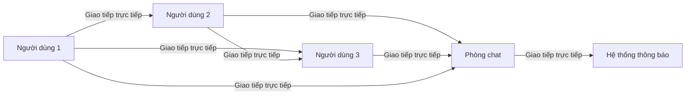
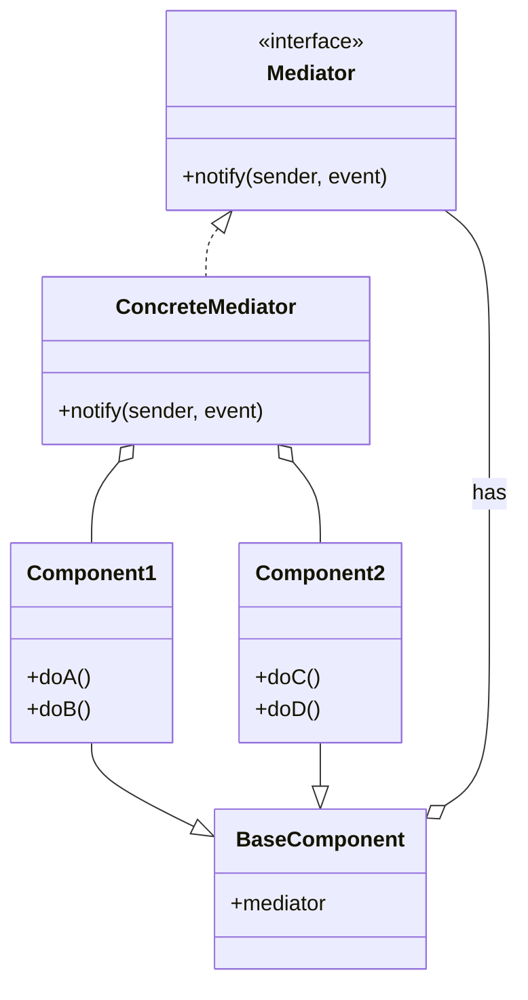
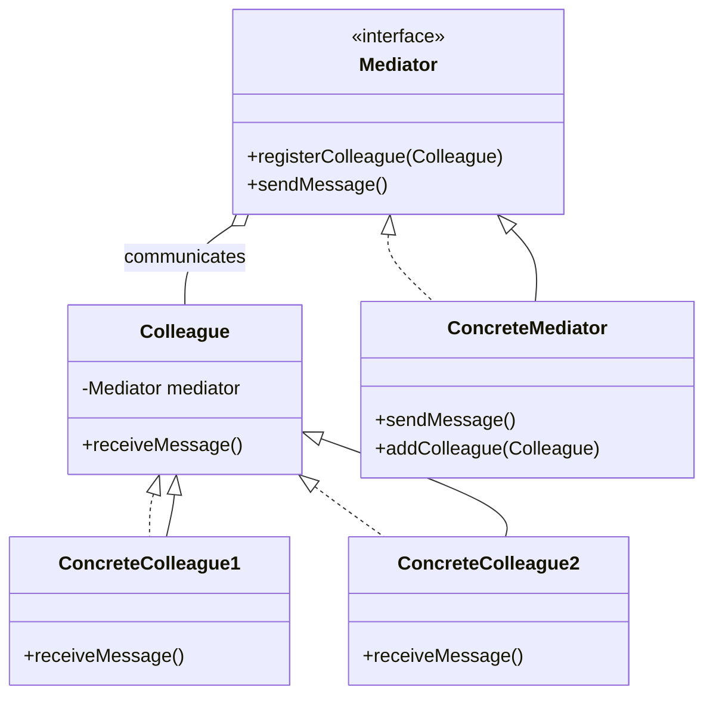

# Mediator

## Khái Niệm

**Mediator Pattern**, trong lĩnh vực phát triển phần mềm, là một mẫu thiết kế hành vi. Nó giúp giảm sự phức tạp trong giao tiếp giữa nhiều đối tượng hoặc lớp bằng cách cung cấp một đối tượng trung gian, gọi là 'mediator'. Điều này giúp các đối tượng không giao tiếp trực tiếp với nhau, mà thông qua mediator, từ đó giảm thiểu sự phụ thuộc lẫn nhau và làm cho mã nguồn dễ bảo trì hơn.

### Tổng quan

- **Định Nghĩa của Pattern:** Mediator Pattern giới thiệu một đối tượng trung gian, gọi là 'Mediator', có nhiệm vụ điều phối giao tiếp giữa các đối tượng khác trong hệ thống. Mục tiêu là giảm sự phụ thuộc trực tiếp giữa các đối tượng, giúp giảm sự phức tạp trong quá trình phát triển và bảo trì.

- **Mục Đích:** Mục đích chính của Mediator Pattern là tạo ra một kênh giao tiếp trung tâm để các đối tượng có thể giao tiếp mà không cần biết về sự tồn tại của nhau. Điều này tạo điều kiện cho việc mở rộng và bảo trì hệ thống trở nên dễ dàng hơn.

- **Ý Tưởng Cốt Lõi:** Trong Mediator Pattern, 'Mediator' đóng vai trò là trung tâm điều phối. Nó giúp các đối tượng tương tác với nhau một cách gián tiếp và giảm thiểu sự phụ thuộc chặt chẽ, từ đó làm cho cấu trúc hệ thống trở nên linh hoạt và dễ quản lý hơn.

### Đặt vấn đề

- **Bối cảnh**: Trong lập trình hướng đối tượng, một vấn đề phổ biến xảy ra khi nhiều lớp tương tác với nhau trực tiếp, tạo ra một mạng lưới phức tạp của các quan hệ. Điều này không chỉ làm cho hệ thống khó hiểu và khó bảo trì, mà còn gây ra sự phụ thuộc lẫn nhau giữa các lớp, làm giảm khả năng tái sử dụng của chúng. Ví dụ, trong một ứng dụng chat, các đối tượng như người dùng, phòng chat, và hệ thống thông báo cần giao tiếp liên tục. Nếu mỗi đối tượng trực tiếp gọi các phương thức của đối tượng khác, mã sẽ nhanh chóng trở nên rối rắm và khó quản lý.

### Giải pháp

- **Cách tiếp cận**: Mediator Pattern giải quyết vấn đề này bằng cách giới thiệu một đối tượng trung gian, gọi là 'Mediator', để quản lý cách các đối tượng tương tác với nhau. Thay vì giao tiếp trực tiếp, các lớp sẽ gửi và nhận yêu cầu thông qua Mediator. Trong ví dụ ứng dụng chat, Mediator có thể là một đối tượng quản lý các phòng chat, xử lý việc gửi thông điệp giữa người dùng và thông báo tới hệ thống thông báo.

- **Lợi ích**: Lợi ích lớn nhất của Mediator Pattern là giảm sự phụ thuộc lẫn nhau giữa các lớp, làm cho mã nguồn dễ đọc và bảo trì hơn. Nó cũng giúp tăng cường khả năng tái sử dụng của các lớp bằng cách giảm sự cố định của chúng vào các lớp khác. Điều này tạo điều kiện cho việc mở rộng và bảo trì hệ thống trở nên dễ dàng hơn.
- **Sự đánh đổi**: Mặt trái của Mediator Pattern là có thể làm tăng độ phức tạp của hệ thống do thêm một lớp trung gian. Nếu mediator trở nên quá phức tạp, nó có thể trở thành điểm nghẽn trong hệ thống. Do đó, cần cân nhắc kỹ lưỡng khi áp dụng pattern này, đặc biệt trong các hệ thống lớn và phức tạp.

## Cấu trúc

- Mediator: định nghĩa interface để giao tiếp với các Colleague.

- Colleague: giao tiếp với mediator thay vì giao tiếp trực tiếp với các Colleague khác.

- ConcreteMediator: triển khaiMediator để điều phối các Colleague.

- ConcreteColleague: các lớp cụ thể tương tác với mediator.

## Cách triển khai

Để triển khai Mediator Pattern trong Java, chúng ta có thể:

- Định nghĩa interface Mediator với các phương thức trung gian.

- Các lớp Colleague sẽ giữ một tham chiếu tới Mediator và gọi các phương thức đó thay vì giao tiếp trực tiếp.

- Lớp ConcreteMediator sẽ triển khai và điều phối các interation giữa các Colleague.

## Ví dụ

// Ví dụ triển khai Mediator Pattern với các lớp ChatRoom, User

## So sánh

So với Observer, Mediator tập trung vào việc điều phối giao tiếp giữa các đối tượng, còn Observer tập trung vào mối quan hệ một-nhiều giữa các đối tượng.

## Kết luận

Mediator Pattern hữu ích để giảm sự phụ thuộc trực tiếp giữa các lớp, dễ dàng mở rộng và thay đổi chương trình. Tuy nhiên cũng cần tránh lạm dụng mediator dẫn tới phức tạp hóa code.