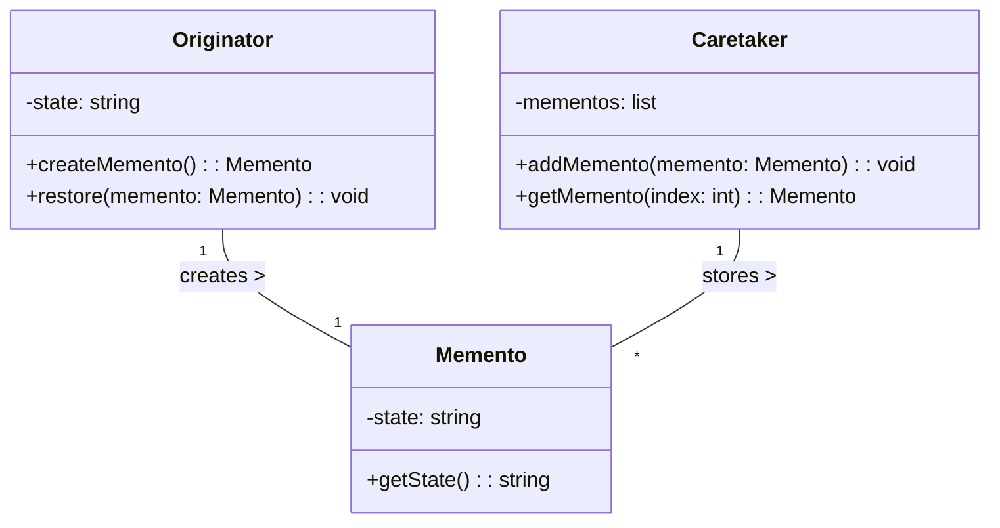
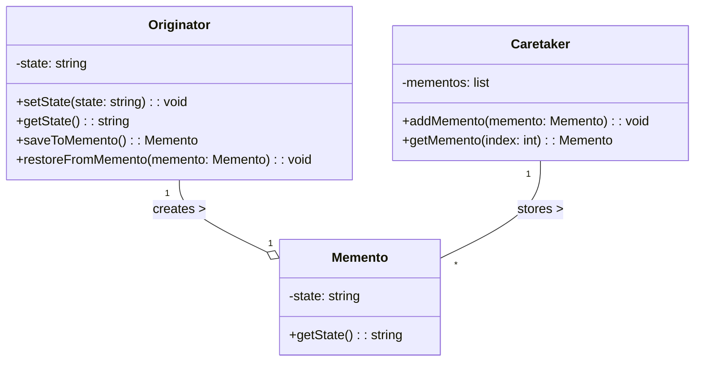

# Memento

## Khái Niệm

**Memento Pattern**, trong lĩnh vực phát triển phần mềm, là một mẫu thiết kế hành vi. Nó được sử dụng để lưu trữ trạng thái của một đối tượng (được gọi là 'memento') mà không vi phạm tính đóng gói, cho phép đối tượng quay lại trạng thái trước đó mà không cần phụ thuộc vào các lớp khác. Memento Pattern cung cấp khả năng 'undo' hoặc 'rollback' trong các ứng dụng, mà không làm lộ chi tiết triển khai nội bộ của đối tượng.

### Tổng quan

- **Định Nghĩa của Pattern:** Memento Pattern bao gồm việc lưu trữ bản sao của trạng thái nội bộ của một đối tượng vào một đối tượng khác mà không làm lộ thông tin nội bộ. Điều này cho phép khôi phục trạng thái trước đó của đối tượng mà không vi phạm nguyên tắc đóng gói.

- **Mục Đích:** Mục đích chính của Memento Pattern là cho phép đối tượng quay lại trạng thái trước đó mà không cần phải lưu trữ thông tin nội bộ của đối tượng ra bên ngoài. Điều này giúp tăng tính bảo mật và độc lập của đối tượng, đồng thời cung cấp chức năng 'undo' mà không làm ảnh hưởng tới kiến trúc tổng thể của hệ thống.

- **Ý Tưởng Cốt Lõi:** Trong Memento Pattern, có ba thành phần chính: 'Originator' (tạo ra trạng thái để lưu), 'Memento' (lưu trữ trạng thái của 'Originator'), và 'Caretaker' (quản lý 'Memento' mà không cần biết chi tiết bên trong). 'Caretaker' yêu cầu lưu trạng thái từ 'Originator' và có thể yêu cầu 'Originator' quay lại trạng thái đã lưu trước đó, nhờ vào 'Memento'.

### Đặt vấn đề

#### Bối cảnh
Trong phát triển phần mềm, một vấn đề phổ biến đối với các ứng dụng cần quản lý trạng thái của đối tượng là việc lưu giữ và khôi phục các trạng thái trước đó. Xét tình huống của một trình soạn thảo văn bản: người dùng muốn có khả năng quay lại các phiên bản trước đó của tài liệu sau khi thực hiện một loạt thay đổi. Một cách tiếp cận đơn giản là lưu trữ mỗi trạng thái của tài liệu trong một cấu trúc dữ liệu riêng biệt. Tuy nhiên, cách tiếp cận này không hiệu quả về mặt bộ nhớ và có thể dẫn đến vi phạm nguyên tắc đóng gói, vì nó yêu cầu tiết lộ chi tiết nội bộ của tài liệu.

### Giải quyết

Memento Pattern đưa ra một giải pháp hiệu quả cho vấn đề này. Pattern cho phép lưu giữ trạng thái của một đối tượng (còn gọi là "Originator") mà không vi phạm nguyên tắc đóng gói của nó. Điều này được thực hiện thông qua việc tạo ra một đối tượng "Memento", chứa trạng thái lưu trữ của "Originator". "Caretaker", một đối tượng khác, quản lý và lưu trữ các "Memento" mà không cần biết đến chi tiết bên trong của chúng. Khi cần khôi phục trạng thái cũ, "Originator" sẽ sử dụng đối tượng "Memento" tương ứng.

Sử dụng Memento Pattern mang lại nhiều lợi ích. Nó giúp duy trì nguyên tắc đóng gói, vì trạng thái nội bộ của đối tượng được lưu trữ mà không cần tiết lộ thông qua giao diện công khai. Điều này cũng giúp tăng cường tính modular của ứng dụng, vì "Caretaker" có thể lưu trữ và quản lý nhiều "Memento" mà không cần biết đến logic nội bộ của "Originator". Hơn nữa, pattern này cung cấp một cách linh hoạt để lưu trữ lịch sử trạng thái của đối tượng mà không cần sao chép toàn bộ trạng thái mỗi lần.

Tuy nhiên, việc sử dụng Memento Pattern không phải không có nhược điểm. Việc lưu trữ nhiều bản sao của trạng thái đối tượng có thể chiếm dụng một lượng lớn bộ nhớ, đặc biệt là đối với các ứng dụng với trạng thái đối tượng phức tạp và lớn. Ngoài ra, việc quản lý các "Memento" có thể trở nên phức tạp, đặc biệt nếu cần hỗ trợ các hoạt động như undo/redo với nhiều cấp độ.

## Cấu trúc

Các thành phần trong Memento Pattern:

- Originator: đối tượng cần lưu trữ trạng thái.

- Memento: đối tượng lưu trữ trạng thái của Originator.

- Caretaker: quản lý các đối tượng Memento.

## Cách triển khai

Để triển khai Memento Pattern trong Java, chúng ta có thể:

- Tạo lớp Memento với các trường dữ liệu cần lưu trữ.

- Lớp Originator sẽ tạo ra đối tượng Memento và lưu/khôi phục trạng thái từ nó.

- Caretaker sẽ quản lý các Memento.

## Ví dụ

// Ví dụ triển khai Memento Pattern để lưu trạng thái đối tượng Player trong game.

## So sánh với các Pattern khác

So với Iterator, Memento tập trung vào việc lưu trữ trạng thái nội bộ của một đối tượng, còn Iterator tập trung vào việc truy cập tuần tự các phần tử trong bộ sưu tập.

## Kết luận

Memento Pattern rất hữu ích khi muốn lưu lại và khôi phục trạng thái của đối tượng mà không vi phạm encapsulation. Tuy nhiên cũng cần xem xét chi phí về bộ nhớ khi lưu trữ nhiều snapshot.