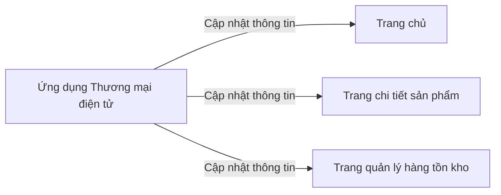

# Observer

## Khái Niệm

**Observer Pattern**, trong lĩnh vực phát triển phần mềm, là một mẫu thiết kế hành vi. Nó được sử dụng để tạo một cơ chế quản lý mối quan hệ một-đến-nhiều giữa các đối tượng, sao cho khi trạng thái của một đối tượng thay đổi, tất cả đối tượng phụ thuộc (observers) sẽ được thông báo và cập nhật tự động. Observer Pattern thường được sử dụng để triển khai các hệ thống phản hồi sự kiện, trong đó đối tượng có thể gửi thông báo tới các đối tượng khác mà không cần biết rõ về những đối tượng đang lắng nghe.

### Tổng quan

- **Định Nghĩa của Pattern:** Observer Pattern bao gồm hai loại đối tượng chính: 'Subject' (đối tượng quan sát) và 'Observer' (đối tượng được thông báo). 'Subject' duy trì một danh sách các 'Observer' quan tâm tới trạng thái của nó và thông báo cho tất cả 'Observers' khi có bất kỳ thay đổi nào về trạng thái.

- **Mục Đích:** Mục đích của Observer Pattern là tạo điều kiện cho việc tạo ra các ứng dụng có cấu trúc linh hoạt, mở rộng được và dễ bảo trì bằng cách giảm thiểu sự phụ thuộc lẫn nhau giữa các đối tượng. Khi một 'Subject' thay đổi trạng thái, 'Observers' của nó sẽ tự động được thông báo và cập nhật mà không cần sự can thiệp trực tiếp.

- **Ý Tưởng Cốt Lõi:** Trong Observer Pattern, 'Subject' đóng vai trò là nhà xuất bản (publisher), trong khi 'Observers' đóng vai trò như các người đăng ký (subscribers). Mỗi khi 'Subject' có một thay đổi trạng thái, nó sẽ thông báo cho tất cả 'Observers' của mình. Điều này cho phép tách biệt giữa 'Subject' và 'Observers', tăng cường tính mô-đun và dễ dàng mở rộng hệ thống. 'Observers' có thể đăng ký hoặc hủy đăng ký với 'Subject' một cách linh hoạt mà không ảnh hưởng tới 'Subject' hoặc các 'Observers' khác.


### Đặt vấn đề

Trong một hệ thống phần mềm, việc theo dõi và phản ứng với các thay đổi trạng thái là một thách thức phổ biến. Xét tình huống của một ứng dụng thương mại điện tử, nơi thông tin sản phẩm cần được cập nhật thường xuyên trên nhiều giao diện như trang chủ, trang chi tiết sản phẩm, và trang quản lý hàng tồn kho. Khi không sử dụng một pattern như Observer Pattern, việc cập nhật trạng thái này trở nên phức tạp và không hiệu quả. Mỗi lần thông tin sản phẩm thay đổi, phải thực hiện nhiều lần gọi và cập nhật trên các giao diện khác nhau, dễ dẫn đến lỗi và khó khăn trong việc bảo trì mã nguồn.



### Giải pháp

Observer Pattern giải quyết vấn đề trên bằng cách tạo ra một cơ chế "đăng ký - thông báo". Trong hệ thống, các thành phần có thể "đăng ký" để theo dõi trạng thái của một đối tượng. Khi có thay đổi trạng thái, đối tượng này sẽ tự động "thông báo" cho tất cả các thành phần đã đăng ký. Trở lại ví dụ về ứng dụng thương mại điện tử, thông tin sản phẩm sẽ là đối tượng "quan sát", và các giao diện như trang chủ, trang chi tiết sản phẩm sẽ là các "quản sát viên". Khi thông tin sản phẩm thay đổi, chỉ cần cập nhật một lần tại nguồn, và tất cả các giao diện liên quan sẽ được tự động cập nhật.

Việc sử dụng Observer Pattern mang lại nhiều lợi ích: giảm sự phụ thuộc lẫn nhau giữa các thành phần của hệ thống, tăng khả năng tái sử dụng và bảo trì mã nguồn. Hơn nữa, pattern này cũng cải thiện hiệu suất bằng cách giảm bớt số lượng cập nhật không cần thiết và chỉ tập trung vào những thay đổi có ý nghĩa.

Tuy nhiên, việc sử dụng Observer Pattern cũng đòi hỏi sự cân nhắc. Khi số lượng quan sát viên tăng lên, việc quản lý và debug có thể trở nên phức tạp. Ngoài ra, nếu không được thiết kế cẩn thận, pattern này có thể dẫn đến các vấn đề về hiệu suất do việc thông báo quá nhiều lần.

#### Sơ đồ minh họa
```mermaid
graph LR
    A[Thông tin sản phẩm] -->|Thông báo thay đổi| B[Trang chủ]
    A -->|Thông báo thay đổi| C[Trang chi tiết sản phẩm]
    A -->|Thông báo thay đổi| D[Trang quản lý hàng tồn]

 kho]
    B -->|Đăng ký quan sát| A
    C -->|Đăng ký quan sát| A
    D -->|Đăng ký quan sát| A
```

## Cấu trúc

Các thành phần trong Observer Pattern:

- Subject: đối tượng chủ thể cần theo dõi. Nó duy trì danh sách các Observer và thông báo cho chúng khi trạng thái thay đổi.

- Observer: đối tượng quan sát Subject. Nó đăng ký theo dõi Subject và cập nhật khi nhận được thông báo từ Subject.

- ConcreteSubject và ConcreteObserver: các cài đặt cụ thể.

## Cách triển khai

Để triển khai Observer Pattern trong Java, có thể:

- Sử dụng interface java.util.Observable và java.util.Observer.
- Tự định nghĩa Subject, Observer interface và các cài đặt tương ứng.

## Ví dụ

// Ví dụ đăng ký nhận thông báo khi giá sản phẩm thay đổi

## So sánh

So với PubSub, Observer tập trung vào mối quan hệ giữa các object, còn PubSub tập trung vào việc truyền thông điệp.

## Kết luận

Observer Pattern thích hợp để xây dựng các chức năng thông báo sự kiện trong hệ thống. Tuy nhiên cũng cần tránh lạm dụng và làm phức tạp hóa code.