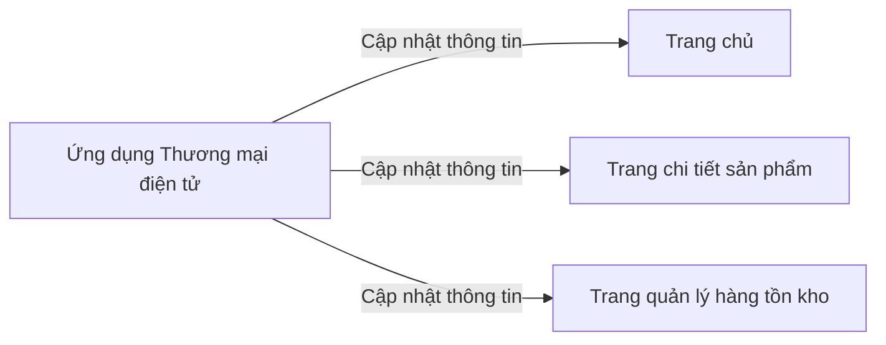
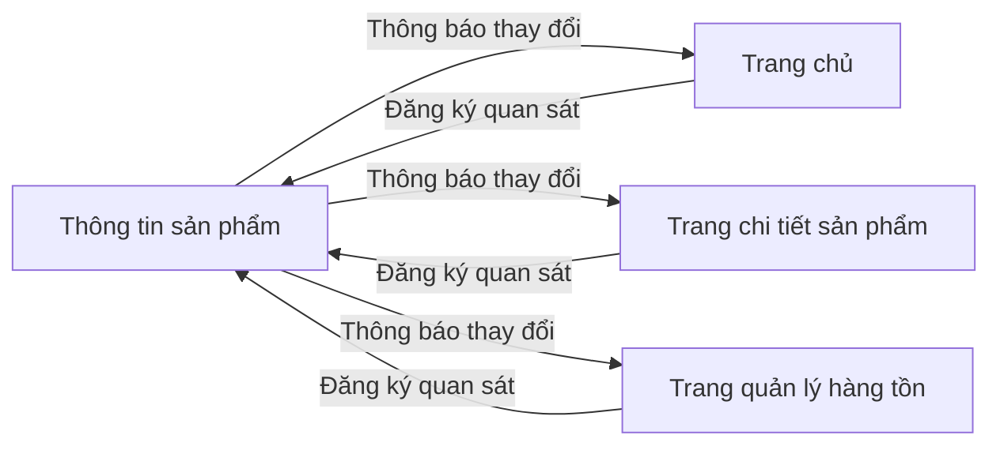
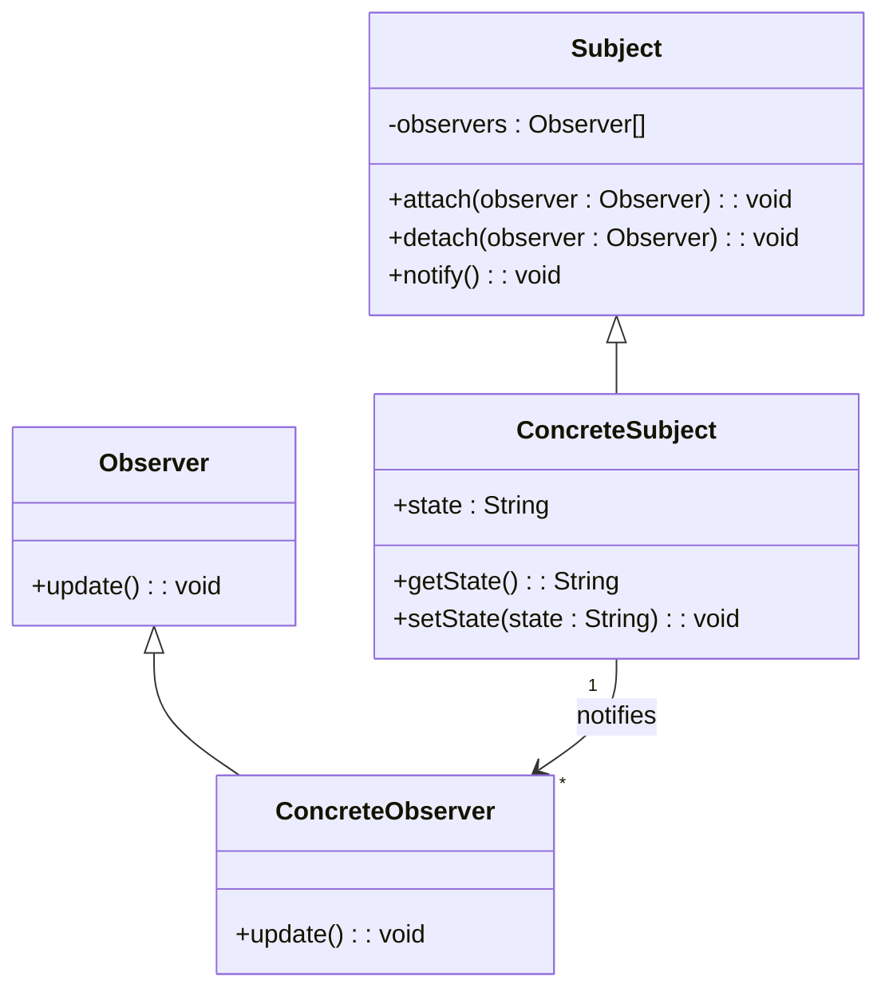
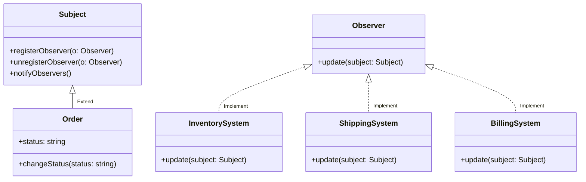

# Observer

## Khái Niệm

**Observer Pattern**, trong lĩnh vực phát triển phần mềm, là một mẫu thiết kế hành vi. Nó được sử dụng để tạo một cơ chế quản lý mối quan hệ một-đến-nhiều giữa các đối tượng, sao cho khi trạng thái của một đối tượng thay đổi, tất cả đối tượng phụ thuộc (observers) sẽ được thông báo và cập nhật tự động. Observer Pattern thường được sử dụng để triển khai các hệ thống phản hồi sự kiện, trong đó đối tượng có thể gửi thông báo tới các đối tượng khác mà không cần biết rõ về những đối tượng đang lắng nghe.

### Tổng quan

- **Định Nghĩa của Pattern:** Observer Pattern bao gồm hai loại đối tượng chính: 'Subject' (đối tượng quan sát) và 'Observer' (đối tượng được thông báo). 'Subject' duy trì một danh sách các 'Observer' quan tâm tới trạng thái của nó và thông báo cho tất cả 'Observers' khi có bất kỳ thay đổi nào về trạng thái.

- **Mục Đích:** Mục đích của Observer Pattern là tạo điều kiện cho việc tạo ra các ứng dụng có cấu trúc linh hoạt, mở rộng được và dễ bảo trì bằng cách giảm thiểu sự phụ thuộc lẫn nhau giữa các đối tượng. Khi một 'Subject' thay đổi trạng thái, 'Observers' của nó sẽ tự động được thông báo và cập nhật mà không cần sự can thiệp trực tiếp.

- **Ý Tưởng Cốt Lõi:** Trong Observer Pattern, 'Subject' đóng vai trò là nhà xuất bản (publisher), trong khi 'Observers' đóng vai trò như các người đăng ký (subscribers). Mỗi khi 'Subject' có một thay đổi trạng thái, nó sẽ thông báo cho tất cả 'Observers' của mình. Điều này cho phép tách biệt giữa 'Subject' và 'Observers', tăng cường tính mô-đun và dễ dàng mở rộng hệ thống. 'Observers' có thể đăng ký hoặc hủy đăng ký với 'Subject' một cách linh hoạt mà không ảnh hưởng tới 'Subject' hoặc các 'Observers' khác.


### Đặt vấn đề

Trong một hệ thống phần mềm, việc theo dõi và phản ứng với các thay đổi trạng thái là một thách thức phổ biến. Xét tình huống của một ứng dụng thương mại điện tử, nơi thông tin sản phẩm cần được cập nhật thường xuyên trên nhiều giao diện như trang chủ, trang chi tiết sản phẩm, và trang quản lý hàng tồn kho. Khi không sử dụng một pattern như Observer Pattern, việc cập nhật trạng thái này trở nên phức tạp và không hiệu quả. Mỗi lần thông tin sản phẩm thay đổi, phải thực hiện nhiều lần gọi và cập nhật trên các giao diện khác nhau, dễ dẫn đến lỗi và khó khăn trong việc bảo trì mã nguồn.



### Giải pháp

Observer Pattern giải quyết vấn đề trên bằng cách tạo ra một cơ chế "đăng ký - thông báo". Trong hệ thống, các thành phần có thể "đăng ký" để theo dõi trạng thái của một đối tượng. Khi có thay đổi trạng thái, đối tượng này sẽ tự động "thông báo" cho tất cả các thành phần đã đăng ký. Trở lại ví dụ về ứng dụng thương mại điện tử, thông tin sản phẩm sẽ là đối tượng "quan sát", và các giao diện như trang chủ, trang chi tiết sản phẩm sẽ là các "quản sát viên". Khi thông tin sản phẩm thay đổi, chỉ cần cập nhật một lần tại nguồn, và tất cả các giao diện liên quan sẽ được tự động cập nhật.

Việc sử dụng Observer Pattern mang lại nhiều lợi ích: giảm sự phụ thuộc lẫn nhau giữa các thành phần của hệ thống, tăng khả năng tái sử dụng và bảo trì mã nguồn. Hơn nữa, pattern này cũng cải thiện hiệu suất bằng cách giảm bớt số lượng cập nhật không cần thiết và chỉ tập trung vào những thay đổi có ý nghĩa.

Tuy nhiên, việc sử dụng Observer Pattern cũng đòi hỏi sự cân nhắc. Khi số lượng quan sát viên tăng lên, việc quản lý và debug có thể trở nên phức tạp. Ngoài ra, nếu không được thiết kế cẩn thận, pattern này có thể dẫn đến các vấn đề về hiệu suất do việc thông báo quá nhiều lần.



## Cấu trúc



Các thành phần trong Observer Pattern:

- Subject: đối tượng chủ thể cần theo dõi. Nó duy trì danh sách các Observer và thông báo cho chúng khi trạng thái thay đổi.

- Observer: đối tượng quan sát Subject. Nó đăng ký theo dõi Subject và cập nhật khi nhận được thông báo từ Subject.

- ConcreteSubject và ConcreteObserver: các cài đặt cụ thể.

## Cách triển khai

Để triển khai Observer Pattern, chúng ta sẽ cần các thành phần sau:

### 1. Subject Interface

```java
public interface Subject {
    void attach(Observer o);
    void detach(Observer o);
    void notifyUpdate(Message m);
}
```

### 2. Observer Interface

```java
public interface Observer {
    void update(Message m);
}
```

### 3. Concrete Subject

```java
import java.util.ArrayList;
import java.util.List;

public class ConcreteSubject implements Subject {
    private List<Observer> observers = new ArrayList<>();

    @Override
    public void attach(Observer o) {
        observers.add(o);
    }

    @Override
    public void detach(Observer o) {
        observers.remove(o);
    }

    @Override
    public void notifyUpdate(Message m) {
        for(Observer o: observers) {
            o.update(m);
        }
    }
}
```

### 4. Concrete Observer

```java
public class ConcreteObserver implements Observer {
    private String name;

    public ConcreteObserver(String name) {
        this.name = name;
    }

    @Override
    public void update(Message m) {
        System.out.println(name + " received message: " + m.getMessageContent());
    }
}
```

### 5. Message Class

```java
public class Message {
    private String messageContent;

    public Message(String m) {
        this.messageContent = m;
    }

    public String getMessageContent() {
        return messageContent;
    }
}
```

### 6. Sử dụng Pattern

```java
public class ObserverPatternDemo {
    public static void main(String[] args) {
        ConcreteSubject subject = new ConcreteSubject();

        Observer observer1 = new ConcreteObserver("Observer 1");
        Observer observer2 = new ConcreteObserver("Observer 2");

        subject.attach(observer1);
        subject.attach(observer2);

        subject.notifyUpdate(new Message("First Message")); // Cả hai observer sẽ nhận được thông báo
    }
}
```

## Ví dụ

Observer pattern là một mẫu thiết kế hành vi (behavioral design pattern) cho phép bạn định nghĩa một cơ chế đăng ký để nhiều đối tượng có thể lắng nghe và phản ứng với các sự kiện xảy ra trong một đối tượng khác. Mẫu thiết kế này thường được sử dụng để tạo ra các ứng dụng dễ mở rộng và linh hoạt, giảm sự phụ thuộc giữa các lớp.

Ví dụ, xem xét một hệ thống quản lý đơn hàng trong đó `Order` là một đối tượng quan trọng. Khi trạng thái của một `Order` thay đổi (ví dụ: từ "mới" sang "đã giao"), nó cần thông báo cho các hệ thống khác như quản lý kho, hệ thống giao hàng và hệ thống hóa đơn để họ có thể thực hiện các hành động phù hợp.

Dưới đây là sơ đồ mermaid minh họa cho ví dụ trên:



### Ví dụ Code

```java
import java.util.ArrayList;
import java.util.List;

// Subject interface
interface Subject {
    void registerObserver(Observer observer);
    void unregisterObserver(Observer observer);
    void notifyObservers();
}

// Observer interface
interface Observer {
    void update(Subject subject);
}

class Order implements Subject {
    private List<Observer> observers = new ArrayList<>();
    private String status;

    public Order(String status) {
        this.status = status;
    }

    @Override
    public void registerObserver(Observer observer) {
        observers.add(observer);
    }

    @Override
    public void unregisterObserver(Observer observer) {
        observers.remove(observer);
    }

    @Override
    public void notifyObservers() {
        for (Observer observer : observers) {
            observer.update(this);
        }
    }

    public String getStatus() {
        return status;
    }

    public void setStatus(String status) {
        this.status = status;
        notifyObservers();
    }
}

// Inventory System
class InventorySystem implements Observer {
    @Override
    public void update(Subject subject) {
        if (subject instanceof Order && ((Order) subject).getStatus().equals("shipped")) {
            System.out.println("Inventory System: Order shipped, updating inventory.");
        }
    }
}

// Shipping System
class ShippingSystem implements Observer {
    @Override
    public void update(Subject subject) {
        if (subject instanceof Order && ((Order) subject).getStatus().equals("new")) {
            System.out.println("Shipping System: New order received, preparing for shipment.");
        }
    }
}

// Billing System
class BillingSystem implements Observer {
    @Override
    public void update(Subject subject) {
        if (subject instanceof Order && ((Order) subject).getStatus().equals("completed")) {
            System.out.println("Billing System: Order completed, generating invoice.");
        }
    }
}


public class ObserverPatternDemo {
    public static void main(String[] args) {
        Order order = new Order("new");

        InventorySystem inventorySystem = new InventorySystem();
        ShippingSystem shippingSystem = new ShippingSystem();
        BillingSystem billingSystem = new BillingSystem();

        order.registerObserver(inventorySystem);
        order.registerObserver(shippingSystem);
        order.registerObserver(billingSystem);

        // Simulate order updates
        order.setStatus("new");
        order.setStatus("shipped");
        order.setStatus("completed");
    }
}
```

Trong ví dụ này, `Order` là lớp `Subject` cụ thể, cho phép đăng ký, hủy đăng ký và thông báo cho các `Observer` về thay đổi trạng thái. `InventorySystem`, `ShippingSystem`, và `BillingSystem` là các lớp `Observer` cụ thể, mỗi lớp cập nhật theo phản ứng với thông báo từ Order. Khi trạng thái của Order thay đổi, nó sẽ tự động thông báo cho tất cả các `Observer` đã đăng ký.

## Khi nào nên sử dụng Observer Pattern

- **Khi bạn muốn một cơ chế thông báo tự động giữa các đối tượng**: Observer Pattern rất hữu ích khi bạn cần một hoặc nhiều đối tượng nhận thông báo tự động khi trạng thái của một đối tượng khác thay đổi. Điều này giúp đảm bảo tính nhất quán giữa các đối tượng liên quan mà không cần chúng trực tiếp gọi lẫn nhau.

- **Khi bạn muốn tạo ra các hệ thống linh hoạt có khả năng mở rộng cao**: Với Observer Pattern, bạn có thể dễ dàng thêm hoặc loại bỏ các observer mà không cần sửa đổi đối tượng chủ đề (subject) - đối tượng mà observer đăng ký theo dõi. Điều này giúp hệ thống của bạn dễ dàng mở rộng và thích ứng với nhu cầu thay đổi.

- **Trong các ứng dụng cần theo dõi và phản ứng với các sự kiện**: Observer Pattern là lựa chọn tối ưu cho các ứng dụng cần phản ứng nhanh chóng với các thay đổi, ví dụ như các hệ thống giám sát, ứng dụng thời tiết, hoặc bất kỳ ứng dụng nào mà dữ liệu cần được cập nhật theo thời gian thực.

- **Khi cần giảm sự phụ thuộc lẫn nhau giữa các thành phần**: Observer Pattern cho phép các thành phần hoạt động một cách độc lập, giảm bớt sự phụ thuộc trực tiếp. Các đối tượng observer không cần biết về sự tồn tại của các đối tượng khác, chỉ cần biết về đối tượng chủ đề mà chúng quan sát.

- **Trong việc xây dựng các ứng dụng phản ứng với sự kiện**: Các ứng dụng như bảng điều khiển quản lý, hệ thống cảnh báo, hoặc ứng dụng tài chính cần cập nhật giao diện người dùng dựa trên sự thay đổi của dữ liệu nền tảng. Observer Pattern giúp việc này trở nên mượt mà và hiệu quả, bằng cách thông báo cho giao diện người dùng (hoặc bất kỳ hệ thống phụ thuộc nào khác) mỗi khi có sự thay đổi dữ liệu.
