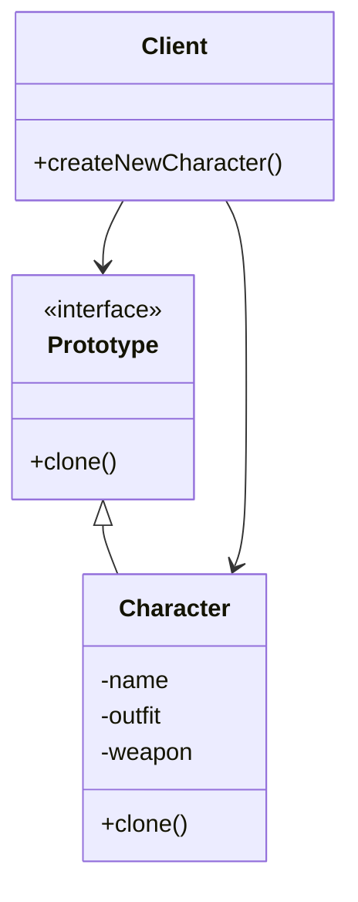
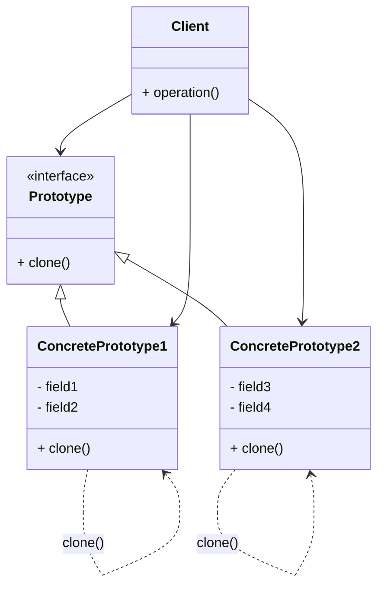

# Prototype

## Giới thiệu

Trong chương trước, chúng ta đã tìm hiểu về các Creational Design Pattern, bao gồm Abstract Factory, Builder, Factory Method giúp khởi tạo đối tượng một cách linh hoạt. Tiếp theo, chúng ta sẽ đi tìm hiểu Prototype - một Pattern thuộc nhóm này với mục đích tạo ra bản sao của các đối tượng đã tồn tại.

Prototype là một Creational Design Pattern cho phép sao chép các đối tượng hiện có thay vì khởi tạo chúng từ đầu.

Cụ thể, Prototype Pattern định nghĩa một kiểu đối tượng (Prototype) có khả năng tự nhân bản bằng cách clone chính bản thân nó, tạo ra một bản sao độc lập với đối tượng gốc.

Mục đích của Pattern này là tạo ra các đối tượng mới bằng cách clone từ đối tượng hiện có thay vì khởi tạo, tiết kiệm chi phí tạo mới đối tượng, đặc biệt là các đối tượng phức tạp. Ngoài ra, nó che giấu logic khởi tạo và cung cấp khả năng tạo các đối tượng tương tự một cách hiệu quả.

Bằng cách sử dụng Prototype Pattern, chúng ta có thể tạo ra các đối tượng mới một cách nhanh chóng và hiệu quả hơn. Chúng ta sẽ cùng tìm hiểu kỹ hơn về Pattern này trong các phần sau.

## Đặt vấn đề

Trong nhiều ứng dụng, việc khởi tạo các đối tượng là một quá trình tốn kém, phức tạp. Chẳng hạn trong một game, việc tạo mới đối tượng Nhân Vật cần phải load dữ liệu, giải mã, khởi tạo trang phục và vũ khí...

Tuy nhiên, thường có nhiều nhân vật chỉ khác biệt ở một vài thuộc tính nhỏ. Ví dụ Mario và Luigi có ngoại hình và kỹ năng gần giống nhau, chỉ khác tên và màu áo.

Nếu phải khởi tạo hoàn toàn từ đầu các nhân vật này thì rất tốn kém và lãng phí tài nguyên.

Chúng ta cần một cách để tạo ra các đối tượng tương tự một cách hiệu quả hơn, bằng cách tận dụng lại những đối tượng đã khởi tạo từ trước. Prototype Pattern ra đời nhằm giải quyết bài toán này.

## Giải quyết

Prototype Pattern giải quyết bài toán bằng cách:



- Định nghĩa một interface Prototype chung cho các đối tượng nhân vật có thể clone.

- Các lớp nhân vật cụ thể (Concrete Prototype) sẽ triển khai interface này và cung cấp hiện thực cho phương thức clone(). Phương thức clone() sẽ sao chép giá trị các trường dữ liệu của đối tượng sang một đối tượng mới.

- Tạo một đối tượng nhân vật ban đầu với quá trình khởi tạo đầy đủ.

- Khi cần tạo nhân vật mới tương tự, client sẽ gọi phương thức clone() trên đối tượng ban đầu để tạo ra bản sao. Sau đó có thể thay đổi các thuộc tính cần thiết trên đối tượng mới.

Như vậy, Prototype Pattern cho phép tạo ra các đối tượng nhân vật mới một cách nhanh chóng và hiệu quả hơn so với khởi tạo lại từ đầu.

## Cấu trúc

Để hiểu rõ cách tổ chức và hoạt động của Prototype Pattern, chúng ta cùng phân tích kỹ hơn cấu trúc của Pattern này.



Các thành phần chính trong Prototype Pattern bao gồm:

- Prototype: định nghĩa một interface chung, khai báo phương thức clone() cho việc sao chép. Đây là giao diện mà Client sẽ tương tác để tạo ra các đối tượng.
- ConcretePrototype: các lớp cụ thể triển khai interface Prototype. Chúng cung cấp hiện thực cho phương thức clone() để sao chép chính bản thân mình, tạo ra một bản sao độc lập.
- Client: tương tác với các đối tượng thông qua interface Prototype, không phụ thuộc vào các lớp cụ thể. Client khởi tạo một ConcretePrototype ban đầu với đầy đủ các bước. Sau đó, nó sẽ sử dụng đối tượng này như một Prototype để nhân bản thành các đối tượng mới thay vì phải khởi tạo lại từ đầu.

## Cách triển khai

Mẫu thiết kế Prototype cho phép bạn tạo ra các đối tượng mới bằng cách sao chép (clone) các đối tượng đã tồn tại, thay vì tạo mới chúng từ đầu. Dưới đây là một ví dụ với một giao diện `CloneableShape`

```java
public interface CloneableShape extends Cloneable {
    CloneableShape clone();
    void draw();
}
```

Sau đó, bạn tạo các lớp cụ thể kế thừa từ `CloneableShape` và triển khai phương thức `clone()` và `draw()`. Ví dụ, một lớp `Circle`:

```java
public class Circle implements CloneableShape {
    private int radius;

    public Circle(int radius) {
        this.radius = radius;
    }

    @Override
    public CloneableShape clone() {
        return new Circle(this.radius);
    }

    @Override
    public void draw() {
        System.out.println("Drawing a circle with radius " + radius);
    }
}
```

Tạo một lớp sử dụng Prototype Pattern để tạo và quản lý các đối tượng. Ví dụ, lớp ShapeCache:

```java
import java.util.HashMap;
import java.util.Map;

public class ShapeCache {
    private static Map<String, CloneableShape> shapeMap = new HashMap<>();

    public static CloneableShape getShape(String shapeId) {
        CloneableShape cachedShape = shapeMap.get(shapeId);
        return (cachedShape != null) ? cachedShape.clone() : null;
    }

    public static void loadCache() {
        Circle circle = new Circle(10);
        shapeMap.put("1", circle);

        Square square = new Square(5);
        shapeMap.put("2", square);

        // Add more shapes as needed
    }
}
```

Cuối cùng, bạn có thể sử dụng ShapeCache để sao chép các đối tượng mà bạn cần:

```java
public class Main {
    public static void main(String[] args) {
        ShapeCache.loadCache();

        CloneableShape clonedCircle = ShapeCache.getShape("1");
        clonedCircle.draw();

        CloneableShape clonedSquare = ShapeCache.getShape("2");
        clonedSquare.draw();
    }
}
```

Trong ví dụ này, chúng ta đã tạo một số hình dạng và lưu chúng trong ShapeCache. Sau đó, chúng ta có thể sao chép (clone) các hình dạng mà không cần tạo mới chúng từ đầu.

## Ví dụ

Giả sử bạn đang phát triển một ứng dụng quản lý thông tin cá nhân. Trong ứng dụng này, mỗi người có một hồ sơ cá nhân với thông tin cơ bản bao gồm tên, ngày sinh và địa chỉ.


Để triển khai Mẫu thiết kế Prototype, bạn bắt đầu bằng việc tạo một giao diện `Profile` định nghĩa phương thức clone:


```java
public interface Profile {
    Profile cloneProfile();
    void printProfile();
}
```

Tiếp theo, bạn tạo một lớp cụ thể `VietnameseProfile` kế thừa từ giao diện `Profile` và triển khai các phương thức `cloneProfile` và `printProfile`:

```java
public class VietnameseProfile implements Profile {
    private String name;
    private String dateOfBirth;
    private String address;

    public VietnameseProfile(String name, String dateOfBirth, String address) {
        this.name = name;
        this.dateOfBirth = dateOfBirth;
        this.address = address;
    }

    @Override
    public Profile cloneProfile() {
        return new VietnameseProfile(name, dateOfBirth, address);
    }

    @Override
    public void printProfile() {
        System.out.println("Họ tên: " + name);
        System.out.println("Ngày sinh: " + dateOfBirth);
        System.out.println("Địa chỉ: " + address);
    }
}
```

Sau đó, bạn có thể sử dụng Mẫu thiết kế Prototype để sao chép các hồ sơ cá nhân mà không cần tạo mới chúng từ đầu:

```java
public class Main {
    public static void main(String[] args) {
        // Tạo một hồ sơ cá nhân gốc
        Profile originalProfile = new VietnameseProfile("Nguyễn Văn A", "01/01/1990", "Hà Nội");

        // Sao chép hồ sơ cá nhân
        Profile clonedProfile = originalProfile.cloneProfile();

        // In thông tin hồ sơ cá nhân gốc và sao chép
        System.out.println("Thông tin hồ sơ cá nhân gốc:");
        originalProfile.printProfile();

        System.out.println("\nThông tin hồ sơ cá nhân sao chép:");
        clonedProfile.printProfile();
    }
}
```

Kết quả, bạn có thể thấy rằng thông tin hồ sơ cá nhân đã được sao chép thành công mà không ảnh hưởng đến hồ sơ gốc. Điều này cho phép bạn tạo nhiều bản sao của hồ sơ cá nhân một cách dễ dàng và tiết kiệm thời gian.

## So sánh với các Pattern khác

- **Factory Method/Abstract Factory vs. Prototype**: Factory Method và Abstract Factory tạo ra đối tượng mới mỗi khi được gọi, trong khi Prototype sử dụng sao chép từ đối tượng đã tồn tại. Factory Method tập trung vào việc tạo các đối tượng dựa trên một giao diện chung, trong khi Prototype giúp tạo bản sao của đối tượng cụ thể. Prototype thường sử dụng trong các tình huống mà bạn muốn sao chép một đối tượng hiện có mà không cần biết cụ thể loại đối tượng đó.

- **Builder vs. Prototype**: Builder tách biệt quá trình khởi tạo phức tạp ra khỏi đối tượng, cho phép bạn xây dựng một đối tượng từ các phần khác nhau một cách linh hoạt. Prototype, ngược lại, che giấu logic khởi tạo bằng cách sao chép đối tượng đã có sẵn. Builder thường được sử dụng khi bạn muốn xây dựng một đối tượng bước cuối cùng theo từng phần, trong khi Prototype giúp bạn tạo nhanh các bản sao của đối tượng hiện có.

## Kết luận

Mẫu thiết kế Prototype rất hữu ích khi quá trình khởi tạo đối tượng phức tạp và bạn cần tạo nhiều đối tượng tương tự. Nó giúp bạn tiết kiệm thời gian và nguồn lực bằng cách sao chép đối tượng hiện có thay vì tạo mới từ đầu. Tuy nhiên, bạn cần cân nhắc chi phí của việc sao chép so với việc tạo mới khi áp dụng mẫu này, vì việc sao chép có thể tốn nhiều tài nguyên hơn trong một số trường hợp.