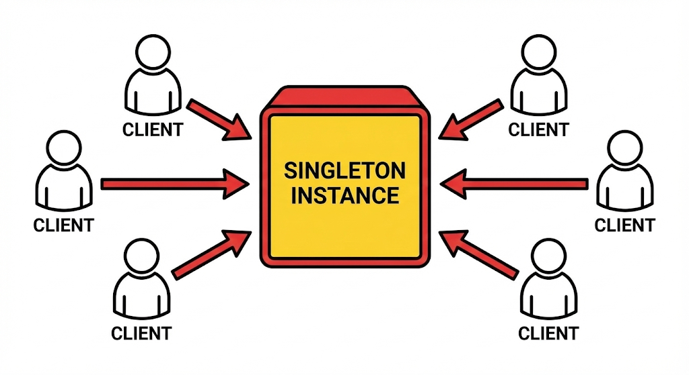
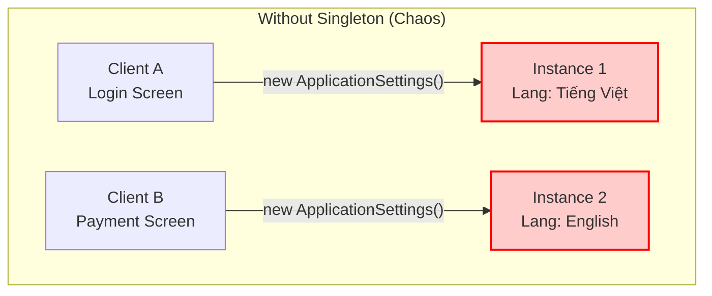
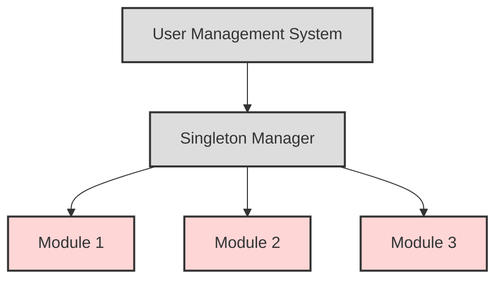
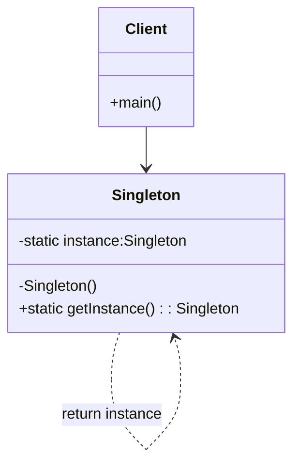

# Singleton

## Giới thiệu

**Singleton** là một Design Pattern thuộc nhóm **Creational Patterns** (Mẫu khởi tạo).

Mục đích cốt lõi của Singleton là đảm bảo **một lớp (class) chỉ có duy nhất một thể hiện (instance)** và cung cấp một điểm truy cập toàn cục (global point of access) đến thể hiện đó.



### Tưởng tượng thực tế
Hãy nghĩ về **Cái Đồng Hồ treo tường** trong một phòng thi Đại học.

Trong phòng thi, dù có hàng chục sinh viên đang cắm cúi làm bài, nhưng chỉ có **duy nhất một cái đồng hồ** treo trên bảng để tính giờ.

Tất cả sinh viên và giám thị đều phải nhìn vào đúng cái đồng hồ đó để thống nhất thời gian nộp bài. Nếu mỗi sinh viên tự dùng đồng hồ cá nhân (cái nhanh, cái chậm) hoặc trong phòng có tới 2 cái đồng hồ chỉ giờ khác nhau, thì chắc chắn sẽ xảy ra cãi vã và "loạn" ngay.

Trong lập trình, Singleton đóng vai trò y hệt cái đồng hồ đó. Nó là nguồn chân lý duy nhất (Single Source of Truth) mà toàn bộ các phần khác của ứng dụng phải tuân theo để đảm bảo tính nhất quán.

### Đặt vấn đề
Hãy tưởng tượng hệ thống của bạn có một lớp `ApplicationSettings` chịu trách nhiệm nạp cấu hình từ file `config.json`.

Nếu không kiểm soát hành vi khởi tạo, Developer A tạo một `new ApplicationSettings()` ở màn hình Login. Developer B lại `new ApplicationSettings()` ở màn hình Thanh toán.



**Hậu quả khôn lường:**
*   **Xung đột dữ liệu:** Dev A thay đổi cài đặt ngôn ngữ sang Tiếng Việt, nhưng instance của Dev B vẫn đang giữ cấu hình Tiếng Anh. Kết quả là App hiển thị "nửa Tây nửa Ta".
*   **Lãng phí tài nguyên:** Mỗi lần `new` là một lần hệ thống phải đọc file từ ổ cứng và parse JSON, làm chậm ứng dụng một cách vô nghĩa.
*   **Mất kiểm soát:** Không ai biết đâu là "nguồn sự thật" (Source of Truth) của cấu hình hiện tại.

### Giải quyết

Singleton ra đời với một tôn chỉ duy nhất: **"There can be only one" (Chỉ một mà thôi).**

Nó giải quyết vấn đề bằng cách **tự mình quản lý chính mình**. Nó chặn đứng mọi nỗ lực khởi tạo tràn lan từ bên ngoài (thông qua `private constructor`) và chỉ cung cấp **một lối đi độc đạo** (`static method`) để truy cập vào tài nguyên chung.



**Cơ chế hoạt động:**
- Lớp Singleton tự mình giữ "chìa khóa" khởi tạo của chính nó.
- Chỉ có **DUY NHẤT** một đối tượng tồn tại trong suốt vòng đời ứng dụng.
- Bất kỳ thành phần nào muốn sử dụng đều phải đi qua cổng kiểm soát này, đảm bảo tính nhất quán tuyệt đối.

### Cấu tạo

Để đạt được quyền năng trên, Singleton cần 3 "bảo bối" cốt lõi:



1.  **`private static instance`**: Hạt nhân duy nhất, nơi lưu trữ thể hiện độc tôn của lớp.
2.  **`private constructor`**: "Khóa cổng". Ngăn chặn tuyệt đối việc sử dụng từ khóa `new` từ bên ngoài để tạo thêm bản sao.
3.  **`public static getInstance()`**: "Cánh cổng duy nhất". Ai muốn gặp Singleton, phải đi qua cửa này. Cửa này có nhiệm vụ kiểm tra: *Nếu chưa có thì tạo mới, có rồi thì trả về cái đang tồn tại.*


## Cách triển khai

Có nhiều cách để triển khai Singleton Pattern trong Java. Một cách phổ biến là sử dụng một biến static private để lưu trữ instance của class.

```java
public class Singleton {

    private static Singleton instance;

    private Singleton() {
        // Constructor is private to prevent direct instantiation
    }

    public static Singleton getInstance() {
        if (instance == null) {
            instance = new Singleton();
        }
        return instance;
    }
}
```

Cách triển khai này đảm bảo rằng chỉ có một instance của Singleton được tạo ra. Khi một đối tượng Singleton được yêu cầu, phương thức `getInstance()` sẽ kiểm tra xem instance đã tồn tại hay chưa. Nếu chưa, phương thức sẽ tạo ra một instance mới. Nếu đã tồn tại, phương thức sẽ trả về instance hiện tại.

Một cách triển khai khác của Singleton Pattern là sử dụng một biến static final private.

```java
public final class Singleton {

    private static final Singleton instance = new Singleton();

    private Singleton() {
        // Constructor is private to prevent direct instantiation
    }

    public static Singleton getInstance() {
        return instance;
    }
}
```

Cách triển khai này tương tự như cách triển khai đầu tiên, nhưng nó sử dụng một biến static final private thay vì một biến static private. Cách triển khai này có một số ưu điểm như sau:

- Sử dụng biến static final private sẽ ngăn chặn việc thay đổi giá trị của biến instance.
- Cấu trúc code sẽ gọn gàng hơn.


## Ví dụ minh họa

Dưới đây là một ví dụ minh họa cách sử dụng Singleton Pattern để tạo một đối tượng DatabaseConnection.

```java
public class DatabaseConnection {

    private static final DatabaseConnection instance = new DatabaseConnection();

    private DatabaseConnection() {
        // Connect to database
    }

    public static DatabaseConnection getInstance() {
        return instance;
    }

    public void query(String sql) {
        // Execute query
    }
}
```

Trong ví dụ này, DatabaseConnection là một class singleton. Nó có một phương thức getInstance() để truy cập instance duy nhất của class.

## So sánh

Singleton Pattern có thể được so sánh với một số Design Pattern tương tự, chẳng hạn như:

- Factory Pattern: Factory Pattern cung cấp một cách để tạo các đối tượng của lớp một cách linh hoạt. Tuy nhiên, Factory Pattern không đảm bảo rằng chỉ có một đối tượng của lớp được tạo ra.
- Prototype Pattern: Prototype Pattern cung cấp một cách để tạo các bản sao của đối tượng. Prototype Pattern cũng có thể được sử dụng để tạo một đối tượng duy nhất của lớp. Tuy nhiên, Prototype Pattern có thể phức tạp hơn Singleton Pattern.

## Lưu ý

Khi áp dụng Singleton Pattern, cần lưu ý một số điểm sau:

- Singleton Pattern có thể làm giảm tính linh hoạt của ứng dụng. Ví dụ, nếu bạn cần tạo ra nhiều instance của một class, bạn sẽ cần phải thay đổi code để xóa phương thức getInstance().
- Singleton Pattern có thể gây ra vấn đề khi test. Ví dụ, nếu bạn đang test một class sử dụng Singleton Pattern, bạn sẽ cần tạo ra một instance giả của class đó.


## Kết luận

Singleton Pattern là một Design Pattern hữu ích trong những trường hợp cần đảm bảo rằng chỉ có một thể hiện duy nhất của một lớp được tạo ra. Tuy nhiên, cần lưu ý những điểm hạn chế của Singleton Pattern khi áp dụng.

Dưới đây là một số hướng dẫn sử dụng Singleton Pattern:


- Nên sử dụng Singleton Pattern khi cần đảm bảo rằng chỉ có một thể hiện duy nhất của một lớp được tạo ra.
- Tránh sử dụng Singleton Pattern khi không cần thiết.
- Hạn chế sử dụng Singleton trong các hệ thống lớn hoặc phức tạp.

## Ví dụ Code

Bạn có thể xem mã nguồn đầy đủ và hướng dẫn chạy thử tại: [Singleton Example README](../../src/main/java/design/patterns/creational/singleton/README.md)


