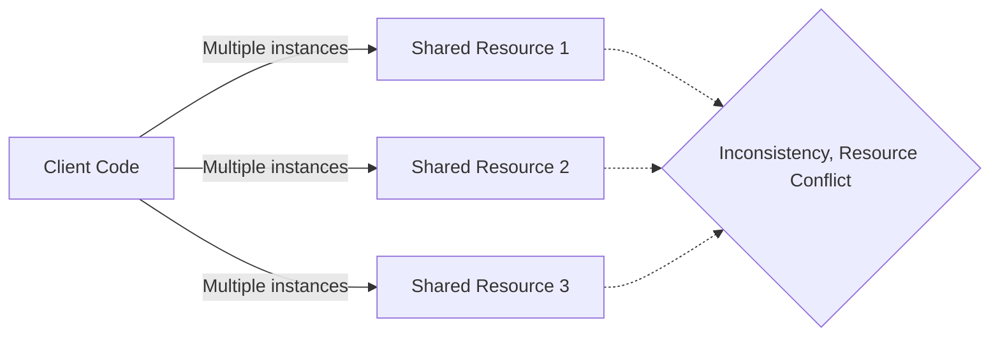
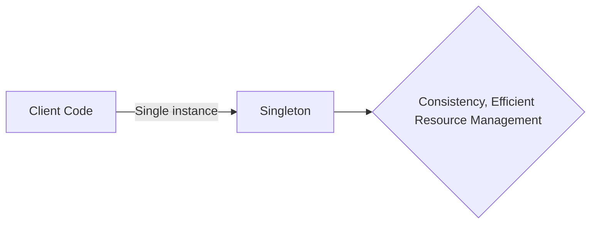
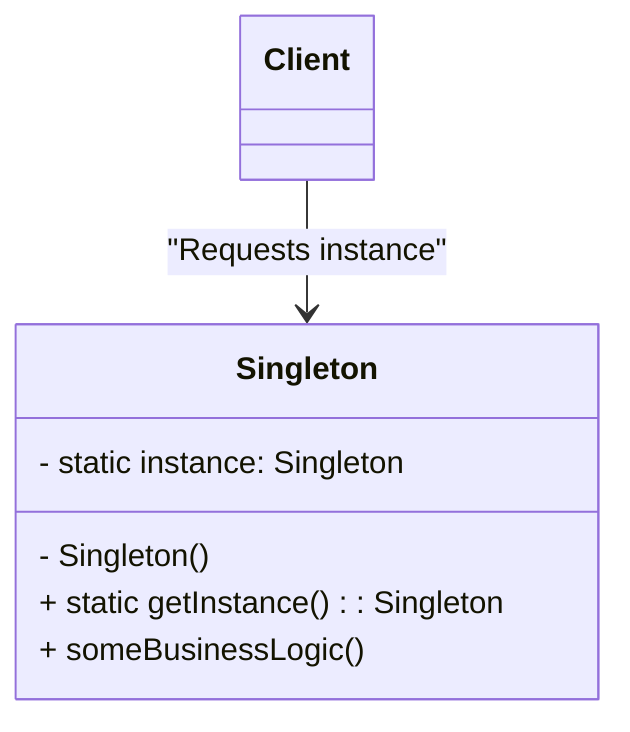
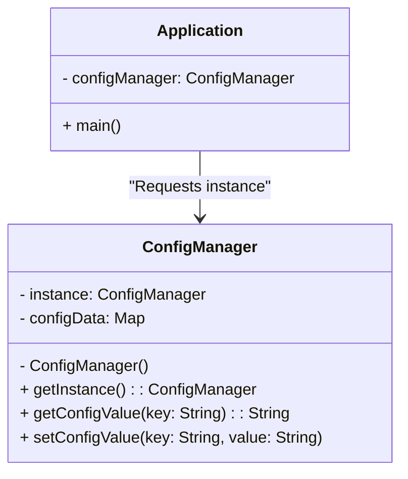
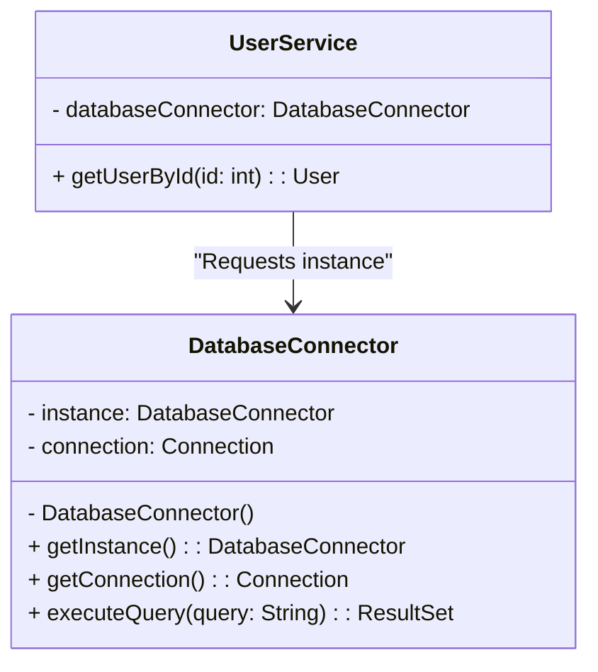
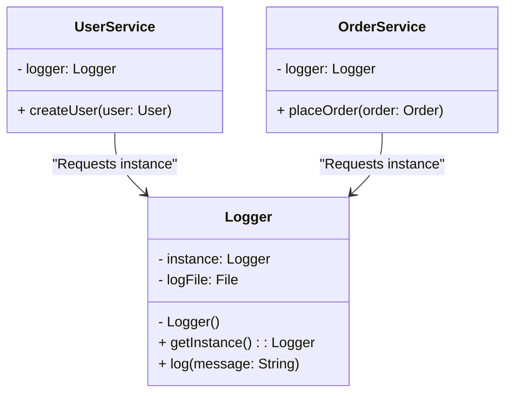

# Singleton: Đảm bảo tính duy nhất

## Giới thiệu

Trong lập trình hướng đối tượng, Singleton là một mẫu thiết kế thuộc nhóm Creational Patterns. Mục đích chính của Singleton là đảm bảo chỉ duy nhất một thể hiện (instance) của một lớp (class) được tạo ra trong toàn bộ chương trình và cung cấp một điểm truy cập toàn cục đến thể hiện này. Singleton giúp giải quyết các vấn đề như quản lý tài nguyên dùng chung, tránh xung đột khi có nhiều thể hiện truy cập đồng thời, đảm bảo tính nhất quán của dữ liệu và tiết kiệm tài nguyên hệ thống.

### Đặt vấn đề

Trong các hệ thống phần mềm lớn, thường có nhiều tài nguyên hoặc đối tượng cần được chia sẻ và truy cập từ nhiều nơi khác nhau, như cơ sở dữ liệu, cấu hình hệ thống, bộ đệm (cache), hoặc các dịch vụ chung. Nếu cho phép tạo nhiều thể hiện của các đối tượng này, sẽ dẫn đến những hạn chế và khó khăn trong việc quản lý, đồng bộ dữ liệu, tiêu tốn tài nguyên không cần thiết.



Như minh họa trong sơ đồ trên, khi client code tạo ra nhiều thể hiện của các tài nguyên dùng chung (Shared Resource), nó có thể dẫn đến sự không nhất quán và xung đột tài nguyên. Vấn đề này đòi hỏi một giải pháp để đảm bảo tính duy nhất và toàn vẹn của các tài nguyên và đối tượng quan trọng trong hệ thống.

### Giải quyết

Singleton Pattern giải quyết vấn đề trên bằng cách đảm bảo chỉ một instance của class được tạo ra, cung cấp một phương thức tĩnh để truy cập instance duy nhất này, và kiểm soát việc khởi tạo instance từ bên trong class.



Với Singleton, như minh họa trong sơ đồ trên, client code chỉ tương tác với một thể hiện duy nhất của lớp Singleton. Điều này đảm bảo tính nhất quán, tránh xung đột tài nguyên và quản lý tài nguyên một cách hiệu quả. Singleton giúp tối ưu hóa việc sử dụng bộ nhớ, tăng cường tính bảo mật và dễ dàng quản lý các tài nguyên quan trọng trong ứng dụng.

Bằng cách áp dụng Singleton Pattern, chúng ta có thể giải quyết các vấn đề liên quan đến việc quản lý và sử dụng các tài nguyên dùng chung trong hệ thống một cách hiệu quả và an toàn.

### Cấu tạo

Để triển khai Singleton Pattern trong Java, chúng ta cần tuân thủ một số quy tắc. Đầu tiên, chúng ta cần một trường tĩnh riêng (private static instance) để lưu trữ thể hiện duy nhất của class Singleton. Tiếp theo, constructor của class Singleton phải được đặt ở chế độ private để ngăn việc khởi tạo trực tiếp từ bên ngoài. Cuối cùng, chúng ta cần một phương thức tĩnh công khai (public static method) với tên gợi ý là getInstance() để trả về thể hiện duy nhất của Singleton. Phương thức này sẽ kiểm tra xem instance đã được tạo hay chưa, nếu chưa thì tạo mới và trả về.



Như minh họa trong biểu đồ lớp trên, cấu trúc của Singleton Pattern bao gồm:
1. Lớp Singleton:
   - Có một trường tĩnh riêng (static instance) để lưu trữ thể hiện duy nhất của lớp.
   - Constructor được đặt ở chế độ private để ngăn việc khởi tạo trực tiếp từ bên ngoài.
   - Cung cấp một phương thức tĩnh công khai (public static method) getInstance() để trả về thể hiện duy nhất của lớp.
   - Chứa các phương thức và thuộc tính khác liên quan đến logic nghiệp vụ của lớp.
2. Client:
   - Là các lớp hoặc đối tượng sử dụng lớp Singleton.
   - Gọi phương thức getInstance() để lấy thể hiện duy nhất của lớp Singleton.
   - Tương tác với lớp Singleton thông qua thể hiện duy nhất này.

Với cấu trúc này, Singleton Pattern đảm bảo rằng chỉ có một thể hiện duy nhất của lớp Singleton được tạo ra và được truy cập thông qua phương thức getInstance(). Client không thể tạo trực tiếp các thể hiện mới của lớp Singleton, mà chỉ có thể sử dụng thể hiện duy nhất được cung cấp bởi phương thức getInstance().

Bằng cách tuân thủ cấu trúc này, Singleton Pattern giúp kiểm soát việc khởi tạo và truy cập đến các tài nguyên quan trọng trong ứng dụng, đảm bảo tính nhất quán và tối ưu hóa việc sử dụng tài nguyên.

## Cách triển khai

Dưới đây là một ví dụ về cách triển khai Singleton Pattern trong Java:

```java
public class Singleton {
    private static Singleton instance;

    private Singleton() {
        // Khởi tạo tài nguyên
    }

    public static Singleton getInstance() {
        if (instance == null) {
            instance = new Singleton();
        }
        return instance;
    }

    public void someBusinessLogic() {
        // Triển khai logic nghiệp vụ
    }
}
```

Để sử dụng Singleton, chúng ta chỉ cần gọi phương thức getInstance() để lấy thể hiện duy nhất của class:

```java
Singleton singleton = Singleton.getInstance();
singleton.someBusinessLogic();
```

## Ứng dụng thực tế

Singleton Pattern được ứng dụng rộng rãi trong nhiều lĩnh vực của phát triển phần mềm. Dưới đây là một số ví dụ điển hình về việc áp dụng Singleton trong thực tế.

### 1. Quản lý cấu hình 

Trong các ứng dụng, thường có các thông tin cấu hình chung như thông tin kết nối cơ sở dữ liệu, cấu hình hệ thống, thông tin người dùng, v.v. Việc quản lý và truy cập các thông tin cấu hình này từ nhiều nơi trong ứng dụng có thể gây ra sự không nhất quán và khó bảo trì. Singleton Pattern giúp giải quyết vấn đề này bằng cách tạo ra một lớp ConfigManager duy nhất để lưu trữ và cung cấp các thông tin cấu hình.



Trong ví dụ trên, lớp ConfigManager là một Singleton chịu trách nhiệm lưu trữ và cung cấp các thông tin cấu hình. Ứng dụng (Application) chỉ tương tác với thể hiện duy nhất của ConfigManager để truy cập và cập nhật các giá trị cấu hình. Điều này đảm bảo tính nhất quán và dễ dàng quản lý các thông tin cấu hình trong toàn bộ ứng dụng.

### 2. Kết nối và truy xuất dữ liệu

Trong các ứng dụng làm việc với cơ sở dữ liệu, việc quản lý kết nối và truy xuất dữ liệu là rất quan trọng. Việc tạo ra nhiều kết nối đến cơ sở dữ liệu có thể gây lãng phí tài nguyên và ảnh hưởng đến hiệu suất của ứng dụng. Singleton Pattern cho phép tạo ra một lớp DatabaseConnector duy nhất để quản lý kết nối và truy xuất dữ liệu.



Trong ví dụ trên, lớp DatabaseConnector là một Singleton đảm nhận vai trò quản lý kết nối và truy xuất dữ liệu từ cơ sở dữ liệu. Các lớp khác, như UserService, chỉ tương tác với thể hiện duy nhất của DatabaseConnector để thực hiện các truy vấn và lấy dữ liệu. Việc sử dụng Singleton ở đây giúp tối ưu hóa việc sử dụng tài nguyên, đảm bảo tính nhất quán và an toàn trong quá trình làm việc với cơ sở dữ liệu.

### 3. Ghi log

Trong quá trình phát triển và vận hành ứng dụng, việc ghi log là rất cần thiết để theo dõi và ghi lại các sự kiện, thông báo, lỗi, v.v. Việc sử dụng Singleton Pattern cho phép tạo ra một lớp Logger duy nhất để quản lý việc ghi log trong toàn bộ ứng dụng.



Trong ví dụ trên, lớp Logger là một Singleton chịu trách nhiệm ghi log. Các lớp khác, như UserService và OrderService, đều sử dụng thể hiện duy nhất của Logger để ghi log các thông tin liên quan. Việc sử dụng Singleton ở đây giúp đảm bảo tính nhất quán và tập trung trong việc ghi log, tránh việc tạo ra nhiều đối tượng Logger không cần thiết.

Trên đây là một số ví dụ điển hình về việc áp dụng Singleton Pattern trong thực tế. Singleton giúp quản lý và truy cập các tài nguyên dùng chung, như cấu hình, kết nối cơ sở dữ liệu và ghi log, một cách hiệu quả và an toàn. Việc sử dụng Singleton còn giúp tối ưu hóa việc sử dụng tài nguyên, tăng cường tính bảo mật và dễ dàng bảo trì ứng dụng.

## Lợi ích và hạn chế

### Lợi ích

1. Đảm bảo tính duy nhất và toàn vẹn của tài nguyên

Singleton Pattern đảm bảo chỉ có một thể hiện duy nhất của một lớp được tạo ra trong toàn bộ ứng dụng. Điều này giúp duy trì tính toàn vẹn và nhất quán của các tài nguyên và đối tượng quan trọng. Bằng cách kiểm soát việc truy cập và sử dụng các tài nguyên thông qua một thể hiện duy nhất, Singleton giúp tránh các xung đột và đảm bảo tính đúng đắn của dữ liệu.

2. Quản lý tài nguyên hiệu quả

Với Singleton, việc quản lý và truy cập các tài nguyên dùng chung trở nên dễ dàng hơn. Thay vì phải tạo ra nhiều thể hiện của một lớp và quản lý chúng riêng lẻ, Singleton cho phép truy cập tài nguyên thông qua một điểm truy cập duy nhất. Điều này giúp đơn giản hóa việc quản lý tài nguyên, giảm thiểu sự phức tạp và tăng cường khả năng kiểm soát.

3. Tiết kiệm bộ nhớ 

Singleton Pattern giúp tiết kiệm bộ nhớ bằng cách chỉ tạo ra một thể hiện duy nhất của một lớp. Thay vì phải cấp phát bộ nhớ cho nhiều thể hiện, Singleton chỉ yêu cầu một lượng bộ nhớ cố định cho thể hiện duy nhất đó. Điều này đặc biệt hữu ích trong các trường hợp mà việc tạo ra nhiều thể hiện của một lớp là không cần thiết và tốn kém tài nguyên.

### Hạn chế

1. Khó khăn trong việc mở rộng

Singleton Pattern có thể gây khó khăn cho việc mở rộng và thay đổi hệ thống trong tương lai. Do Singleton chỉ cho phép một thể hiện duy nhất của một lớp, việc mở rộng hoặc thay thế lớp đó có thể đòi hỏi sự thay đổi lớn trong thiết kế và mã nguồn. Điều này có thể làm giảm tính linh hoạt và khả năng thích ứng của hệ thống.

2. Khó kiểm thử

Việc sử dụng Singleton có thể gây khó khăn cho việc viết các bài kiểm thử đơn vị (unit test). Do Singleton phụ thuộc vào trạng thái toàn cục và có thể ảnh hưởng đến các phần khác của hệ thống, việc kiểm thử các thành phần riêng lẻ trở nên phức tạp hơn. Điều này có thể dẫn đến việc khó phát hiện và xử lý các lỗi tiềm ẩn trong quá trình phát triển.

3. Vấn đề đa luồng

Trong môi trường đa luồng, Singleton Pattern cần được xử lý cẩn thận để đảm bảo tính an toàn và đúng đắn. Nếu nhiều luồng cùng truy cập và thay đổi trạng thái của Singleton cùng một lúc, có thể dẫn đến các vấn đề như xung đột tài nguyên, deadlock hoặc kết quả không nhất quán. Việc đảm bảo tính an toàn của Singleton trong môi trường đa luồng đòi hỏi các kỹ thuật đồng bộ hóa và khóa thích hợp.

Tóm lại, Singleton Pattern mang lại nhiều lợi ích trong việc quản lý và sử dụng tài nguyên, đảm bảo tính duy nhất và toàn vẹn của dữ liệu. Tuy nhiên, nó cũng có những hạn chế nhất định như khó mở rộng, khó kiểm thử và vấn đề đa luồng. Việc cân nhắc và đánh giá kỹ lưỡng trước khi áp dụng Singleton là rất quan trọng để đảm bảo nó phù hợp với yêu cầu và ràng buộc cụ thể của hệ thống.

## Khi nào sử dụng Singleton Pattern

Singleton Pattern thích hợp sử dụng trong các trường hợp sau:

- Khi một class trong hệ thống chỉ nên có một instance duy nhất và instance đó cần được truy cập từ một điểm truy cập toàn cục.
- Khi việc kiểm soát truy cập và quản lý tài nguyên là quan trọng.
- Khi cần đảm bảo tính nhất quán và toàn vẹn của dữ liệu và tài nguyên trong hệ thống.
- Khi muốn tối ưu hóa việc sử dụng bộ nhớ và tài nguyên hệ thống.

Tuy nhiên, khi áp dụng Singleton, chúng ta cần cân nhắc kỹ về tính cần thiết và sự đánh đổi giữa sự đơn giản và tính linh hoạt của hệ thống.

## Kết luận

Singleton Pattern là một mẫu thiết kế hữu ích trong việc đảm bảo tính duy nhất của instance trong hệ thống, giúp quản lý tài nguyên hiệu quả và tránh xung đột. Tuy nhiên, nó cũng đi kèm với những hạn chế và cần được sử dụng một cách thận trọng. Khi áp dụng Singleton, chúng ta cần cân nhắc kỹ về tính cần thiết, đánh đổi giữa sự đơn giản và tính linh hoạt, cũng như xử lý các vấn đề liên quan đến đa luồng. Với sự hiểu biết và áp dụng đúng cách, Singleton có thể là một công cụ mạnh mẽ trong việc xây dựng các hệ thống phần mềm hiệu quả và dễ bảo trì.


