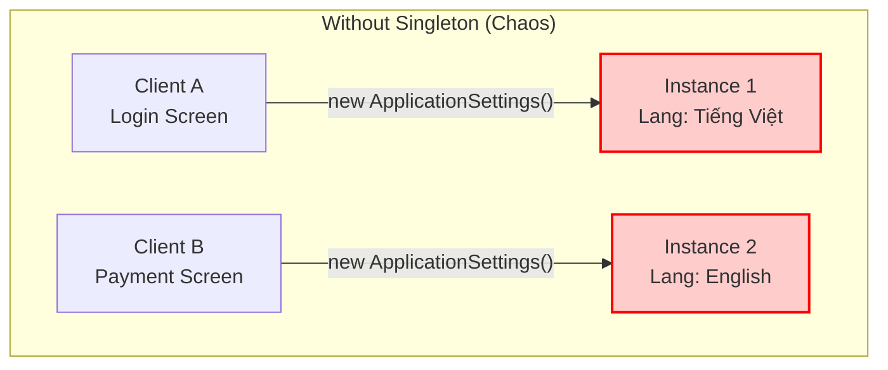
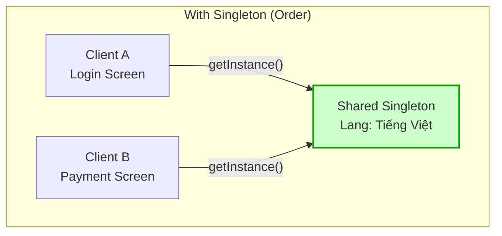
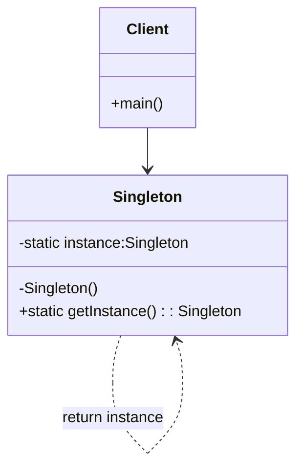

# Singleton

## Giới thiệu

**Singleton** là một Design Pattern thuộc nhóm **Creational Patterns** (Mẫu khởi tạo).

Mục đích cốt lõi của Singleton là đảm bảo **một lớp (class) chỉ có duy nhất một thể hiện (instance)** và cung cấp một điểm truy cập toàn cục (global point of access) đến thể hiện đó.


### Tưởng tượng thực tế
Hãy nghĩ về **Cái Đồng Hồ treo tường** trong một phòng thi Đại học.

Trong phòng thi, dù có hàng chục sinh viên đang cắm cúi làm bài, nhưng chỉ có **duy nhất một cái đồng hồ** treo trên bảng để tính giờ.

Tất cả sinh viên và giám thị đều phải nhìn vào đúng cái đồng hồ đó để thống nhất thời gian nộp bài. Nếu mỗi sinh viên tự dùng đồng hồ cá nhân (cái nhanh, cái chậm) hoặc trong phòng có tới 2 cái đồng hồ chỉ giờ khác nhau, thì chắc chắn sẽ xảy ra cãi vã và "loạn" ngay.

Trong lập trình, Singleton đóng vai trò y hệt cái đồng hồ đó. Nó là nguồn chân lý duy nhất (Single Source of Truth) mà toàn bộ các phần khác của ứng dụng phải tuân theo để đảm bảo tính nhất quán.

### Đặt vấn đề
Hãy tưởng tượng hệ thống của bạn có một lớp `ApplicationSettings` chịu trách nhiệm nạp cấu hình từ file `config.json`.

Nếu không kiểm soát hành vi khởi tạo, Developer A tạo một `new ApplicationSettings()` ở màn hình Login. Developer B lại `new ApplicationSettings()` ở màn hình Thanh toán.



**Hậu quả khôn lường:**
*   **Xung đột dữ liệu:** Dev A thay đổi cài đặt ngôn ngữ sang Tiếng Việt, nhưng instance của Dev B vẫn đang giữ cấu hình Tiếng Anh. Kết quả là App hiển thị "nửa Tây nửa Ta".
*   **Lãng phí tài nguyên:** Mỗi lần `new` là một lần hệ thống phải đọc file từ ổ cứng và parse JSON, làm chậm ứng dụng một cách vô nghĩa.
*   **Mất kiểm soát:** Không ai biết đâu là "nguồn sự thật" (Source of Truth) của cấu hình hiện tại.

### Giải quyết

Singleton ra đời với một tôn chỉ duy nhất: **"There can be only one" (Chỉ một mà thôi).**

Nó giải quyết vấn đề bằng cách **tự mình quản lý chính mình**. Nó chặn đứng mọi nỗ lực khởi tạo tràn lan từ bên ngoài (thông qua `private constructor`) và chỉ cung cấp **một cổng truy cập duy nhất** (`static method`) để truy cập vào tài nguyên chung.



**Cơ chế hoạt động:**
- Lớp Singleton tự mình giữ "chìa khóa" khởi tạo của chính nó.
- Chỉ có **DUY NHẤT** một đối tượng tồn tại trong suốt vòng đời ứng dụng.
- Bất kỳ thành phần nào muốn sử dụng đều phải đi qua cổng kiểm soát này, đảm bảo tính nhất quán tuyệt đối.

### Cấu tạo

Để thực hiện được điều này, Singleton cần 3 **thành phần** cốt lõi:



1.  **`private static instance`**: Hạt nhân duy nhất, nơi lưu trữ **thể hiện duy nhất** của lớp.
2.  **`private constructor`**: "Khóa cổng". Ngăn chặn tuyệt đối việc sử dụng từ khóa `new` từ bên ngoài để tạo thêm bản sao.
3.  **`public static getInstance()`**: "Cánh cổng duy nhất". Ai muốn gặp Singleton, phải đi qua cửa này. Cửa này có nhiệm vụ kiểm tra: *Nếu chưa có thì tạo mới, có rồi thì trả về cái đang tồn tại.*


## Cách triển khai

Trong Java, có hai chiến lược chính để tạo ra Singleton, mỗi cách giống như một phong cách sống khác nhau:

### 1. Lazy Initialization (Làm khi cần)
> *"Nước đến chân mới nhảy"*

Đây là phong cách của những người chỉ làm việc khi thực sự cần thiết. Singleton sẽ không được tạo ra ngay lập tức khi chương trình chạy, mà nó sẽ **kiên nhẫn chờ đợi**. Chỉ khi nào có ai đó gọi tên nó (`getInstance()`), nó mới bắt đầu khởi tạo.

```java
public class Singleton {

    private static Singleton instance;

    private Singleton() {
        // Constructor private: "Ngăn chặn khởi tạo từ bên ngoài"
    }

    public static Singleton getInstance() {
        if (instance == null) {
            // Nếu chưa có thì mới bắt đầu tạo
            instance = new Singleton();
        }
        return instance;
    }
}
```

*   **Ưu điểm:** Tiết kiệm tài nguyên. Nếu cả buổi không ai cần dùng, object sẽ không bao giờ được tạo ra.
*   **Lưu ý:** Cách viết cơ bản này tuyệt vời cho người mới bắt đầu, nhưng hãy cẩn thận khi dùng trong môi trường đa luồng (Multi-threading).

### 2. Eager Initialization (Làm sẵn)
> *"Ăn chắc mặc bền"*

Ngược lại với Lazy, đây là phong cách chuẩn bị trước mọi thứ. Singleton sẽ được tạo ra **ngay khi class được nạp (load)**, bất kể có ai dùng hay không. Giống như một cửa hàng tiện lợi luôn mở cửa bật đèn sẵn sàng, khách vào là phục vụ ngay.

```java
public class Singleton {

    // Tạo sẵn ngay từ đầu
    private static final Singleton instance = new Singleton();

    private Singleton() {
        // Constructor private
    }

    public static Singleton getInstance() {
        // Cần là có ngay, không phải chờ đợi
        return instance;
    }
}
```

*   **Ưu điểm:** Đơn giản, an toàn (Thread-safe) nhờ cơ chế của JVM, không lo xung đột khi nhiều luồng cùng gọi.
*   **Nhược điểm:** Nếu object quá nặng mà lại không được sử dụng, nó sẽ nằm chiếm chỗ trong bộ nhớ một cách lãng phí.


## Cách sử dụng (Usage)

Quay lại với bài toán `ApplicationSettings` ở phần đầu. Làm thế nào để đảm bảo "chỉ có một"?

Đây là cách chúng ta sử dụng Singleton trong thực tế:

```java
public class Client {
    public static void main(String[] args) {
        // Developer A gọi ở màn hình Login
        Singleton s1 = Singleton.getInstance();
        
        // Developer B gọi ở màn hình Thanh toán
        Singleton s2 = Singleton.getInstance();

        // KIỂM CHỨNG: Liệu hai người có đang dùng chung một thứ?
        if (s1 == s2) {
            System.out.println("Thành công! Cả hai đều là cùng một object duy nhất.");
        } else {
            System.out.println("Thất bại! Có hai object khác nhau tồn tại.");
        }
    }
}
```

Kết quả in ra màn hình sẽ luôn là **"Thành công!"**. Dù bạn có gọi `getInstance()` cả nghìn lần ở nghìn nơi khác nhau, bạn vẫn sẽ luôn nhận về đúng một object đó mà thôi.

## So sánh: Singleton vs Static Class

Một thắc mắc phổ biến: *"Tại sao không dùng Static Class thay vì Singleton?"*

| Tiêu chí | Singleton Pattern | Static Class |
| :--- | :--- | :--- |
| **Giao diện (Interface)** | ✅ Có thể implement Interface (Tính đa hình) | ❌ Không thể |
| **Khởi tạo (Init)** | ✅ Có thể Lazy Loading, xử lý logic phức tạp trong Constructor | ❌ Static block thường khó kiểm soát hơn |
| **Truyền tham số** | ✅ Có thể truyền config vào `getInstance(config)` | ❌ Không hỗ trợ |
| **Quản lý** | ✅ Được quản lý như một Object bình thường | ❌ Gắn chặt với ClassLoader |

-> Dùng **Static Class** khi chỉ đơn thuần là bộ thư viện tiện ích (Utils) như `Math.abs()`, `StringUtils.isEmpty()`.
-> Dùng **Singleton** khi cần quản lý tài nguyên (Connection, Config) và cần tính linh hoạt của OOP.

## Lưu ý (Cần đọc)

Singleton là con dao hai lưỡi. Đừng lạm dụng nó!

1.  **Kẻ thù của Unit Test:** Singleton giữ trạng thái toàn cục (Global State). Hãy tưởng tượng Test Case A chạy xong nhưng quên "dọn dẹp" (reset) dữ liệu trong Singleton, làm cho Test Case B chạy sau bị lỗi oan ức.
2.  **Vi phạm Single Responsibility:** Lớp Singleton vừa phải lo nghiệp vụ của nó, vừa phải lo quản lý việc "sinh đẻ" (khởi tạo) của chính nó.
3.  **Trong thế giới hiện đại (Dependency Injection):** Nếu bạn dùng **Spring Boot** hay các DI Framework, bản thân chúng đã tự quản lý các Bean theo scope Singleton rồi. Bạn **hiếm khi** cần phải tự tay viết code Singleton thủ công như bài học này nữa.

## Kết luận

**Quy tắc vàng (Golden Rules):**

*   ✅ **NÊN DÙNG:** Cho các tài nguyên cần chia sẻ chung và quản lý tập trung: **Logger, Configuration, Caching, Database Connection Pool.**
*   ⛔️ **TUYỆT ĐỐI TRÁNH:** Dùng Singleton như một "cái túi thần kỳ" để truyền biến loạn xạ giữa các màn hình. Điều này sẽ tạo ra "Spaghetti Code" không thể bảo trì.

## Ví dụ Code & Nâng cao

Phần trên chúng ta đã tìm hiểu về khái niệm và cách triển khai cơ bản. Tuy nhiên, trong môi trường Production thực tế (đặc biệt là Đa luồng), chúng ta cần những kỹ thuật chuyên sâu hơn.

Bạn có thể tham khảo **Mã nguồn đầy đủ (Full Source Code)** tại link bên dưới, bao gồm các triển khai nâng cao:
*  **Thread-Safe Singleton** (Double-Checked Locking)

👉 [Xem Code chi tiết tại đây](../../src/main/java/design/patterns/creational/singleton/README.md)

---
Good luck! Nếu thấy bài viết này hữu ích, hãy ủng hộ project bằng cách bấm **Star** ⭐️ hoặc **Fork** 🔄 nhé! Cảm ơn bạn rất nhiều!
