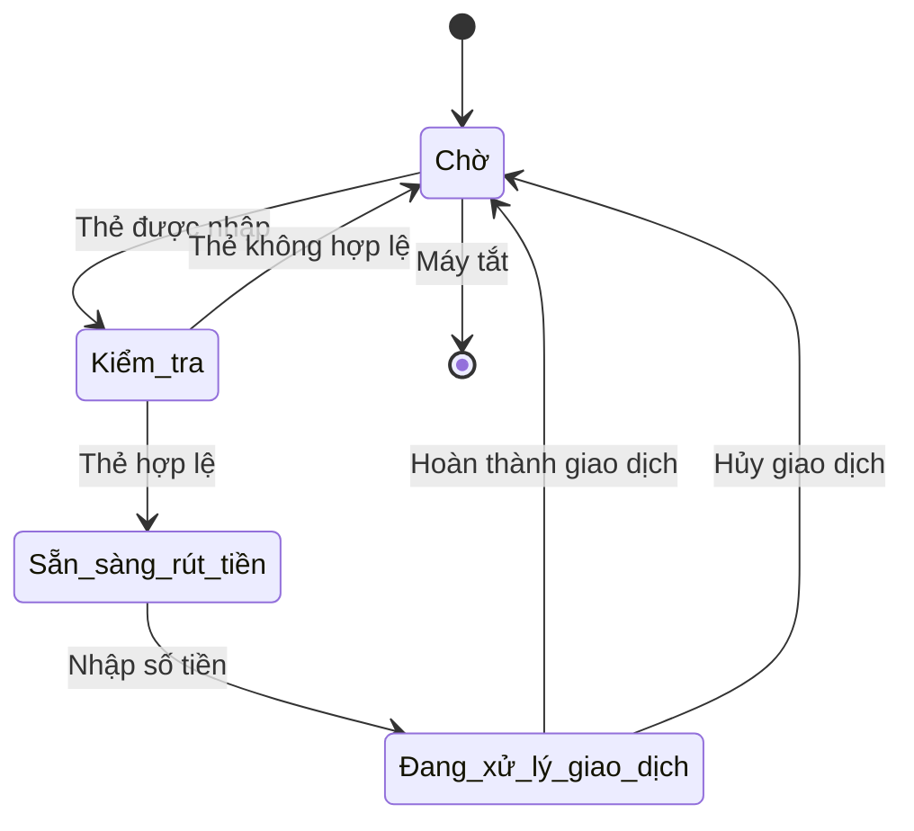
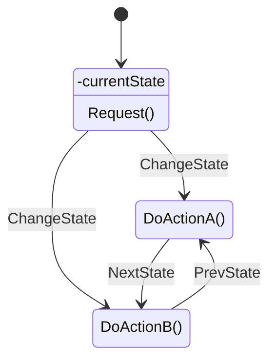
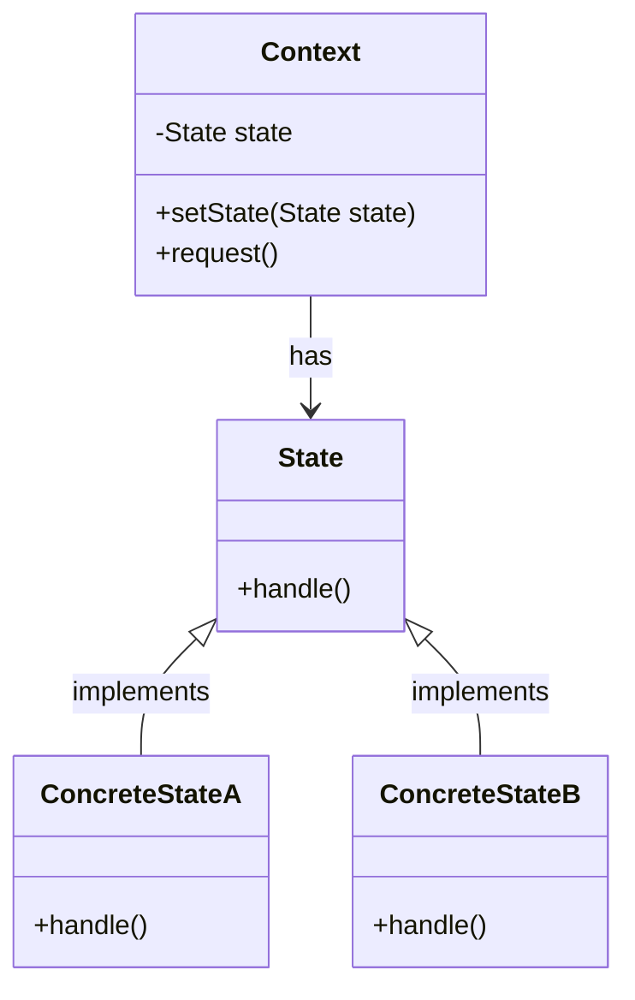

# State Pattern

## Khái Niệm

**State Pattern**, trong lĩnh vực phát triển phần mềm, là một mẫu thiết kế hành vi cho phép một đối tượng thay đổi hành vi của mình khi trạng thái nội bộ thay đổi. Mẫu này coi trạng thái là một đối tượng độc lập và đối tượng chính có thể thay đổi hành vi của mình bằng cách thay đổi trạng thái hiện tại của nó. Điều này được thực hiện mà không cần sửa đổi mã nguồn của đối tượng, giúp cho việc quản lý các thay đổi về trạng thái trở nên dễ dàng và linh hoạt.

### Tổng quan

- **Định Nghĩa của Pattern:** State Pattern bao gồm đối tượng 'Context' (môi trường hoặc ngữ cảnh sử dụng) và một tập hợp các đối tượng 'State' (trạng thái). 'Context' giữ một tham chiếu tới một 'State' hiện tại và có thể thay đổi tham chiếu này để chuyển đổi giữa các trạng thái khác nhau. Các 'State' biết cách xử lý các yêu cầu từ 'Context', và mỗi 'State' cung cấp hành vi cụ thể phù hợp với trạng thái của 'Context'.

- **Mục Đích:** Mục đích của State Pattern là giúp quản lý và cơ cấu lại mã nguồn liên quan đến các quyết định điều khiển dựa trên trạng thái, bằng cách tách biệt hành vi liên quan đến trạng thái cụ thể ra khỏi 'Context'. Điều này giúp giảm sự phức tạp và tăng tính mô-đun của mã nguồn, cũng như dễ dàng thêm mới hoặc sửa đổi các trạng thái mà không ảnh hưởng đến 'Context'.

- **Ý Tưởng Cốt Lõi:** Ý tưởng cốt lõi của State Pattern là "đóng gói sự thay đổi". Bằng cách sử dụng các đối tượng 'State' để đại diện cho các trạng thái khác nhau và cho phép 'Context' thay đổi trạng thái của mình, hệ thống có thể thay đổi hành vi một cách linh hoạt theo trạng thái mà không cần phải viết các câu lệnh điều kiện phức tạp. Điều này giúp mã nguồn trở nên dễ hiểu, dễ bảo trì và mở rộng hơn.

## Đặt vấn đề

Trong phát triển phần mềm, chúng ta thường gặp phải các hệ thống có các đối tượng cần thay đổi hành vi dựa trên trạng thái của nó. Ví dụ, một máy ATM có thể có các trạng thái như: Chờ, Kiểm tra, Sẵn sàng rút tiền, và Đang xử lý giao dịch. Khi không sử dụng State Pattern, việc quản lý các trạng thái và chuyển đổi giữa chúng có thể trở nên phức tạp và dễ gây ra lỗi, đặc biệt là khi số lượng trạng thái tăng lên. Mã nguồn có thể trở nên khó quản lý với một lượng lớn câu lệnh điều kiện và chuyển đổi trạng thái rải rác khắp nơi.



## Giải quyết

State Pattern cho phép một đối tượng thay đổi hành vi của nó khi trạng thái nội bộ của nó thay đổi. Pattern này giải quyết vấn đề bằng cách tách biệt trạng thái và hành vi liên quan thành các lớp trạng thái riêng biệt. Mỗi lớp trạng thái sẽ thực thi một phần của hành vi đối tượng, tương ứng với một trạng thái cụ thể. Điều này giúp giảm thiểu sự phức tạp và tăng cường khả năng mở rộng và bảo trì của mã nguồn.

Sử dụng State Pattern giúp tách biệt các hành vi cụ thể liên quan đến trạng thái và đóng gói chúng trong các đối tượng riêng lẻ. Điều này làm cho mã nguồn dễ hiểu và dễ bảo trì hơn, đồng thời giúp giảm lỗi do việc quản lý trạng thái không đúng cách. Nó cũng tăng cường tính mô-đun, cho phép thêm các trạng thái mới mà không cần sửa đổi mã nguồn hiện có.

Mặc dù State Pattern mang lại nhiều lợi ích, nhưng nó cũng có thể dẫn đến một số sự thỏa hiệp. Việc triển khai có thể yêu cầu nhiều lớp và đối tượng hơn so với việc không sử dụng pattern, điều này có thể làm tăng độ phức tạp của mã và yêu cầu nhiều bộ nhớ hơn. Tuy nhiên, những bất lợi này thường được bù đắp bởi sự linh hoạt và khả năng bảo trì cao hơn.



## Cấu trúc



Trong sơ đồ này:
- `Context` là lớp môi trường chứa một thể hiện của các trạng thái khác nhau (`State`).
- `State` là lớp trừu tượng hoặc interface định nghĩa phương thức `handle()` mà mỗi trạng thái cụ thể (`ConcreteStateA`, `ConcreteStateB`) sẽ triển khai.
- `ConcreteStateA` và `ConcreteStateB` là các lớp cụ thể triển khai các hành vi khác nhau tương ứng với từng trạng thái của `Context`.

Dường như có một sự nhầm lẫn ở đây. Bạn đã cung cấp cấu trúc và mã nguồn cho Observer Pattern nhưng bạn muốn biết về State Pattern. Dưới đây là cách triển khai State Pattern bằng Java:

## Cách triển khai State Pattern

Để triển khai State Pattern, chúng ta sẽ cần các thành phần sau:

### 1. State Interface

Đây là interface cho các trạng thái khác nhau trong context. Mỗi trạng thái sẽ cài đặt các hành động cụ thể.

```java
public interface State {
    void handleRequest();
}
```

### 2. Concrete State Classes

Các lớp này cài đặt các hành động cụ thể cho một trạng thái cụ thể của Context.

```java
public class ConcreteStateA implements State {
    @Override
    public void handleRequest() {
        System.out.println("Handling request by ConcreteStateA");
    }
}

public class ConcreteStateB implements State {
    @Override
    public void handleRequest() {
        System.out.println("Handling request by ConcreteStateB");
    }
}
```

### 3. Context

Lớp này duy trì một tham chiếu đến một đối tượng State và cho phép Client thay đổi trạng thái.

```java
public class Context {
    private State state;

    public Context(State state) {
        this.state = state;
    }

    public void setState(State state) {
        this.state = state;
    }

    public void request() {
        state.handleRequest();
    }
}
```

### 4. Sử dụng Pattern

Đây là cách chúng ta có thể sử dụng State Pattern trong một ứng dụng.

```java
public class StatePatternDemo {
    public static void main(String[] args) {
        Context context = new Context(new ConcreteStateA());

        // The context is in ConcreteStateA.
        context.request(); // Handling request by ConcreteStateA

        // Change state to ConcreteStateB
        context.setState(new ConcreteStateB());

        // Now the context is in ConcreteStateB.
        context.request(); // Handling request by ConcreteStateB
    }
}
```

## Ví dụ

```java
import java.util.ArrayList;
import java.util.List;

// State interface
interface OrderState {
    void proceed(Order order);
}

// Concrete States
class NewState implements OrderState {
    @Override
    public void proceed(Order order) {
        System.out.println("Order is in new state, preparing for shipment.");
        order.setState(new ShippedState());
    }
}

class ShippedState implements OrderState {
    @Override
    public void proceed(Order order) {
        System.out.println("Order is shipped, updating inventory.");
        order.setState(new CompletedState());
    }
}

class CompletedState implements OrderState {
    @Override
    public void proceed(Order order) {
        System.out.println("Order is completed, generating invoice.");
        // Order completion logic here
    }
}

// Context class
class Order {
    private OrderState state;
    private List<Observer> observers = new ArrayList<>();

    public Order(OrderState state) {
        this.state = state;
    }

    public void setState(OrderState state) {
        this.state = state;
        notifyObservers();
    }

    public OrderState getState() {
        return state;
    }

    public void proceed() {
        state.proceed(this);
    }

    public void registerObserver(Observer observer) {
        observers.add(observer);
    }

    public void unregisterObserver(Observer observer) {
        observers.remove(observer);
    }

    public void notifyObservers() {
        for (Observer observer : observers) {
            observer.update(this);
        }
    }
}

// Observer interface
interface Observer {
    void update(Order order);
}

// Inventory System
class InventorySystem implements Observer {
    @Override
    public void update(Order order) {
        if (order.getState() instanceof ShippedState) {
            System.out.println("Inventory System: Order shipped, updating inventory.");
        }
    }
}

// Shipping System
class ShippingSystem implements Observer {
    @Override
    public void update(Order order) {
        if (order.getState() instanceof NewState) {
            System.out.println("Shipping System: New order received, preparing for shipment.");
        }
    }
}

// Billing System
class BillingSystem implements Observer {
    @Override
    public void update(Order order) {
        if (order.getState() instanceof CompletedState) {
            System.out.println("Billing System: Order completed, generating invoice.");
        }
    }
}

public class StatePatternDemo {
    public static void main(String[] args) {
        Order order = new Order(new NewState());

        InventorySystem inventorySystem = new InventorySystem();
        ShippingSystem shippingSystem = new ShippingSystem();
        BillingSystem billingSystem = new BillingSystem();

        order.registerObserver(inventorySystem);
        order.registerObserver(shippingSystem);
        order.registerObserver(billingSystem);

        // Simulate order updates
        order.proceed(); // New to Shipped
        order.proceed(); // Shipped to Completed
    }
}
```

Trong ví dụ này, `Order` chứa một trạng thái (`OrderState`), và các trạng thái cụ thể (`NewState`, `ShippedState`, `CompletedState`) định nghĩa cách thức `Order` chuyển từ trạng thái này sang trạng thái khác. `InventorySystem`, `ShippingSystem`, và `BillingSystem` vẫn là các `Observer`, nhưng bây giờ chúng phản ứng dựa trên trạng thái cụ thể của `Order` thay vì chỉ dựa trên thông báo từ `Order`.

## Khi nào nên sử dụng State Pattern

- **Khi hành vi của đối tượng thay đổi tùy thuộc vào trạng thái của nó**: State Pattern là lựa chọn lý tưởng khi bạn muốn hành vi của một đối tượng thay đổi dựa trên trạng thái nội bộ của nó. Điều này giúp mã nguồn dễ đọc và dễ bảo trì hơn bằng cách ngăn chặn các điều kiện rẽ nhánh phức tạp và liên tục.

- **Khi bạn muốn tránh mã lệnh rắc rối với nhiều điều kiện**: State Pattern giúp loại bỏ sự phụ thuộc vào các câu lệnh điều kiện dài và phức tạp bằng cách chuyển trạng thái của đối tượng vào các lớp trạng thái riêng biệt. Điều này làm cho mã nguồn trở nên sạch sẽ và dễ quản lý hơn.

- **Trong các ứng dụng cần mô phỏng máy trạng thái**: State Pattern là lựa chọn tốt cho các ứng dụng mô phỏng máy trạng thái, như các trò chơi điện tử, các ứng dụng quản lý trạng thái đối tượng, hoặc bất kỳ hệ thống nào mà đối tượng có thể chuyển đổi qua lại giữa nhiều trạng thái khác nhau.

- **Khi bạn muốn mã nguồn dễ mở rộng và bảo trì**: State Pattern giúp việc thêm mới trạng thái hoặc thay đổi hành vi của trạng thái trở nên dễ dàng hơn mà không cần sửa đổi mã nguồn hiện có. Điều này làm cho mã nguồn dễ mở rộng và dễ bảo trì hơn.

- **Khi cần tách rời quá trình thay đổi trạng thái khỏi lớp đối tượng chính**: Sử dụng State Pattern giúp tách biệt quá trình thay đổi trạng thái ra khỏi lớp đối tượng chính, giúp giảm sự phức tạp và tăng tính mô-đun. Điều này cho phép phát triển và thử nghiệm các trạng thái một cách độc lập, giúp cải thiện chất lượng mã nguồn và giảm thiểu lỗi.