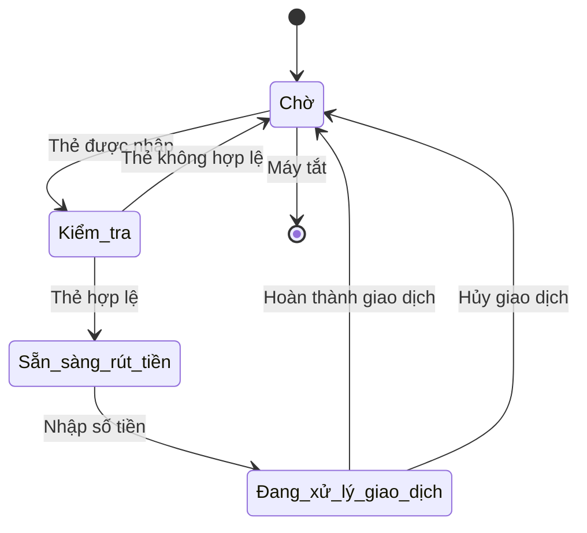

# State Pattern

## Khái Niệm

**State Pattern**, trong lĩnh vực phát triển phần mềm, là một mẫu thiết kế hành vi cho phép một đối tượng thay đổi hành vi của mình khi trạng thái nội bộ thay đổi. Mẫu này coi trạng thái là một đối tượng độc lập và đối tượng chính có thể thay đổi hành vi của mình bằng cách thay đổi trạng thái hiện tại của nó. Điều này được thực hiện mà không cần sửa đổi mã nguồn của đối tượng, giúp cho việc quản lý các thay đổi về trạng thái trở nên dễ dàng và linh hoạt.

### Tổng quan

- **Định Nghĩa của Pattern:** State Pattern bao gồm đối tượng 'Context' (môi trường hoặc ngữ cảnh sử dụng) và một tập hợp các đối tượng 'State' (trạng thái). 'Context' giữ một tham chiếu tới một 'State' hiện tại và có thể thay đổi tham chiếu này để chuyển đổi giữa các trạng thái khác nhau. Các 'State' biết cách xử lý các yêu cầu từ 'Context', và mỗi 'State' cung cấp hành vi cụ thể phù hợp với trạng thái của 'Context'.

- **Mục Đích:** Mục đích của State Pattern là giúp quản lý và cơ cấu lại mã nguồn liên quan đến các quyết định điều khiển dựa trên trạng thái, bằng cách tách biệt hành vi liên quan đến trạng thái cụ thể ra khỏi 'Context'. Điều này giúp giảm sự phức tạp và tăng tính mô-đun của mã nguồn, cũng như dễ dàng thêm mới hoặc sửa đổi các trạng thái mà không ảnh hưởng đến 'Context'.

- **Ý Tưởng Cốt Lõi:** Ý tưởng cốt lõi của State Pattern là "đóng gói sự thay đổi". Bằng cách sử dụng các đối tượng 'State' để đại diện cho các trạng thái khác nhau và cho phép 'Context' thay đổi trạng thái của mình, hệ thống có thể thay đổi hành vi một cách linh hoạt theo trạng thái mà không cần phải viết các câu lệnh điều kiện phức tạp. Điều này giúp mã nguồn trở nên dễ hiểu, dễ bảo trì và mở rộng hơn.

## Đặt vấn đề

Trong phát triển phần mềm, chúng ta thường gặp phải các hệ thống có các đối tượng cần thay đổi hành vi dựa trên trạng thái của nó. Ví dụ, một máy ATM có thể có các trạng thái như: Chờ, Kiểm tra, Sẵn sàng rút tiền, và Đang xử lý giao dịch. Khi không sử dụng State Pattern, việc quản lý các trạng thái và chuyển đổi giữa chúng có thể trở nên phức tạp và dễ gây ra lỗi, đặc biệt là khi số lượng trạng thái tăng lên. Mã nguồn có thể trở nên khó quản lý với một lượng lớn câu lệnh điều kiện và chuyển đổi trạng thái rải rác khắp nơi.



## Giải quyết

State Pattern cho phép một đối tượng thay đổi hành vi của nó khi trạng thái nội bộ của nó thay đổi. Pattern này giải quyết vấn đề bằng cách tách biệt trạng thái và hành vi liên quan thành các lớp trạng thái riêng biệt. Mỗi lớp trạng thái sẽ thực thi một phần của hành vi đối tượng, tương ứng với một trạng thái cụ thể. Điều này giúp giảm thiểu sự phức tạp và tăng cường khả năng mở rộng và bảo trì của mã nguồn.

Sử dụng State Pattern giúp tách biệt các hành vi cụ thể liên quan đến trạng thái và đóng gói chúng trong các đối tượng riêng lẻ. Điều này làm cho mã nguồn dễ hiểu và dễ bảo trì hơn, đồng thời giúp giảm lỗi do việc quản lý trạng thái không đúng cách. Nó cũng tăng cường tính mô-đun, cho phép thêm các trạng thái mới mà không cần sửa đổi mã nguồn hiện có.

Mặc dù State Pattern mang lại nhiều lợi ích, nhưng nó cũng có thể dẫn đến một số sự thỏa hiệp. Việc triển khai có thể yêu cầu nhiều lớp và đối tượng hơn so với việc không sử dụng pattern, điều này có thể làm tăng độ phức tạp của mã và yêu cầu nhiều bộ nhớ hơn. Tuy nhiên, những bất lợi này thường được bù đắp bởi sự linh hoạt và khả năng bảo trì cao hơn.

```mermaid
stateDiagram-v2
    [*] --> Context
    Context --> StateA: ChangeState
    Context --> StateB: ChangeState
    StateA --> StateB: NextState
    StateB --> StateA: PrevState
    StateA: DoActionA()
    StateB: DoActionB()
    Context: -currentState
    Context: Request()
˙```

## Cấu trúc

Các thành phần chính trong State Pattern:

- Context: lớp chứa tham chiếu đến trạng thái hiện tại.

- State: interface chung cho các trạng thái.

- ConcreteState: các lớp triển khai cụ thể cho mỗi trạng thái.

## Cách triển khai

Để triển khai State Pattern trong Java, chúng ta có thể:

- Định nghĩa một interface chung cho State.

- Tạo các lớp Concrete State triển khai interface đó.

- Lớp Context sẽ lưu trữ instance của State hiện tại.

## Ví dụ

// Ví dụ State Pattern áp dụng cho trạng thái của nhân vật trong game

## So sánh với các Pattern

So với Strategy, State tập trung vào việc thay đổi hành vi dựa trên trạng thái đối tượng. Strategy tập trung vào việc thay đổi thuật toán riêng lẻ.

## Kết luận

State Pattern giúp tổ chức code dựa trên trạng thái của đối tượng, dễ mở rộng và bảo trì hơn. Tuy nhiên cũng cần tránh lạm dụng và làm phức tạp hóa code.