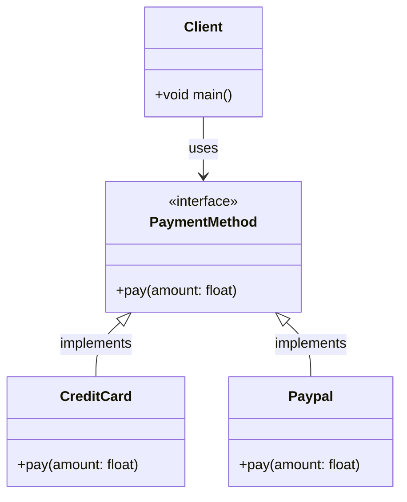
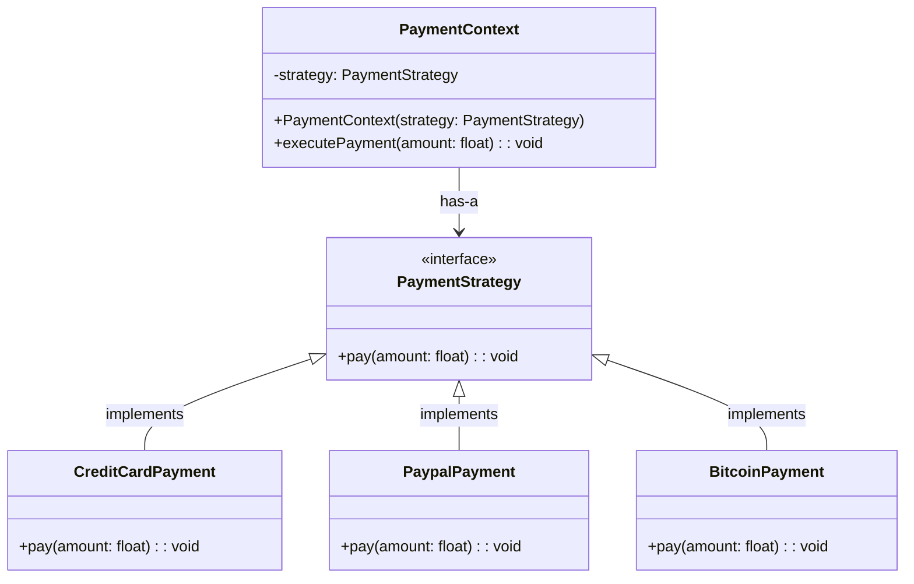

# Strategy

## Khái Niệm

**Strategy Pattern**, trong lĩnh vực phát triển phần mềm, là một mẫu thiết kế hành vi cho phép định nghĩa một nhóm các thuật toán, đóng gói từng thuật toán lại, và làm cho chúng có thể hoán đổi cho nhau. Strategy cho phép thuật toán biến đổi độc lập với các khách hàng sử dụng nó. Điều này giúp tăng cường tính mô-đun và tái sử dụng của mã, bởi vì nó tách rời việc triển khai của các thuật toán từ các lớp sử dụng chúng.

### Tổng quan

- **Định Nghĩa của Pattern:** Strategy Pattern bao gồm các lớp 'Context' (ngữ cảnh sử dụng), 'Strategy' (các chiến lược hoặc thuật toán cụ thể), và một giao diện 'Strategy' mà tất cả các chiến lược cụ thể đều thực hiện. 'Context' giữ một tham chiếu đến một 'Strategy' và giao tiếp với đối tượng 'Strategy' này thay vì thực hiện trực tiếp một thuật toán cụ thể.

- **Mục Đích:** Mục đích của Strategy Pattern là cung cấp một cách để định cấu hình một lớp với một trong nhiều hành vi, hoặc thay đổi hành vi tại thời điểm chạy. Điều này giúp loại bỏ các câu lệnh điều kiện trong mã và thay thế chúng bằng việc chọn đối tượng chiến lược phù hợp. Cách tiếp cận này giúp mã nguồn dễ dàng mở rộng và bảo trì hơn.

- **Ý Tưởng Cốt Lõi:** Ý tưởng cốt lõi của Strategy Pattern là "đóng gói thuật toán". Bằng cách sử dụng các đối tượng 'Strategy' để đại diện cho các thuật toán khác nhau và cho phép 'Context' thay đổi chiến lược của mình, ứng dụng có thể thay đổi hành vi một cách linh hoạt mà không ảnh hưởng đến các lớp khách hàng. Điều này giúp mã nguồn trở nên linh hoạt hơn, dễ hiểu và dễ bảo trì.

### Đặt vấn đề

Trong lập trình hướng đối tượng, các ứng dụng thường phải đối mặt với những thách thức liên quan đến việc lựa chọn hành vi thích hợp trong thời gian chạy. Một ví dụ điển hình là việc xử lý các chiến lược thanh toán khác nhau trong một hệ thống thương mại điện tử. Khi không sử dụng Strategy Pattern, việc thêm hoặc thay đổi các phương thức thanh toán có thể yêu cầu sửa đổi lớn trong mã nguồn, dẫn đến việc vi phạm nguyên tắc Mở - Đóng (Open-Closed Principle), làm tăng sự phức tạp và khó khăn trong việc bảo trì.

### Giải pháp

Strategy Pattern cung cấp một giải pháp cho vấn đề trên bằng cách định nghĩa một tập hợp các thuật toán, mỗi thuật toán được đóng gói trong một lớp riêng biệt với một interface chung. Điều này cho phép thuật toán có thể thay đổi độc lập với các client sử dụng nó. Trong ví dụ về hệ thống thanh toán, các chiến lược thanh toán khác nhau như Credit Card, PayPal, hoặc Bitcoin có thể được thực hiện như các lớp riêng biệt, giúp việc thêm hoặc sửa đổi các phương thức thanh toán trở nên dễ dàng và linh hoạt hơn.
 
Việc sử dụng Strategy Pattern giúp tăng cường tính mô đun hóa và tái sử dụng của mã. Nó cũng giúp giảm sự phụ thuộc giữa các lớp và tăng tính linh hoạt cho ứng dụng. Ngoài ra, pattern cũng giúp ứng dụng tuân thủ nguyên tắc Open-Closed, giúp dễ dàng mở rộng mà không cần sửa đổi mã nguồn hiện có.

Mặc dù Strategy Pattern mang lại nhiều lợi ích, nhưng việc sử dụng nó cũng có thể dẫn đến một số sự thỏa hiệp. Ví dụ, nó có thể gây ra sự phức tạp ban đầu khi cần phải thiết kế và triển khai các interface và lớp cụ thể. Ngoài ra, nếu có quá nhiều chiến lược, việc quản lý chúng có thể trở nên khó khăn.

## Cấu trúc

Các thành phần chính trong Strategy Pattern:

- Strategy: interface chung cho các thuật toán.

- ConcreteStrategy: các lớp triển khai cụ thể các thuật toán.

- Context: lớp sử dụng các thuật toán thông qua Strategy.

## Cách triển khai

Để triển khai Strategy Pattern trong Java, chúng ta có thể:

- Định nghĩa một interface chung cho Strategy.

- Các ConcreteStrategy triển khai interface đó.

- Context sẽ có một tham chiếu tới Strategy và sử dụng nó.

## Ví dụ

// Ví dụ minh họa Strategy Pattern áp dụng cho cách di chuyển của nhân vật

## So sánh với các Pattern

So với State, Strategy tập trung vào việc thay đổi riêng lẻ một thuật toán cụ thể, còn State tập trung vào việc thay đổi toàn bộ hành vi dựa trên trạng thái.

## Kết luận

Strategy Pattern giúp tách biệt các thuật toán riêng lẻ thành các lớp độc lập, dễ dàng thay đổi và mở rộng. Tuy nhiên cũng cần tránh lạm dụng dẫn đến phức tạp code.