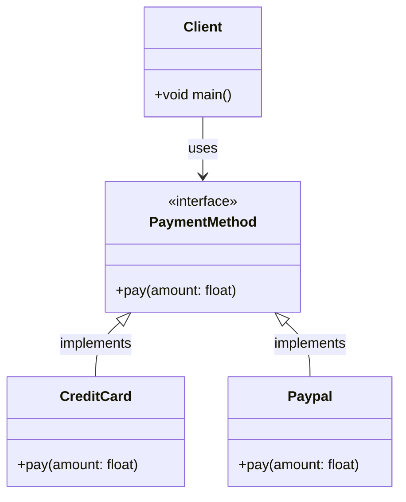
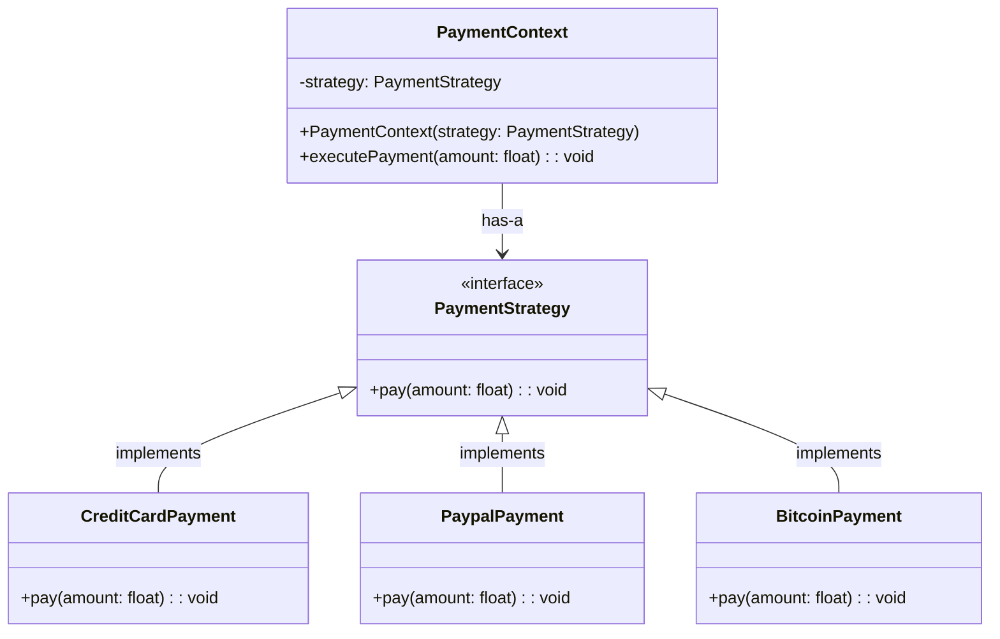
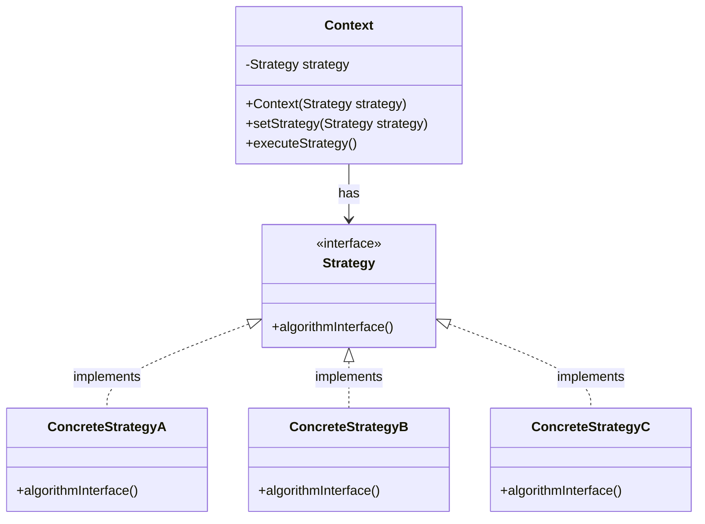

# Strategy

## Khái Niệm

**Strategy Pattern**, trong lĩnh vực phát triển phần mềm, là một mẫu thiết kế hành vi cho phép định nghĩa một nhóm các thuật toán, đóng gói từng thuật toán lại, và làm cho chúng có thể hoán đổi cho nhau. Strategy cho phép thuật toán biến đổi độc lập với các khách hàng sử dụng nó. Điều này giúp tăng cường tính mô-đun và tái sử dụng của mã, bởi vì nó tách rời việc triển khai của các thuật toán từ các lớp sử dụng chúng.

### Tổng quan

- **Định Nghĩa của Pattern:** Strategy Pattern bao gồm các lớp 'Context' (ngữ cảnh sử dụng), 'Strategy' (các chiến lược hoặc thuật toán cụ thể), và một giao diện 'Strategy' mà tất cả các chiến lược cụ thể đều thực hiện. 'Context' giữ một tham chiếu đến một 'Strategy' và giao tiếp với đối tượng 'Strategy' này thay vì thực hiện trực tiếp một thuật toán cụ thể.

- **Mục Đích:** Mục đích của Strategy Pattern là cung cấp một cách để định cấu hình một lớp với một trong nhiều hành vi, hoặc thay đổi hành vi tại thời điểm chạy. Điều này giúp loại bỏ các câu lệnh điều kiện trong mã và thay thế chúng bằng việc chọn đối tượng chiến lược phù hợp. Cách tiếp cận này giúp mã nguồn dễ dàng mở rộng và bảo trì hơn.

- **Ý Tưởng Cốt Lõi:** Ý tưởng cốt lõi của Strategy Pattern là "đóng gói thuật toán". Bằng cách sử dụng các đối tượng 'Strategy' để đại diện cho các thuật toán khác nhau và cho phép 'Context' thay đổi chiến lược của mình, ứng dụng có thể thay đổi hành vi một cách linh hoạt mà không ảnh hưởng đến các lớp khách hàng. Điều này giúp mã nguồn trở nên linh hoạt hơn, dễ hiểu và dễ bảo trì.

### Đặt vấn đề

Trong lập trình hướng đối tượng, các ứng dụng thường phải đối mặt với những thách thức liên quan đến việc lựa chọn hành vi thích hợp trong thời gian chạy. Một ví dụ điển hình là việc xử lý các chiến lược thanh toán khác nhau trong một hệ thống thương mại điện tử. Khi không sử dụng Strategy Pattern, việc thêm hoặc thay đổi các phương thức thanh toán có thể yêu cầu sửa đổi lớn trong mã nguồn, dẫn đến việc vi phạm nguyên tắc Mở - Đóng (Open-Closed Principle), làm tăng sự phức tạp và khó khăn trong việc bảo trì.



### Giải pháp

Strategy Pattern cung cấp một giải pháp cho vấn đề trên bằng cách định nghĩa một tập hợp các thuật toán, mỗi thuật toán được đóng gói trong một lớp riêng biệt với một interface chung. Điều này cho phép thuật toán có thể thay đổi độc lập với các client sử dụng nó. Trong ví dụ về hệ thống thanh toán, các chiến lược thanh toán khác nhau như Credit Card, PayPal, hoặc Bitcoin có thể được thực hiện như các lớp riêng biệt, giúp việc thêm hoặc sửa đổi các phương thức thanh toán trở nên dễ dàng và linh hoạt hơn.
 
Việc sử dụng Strategy Pattern giúp tăng cường tính mô đun hóa và tái sử dụng của mã. Nó cũng giúp giảm sự phụ thuộc giữa các lớp và tăng tính linh hoạt cho ứng dụng. Ngoài ra, pattern cũng giúp ứng dụng tuân thủ nguyên tắc Open-Closed, giúp dễ dàng mở rộng mà không cần sửa đổi mã nguồn hiện có.

Mặc dù Strategy Pattern mang lại nhiều lợi ích, nhưng việc sử dụng nó cũng có thể dẫn đến một số sự thỏa hiệp. Ví dụ, nó có thể gây ra sự phức tạp ban đầu khi cần phải thiết kế và triển khai các interface và lớp cụ thể. Ngoài ra, nếu có quá nhiều chiến lược, việc quản lý chúng có thể trở nên khó khăn.



## Cấu trúc của Strategy Pattern



- `Context` là lớp môi trường, nó chứa một tham chiếu đến một đối tượng `Strategy`. `Context` có thể thay đổi chiến lược tại thời điểm chạy (runtime).
- `Strategy` là một interface hoặc lớp trừu tượng định nghĩa một nhóm các thuật toán liên quan hoặc hành vi cụ thể. Trong mô hình chiến lược, các thuật toán này đều được đóng gói và hoán đổi cho nhau một cách linh hoạt.
- `ConcreteStrategyA`, `ConcreteStrategyB`, và `ConcreteStrategyC` là các lớp triển khai cụ thể của interface `Strategy`. Mỗi một `ConcreteStrategy` triển khai một biến thể của một thuật toán hoặc một hành vi.

Mục đích của Strategy Pattern là cho phép thuật toán thay đổi độc lập với các client sử dụng thuật toán đó.

## Cách triển khai Strategy Pattern

Để triển khai Strategy Pattern, chúng ta sẽ cần các thành phần sau:

### 1. Strategy Interface

Đây là interface cho các chiến lược khác nhau trong context. Mỗi chiến lược sẽ cài đặt các hành động cụ thể.

```java
public interface Strategy {
    void executeStrategy();
}
```

### 2. Concrete Strategy Classes

Các lớp này cài đặt các hành động cụ thể cho một chiến lược cụ thể.

```java
public class ConcreteStrategyA implements Strategy {
    @Override
    public void executeStrategy() {
        System.out.println("Executing Strategy A");
    }
}

public class ConcreteStrategyB implements Strategy {
    @Override
    public void executeStrategy() {
        System.out.println("Executing Strategy B");
    }
}
```

### 3. Context

Lớp này duy trì một tham chiếu đến một đối tượng Strategy và cho phép Client thay đổi strategy.

```java
public class Context {
    private Strategy strategy;

    public Context(Strategy strategy) {
        this.strategy = strategy;
    }

    public void setStrategy(Strategy strategy) {
        this.strategy = strategy;
    }

    public void executeStrategy() {
        strategy.executeStrategy();
    }
}
```

### 4. Sử dụng Pattern

Đây là cách chúng ta có thể sử dụng Strategy Pattern trong một ứng dụng.

```java
public class StrategyPatternDemo {
    public static void main(String[] args) {
        Context context = new Context(new ConcreteStrategyA());

        // The context is using ConcreteStrategyA.
        context.executeStrategy(); // Executing Strategy A

        // Change strategy to ConcreteStrategyB
        context.setStrategy(new ConcreteStrategyB());

        // Now the context is using ConcreteStrategyB.
        context.executeStrategy(); // Executing Strategy B
    }
}
```

## Ví dụ

Dưới đây là một ví dụ minh họa cho việc sử dụng Strategy Pattern trong Java, được cấu trúc theo yêu cầu của bạn:

```java
import java.util.ArrayList;
import java.util.List;

// Strategy interface
interface PaymentStrategy {
    void pay(int amount);
}

// Concrete Strategies
class CreditCardStrategy implements PaymentStrategy {
    private String name;
    private String cardNumber;

    public CreditCardStrategy(String nm, String ccNum) {
        this.name = nm;
        this.cardNumber = ccNum;
    }

    @Override
    public void pay(int amount) {
        System.out.println(amount + " paid with credit/debit card.");
    }
}

class PaypalStrategy implements PaymentStrategy {
    private String emailId;
    private String password;

    public PaypalStrategy(String email, String pwd) {
        this.emailId = email;
        this.password = pwd;
    }

    @Override
    public void pay(int amount) {
        System.out.println(amount + " paid using Paypal.");
    }
}

// Context class
class ShoppingCart {
    List<Item> items;
    PaymentStrategy paymentStrategy;

    public ShoppingCart() {
        this.items = new ArrayList<>();
    }

    public void addItem(Item item) {
        this.items.add(item);
    }

    public void removeItem(Item item) {
        this.items.remove(item);
    }

    public int calculateTotal() {
        int sum = 0;
        for (Item item : items) {
            sum += item.getPrice();
        }
        return sum;
    }

    public void setPaymentStrategy(PaymentStrategy strategy) {
        this.paymentStrategy = strategy;
    }

    public void checkout() {
        int amount = calculateTotal();
        paymentStrategy.pay(amount);
    }
}

// Item class
class Item {
    private String upcCode;
    private int price;

    public Item(String upc, int cost) {
        this.upcCode = upc;
        this.price = cost;
    }

    public int getPrice() {
        return this.price;
    }
}

// StrategyPatternDemo class
public class StrategyPatternDemo {
    public static void main(String[] args) {
        ShoppingCart cart = new ShoppingCart();

        Item item1 = new Item("1234", 10);
        Item item2 = new Item("5678", 40);

        cart.addItem(item1);
        cart.addItem(item2);

        // Pay by PayPal
        cart.setPaymentStrategy(new PaypalStrategy("myemail@example.com", "mypwd"));
        cart.checkout();

        // Pay by Credit Card
        cart.setPaymentStrategy(new CreditCardStrategy("John Doe", "1234567890123456"));
        cart.checkout();
    }
}
```

Trong ví dụ này, `ShoppingCart` đại diện cho Context class, nó chứa một Strategy (`PaymentStrategy`), và các Strategies cụ thể (`CreditCardStrategy`, `PaypalStrategy`) định nghĩa cách thức thanh toán khác nhau. `ShoppingCart` có thể thay đổi Strategy của nó tùy ý để sử dụng phương thức thanh toán khác nhau mà không cần sửa đổi mã nguồn của chính nó.

## Khi nào nên sử dụng Strategy Pattern

- **Khi bạn muốn thay đổi hành vi của một đối tượng tại thời gian chạy**: Strategy Pattern là lựa chọn lý tưởng khi bạn cần thay đổi hành vi của một đối tượng tại thời điểm chạy mà không làm thay đổi cấu trúc của lớp. Việc sử dụng các chiến lược khác nhau giúp bạn dễ dàng chuyển đổi giữa các thuật toán hoặc công việc mà đối tượng cần thực hiện.

- **Khi có nhiều biến thể của một hành vi**: Nếu bạn có nhiều phiên bản khác nhau của một hành vi cụ thể, sử dụng Strategy Pattern giúp bạn tách rời chúng thành các lớp riêng biệt, mỗi lớp thực thi một phiên bản của hành vi. Điều này làm cho mã nguồn dễ quản lý và mở rộng hơn.

- **Khi bạn muốn tránh việc sử dụng nhiều điều kiện**: Thay vì sử dụng câu lệnh điều kiện để chọn hành vi, Strategy Pattern cho phép bạn loại bỏ cấu trúc điều kiện bằng cách đóng gói hành vi trong các lớp riêng biệt. Điều này giúp mã nguồn dễ đọc và dễ bảo trì hơn.

- **Khi cần mô-đun hóa các thuật toán**: Nếu bạn cần mô-đun hóa các thuật toán hoặc hành vi để chúng có thể dễ dàng thay thế hoặc mở rộng, Strategy Pattern cung cấp một cấu trúc tốt để thực hiện điều này. Bằng cách đóng gói mỗi thuật toán vào một lớp riêng, bạn có thể thay thế hoặc thêm các chiến lược mới mà không ảnh hưởng đến các lớp sử dụng chúng.

- **Khi bạn muốn che giấu sự phức tạp của các thuật toán**: Strategy Pattern cũng hữu ích khi bạn muốn ẩn đi sự phức tạp của các thuật toán khỏi người dùng của chúng. Bằng cách cung cấp một giao diện chung cho các chiến lược khác nhau, bạn có thể làm cho mã nguồn sạch sẽ hơn và dễ hiểu hơn cho người khác sử dụng hoặc mở rộng.