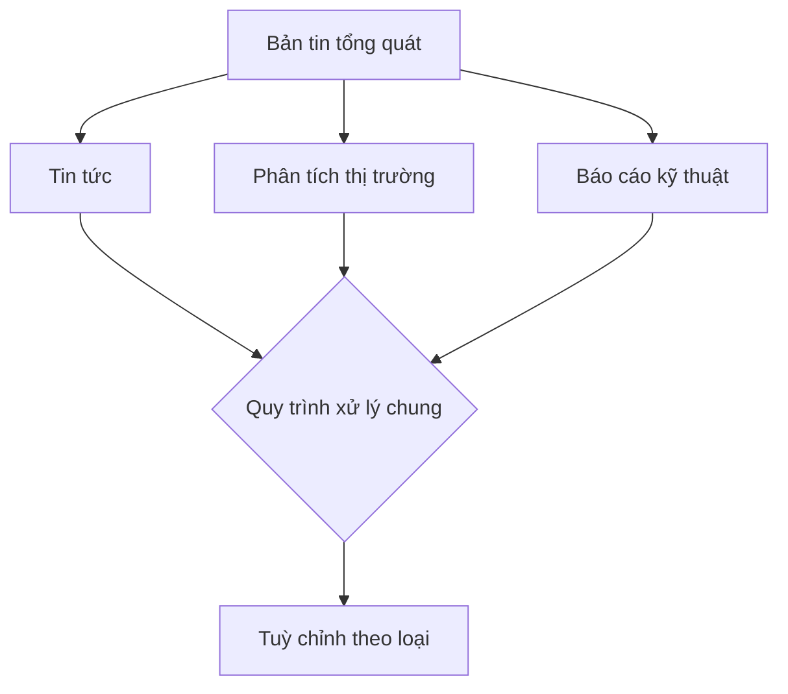

# Template Method

## Khái Niệm

**Template Pattern** là một mẫu thiết kế thuộc loại mẫu thiết kế hành vi (behavioral design pattern) trong phát triển phần mềm. Mẫu này hoạt động bằng cách xác định khung sườn của một thuật toán trong một phương thức, hoãn một số bước cho các lớp con. Template Pattern cho phép lớp con có thể thay đổi hoặc mở rộng các bước cụ thể của thuật toán mà không thay đổi cấu trúc tổng thể của thuật toán.

### Tổng quan

- **Định Nghĩa của Pattern:** Template Pattern bao gồm hai thành phần chính là một lớp trừu tượng chứa phương thức template và một hoặc nhiều lớp con thực thi các bước cụ thể của thuật toán. Phương thức template xác định các bước của một thuật toán và thứ tự chúng nên được thực hiện, trong khi các lớp con thì triển khai chi tiết của các bước đó.

- **Mục Đích:** Mục đích của Template Pattern là tạo ra một cấu trúc thuật toán trong một phương thức, hoãn một số bước lại cho các lớp con. Mẫu này giúp tái sử dụng mã nguồn và tránh sự trùng lặp, đồng thời cung cấp một cách để các lớp con có thể mở rộng một số phần cụ thể của thuật toán mà không làm thay đổi cấu trúc thuật toán chính.

- **Ý Tưởng Cốt Lõi:** Ý tưởng cốt lõi của Template Pattern là "Inversion of Control", tức là đảo ngược quyền kiểm soát. Thay vì lớp con gọi phương thức từ lớp cơ sở, trong Template Pattern, lớp cơ sở gọi phương thức từ lớp con, điều này được thực hiện qua cách triển khai các phương thức trừu tượng trong lớp cơ sở. Điều này giúp định nghĩa khung của thuật toán trong lớp cơ sở nhưng để các lớp con xác định một số phần cụ thể.

### Đặt vấn đề

Trong nhiều ứng dụng phần mềm, các lớp khác nhau thường có những phần xử lý giống nhau, nhưng cũng có một số bước thực thi cần được tuỳ chỉnh theo từng ngữ cảnh cụ thể. Điều này dẫn đến việc lặp lại mã nguồn, làm tăng độ phức tạp và khó khăn trong việc bảo trì. Ví dụ, trong một ứng dụng về xử lý bản tin, các loại bản tin khác nhau như tin tức, phân tích thị trường, và báo cáo kỹ thuật có thể cần đến một quy trình xử lý tương tự nhưng với một số bước đặc biệt tuỳ chỉnh cho từng loại.




### Giải pháp

Template Method Pattern giải quyết vấn đề trên bằng cách xác định khung của một thuật toán trong một phương thức, chừa lại các bước cụ thể để được ghi đè trong các lớp con. Điều này cho phép các lớp con mở rộng các bước cụ thể mà không cần thay đổi cấu trúc của thuật toán. Trong ví dụ về bản tin, có thể tạo một lớp trừu tượng với các phương thức cố định và các phương thức trừu tượng tương ứng với các bước tuỳ chỉnh.

Việc áp dụng Template Method Pattern giúp giảm bớt sự trùng lặp mã nguồn và tăng tính tái sử dụng. Nó cũng giúp tập trung quản lý quy trình xử lý, đồng thời cung cấp khuôn mẫu cho các phần tuỳ chỉnh, làm cho mã nguồn dễ hiểu và bảo trì hơn.

Mặc dù Template Method Pattern giúp giảm sự lặp code và tăng tính mô-đun, nhưng nó cũng có thể dẫn đến một cấu trúc lớp phức tạp hơn và ít linh hoạt hơn do cơ chế kế thừa. Ngoài ra, việc sử dụng quá mức có thể làm giảm sự minh bạch và khả năng hiểu mã nguồn cho những người mới làm quen.

```mermaid
graph TD;
    A[AbstractClass] -->|define| B[TemplateMethod()]
    A -->|implements| C[PrimitiveOperation1()]
    A -->|implements| D[PrimitiveOperation2()]
    E[ConcreteClass] -->|extends| A
    E -->|override| C
    E -->|override| D
```

Trong sơ đồ này, `AbstractClass` xác định khung của thuật toán trong `TemplateMethod()`, trong khi `ConcreteClass` mở rộng và tuỳ chỉnh các bước cụ thể thông qua `PrimitiveOperation1()` và `PrimitiveOperation2()`.

## Cấu trúc

Các thành phần chính trong Template Method Pattern:

- AbstractClass: định nghĩa template method và các phương thức trừu tượng.

- ConcreteClass: cài đặt lại các phương thức trừu tượng.

## Cách triển khai

Để triển khai Template Method trong Java, chúng ta có thể:

- Tạo một abstract class khai báo các phương thức trừu tượng.

- Cài đặt một template method sử dụng các phương thức trừu tượng đó.

- Các lớp con sẽ cài đặt lại các phương thức trừu tượng.

## Ví dụ

// Ví dụ Template Method áp dụng cho export dữ liệu có định dạng khác nhau

## So sánh với các Pattern

So với Strategy, Template Method định nghĩa bố cục của thuật toán và gọi các phương thức trừu tượng. Strategy định nghĩa riêng các thuật toán có thể hoán đổi cho nhau.

## Kết luận

Template Method giúp tái sử dụng code và tránh lặp lại phần khung của thuật toán giữa các lớp. Tuy nhiên cần cân nhắc khi sử dụng để tránh phức tạp hóa code.
