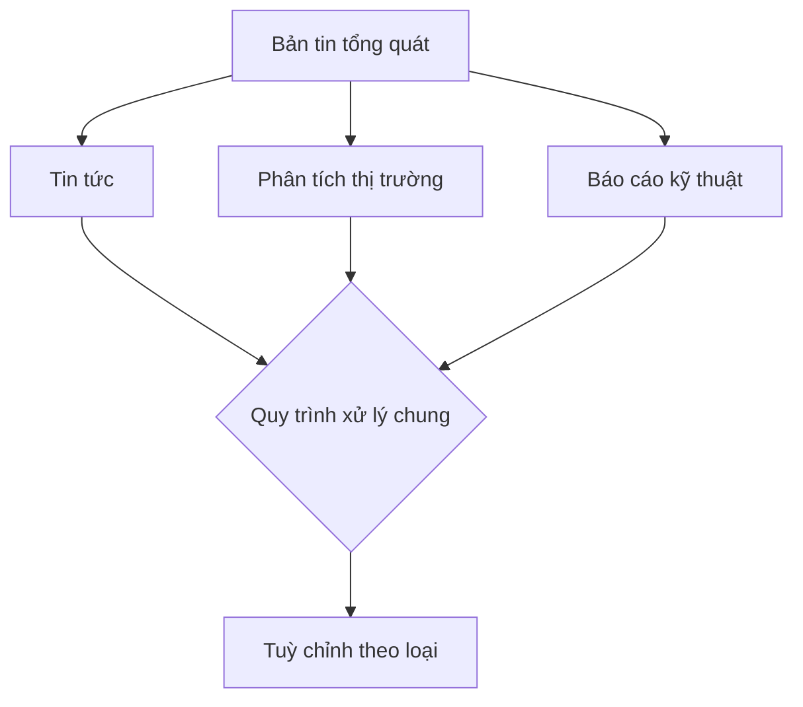
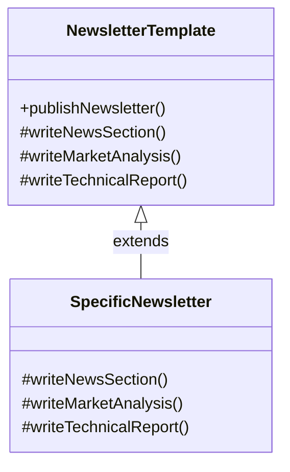
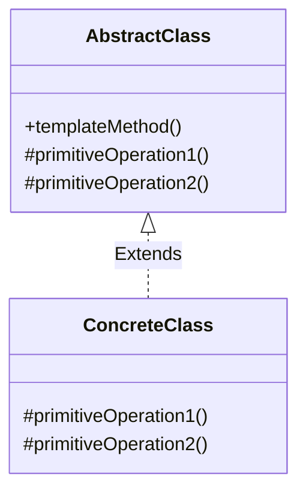

# Template Method

## Khái Niệm

**Template Pattern** là một mẫu thiết kế thuộc loại mẫu thiết kế hành vi (behavioral design pattern) trong phát triển phần mềm. Mẫu này hoạt động bằng cách xác định khung sườn của một thuật toán trong một phương thức, hoãn một số bước cho các lớp con. Template Pattern cho phép lớp con có thể thay đổi hoặc mở rộng các bước cụ thể của thuật toán mà không thay đổi cấu trúc tổng thể của thuật toán.

### Tổng quan

- **Định Nghĩa của Pattern:** Template Pattern bao gồm hai thành phần chính là một lớp trừu tượng chứa phương thức template và một hoặc nhiều lớp con thực thi các bước cụ thể của thuật toán. Phương thức template xác định các bước của một thuật toán và thứ tự chúng nên được thực hiện, trong khi các lớp con thì triển khai chi tiết của các bước đó.

- **Mục Đích:** Mục đích của Template Pattern là tạo ra một cấu trúc thuật toán trong một phương thức, hoãn một số bước lại cho các lớp con. Mẫu này giúp tái sử dụng mã nguồn và tránh sự trùng lặp, đồng thời cung cấp một cách để các lớp con có thể mở rộng một số phần cụ thể của thuật toán mà không làm thay đổi cấu trúc thuật toán chính.

- **Ý Tưởng Cốt Lõi:** Ý tưởng cốt lõi của Template Pattern là "Inversion of Control", tức là đảo ngược quyền kiểm soát. Thay vì lớp con gọi phương thức từ lớp cơ sở, trong Template Pattern, lớp cơ sở gọi phương thức từ lớp con, điều này được thực hiện qua cách triển khai các phương thức trừu tượng trong lớp cơ sở. Điều này giúp định nghĩa khung của thuật toán trong lớp cơ sở nhưng để các lớp con xác định một số phần cụ thể.

### Đặt vấn đề

Trong nhiều ứng dụng phần mềm, các lớp khác nhau thường có những phần xử lý giống nhau, nhưng cũng có một số bước thực thi cần được tuỳ chỉnh theo từng ngữ cảnh cụ thể. Điều này dẫn đến việc lặp lại mã nguồn, làm tăng độ phức tạp và khó khăn trong việc bảo trì. Ví dụ, trong một ứng dụng về xử lý bản tin, các loại bản tin khác nhau như tin tức, phân tích thị trường, và báo cáo kỹ thuật có thể cần đến một quy trình xử lý tương tự nhưng với một số bước đặc biệt tuỳ chỉnh cho từng loại.




### Giải pháp

Template Method Pattern giải quyết vấn đề trên bằng cách xác định khung của một thuật toán trong một phương thức, chừa lại các bước cụ thể để được ghi đè trong các lớp con. Điều này cho phép các lớp con mở rộng các bước cụ thể mà không cần thay đổi cấu trúc của thuật toán. Trong ví dụ về bản tin, có thể tạo một lớp trừu tượng với các phương thức cố định và các phương thức trừu tượng tương ứng với các bước tuỳ chỉnh.

Việc áp dụng Template Method Pattern giúp giảm bớt sự trùng lặp mã nguồn và tăng tính tái sử dụng. Nó cũng giúp tập trung quản lý quy trình xử lý, đồng thời cung cấp khuôn mẫu cho các phần tuỳ chỉnh, làm cho mã nguồn dễ hiểu và bảo trì hơn.

Mặc dù Template Method Pattern giúp giảm sự lặp code và tăng tính mô-đun, nhưng nó cũng có thể dẫn đến một cấu trúc lớp phức tạp hơn và ít linh hoạt hơn do cơ chế kế thừa. Ngoài ra, việc sử dụng quá mức có thể làm giảm sự minh bạch và khả năng hiểu mã nguồn cho những người mới làm quen.



- `NewsletterTemplate` tương ứng với "Bản tin tổng quát" từ sơ đồ vấn đề. Nó định nghĩa phương thức `publishNewsletter()` (tương ứng với "Quy trình xử lý chung" trong sơ đồ vấn đề), mà bên trong sẽ gọi các phương thức `writeNewsSection()`, `writeMarketAnalysis()`, và `writeTechnicalReport()`. Các phương thức này tương ứng với "Tin tức", "Phân tích thị trường", và "Báo cáo kỹ thuật" trong sơ đồ vấn đề và được định nghĩa là trừu tượng trong lớp này để các lớp con cần phải cung cấp cài đặt cụ thể cho chúng.

- `SpecificNewsletter` tương ứng với "Tuỳ chỉnh theo loại" trong sơ đồ vấn đề. Lớp này kế thừa từ `NewsletterTemplate` và cung cấp các triển khai cụ thể cho các phương thức `writeNewsSection()`, `writeMarketAnalysis()`, và `writeTechnicalReport()`, tùy chỉnh nội dung cụ thể của các phần này cho loại bản tin cụ thể.

## Cấu trúc của Template Method Pattern



- `AbstractClass` là một lớp trừu tượng chứa phương thức `templateMethod()`. Phương thức này thường được định nghĩa là `final` để ngăn chặn việc ghi đè, và nó gọi các phương thức trừu tượng (hoặc hook methods) khác như `primitiveOperation1()` và `primitiveOperation2()`, mà các lớp con sẽ cung cấp định nghĩa cụ thể.
- `ConcreteClass` là lớp cụ thể kế thừa từ `AbstractClass` và triển khai các phương thức trừu tượng như `primitiveOperation1()` và `primitiveOperation2()`.

Mục đích của Template Method Pattern là để xác định khung của một thuật toán trong một phương thức, trì hoãn một số bước đến các lớp con. Template Method cho phép lớp con ghi đè và mở rộng cấu trúc mà không thay đổi cấu trúc tổng thể của thuật toán.

## Cách triển khai Template Method Pattern

### 1. Abstract Class

Đây là lớp trừu tượng định nghĩa phương thức template. Phương thức này chứa một loạt các bước, một số trong đó có thể được triển khai ở lớp này hoặc bị hoãn lại để các lớp con triển khai.

```java
public abstract class Game {
    abstract void initialize();
    abstract void startPlay();
    abstract void endPlay();

    // Template method
    public final void play(){
        // Initialize the game
        initialize();

        // Start game
        startPlay();

        // End game
        endPlay();
    }
}
```

### 2. Concrete Classes

Các lớp này triển khai các phần của phương thức template cần được tùy chỉnh.

```java
public class Cricket extends Game {
    @Override
    void initialize() {
        System.out.println("Cricket Game Initialized! Start playing.");
    }

    @Override
    void startPlay() {
        System.out.println("Cricket Game Started. Enjoy the game!");
    }

    @Override
    void endPlay() {
        System.out.println("Cricket Game Finished!");
    }
}

public class Football extends Game {
    @Override
    void initialize() {
        System.out.println("Football Game Initialized! Start playing.");
    }

    @Override
    void startPlay() {
        System.out.println("Football Game Started. Enjoy the game!");
    }

    @Override
    void endPlay() {
        System.out.println("Football Game Finished!");
    }
}
```

### 3. Sử dụng Pattern

Đây là cách chúng ta có thể sử dụng Template Method Pattern trong một ứng dụng.

```java
public class TemplatePatternDemo {
    public static void main(String[] args) {

        Game game = new Cricket();
        game.play();
        System.out.println();

        game = new Football();
        game.play();
    }
}
```

Trong ví dụ trên, `Cricket` và `Football` là các lớp con của `Game` và chúng triển khai theo phương thức template được định nghĩa trong lớp trừu tượng `Game`. Phương thức `play()` là phương thức template và nó gọi đến ba phương thức khác mà các lớp con phải cung cấp cài đặt.

## Ví dụ

Trong ví dụ này, `Game` đại diện cho AbstractClass, nó chứa một số phương thức abstract (`initialize()`, `startPlay()`, `endPlay()`) và một phương thức Template (`play()`), tự động gọi tất cả các phương thức khác theo đúng trình tự. `Cricket` và `Football` là các ConcreteClass, chúng cung cấp cài đặt cụ thể cho các phương thức trừu tượng của `Game`. Khi `play()` được gọi, nó thực hiện quy trình trò chơi từ đầu đến cuối, từ khởi tạo đến bắt đầu chơi và cuối cùng là kết thúc trò chơi, cho phép các lớp con chỉ định các bước cụ thể mà không thay đổi cấu trúc tổng thể.

```java
// AbstractClass
abstract class Game {
    abstract void initialize();
    abstract void startPlay();
    abstract void endPlay();

    // Template method
    public final void play() {
        // Initialize the game
        initialize();

        // Start game
        startPlay();

        // End game
        endPlay();
    }
}

// ConcreteClass
class Cricket extends Game {
    @Override
    void initialize() {
        System.out.println("Cricket Game Initialized! Start playing.");
    }

    @Override
    void startPlay() {
        System.out.println("Cricket Game Started. Enjoy the game!");
    }

    @Override
    void endPlay() {
        System.out.println("Cricket Game Finished!");
    }
}

// ConcreteClass
class Football extends Game {
    @Override
    void initialize() {
        System.out.println("Football Game Initialized! Start playing.");
    }

    @Override
    void startPlay() {
        System.out.println("Football Game Started. Enjoy the game!");
    }

    @Override
    void endPlay() {
        System.out.println("Football Game Finished!");
    }
}

// TemplatePatternDemo class
public class TemplatePatternDemo {
    public static void main(String[] args) {

        Game game = new Cricket();
        game.play();
        System.out.println();

        game = new Football();
        game.play();
    }
}
```

## Khi nào nên sử dụng Template Method

- **Khi bạn muốn cố định không gian của một thuật toán**: Template Method là một lựa chọn tốt khi bạn muốn xác định khung sườn của một thuật toán, để lại một số bước cụ thể có thể được ghi đè bởi các lớp con. Điều này giúp đảm bảo rằng cấu trúc tổng thể của thuật toán không thay đổi, trong khi vẫn cho phép sự linh hoạt trong việc thực hiện các bước cụ thể.

- **Khi các lớp con chỉ cần mở rộng một số bước nhất định của thuật toán**: Nếu bạn có một loạt các lớp con cần thực hiện cùng một thuật toán với chỉ một vài bước khác nhau, Template Method cho phép bạn đặt thuật toán cơ bản tại lớp cơ sở và để các lớp con triển khai hoặc thay đổi một số bước nhất định.

- **Khi bạn muốn tránh trùng lặp mã**: Sử dụng Template Method giúp giảm bớt việc sao chép mã nguồn giữa các lớp bằng cách chia sẻ mã nguồn chung trong một lớp cơ sở. Điều này giúp dễ dàng cập nhật và bảo trì mã nguồn, vì mọi thay đổi cần thiết chỉ cần thực hiện một lần ở lớp cơ sở.

- **Khi bạn muốn kiểm soát điểm mở rộng của lớp**: Template Method cung cấp một cách tốt để kiểm soát các điểm mở rộng trong lớp của bạn. Bằng cách xác định các phương thức 'hook' hoặc 'template', bạn có thể cho phép lớp con mở rộng chức năng mà không thay đổi cấu trúc thuật toán.

- **Khi bạn muốn áp dụng nguyên tắc Hollywood "Đừng gọi chúng tôi, chúng tôi sẽ gọi bạn"**: Điều này có nghĩa là thay vì cho phép lớp con gọi phương thức từ lớp cơ sở, lớp cơ sở sẽ gọi các phương thức được định nghĩa trong lớp con tại các thời điểm cụ thể. Điều này giúp kiểm soát quy trình xử lý và giảm sự phụ thuộc giữa lớp cơ sở và lớp con.