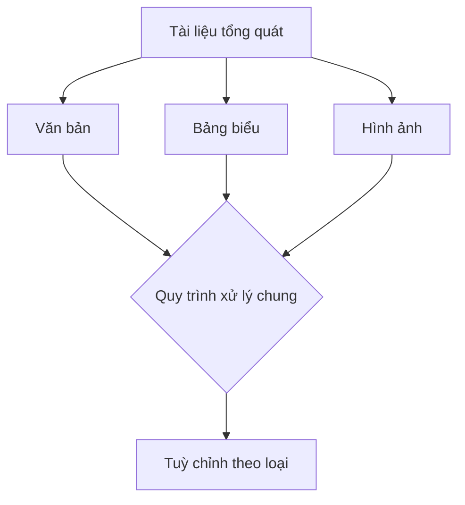
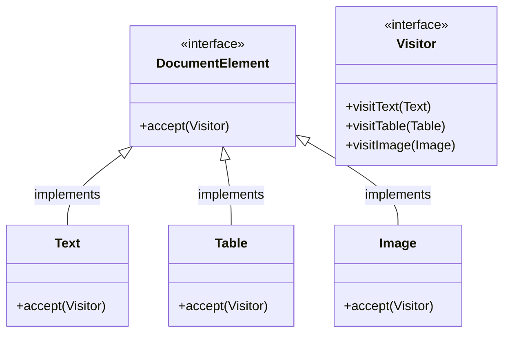
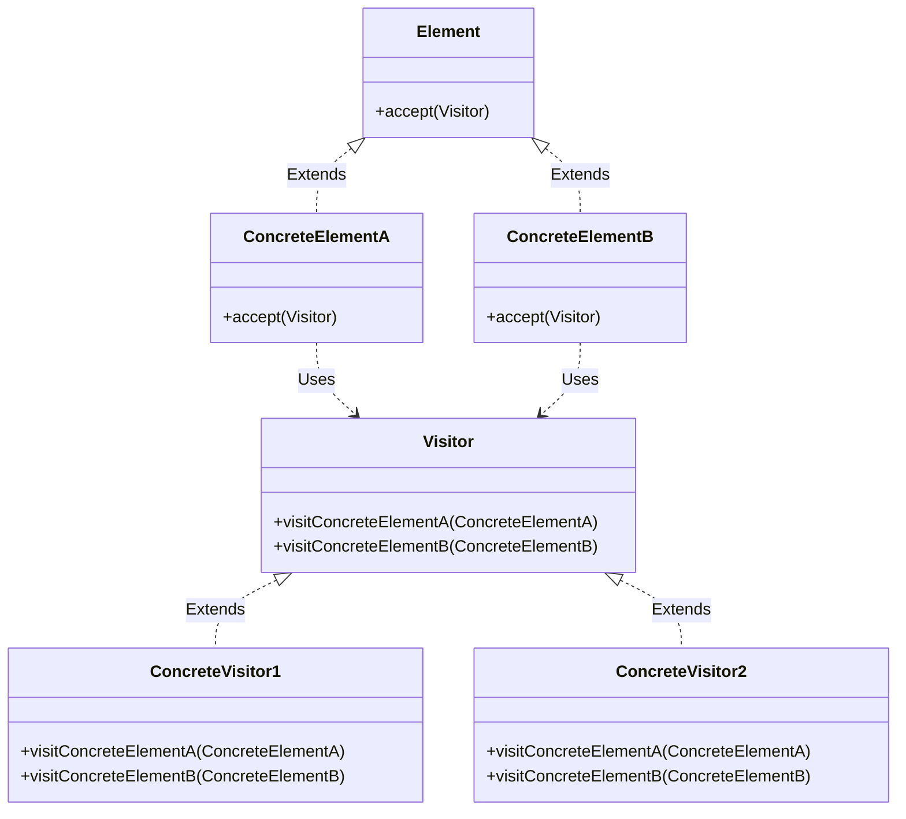

# Visitor

## Khái Niệm

**Visitor Pattern** là một mẫu thiết kế thuộc loại mẫu thiết kế hành vi (behavioral design pattern) trong phát triển phần mềm. Mẫu này giúp chúng ta tách biệt các phép toán khỏi đối tượng mà chúng hoạt động trên. Thông qua Visitor Pattern, chúng ta có thể thêm các chức năng mới mà không làm thay đổi các lớp của các đối tượng mà chúng tương tác.

### Tổng quan

- **Định Nghĩa của Pattern:** Visitor Pattern cho phép một hoặc nhiều đối tượng 'Visitor' định nghĩa một tập hợp các phép toán để áp dụng lên một tập các đối tượng 'Element' mà không làm thay đổi mã nguồn của những đối tượng này. Các 'Element' có một phương thức 'accept' mà nó nhận một 'Visitor' làm tham số. 'Visitor' này sau đó được áp dụng cho đối tượng 'Element'.

- **Mục Đích:** Mục đích chính của Visitor Pattern là cho phép thêm các hoạt động mới vào một tập hợp các lớp đối tượng mà không cần sửa đổi mã nguồn của chúng. Điều này giúp mã nguồn trở nên dễ dàng mở rộng hơn và giảm sự phụ thuộc giữa các chức năng và cấu trúc dữ liệu của đối tượng.

- **Ý Tưởng Cốt Lõi:** Ý tưởng cốt lõi của Visitor Pattern là tách biệt thuật toán từ các đối tượng mà nó hoạt động trên. Điều này cho phép chúng ta thêm các thuật toán mới mà không thay đổi định nghĩa của các đối tượng. Khi cần thực hiện một hoạt động trên một tập hợp các đối tượng, chúng ta có thể định nghĩa một đối tượng Visitor chứa hoạt động đó và sau đó cho phép các đối tượng đó chấp nhận Visitor, từ đó áp dụng hoạt động mà không làm thay đổi mã nguồn của chúng.

### Đặt vấn đề

Trong nhiều ứng dụng phần mềm, các lớp khác nhau thường phải thực hiện những nhiệm vụ tương tự nhưng với một số biến thể nhỏ dựa trên đặc điểm cụ thể của đối tượng. Khi một hệ thống được mở rộng để xử lý các loại đối tượng mới, việc thêm code mới vào các lớp hiện có có thể làm tăng sự phức tạp và giảm tính linh hoạt. Đặc biệt, trong các hệ thống xử lý nhiều đối tượng khác nhau, việc cập nhật và bảo trì mã nguồn trở nên khó khăn do sự chồng chéo và lặp lại code. Ví dụ, một ứng dụng phân tích tài liệu cần xử lý các loại tài liệu khác nhau như văn bản, bảng biểu và hình ảnh. Mặc dù các tài liệu này có thể chia sẻ một quy trình xử lý cơ bản, nhưng mỗi loại cần một số thao tác đặc biệt để phân tích hiệu quả.



### Giải pháp

Visitor Pattern giải quyết vấn đề này bằng cách cho phép thêm các thao tác mới vào một hệ thống đối tượng mà không cần sửa đổi cấu trúc của các lớp đối tượng. Pattern này sử dụng một lớp visitor mà có thể thực hiện một tập hợp các thao tác trên các đối tượng thuộc các lớp khác nhau mà không cần làm cho mã nguồn trở nên rối bời bởi logic dành riêng cho từng loại đối tượng. Trong ví dụ của ứng dụng phân tích tài liệu, có thể tạo các visitor khác nhau cho các thao tác như in, kiểm tra lỗi và phân tích sâu.

Khi áp dụng Visitor Pattern, cấu trúc của hệ thống trở nên rõ ràng và linh hoạt hơn, cho phép dễ dàng thêm vào hoặc sửa đổi các thao tác mà không làm ảnh hưởng đến các lớp đối tượng. Pattern này tách biệt được logic xử lý khỏi cấu trúc dữ liệu, từ đó làm giảm sự phụ thuộc giữa chúng và tăng khả năng tái sử dụng code.



Trong sơ đồ này, `DocumentElement` là một interface đại diện cho các loại phần tử của tài liệu mà có thể được "thăm" bởi các visitor. `Text`, `Table`, và `Image` là các lớp cụ thể biểu diễn các loại phần tử khác

## Cấu trúc của Visitor Pattern



- `Visitor` là một interface hoặc abstract class chứa một loạt các phương thức visit(), mỗi phương thức cho một loại element khác nhau.
- `ConcreteVisitor1` và `ConcreteVisitor2` là các lớp cụ thể triển khai interface `Visitor`, cung cấp cách thực hiện cụ thể cho mỗi phương thức visit().
- `Element` là một interface hoặc abstract class chứa phương thức accept(), trong đó tham số là một đối tượng Visitor.
- `ConcreteElementA` và `ConcreteElementB` là các lớp cụ thể triển khai `Element`, mỗi lớp cung cấp triển khai cụ thể cho phương thức accept(), thường là gọi phương thức visit() của Visitor và truyền chính nó như một đối số.

## Cách triển khai Visitor Pattern

Hãy tưởng tượng một ứng dụng Zoo, nơi bạn muốn thực hiện các hoạt động khác nhau đối với các loài động vật mà không cần thay đổi các lớp động vật. Ví dụ, bạn muốn thực hiện "Feeding" và "Exercising" cho các loài động vật khác nhau. Đây là một tình huống lý tưởng để sử dụng Visitor Pattern.

### 1. Interface Visitor

Đây là Visitor, định nghĩa các hoạt động (trong trường hợp này là Feeding và Exercising) cho mỗi loại động vật.

```java
public interface AnimalVisitor {
    void visit(Lion lion);
    void visit(Tiger tiger);
    void visit(Elephant elephant);
}
```

### 2. Interface Element

Đây là Element, mô tả các loài động vật trong zoo.

```java
public interface Animal {
    void accept(AnimalVisitor visitor);
}
```

### 3. Concrete Visitor Classes

Các lớp này triển khai `AnimalVisitor` để xác định cách thức thực hiện các hoạt động cho từng loài động vật.

```java
public class FeedingVisitor implements AnimalVisitor {
    @Override
    public void visit(Lion lion) {
        System.out.println("Feeding the lion with some meat.");
    }

    @Override
    public void visit(Tiger tiger) {
        System.out.println("Feeding the tiger with chicken.");
    }

    @Override
    public void visit(Elephant elephant) {
        System.out.println("Feeding the elephant with fruits and vegetables.");
    }
}

public class ExercisingVisitor implements AnimalVisitor {
    @Override
    public void visit(Lion lion) {
        System.out.println("Taking the lion for a run.");
    }

    @Override
    public void visit(Tiger tiger) {
        System.out.println("Making the tiger jump through hoops.");
    }

    @Override
    public void visit(Elephant elephant) {
        System.out.println("Walking the elephant around the zoo.");
    }
}
```

### 4. Concrete Element Classes

Các lớp động vật cụ thể, mỗi loài sẽ có cách tiếp nhận (accept) khách thăm (visitor) riêng.

```java
public class Lion implements Animal {
    @Override
    public void accept(AnimalVisitor visitor) {
        visitor.visit(this);
    }
}

public class Tiger implements Animal {
    @Override
    public void accept(AnimalVisitor visitor) {
        visitor.visit(this);
    }
}

public class Elephant implements Animal {
    @Override
    public void accept(AnimalVisitor visitor) {
        visitor.visit(this);
    }
}
```

### 5. Sử dụng Pattern

Đoạn mã sau đây mô tả cách các động vật được thăm bởi các visitor khác nhau để thực hiện các hoạt động như feeding và exercising.

```java
public class ZooVisitorDemo {
    public static void main(String[] args) {
        Animal[] animals = new Animal[]{new Lion(), new Tiger(), new Elephant()};

        AnimalVisitor feedingVisitor = new FeedingVisitor();
        AnimalVisitor exercisingVisitor = new ExercisingVisitor();

        System.out.println("Zoo Feeding Time:");
        for (Animal animal : animals) {
            animal.accept(feedingVisitor);
        }

        System.out.println("\nZoo Exercise Time:");
        for (Animal animal : animals) {
            animal.accept(exercisingVisitor);
        }
    }
}
```

Trong ví dụ này, `FeedingVisitor` và `ExercisingVisitor` đại diện cho các hoạt động cụ thể được thực hiện trên các loài động vật. Mỗi loài động vật (`Lion`, `Tiger`, `Elephant`) đều triển khai interface `Animal` và định nghĩa phương thức `accept()` để chấp nhận `AnimalVisitor`. Phần demo `ZooVisitorDemo` minh họa cách thức các `Animal` được "thăm" bởi các `AnimalVisitor` để thực hiện feeding và exercising mà không cần sửa đổi code trong các lớp `Animal`.

## Khi nào nên sử dụng Visitor Pattern

- **Khi bạn có cấu trúc đối tượng phức tạp**: Visitor Pattern là một lựa chọn tốt khi bạn đang làm việc với một cấu trúc đối tượng phức tạp, chẳng hạn như một cây đối tượng, và bạn muốn thực hiện các thao tác trên các đối tượng trong cấu trúc mà không làm thay đổi định nghĩa của chúng. Visitor cho phép bạn thêm chức năng mới mà không sửa đổi các lớp đối tượng.

- **Khi bạn cần thực hiện các thao tác qua nhiều đối tượng thuộc nhiều lớp khác nhau**: Nếu bạn cần thực hiện một loạt các thao tác trên một nhóm đối tượng khác nhau mà không muốn ô nhiễm mã của chúng với logic hoạt động, Visitor Pattern cung cấp một cách để tập trung logic hoạt động trong một đối tượng visitor duy nhất.

- **Khi bạn muốn tách biệt logic hoạt động khỏi cấu trúc đối tượng**: Visitor Pattern giúp tách biệt logic hoạt động khỏi cấu trúc đối tượng, giúp mã nguồn dễ quản lý và bảo trì hơn. Điều này đặc biệt hữu ích khi logic hoạt động hoặc cấu trúc đối tượng thay đổi thường xuyên.

- **Khi bạn muốn cung cấp một bộ các thao tác có thể áp dụng trên đối tượng mà không thay đổi cấu trúc đối tượng**: Visitor Pattern cho phép bạn định nghĩa một bộ các thao tác có thể áp dụng trên các đối tượng khác nhau. Điều này giúp tăng tính mô-đun và tái sử dụng của mã, vì bạn có thể thêm các thao tác mới mà không ảnh hưởng đến định nghĩa của đối tượng.

- **Khi bạn muốn thu thập thông tin qua nhiều đối tượng khác nhau mà không liên quan đến cấu trúc nội bộ của chúng**: Visitor Pattern cho phép bạn thực hiện các thao tác trên một nhóm đối tượng mà không cần biết đến cấu trúc nội bộ của chúng, điều này giúp giảm sự phụ thuộc và tăng tính bảo mật cho cấu trúc đối tượng.

- **Khi bạn cần đảm bảo rằng các thao tác khác nhau có thể được thực hiện mà không cần sửa đổi các đối tượng**: Visitor Pattern cung cấp một cách để bạn thêm các thao tác mới mà không cần sửa đổi mã nguồn của đối tượng, giúp hệ thống của bạn dễ dàng mở rộng và bảo trì.
