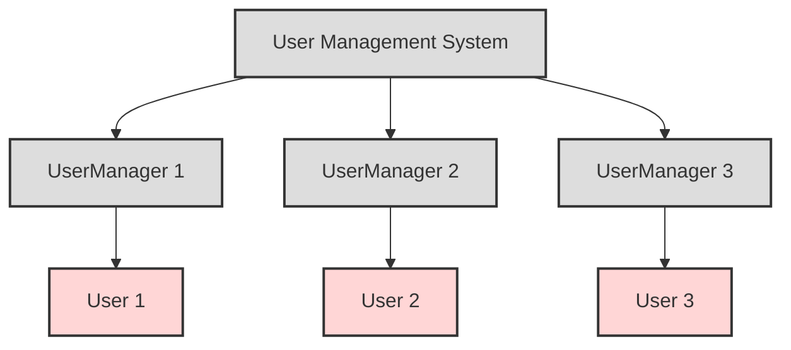
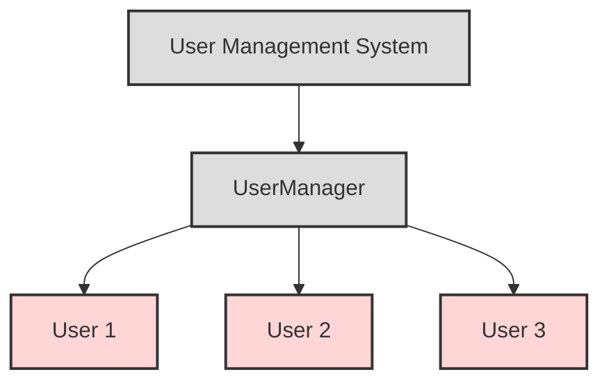
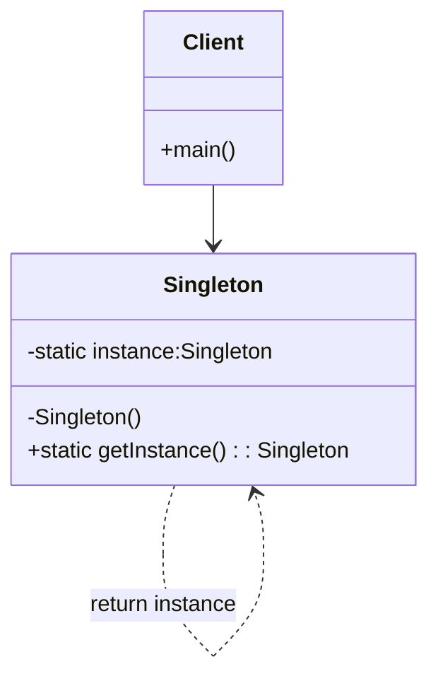

# Singleton

## Giới thiệu

Singleton là một Design Pattern thuộc nhóm Creational Design Pattern. Nó đảm bảo rằng chỉ duy nhất một đối tượng của lớp được tạo ra trong suốt quá trình chạy của một chương trình.

### Đặt vấn đề

Trong nhiều trường hợp, chúng ta cần đảm bảo rằng chỉ có một thể hiện duy nhất của một lớp được tạo ra. Ví dụ, trong một hệ thống quản lý người dùng, chúng ta cần đảm bảo rằng chỉ có một đối tượng UserManager được tạo ra, để quản lý tất cả người dùng trong hệ thống. Nếu không dùng Singleton rất có thể xảy ra trường hợp giống sơ đồ dưới đây.



Giải thích:

- Có nhiều đối tượng UserManager được tạo ra thay vì chỉ 1 đối tượng
- Mỗi UserManager kết nối với 1 nhóm người dùng riêng biệt
- Dữ liệu người dùng có thể bị trùng lặp giữa các UserManager
- Khó khăn trong việc kiểm soát và quản lý

Do đó, cần áp dụng Singleton pattern để chỉ cho phép tồn tại duy nhất một đối tượng UserManager.


### Giải quyết

Singleton Pattern giải quyết bằng cách chỉ tạo duy nhất một đối tượng. Singleton Pattern làm điều này bằng cách sử dụng các phương pháp sau:



Giải thích:

- Lớp UserManager được triển khai Singleton
- Chỉ có DUY NHẤT một đối tượng UserManager trong hệ thống
- Quản lý tất cả người dùng một cách tập trung
- Tránh được các vấn đề như dữ liệu trùng lặp, xung đột tài nguyên, khó kiểm soát

Với cách triển khai này, chỉ có một đối tượng UserManager duy nhất được tạo ra, và đối tượng này có thể được truy cập từ bất kỳ nơi nào trong chương trình.

### Cấu tạo

Singleton Pattern có cấu trúc đơn giản, bao gồm các thành phần sau:



- Lớp Singleton: Lớp này chứa các phương thức và biến cần thiết để triển khai Singleton Pattern.
- Phương thức khởi tạo private: Phương thức này chỉ có thể được gọi từ bên trong lớp.
- Biến static private: Biến này giữ đối tượng của lớp.
- Phương thức static public để trả về đối tượng của lớp: Phương thức này trả về đối tượng của lớp.


## Cách triển khai

Có nhiều cách để triển khai Singleton Pattern trong Java. Một cách phổ biến là sử dụng một biến static private để lưu trữ instance của class.

```java
public class Singleton {

    private static Singleton instance;

    private Singleton() {
        // Constructor is private to prevent direct instantiation
    }

    public static Singleton getInstance() {
        if (instance == null) {
            instance = new Singleton();
        }
        return instance;
    }
}
```

Cách triển khai này đảm bảo rằng chỉ có một instance của Singleton được tạo ra. Khi một đối tượng Singleton được yêu cầu, phương thức `getInstance()` sẽ kiểm tra xem instance đã tồn tại hay chưa. Nếu chưa, phương thức sẽ tạo ra một instance mới. Nếu đã tồn tại, phương thức sẽ trả về instance hiện tại.

Một cách triển khai khác của Singleton Pattern là sử dụng một biến static final private.

```java
public final class Singleton {

    private static final Singleton instance = new Singleton();

    private Singleton() {
        // Constructor is private to prevent direct instantiation
    }

    public static Singleton getInstance() {
        return instance;
    }
}
```

Cách triển khai này tương tự như cách triển khai đầu tiên, nhưng nó sử dụng một biến static final private thay vì một biến static private. Cách triển khai này có một số ưu điểm như sau:

- Sử dụng biến static final private sẽ ngăn chặn việc thay đổi giá trị của biến instance.
- Cấu trúc code sẽ gọn gàng hơn.


## Ví dụ minh họa

Dưới đây là một ví dụ minh họa cách sử dụng Singleton Pattern để tạo một đối tượng DatabaseConnection.

```java
public class DatabaseConnection {

    private static final DatabaseConnection instance = new DatabaseConnection();

    private DatabaseConnection() {
        // Connect to database
    }

    public static DatabaseConnection getInstance() {
        return instance;
    }

    public void query(String sql) {
        // Execute query
    }
}
```

Trong ví dụ này, DatabaseConnection là một class singleton. Nó có một phương thức getInstance() để truy cập instance duy nhất của class.

## So sánh

Singleton Pattern có thể được so sánh với một số Design Pattern tương tự, chẳng hạn như:

- Factory Pattern: Factory Pattern cung cấp một cách để tạo các đối tượng của lớp một cách linh hoạt. Tuy nhiên, Factory Pattern không đảm bảo rằng chỉ có một đối tượng của lớp được tạo ra.
- Prototype Pattern: Prototype Pattern cung cấp một cách để tạo các bản sao của đối tượng. Prototype Pattern cũng có thể được sử dụng để tạo một đối tượng duy nhất của lớp. Tuy nhiên, Prototype Pattern có thể phức tạp hơn Singleton Pattern.

## Lưu ý

Khi áp dụng Singleton Pattern, cần lưu ý một số điểm sau:

- Singleton Pattern có thể làm giảm tính linh hoạt của ứng dụng. Ví dụ, nếu bạn cần tạo ra nhiều instance của một class, bạn sẽ cần phải thay đổi code để xóa phương thức getInstance().
- Singleton Pattern có thể gây ra vấn đề khi test. Ví dụ, nếu bạn đang test một class sử dụng Singleton Pattern, bạn sẽ cần tạo ra một instance giả của class đó.


## Kết luận

Singleton Pattern là một Design Pattern hữu ích trong những trường hợp cần đảm bảo rằng chỉ có một thể hiện duy nhất của một lớp được tạo ra. Tuy nhiên, cần lưu ý những điểm hạn chế của Singleton Pattern khi áp dụng.

Dưới đây là một số hướng dẫn sử dụng Singleton Pattern:

- Nên sử dụng Singleton Pattern khi cần đảm bảo rằng chỉ có một thể hiện duy nhất của một lớp được tạo ra.
- Tránh sử dụng Singleton Pattern khi không cần thiết.
- Hạn chế sử dụng Singleton trong các hệ thống lớn hoặc phức tạp.


