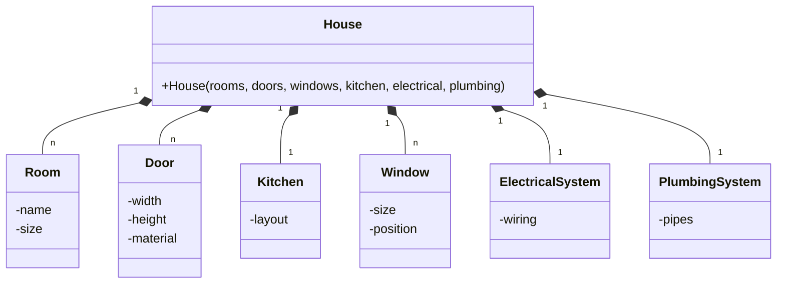
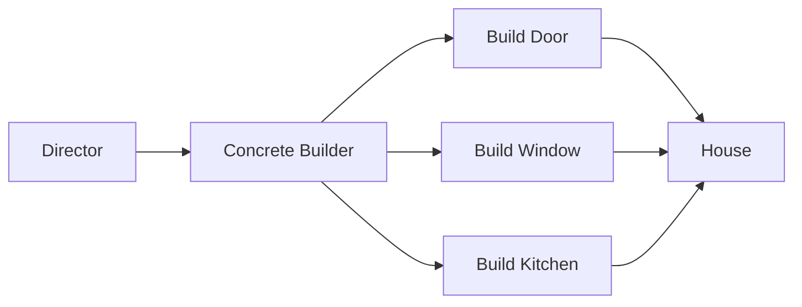
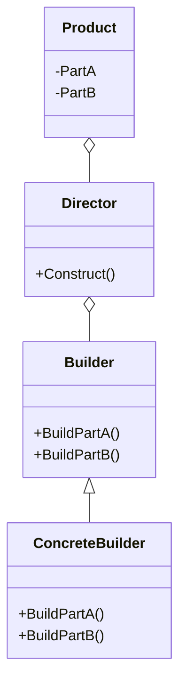

# Builder Pattern

## Giới thiệu

Builder Pattern là một Creational Design Pattern cho phép xây dựng đối tượng phức tạp bằng cách sử dụng các đối tượng riêng biệt đại diện cho từng bộ phận cấu thành.

Builder Pattern tách rời quá trình khởi tạo đối tượng phức tạp khỏi các đại diện của nó. Điều này cho phép cùng một quá trình xây dựng có thể tạo ra nhiều biểu diễn khác nhau của đối tượng.

Mục đích: Builder Pattern được sử dụng để tách rời quá trình khởi tạo đối tượng phức tạp khỏi các đại diện của nó, giúp đạt được những lợi ích sau:

- Tăng tính linh hoạt trong khởi tạo đối tượng phức tạp
- Dễ dàng thay đổi cách khởi tạo đối tượng.
- Hỗ trợ tạo nhiều biểu diễn khác nhau của đối tượng.
- Đơn giản hóa việc test và debug.

Builder Pattern tách rời quá trình xây dựng đối tượng phức tạp thành nhiều bước riêng biệt. Mỗi bước tập trung vào một khía cạnh của đối tượng.

Các đại diện chỉ đơn giản lưu trữ kết quả, không cần quan tâm đến quá trình tạo ra chúng.

### Đặt vấn đề

Trong phát triển phần mềm, ta thường gặp các đối tượng phức tạp với nhiều thuộc tính và thành phần. Ví dụ một đối tượng House có thể bao gồm các thành phần như phòng khách, phòng ngủ, nhà bếp, cửa ra vào, cửa sổ, hệ thống điện, nước, ...



- Quá trình khởi tạo phức tạp, dễ gây nhầm lẫn với nhiều tham số truyền vào
- Các thành phần của House bị phụ thuộc lẫn nhau, khó thay đổi một phần mà không ảnh hưởng các thành phần khác.
- Khó tạo các biến thể khác nhau của House một cách linh hoạt.

Như vậy, việc xây dựng các đối tượng phức tạp cần được thiết kế cẩn thận để tránh các vấn đề trên.

### Giải quyết Vấn Đề

Builder Pattern giúp giải quyết vấn đề của việc tạo ra đối tượng phức tạp, như ví dụ sau về việc xây dựng một ngôi nhà. Thay vì tạo ngôi nhà một cách trực tiếp từng phần, chúng ta chia quá trình này thành nhiều bước riêng biệt. Mỗi bước tập trung vào việc xây dựng một khía cạnh cụ thể của ngôi nhà, chẳng hạn như cửa, cửa sổ và nhà bếp.

Cách hoạt động

1. Director (Quản lý): Đầu tiên, chúng ta có một người quản lý, được gọi là Director. Quản lý này có nhiệm vụ chỉ đạo quá trình xây dựng ngôi nhà.

2. Các Concrete Builder (Xây dựng cụ thể): Sau đó, chúng ta có các xây dựng cụ thể, ví dụ: Xây dựng Cửa, Xây dựng Cửa sổ và Xây dựng Nhà bếp. Mỗi Concrete Builder chịu trách nhiệm cho việc xây dựng một phần cụ thể của ngôi nhà.

3. Tạo ngôi nhà: Chúng ta kết hợp các phần đã xây dựng từ các Concrete Builder để tạo ra ngôi nhà hoàn chỉnh.

Ví dụ minh hoạ

Để hiểu rõ hơn, hãy xem ví dụ sau:



- Director (Quản lý) gọi Concrete Builder (Xây dựng cụ thể) để bắt đầu xây dựng ngôi nhà.

- Concrete Builder (Xây dựng cụ thể) thực hiện công việc của mình, ví dụ: xây dựng cửa, cửa sổ và nhà bếp.

- Các phần này được kết hợp lại để tạo thành ngôi nhà hoàn chỉnh.

Kết quả là, người dùng ngôi nhà không cần quan tâm đến chi tiết cụ thể của quá trình xây dựng, mà chỉ cần sử dụng ngôi nhà đã hoàn thành một cách dễ dàng.

### Cấu trúc

Builder Pattern có cấu trúc đơn giản, bao gồm các thành phần sau:



- Builder: Định nghĩa phương thức xây dựng chung.
- ConcreteBuilder: Triển khai chi tiết các bước xây dựng cụ thể.
- Director: Sử dụng Builder để xây dựng sản phẩm.
- Product: Là sản phẩm được tạo ra, chứa các phần do Builder tạo.

Như vậy Builder tách rời quá trình xây dựng phức tạp thành nhiều bước đơn giản, từng bước tập trung vào một khía cạnh riêng lẻ.

## Cách triển khai

Builder Pattern có thể được triển khai theo nhiều cách khác nhau. Trong Java, có một số cách triển khai phổ biến như sau:

Định nghĩa Product: Chúng ta bắt đầu bằng việc định nghĩa lớp Product để lưu trữ thông tin đối tượng cuối cùng:

```java
class Product {
    private String partA;
    private String partB;

    public void setPartA(String partA) {
        this.partA = partA;
    }

    public void setPartB(String partB) {
        this.partB = partB;
    }

    public void show() {
        System.out.println("Product Parts: " + partA + " and " + partB);
    }
}

```

Định nghĩa Builder : Sau đó, chúng ta định nghĩa lớp Builder với các phương thức xây dựng, nhưng với Builder, mỗi phương thức xây dựng trả về chính builder, cho phép chúng ta gọi tiếp theo một cách liền mạch:

```java
class Builder {
    private Product product = new Product();

    public Builder buildPartA(String partA) {
        product.setPartA(partA);
        return this;
    }

    public Builder buildPartB(String partB) {
        product.setPartB(partB);
        return this;
    }

    public Product getResult() {
        return product;
    }
}
```

Bây giờ, chúng ta có thể sử dụng Builder để xây dựng sản phẩm một cách dễ đọc và gần gũi:

```java
public class Main {
    public static void main(String[] args) {
        // Sử dụng Builder để xây dựng sản phẩm
        Product product = new Builder()
            .buildPartA("Part A")
            .buildPartB("Part B")
            .getResult();
        
        // Hiển thị sản phẩm
        product.show();
    }
}
```

Giải thích 

- Chúng ta đã tạo một lớp `Builder` với các phương thức xây dựng trả về chính builder. Điều này cho phép chúng ta gọi tiếp các phương thức một cách liền mạch, tạo một chuỗi dễ đọc để xây dựng sản phẩm.
- Khi sử dụng Builder, các phương thức xây dựng có thể được gọi nối tiếp trên một đối tượng builder duy nhất, giúp giảm bớt sự phức tạp trong mã nguồn và làm cho mã trở nên rõ ràng hơn.
- Cuối cùng, chúng ta gọi `getResult()` để lấy đối tượng Product đã được xây dựng và hiển thị nó.

## Ví dụ minh họa

Dưới đây là một ví dụ minh họa về Builder Pattern trong Java:

```java
// Đối tượng Product: Nhà
class House {
  private String foundation;
  private String walls;
  private String roof;
  private String interior;

  public void setFoundation(String foundation) {
    this.foundation = foundation;
  }

  public void setWalls(String walls) {
    this.walls = walls;
  }

  public void setRoof(String roof) {
    this.roof = roof;
  }

  public void setInterior(String interior) {
    this.interior = interior;
  }

  public void showHouseDetails() {
    System.out.println("House Details:");
    System.out.println("Foundation: " + foundation);
    System.out.println("Walls: " + walls);
    System.out.println("Roof: " + roof);
    System.out.println("Interior: " + interior);
  }
}

// Builder Interface: Builder
interface HouseBuilder {
  void buildFoundation();
  void buildWalls();
  void buildRoof();
  void buildInterior();
  House getResult();
}

// Concrete Builder: ConcreteHouseBuilder
class ConcreteHouseBuilder implements HouseBuilder {
  private House house = new House();

  public void buildFoundation() {
    house.setFoundation("Concrete Foundation");
  }

  public void buildWalls() {
    house.setWalls("Concrete Walls");
  }

  public void buildRoof() {
    house.setRoof("Concrete Roof");
  }

  public void buildInterior() {
    house.setInterior("Modern Interior");
  }

  public House getResult() {
    return house;
  }
}

// Director: HouseDirector
class HouseDirector {
  private HouseBuilder builder;

  public HouseDirector(HouseBuilder builder) {
    this.builder = builder;
  }

  public void constructHouse() {
    builder.buildFoundation();
    builder.buildWalls();
    builder.buildRoof();
    builder.buildInterior();
  }
}

// Main class
public class Main {
  public static void main(String[] args) {
    // Tạo một đối tượng ConcreteHouseBuilder
    HouseBuilder builder = new ConcreteHouseBuilder();

    // Tạo một đối tượng HouseDirector và kết nối với builder
    HouseDirector director = new HouseDirector(builder);

    // Xây dựng nhà
    director.constructHouse();

    // Lấy kết quả
    House house = builder.getResult();

    // Hiển thị thông tin về nhà
    house.showHouseDetails();
  }
}
```

Trong ví dụ này, chúng ta sử dụng phương pháp Builder để xây dựng

1. **Đối tượng Product: Nhà (House)**:
  - Trong ví dụ này, `House` là đối tượng mà chúng ta muốn xây dựng.
  - `House` có các thuộc tính như `foundation`, `walls`, `roof`, và `interior`, đại diện cho các phần cấu trúc và nội thất của ngôi nhà.
  - Chúng ta định nghĩa các phương thức `setPart` để thiết lập các phần của ngôi nhà và `showHouseDetails` để hiển thị thông tin chi tiết của ngôi nhà.

2. **Builder Interface: Builder**:
  - `HouseBuilder` là một giao diện định nghĩa các phương thức để xây dựng một đối tượng `House`.
  - Các phương thức trong `HouseBuilder` bao gồm `buildFoundation`, `buildWalls`, `buildRoof`, và `buildInterior`, mỗi phương thức tương ứng với việc xây dựng một phần cụ thể của ngôi nhà.
  - `getResult` để lấy đối tượng `House` đã hoàn thành.

3. **Concrete Builder: ConcreteHouseBuilder**:
  - `ConcreteHouseBuilder` là lớp cụ thể triển khai `HouseBuilder`.
  - Các phương thức của `ConcreteHouseBuilder` được triển khai để xây dựng các phần của ngôi nhà. Ví dụ, `buildFoundation` thiết lập phần nền móng của ngôi nhà là "Concrete Foundation".
  - Mỗi phương thức trả về chính đối tượng `ConcreteHouseBuilder` để cho phép chuỗi gọi phương thức (method chaining).

4. **Director: HouseDirector**:
  - `HouseDirector` là lớp chịu trách nhiệm hướng dẫn quá trình xây dựng ngôi nhà.
  - Nó chấp nhận một đối tượng `HouseBuilder` (ở đây là `ConcreteHouseBuilder`) thông qua hàm tạo và sẽ sử dụng nó để xây dựng ngôi nhà.
  - `constructHouse` phương thức của `HouseDirector` gọi các phương thức xây dựng trên builder để xây dựng các phần khác nhau của ngôi nhà theo đúng thứ tự.

5. **Main class**:
  - Trong hàm `main`, chúng ta bắt đầu bằng việc tạo một đối tượng `ConcreteHouseBuilder`.
  - Sau đó, chúng ta tạo một đối tượng `HouseDirector` và kết nối nó với `ConcreteHouseBuilder`.
  - Gọi `constructHouse` để bắt đầu quá trình xây dựng ngôi nhà.
  - Cuối cùng, sử dụng `getResult` để nhận đối tượng `House` đã hoàn thành và gọi `showHouseDetails` để hiển thị thông tin chi tiết về ngôi nhà.

Kết quả là, chúng ta đã xây dựng một đối tượng ngôi nhà một cách dễ dàng và linh hoạt, trong đó mỗi phần của ngôi nhà được xây dựng bằng cách sử dụng Builder Pattern. Điều này giúp giảm sự phức tạp và làm cho mã nguồn trở nên rõ ràng hơn.

## So sánh

Builder Pattern có thể được so sánh với một số Design Pattern tương tự, bao gồm:

- Factory Pattern: Factory Pattern cung cấp một cách để tạo các đối tượng của lớp một cách linh hoạt. Tuy nhiên, Factory Pattern không tách biệt việc xây dựng đối tượng khỏi việc đại diện cho nó. Nó chủ yếu tập trung vào việc tạo đối tượng và trả về chúng, trong khi Builder Pattern tập trung vào việc xây dựng một đối tượng phức tạp từ các phần cấu trúc riêng biệt.
- Prototype Pattern: Prototype Pattern cung cấp một cách để tạo các bản sao của đối tượng. Prototype Pattern cũng có thể được sử dụng để tạo một đối tượng duy nhất của lớp, bằng cách sao chép nó. Tuy nhiên, Prototype Pattern thường phức tạp hơn Builder Pattern vì nó yêu cầu quản lý và sao chép đối tượng gốc, trong khi Builder Pattern tập trung vào việc xây dựng đối tượng theo từng bước.

## Lưu ý

Khi áp dụng Builder Pattern, cần lưu ý những điểm sau:

- Builder Pattern có thể làm tăng số lượng lớp cần thiết, do đòi hỏi một set builder riêng cho mỗi đối tượng cần xây dựng. Điều này có thể dẫn đến sự tăng nhanh của số lượng lớp trong mã nguồn.
- Builder Pattern có thể làm chậm quá trình xây dựng đối tượng một chút so với việc tạo đối tượng trực tiếp. Tuy nhiên, lợi ích của việc tách biệt quá trình xây dựng và đại diện của đối tượng thường vượt qua sự chậm trễ nhỏ này. Điều này giúp đảm bảo sự linh hoạt và dễ bảo trì trong mã nguồn của bạn.


## Kết luận

Builder Pattern là một Design Pattern hữu ích trong những trường hợp cần xây dựng các đối tượng phức tạp. Nó giúp việc xây dựng các đối tượng phức tạp trở nên dễ dàng hơn và ít xảy ra lỗi hơn.

Dưới đây là một số hướng dẫn về khi nên và không nên sử dụng Builder Pattern:

- Nên sử dụng Builder Pattern khi:
  - Đối tượng phức tạp có nhiều thuộc tính hoặc thành phần phức tạp.
  - Cần xây dựng nhiều phiên bản khác nhau của đối tượng phức tạp.
  - Cần dễ dàng kiểm tra và đảm bảo tính nhất quán của đối tượng phức tạp.
  - Muốn tránh sự phụ thuộc vào thứ tự xây dựng các thành phần.
- Không nên sử dụng Builder Pattern khi:
  - Đối tượng phức tạp không có nhiều thuộc tính hoặc thành phần, và có thể được tạo một cách đơn giản bằng cách sử dụng constructor hoặc setter.
  - Chỉ cần xây dựng một phiên bản duy nhất của đối tượng phức tạp và không cần tạo nhiều biến thể của nó.
  - Không cần dễ dàng kiểm tra và đảm bảo tính nhất quán của đối tượng phức tạp, hoặc không có quy trình xây dựng phức tạp cần được tách ra.

Tôi hy vọng bài viết này đã giúp bạn hiểu rõ hơn về Builder Pattern và cách áp dụng nó trong thiết kế phần mềm của bạn. Builder Pattern là một công cụ mạnh mẽ để tạo ra các đối tượng phức tạp một cách linh hoạt và kiểm soát được quá trình xây dựng của chúng.
