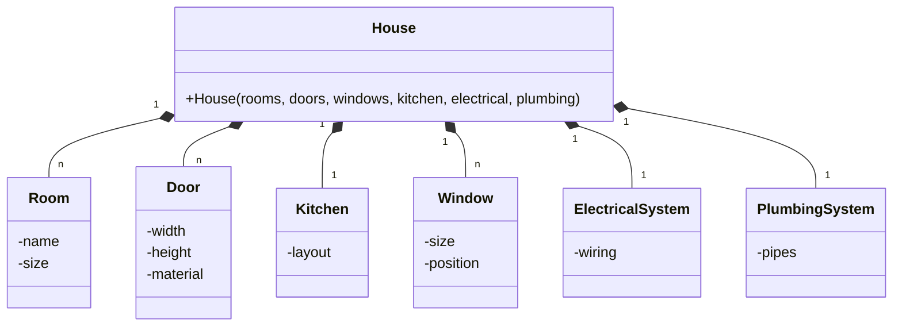
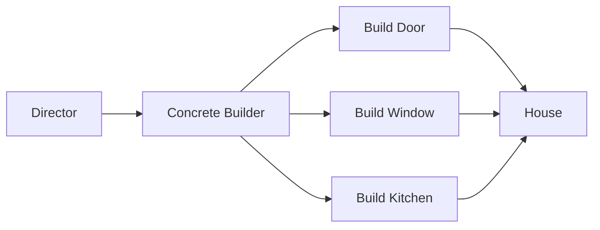

# Buidler Pattern

## Giới thiệu

Builder Pattern là một Creational Design Pattern cho phép xây dựng đối tượng phức tạp bằng cách sử dụng các đối tượng riêng biệt đại diện cho từng bộ phận cấu thành.

Builder Pattern tách rời quá trình khởi tạo đối tượng phức tạp khỏi các đại diện của nó. Điều này cho phép cùng một quá trình xây dựng có thể tạo ra nhiều biểu diễn khác nhau của đối tượng.

Mục đích: Builder Pattern được sử dụng để tách rời quá trình khởi tạo đối tượng phức tạp khỏi các đại diện của nó, giúp đạt được những lợi ích sau:

- Tăng tính linh hoạt trong khởi tạo đối tượng phức tạp
- Dễ dàng thay đổi cách khởi tạo đối tượng.
- Hỗ trợ tạo nhiều biểu diễn khác nhau của đối tượng.
- Đơn giản hóa việc test và debug.

Builder Pattern tách rời quá trình xây dựng đối tượng phức tạp thành nhiều bước riêng biệt. Mỗi bước tập trung vào một khía cạnh của đối tượng.

Các đại diện chỉ đơn giản lưu trữ kết quả, không cần quan tâm đến quá trình tạo ra chúng.

### Đặt vấn đề

Trong phát triển phần mềm, ta thường gặp các đối tượng phức tạp với nhiều thuộc tính và thành phần. Ví dụ một đối tượng House có thể bao gồm các thành phần như phòng khách, phòng ngủ, nhà bếp, cửa ra vào, cửa sổ, hệ thống điện, nước, ...



- Quá trình khởi tạo phức tạp, dễ gây nhầm lẫn với nhiều tham số truyền vào
- Các thành phần của House bị phụ thuộc lẫn nhau, khó thay đổi một phần mà không ảnh hưởng các thành phần khác.
- Khó tạo các biến thể khác nhau của House một cách linh hoạt.

Như vậy, việc xây dựng các đối tượng phức tạp cần được thiết kế cẩn thận để tránh các vấn đề trên.

### Giải quyết Vấn Đề

Builder Pattern giúp giải quyết vấn đề của việc tạo ra đối tượng phức tạp, như ví dụ sau về việc xây dựng một ngôi nhà. Thay vì tạo ngôi nhà một cách trực tiếp từng phần, chúng ta chia quá trình này thành nhiều bước riêng biệt. Mỗi bước tập trung vào việc xây dựng một khía cạnh cụ thể của ngôi nhà, chẳng hạn như cửa, cửa sổ và nhà bếp.

Cách hoạt động

1. Director (Quản lý): Đầu tiên, chúng ta có một người quản lý, được gọi là Director. Quản lý này có nhiệm vụ chỉ đạo quá trình xây dựng ngôi nhà.

2. Các Concrete Builder (Xây dựng cụ thể): Sau đó, chúng ta có các xây dựng cụ thể, ví dụ: Xây dựng Cửa, Xây dựng Cửa sổ và Xây dựng Nhà bếp. Mỗi Concrete Builder chịu trách nhiệm cho việc xây dựng một phần cụ thể của ngôi nhà.

3. Tạo ngôi nhà: Chúng ta kết hợp các phần đã xây dựng từ các Concrete Builder để tạo ra ngôi nhà hoàn chỉnh.

Ví dụ minh hoạ

Để hiểu rõ hơn, hãy xem ví dụ sau:



- Director (Quản lý) gọi Concrete Builder (Xây dựng cụ thể) để bắt đầu xây dựng ngôi nhà.

- Concrete Builder (Xây dựng cụ thể) thực hiện công việc của mình, ví dụ: xây dựng cửa, cửa sổ và nhà bếp.

- Các phần này được kết hợp lại để tạo thành ngôi nhà hoàn chỉnh.

Kết quả là, người dùng ngôi nhà không cần quan tâm đến chi tiết cụ thể của quá trình xây dựng, mà chỉ cần sử dụng ngôi nhà đã hoàn thành một cách dễ dàng.

---

### Cấu trúc

Builder Pattern có cấu trúc đơn giản, bao gồm các thành phần sau:

- Lớp Builder: Lớp này chịu trách nhiệm xây dựng đối tượng phức tạp. Lớp Builder có các phương thức để đặt giá trị cho các thuộc tính hoặc thành phần của đối tượng phức tạp.
- Lớp đại diện: Lớp này lưu trữ đối tượng đã được xây dựng bởi lớp Builder.


## Cách triển khai

Builder Pattern có thể được triển khai theo nhiều cách khác nhau. Trong Java, có một số cách triển khai phổ biến như sau:

- Fluent Builder: Phương pháp này sử dụng các phương thức setter để đặt giá trị cho các thuộc tính hoặc thành phần của đối tượng phức tạp.
- Chained Builder: Phương pháp này sử dụng các phương thức builder() để tạo các đối tượng Builder mới.


## Ví dụ minh họa

Dưới đây là một ví dụ minh họa về Builder Pattern trong Java:

```java
public class PizzaBuilder {

    private String crust;
    private String sauce;
    private List<String> toppings;

    public PizzaBuilder crust(String crust) {
        this.crust = crust;
        return this;
    }

    public PizzaBuilder sauce(String sauce) {
        this.sauce = sauce;
        return this;
    }

    public PizzaBuilder toppings(List<String> toppings) {
        this.toppings = toppings;
        return this;
    }

    public Pizza build() {
        return new Pizza(crust, sauce, toppings);
    }
}

public class Pizza {

    private String crust;
    private String sauce;
    private List<String> toppings;

    public Pizza(String crust, String sauce, List<String> toppings) {
        this.crust = crust;
        this.sauce = sauce;
        this.toppings = toppings;
    }

    @Override
    public String toString() {
        return "Pizza{" +
                "crust='" + crust + '\'' +
                ", sauce='" + sauce + '\'' +
                ", toppings=" + toppings +
                '}';
    }
}

public class Main {

    public static void main(String[] args) {
        PizzaBuilder pizzaBuilder = new PizzaBuilder();
        pizzaBuilder.crust("Thin crust");
        pizzaBuilder.sauce("Tomato sauce");
        pizzaBuilder.toppings(Arrays.asList("Pepperoni", "Sausage"));

        Pizza pizza = pizzaBuilder.build();
        System.out.println(pizza);
    }
}

```

Trong ví dụ này, chúng ta sử dụng phương pháp Fluent Builder để xây dựng

## So sánh

Builder Pattern có thể được so sánh với một số Design Pattern tương tự, chẳng hạn như:

- Factory Pattern: Factory Pattern cung cấp một cách để tạo các đối tượng của lớp một cách linh hoạt. Tuy nhiên, Factory Pattern không tách biệt việc xây dựng đối tượng khỏi việc đại diện cho nó.
- Prototype Pattern: Prototype Pattern cung cấp một cách để tạo các bản sao của đối tượng. Prototype Pattern cũng có thể được sử dụng để tạo một đối tượng duy nhất của lớp. Tuy nhiên, Prototype Pattern có thể phức tạp hơn Builder Pattern.


## Lưu ý

Khi áp dụng Builder Pattern, cần lưu ý những điểm sau:

- Builder Pattern có thể làm tăng số lượng lớp cần thiết.
- Builder Pattern có thể làm chậm quá trình xây dựng đối tượng.


## Kết luận

Builder Pattern là một Design Pattern hữu ích trong những trường hợp cần xây dựng các đối tượng phức tạp. Builder Pattern giúp việc xây dựng các đối tượng phức tạp trở nên dễ dàng hơn và ít xảy ra lỗi hơn.

Dưới đây là một số hướng dẫn khi nên và không nên sử dụng Builder Pattern:

- Nên sử dụng Builder Pattern khi:
  - Đối tượng phức tạp có nhiều thuộc tính hoặc thành phần.
  - Cần xây dựng nhiều phiên bản khác nhau của đối tượng phức tạp.
  - Cần dễ dàng kiểm tra đối tượng phức tạp.
- Không nên sử dụng Builder Pattern khi:
  - Đối tượng phức tạp không có nhiều thuộc tính hoặc thành phần.
  - Chỉ cần xây dựng một phiên bản duy nhất của đối tượng phức tạp.
  - Không cần dễ dàng kiểm tra đối tượng phức tạp.

Tôi hy vọng bài viết này đã giúp bạn hiểu rõ về Builder Pattern.
