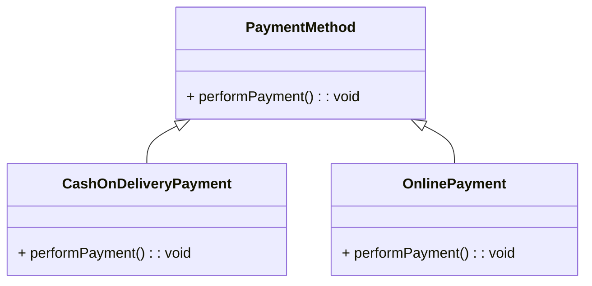
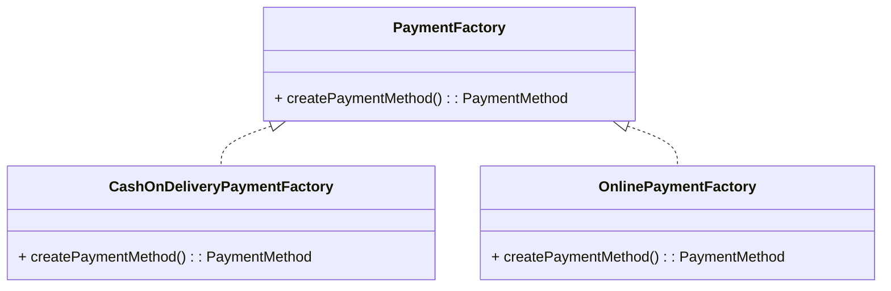

# Factory Method

## Giới thiệu

**Định nghĩa**: Factory Method là một Design Pattern thuộc nhóm Creational Patterns (Mẫu thiết kế tạo đối tượng), cung cấp một cách để tạo các đối tượng của lớp một cách linh hoạt mà không cần chỉ định rõ kiểu cụ thể của đối tượng nào sẽ được tạo. 

**Mục đích**: Factory Method Pattern được sử dụng để giải quyết việc tạo đối tượng mà không cố định lớp cụ thể nào sẽ được tạo. Các mục đích chính của mẫu này bao gồm:
  - **Dễ dàng tạo các đối tượng của lớp**: Factory Method cho phép tạo các đối tượng của lớp một cách dễ dàng thông qua một phương thức trừu tượng.
  - **Dễ dàng thay đổi cách tạo các đối tượng của lớp**: Bằng cách triển khai lại phương thức factory ở các lớp con, bạn có thể thay đổi cách tạo đối tượng mà không ảnh hưởng đến client code.
  - **Dễ dàng kiểm tra các đối tượng của lớp**: Factory Method cho phép bạn kiểm tra và quản lý các đối tượng được tạo một cách linh hoạt.

**Ý tưởng chính**: Factory Method Pattern dựa trên việc sử dụng một phương thức trừu tượng (thường được gọi là "factory method") trong một lớp trừu tượng (thường được gọi là "Creator"). Các lớp con của Creator sẽ triển khai factory method này để tạo ra các đối tượng cụ thể của lớp. Điều này cho phép linh hoạt trong việc tạo đối tượng mà không cần biết chính xác kiểu cụ thể của đối tượng.


## Đặt vấn đề

Hãy tưởng tượng bạn đang xây dựng một hệ thống quản lý bán hàng trực tuyến cho thị trường Việt Nam. Ban đầu, hệ thống của bạn chỉ hỗ trợ thanh toán bằng tiền mặt khi nhận hàng (COD - Cash On Delivery), bởi vì đây là phương thức thanh toán phổ biến nhất tại Việt Nam.

Tuy nhiên, theo thời gian, bạn nhận thấy nhu cầu của khách hàng đang thay đổi. Người dùng muốn có sự linh hoạt hơn trong việc thanh toán, bao gồm thanh toán trực tuyến qua thẻ tín dụng và ví điện tử.


Việc thêm phương thức thanh toán mới vào hệ thống gây ra một vấn đề:

Thêm một phương thức thanh toán trực tuyến vào hệ thống là một thách thức, vì hầu hết mã nguồn của bạn đã được thiết kế dựa trên phương thức thanh toán COD. Toàn bộ hệ thống có thể liên quan chặt chẽ đến việc xử lý thanh toán bằng tiền mặt và có rất nhiều mã nguồn sử dụng các logic và quy trình liên quan đến COD.

Dưới góc độ lập trình, việc thêm thanh toán trực tuyến yêu cầu bạn phải thay đổi toàn bộ hệ thống để tích hợp các API thanh toán trực tuyến, xử lý giao dịch trực tuyến và cập nhật giao diện người dùng để cho phép người dùng chọn phương thức thanh toán mới. Điều này đồng nghĩa với việc sửa đổi và thêm mã nguồn rải rác trong hệ thống, và có thể dẫn đến các vấn đề về tính nhất quán và bảo trì trong tương lai.

Nếu bạn quyết định mở rộng hệ thống để hỗ trợ thêm các phương thức thanh toán khác như ví điện tử hay chuyển khoản ngân hàng, bạn sẽ phải duyệt qua toàn bộ mã nguồn một lần nữa và thực hiện các sửa đổi lớn. Điều này dẫn đến mã nguồn trở nên phức tạp và khó bảo trì, không tuân theo nguyên tắc thiết kế mở rộng.

## Giải quyết

Mẫu thiết kế `Factory Method` đề xuất bạn thay thế việc tạo đối tượng trực tiếp bằng cách gọi đến một phương thức factory đặc biệt. Đừng lo lắng: các đối tượng vẫn được tạo ra bằng toán tử new, nhưng điều này được thực hiện từ bên trong phương thức factory. Các đối tượng được trả về bởi một phương thức factory thường được gọi là sản phẩm (products).

Ở cái nhìn đầu tiên, thay đổi này có vẻ không có ý nghĩa: chúng ta chỉ di chuyển cuộc gọi hàm khởi tạo từ một phần của chương trình sang phần khác. Tuy nhiên, hãy xem xét điều này: bây giờ bạn có thể ghi đè phương thức factory trong một lớp con và thay đổi lớp của các sản phẩm được tạo ra bởi phương thức đó.

Tuy nhiên, có một hạn chế nhỏ: các lớp con chỉ có thể trả về các loại sản phẩm khác nhau nếu những sản phẩm này có một Base Class hoặc Interface chung. Ngoài ra, phương thức factory trong Base Class nên có kiểu trả về được khai báo là Interface hoặc Base Class đó.

Ví dụ, trong bài toán thanh toán ở Việt Nam, bạn có thể tạo một giao diện (interface) có tên là `PaymentMethod` với một phương thức chung là `performPayment` (thực hiện thanh toán). Sau đó, bạn tạo hai lớp cụ thể, ví dụ: `CashOnDeliveryPayment` và `OnlinePayment`, và cả hai lớp này đều triển khai giao diện `PaymentMethod`.



Lớp `CashOnDeliveryPayment` có thể triển khai phương thức `performPayment` để xử lý thanh toán bằng tiền mặt khi nhận hàng, trong khi lớp `OnlinePayment` triển khai phương thức đó để xử lý thanh toán trực tuyến.

Tiếp theo, bạn tạo một lớp `PaymentFactory` với một phương thức `createPaymentMethod`, và các lớp cụ thể `CashOnDeliveryPaymentFactory` và `OnlinePaymentFactory` kế thừa từ lớp này.



Lớp `CashOnDeliveryPaymentFactory` sẽ triển khai phương thức `createPaymentMethod` để trả về một đối tượng `CashOnDeliveryPayment`, trong khi `OnlinePaymentFactory` sẽ trả về một đối tượng `OnlinePayment`.

Với cách làm này, mã nguồn sử dụng phương thức nhà máy (factory method) không phát hiện sự khác biệt giữa các phương thức thanh toán khác nhau. Khách hàng (client) xem xét tất cả các phương thức thanh toán như là đối tượng `PaymentMethod` trừu tượng và biết rằng tất cả các đối tượng này đều có thể thực hiện phương thức `performPayment`, nhưng cụ thể cách mỗi phương thức hoạt động không quan trọng đối với khách hàng.

## Cấu trúc

Factory Method có cấu trúc đơn giản, bao gồm các thành phần sau:

 - Lớp cha: Lớp cha chứa phương thức trừu tượng để tạo các đối tượng của lớp.
 - Lớp con: Các lớp con triển khai phương thức trừu tượng của lớp cha để tạo các đối tượng của lớp theo cách tùy ý.

## Cách triển khai

Factory Method có thể được triển khai theo nhiều cách khác nhau. Trong Java, có một số cách triển khai phổ biến như sau:

- Phương thức static: Phương pháp này sử dụng một phương thức static để tạo các đối tượng của lớp.
- Phương thức factory: Phương pháp này sử dụng một phương thức non-static để tạo các đối tượng của lớp.


## Ví dụ

Dưới đây là một ví dụ minh họa về Factory Method trong Java:

```java
public abstract class ShapeFactory {

    public abstract Shape createShape();
}

public class CircleFactory extends ShapeFactory {

    @Override
    public Shape createShape() {
        return new Circle();
    }
}

public class RectangleFactory extends ShapeFactory {

    @Override
    public Shape createShape() {
        return new Rectangle();
    }
}

public class Main {

    public static void main(String[] args) {
        ShapeFactory circleFactory = new CircleFactory();
        Shape circle = circleFactory.createShape();

        ShapeFactory rectangleFactory = new RectangleFactory();
        Shape rectangle = rectangleFactory.createShape();
    }
}

```

Trong ví dụ này, chúng ta có hai lớp con của lớp cha ShapeFactory: CircleFactory và RectangleFactory. Hai lớp con này triển khai phương thức createShape() để tạo các đối tượng của lớp Shape tương ứng.

## So sánh

Factory Method có thể được so sánh với một số Design Pattern tương tự, chẳng hạn như:

- Builder Pattern: Builder Pattern cũng cung cấp một cách để tạo các đối tượng của lớp một cách linh hoạt. Tuy nhiên, Builder Pattern tách biệt việc xây dựng đối tượng khỏi việc đại diện cho nó.
- Abstract Factory Pattern: Abstract Factory Pattern cung cấp một cách để tạo các đối tượng của nhiều lớp một cách linh hoạt.


