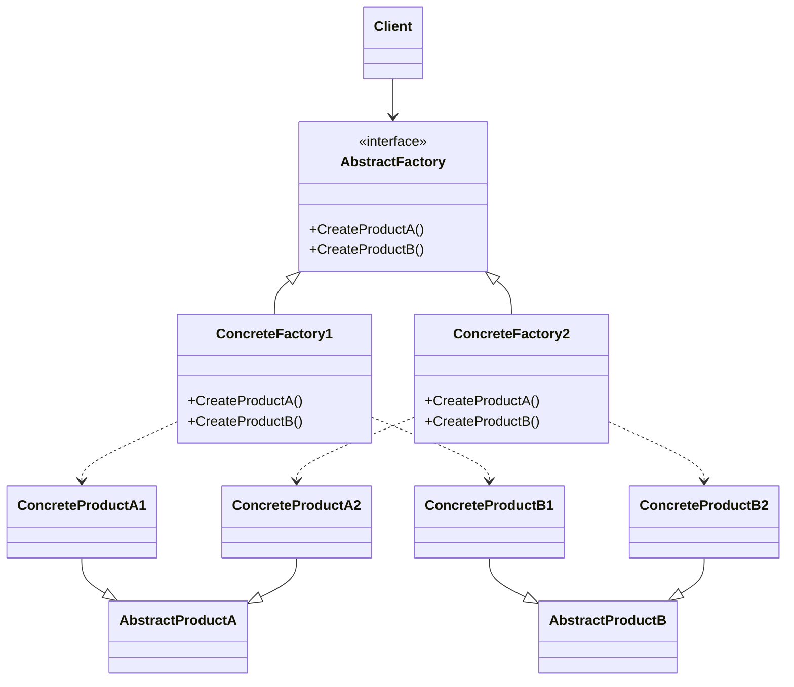

# Abstract Factory

## Giới thiệu

- Định nghĩa: Abstract Factory là một Design Pattern cung cấp một interface để tạo ra các họ đối tượng liên quan với nhau một cách linh hoạt.
- Mục đích: Abstract Factory được sử dụng để tạo ra các họ đối tượng liên quan, nhằm các mục đích:
  - Giúp dễ dàng tạo các đối tượng thuộc cùng một họ.
  - Giúp dễ dàng thay đổi cách tạo các họ đối tượng.
  - Giúp dễ dàng kiểm tra các đối tượng thuộc cùng một họ.
  - Tách biệt implementation cuar các objects khỏi business logic sử dụng chúng.
  - Cho phép thay đổi cách tạo objects mà không ảnh hưởng tới phần còn lại của code.
- Ý tưởng chính:
    - Abstract Factory định nghĩa interfaces cho một họ các sản phẩm liên quan. 
    - Các Concrete Factory implement các interfaces này để tạo ra các sản phẩm cụ thể.
    - Code sử dụng chỉ tương tác với interfaces, không phụ thuộc vào các Concrete Factory hoặc sản phẩm cụ thể.

## Đặt vấn đề

Giả sử bạn đang làm một ứng dụng gọi món ăn cho nhà hàng. Các món ăn được phân thành các nhóm:

- Món lẩu: Thịt bò, rau củ, nấm hương
- Món phở: Bánh phở, thịt bò, giá đỗ
- Món bún: Bún, nem nuong, chả giò

Bạn muốn có thể dễ dàng thêm nhóm món mới mà không ảnh hưởng tới code.

Ví dụ thêm nhóm món bò kho, gồm thịt bò, khoai tây, cà rốt.

## Giải quyết

Đầu tiên định nghĩa interface cho các loại thành phần món ăn:

- IProtein: thịt bò, tôm,..
- ICarbohydrate: mì, bún, bánh phở,..
- IVegetable: cà rốt, giá đỗ,..

Tiếp theo, tạo Abstract Factory định nghĩa các phương thức tạo các thành phần trên.

Sau đó tạo các Concrete Factory tương ứng với từng nhóm món:

LauFactory, PhoFactory, BunFactory,...

Mỗi Factory implement cách tạo ra các thành phần cho món ăn của nhóm đó.

Khi thêm nhóm mới, ta chỉ việc tạo thêm Concrete Factory tương ứng.

## Cấu trúc

Abstract Factory có cấu trúc gồm các thành phần chính sau:



- Abstract Factory interface: định nghĩa các phương thức nhà máy trừu tượng để tạo ra các sản phẩm trừu tượng.
- Concrete Factory: cài đặt các phương thức nhà máy cụ thể để tạo ra các sản phẩm cụ thể. Mỗi Concrete Factory tạo ra một tập sản phẩm khác biệt, phù hợp với một variant.
- Abstract Product: định nghĩa interface chung cho một loại sản phẩm trừu tượng.
- Concrete Product: cài đặt các sản phẩm cụ thể, triển khai từ Abstract Product. Mỗi sản phẩm thuộc về một Concrete Factory nhất định.
- Client: sử dụng Abstract Factory và Abstract Product để tương tác với hệ thống. Không cần quan tâm đến các lớp cụ thể.

## Cách triển khai

Đầu tiên, ta định nghĩa interface AbstractFactory:
```java
interface AbstractFactory {
  AbstractProductA createProductA();
  AbstractProductB createProductB(); 
}
```
Tiếp theo, định nghĩa các Concrete Factory triển khai AbstractFactory:
```java
class ConcreteFactory1 implements AbstractFactory {

  @Override
  AbstractProductA createProductA() {
    return new ConcreteProductA1();
  }

  @Override
  AbstractProductB createProductB() {
    return new ConcreteProductB1();
  }

}

class ConcreteFactory2 implements AbstractFactory {

  // implements createProductA() and createProductB()
}
```

Định nghĩa các Abstract Product dưới dạng interface:

```java
interface AbstractProductA {}
interface AbstractProductB {}
```

Triển khai các Concrete Product từ Abstract Product:

```java
class ConcreteProductA1 implements AbstractProductA {}

class ConcreteProductB1 implements AbstractProductB {}
```

Cuối cùng, ở Client chúng ta sẽ sử dụng AbstractFactory để tạo ra các Abstract Product mà không cần quan tâm đến các lớp cụ thể:

```java
public class Main {

  public static void main(String[] args) {

    // Khởi tạo factory 
    AbstractFactory factory = new ConcreteFactory1();

    // Sử dụng factory để lấy các sản phẩm
    AbstractProductA productA = factory.createProductA();
    AbstractProductB productB = factory.createProductB();

    // Sử dụng các sản phẩm 
    productA.methodA();
    productB.methodB();

    // Thay đổi factory khác
    factory = new ConcreteFactory2();

    // Lấy lại các sản phẩm 
    productA = factory.createProductA();
    productB = factory.createProductB();

    // Sử dụng các sản phẩm mới
  }

}
```
## Ví dụ

Dưới đây là một ví dụ minh họa về Abstract Factory trong Java:


```java
public abstract class AbstractFactory {
  
  public abstract Shape createShape();

  public abstract Color createColor();
}

public class ShapeFactory extends AbstractFactory {

    @Override
    public Shape createShape() {
        return new Circle();
    }

    @Override
    public Color createColor() {
        return new Red();
    }
}

public class ColorFactory extends AbstractFactory {

    @Override
    public Shape createShape() {
        return new Rectangle();
    }

    @Override
    public Color createColor() {
        return new Blue();
    }
}

public class Main {

    public static void main(String[] args) {
        AbstractFactory shapeFactory = new ShapeFactory();
        Shape shape = shapeFactory.createShape();

        AbstractFactory colorFactory = new ColorFactory();
        Color color = colorFactory.createColor();
    }
}
```

## So sánh

Abstract Factory có thể được so sánh với một số Design Pattern tương tự, chẳng hạn như:

- Factory Method: Factory Method cũng cung cấp một cách để tạo các đối tượng của nhiều lớp một cách linh hoạt. Tuy nhiên, Factory Method chỉ cung cấp một phương thức để tạo các đối tượng của một lớp.
- Builder Pattern: Builder Pattern cũng cung cấp một cách để tạo các đối tượng phức tạp


## Kết luận

    Tóm tắt ưu/nhược điểm của Pattern
    Hướng dẫn khi nào nên & không nên sử dụng Pattern
