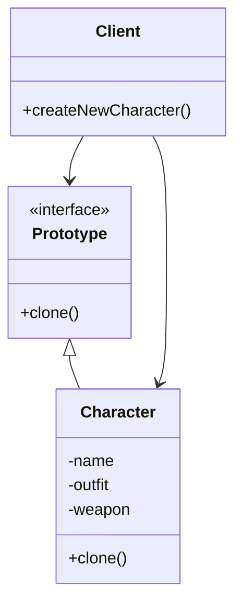

# Prototype Pattern

## Giới thiệu

Trong chương trước, chúng ta đã tìm hiểu về các Creational Design Pattern, bao gồm Abstract Factory, Builder, Factory Method giúp khởi tạo đối tượng một cách linh hoạt. Tiếp theo, chúng ta sẽ đi tìm hiểu Prototype - một Pattern thuộc nhóm này với mục đích tạo ra bản sao của các đối tượng đã tồn tại.

Prototype là một Creational Design Pattern cho phép sao chép các đối tượng hiện có thay vì khởi tạo chúng từ đầu.

Cụ thể, Prototype Pattern định nghĩa một kiểu đối tượng (Prototype) có khả năng tự nhân bản bằng cách clone chính bản thân nó, tạo ra một bản sao độc lập với đối tượng gốc.

Mục đích của Pattern này là tạo ra các đối tượng mới bằng cách clone từ đối tượng hiện có thay vì khởi tạo, tiết kiệm chi phí tạo mới đối tượng, đặc biệt là các đối tượng phức tạp. Ngoài ra, nó che giấu logic khởi tạo và cung cấp khả năng tạo các đối tượng tương tự một cách hiệu quả.

Bằng cách sử dụng Prototype Pattern, chúng ta có thể tạo ra các đối tượng mới một cách nhanh chóng và hiệu quả hơn. Chúng ta sẽ cùng tìm hiểu kỹ hơn về Pattern này trong các phần sau.

## Đặt vấn đề

Trong nhiều ứng dụng, việc khởi tạo các đối tượng là một quá trình tốn kém, phức tạp. Chẳng hạn trong một game, việc tạo mới đối tượng Nhân Vật cần phải load dữ liệu, giải mã, khởi tạo trang phục và vũ khí...

Tuy nhiên, thường có nhiều nhân vật chỉ khác biệt ở một vài thuộc tính nhỏ. Ví dụ Mario và Luigi có ngoại hình và kỹ năng gần giống nhau, chỉ khác tên và màu áo.

Nếu phải khởi tạo hoàn toàn từ đầu các nhân vật này thì rất tốn kém và lãng phí tài nguyên.

Chúng ta cần một cách để tạo ra các đối tượng tương tự một cách hiệu quả hơn, bằng cách tận dụng lại những đối tượng đã khởi tạo từ trước. Prototype Pattern ra đời nhằm giải quyết bài toán này.

## Giải quyết

Prototype Pattern giải quyết bài toán bằng cách:



- Định nghĩa một interface Prototype chung cho các đối tượng nhân vật có thể clone.

- Các lớp nhân vật cụ thể (Concrete Prototype) sẽ triển khai interface này và cung cấp hiện thực cho phương thức clone(). Phương thức clone() sẽ sao chép giá trị các trường dữ liệu của đối tượng sang một đối tượng mới.

- Tạo một đối tượng nhân vật ban đầu với quá trình khởi tạo đầy đủ.

- Khi cần tạo nhân vật mới tương tự, client sẽ gọi phương thức clone() trên đối tượng ban đầu để tạo ra bản sao. Sau đó có thể thay đổi các thuộc tính cần thiết trên đối tượng mới.

Như vậy, Prototype Pattern cho phép tạo ra các đối tượng nhân vật mới một cách nhanh chóng và hiệu quả hơn so với khởi tạo lại từ đầu.

## Cấu trúc

Prototype Pattern bao gồm các thành phần:

- Prototype: định nghĩa phương thức clone() để tạo bản sao.

- ConcretePrototype: cài đặt phương thức clone().

- Client: tạo ra đối tượng ban đầu, sau đó sử dụng prototype để clone.

## Cách triển khai

Trong Java, có 2 cách triển khai Prototype Pattern:

- Sử dụng interface Cloneable và phương thức clone() mặc định của Object.

- Tự định nghĩa interface Prototype với phương thức clone() và triển khai trên các lớp cụ thể.

## Ví dụ

```java
public class CharacterPrototype implements Cloneable {

  private String name; 
  private Armor armor;
  private Weapon weapon;

  // constructor, getter/setter

  @Override
  public CharacterPrototype clone() throws CloneNotSupportedException {
    return (CharacterPrototype) super.clone(); 
  }

}

// Tạo đối tượng ban đầu 
CharacterPrototype mario = new CharacterPrototype("Mario"); 

// Tạo đối tượng mới bằng clone
CharacterPrototype luigi = mario.clone();
luigi.setName("Luigi");
```

## So sánh với các Pattern khác

- Factory Method/Abstract Factory tạo ra đối tượng mới mỗi lần được gọi. Prototype sao chép từ đối tượng đã tồn tại.

- Builder tách quá trình khởi tạo phức tạp ra khỏi đối tượng. Prototype che giấu logic khởi tạo bằng cách clone đối tượng có sẵn.

## Kết luận

Prototype Pattern rất hữu ích khi quá trình khởi tạo đối tượng phức tạp mà chúng ta cần tạo nhiều đối tượng tương tự. Tuy nhiên cần cân nhắc chi phí clone so với tạo mới khi áp dụng.