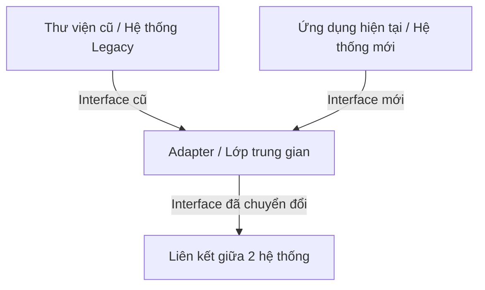
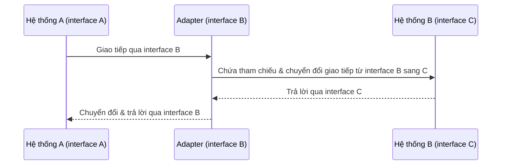
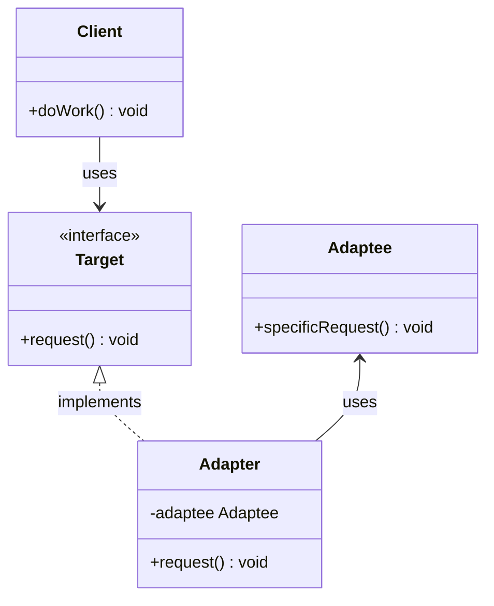
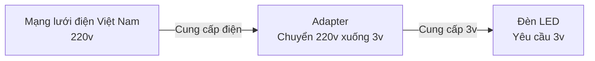

# Adapter Pattern

## Khái niệm

Trong chương trước, chúng ta đã tìm hiểu về các Creational Design Pattern, bao gồm Abstract Factory, Builder, Prototype... giúp khởi tạo đối tượng một cách linh hoạt. Tiếp theo, chúng ta sẽ tìm hiểu về Adapter - một Structural Design Pattern.

Adapter Pattern cho phép các đối tượng có interface không tương thích có thể làm việc cùng nhau thông qua một lớp trung gian.

## Đặt vấn đề

Trong phát triển phần mềm, rất nhiều lúc ta gặp phải tình huống hai hệ thống có sẵn không thể tương tác trực tiếp với nhau do interface không khớp.

Ví dụ:



- Muốn tích hợp một thư viện cũ vào ứng dụng hiện tại nhưng interface không tương thích.
- Muốn kết nối một hệ thống legacy với hệ thống mới nhưng hai bên có interface khác biệt.

Lúc này, ta cần một lớp trung gian đóng vai trò nối kết, chuyển đổi interface giữa chúng.

## Giải pháp

Adapter Pattern được áp dụng như sau:



- Xác định hai hệ thống (object) có interface khác biệt cần tương tác.
- Tạo một lớp Adapter triển khai interface mà hệ thống sử dụng cần.
- Adapter sẽ chứa tham chiếu tới object kia và thực hiện chuyển đổi interface.
- Hệ thống sẽ giao tiếp với Adapter thay vì object kia.

Với cách này, ta tránh sửa đổi hai hệ thống hiện có mà vẫn kết nối được chúng.

## Cấu Trúc

Các thành phần trong Adapter Pattern:



- Target: interface mà client sử dụng.
- Adapter: lớp trung gian, triển khai interface Target và gọi tới Adaptee.
- Adaptee: lớp cần được adapt để phù hợp với interface Target.
- Client: tương tác với Target interface.

## Triển khai Adapter Pattern

Adapter Pattern cho phép bạn "đóng gói" một interface không tương thích vào một lớp adapter để làm cho nó tương thích với interface khác. Để triển khai Adapter Pattern, chúng ta sẽ tạo ra một lớp adapter, nó sẽ kết hợp giữa interface cũ và interface mới.

### 1. Định nghĩa interface cần phục vụ 

Đầu tiên, bạn cần xác định rõ interface mà ứng dụng hiện tại hoặc client muốn sử dụng. Đây chính là interface mà lớp adapter sẽ phải triển khai.

```java
public interface NewInterface {
    void newMethod();
}
```

### 2. Tạo lớp adapter

Lớp adapter này sẽ triển khai (implement) interface mới và có tham chiếu đến đối tượng của lớp cũ (hoặc interface cũ).

```java
public class Adapter implements NewInterface {
    private OldClass oldObject;

    public Adapter(OldClass oldObject) {
        this.oldObject = oldObject;
    }

    @Override
    public void newMethod() {
        oldObject.oldMethod();
    }
}
```

Trong ví dụ trên, `OldClass` là một lớp mà bạn muốn tích hợp vào hệ thống hiện tại. Hàm `newMethod` của `NewInterface` được "đóng gói" bằng cách sử dụng hàm `oldMethod` của `OldClass`.

### 3. Sử dụng lớp adapater

Khi muốn sử dụng lớp cũ trong ứng dụng của bạn, thay vì tạo một instance của `OldClass`, bạn sẽ tạo một instance của `Adapter`.

```java
public class Client {
    public static void main(String[] args) {
        NewInterface target = new Adapter(new OldClass());
        target.newMethod();
    }
}
```

Bằng cách này, lớp `Client` có thể sử dụng được lớp `OldClass` mà không cần phải biết đến chi tiết bên trong nó. Mọi tương tác đều diễn ra thông qua `NewInterface`.

## Ví dụ áp dụng Adapter Pattern

Một người muốn sử dụng đèn led, với hiệu điện thế 3v. Tuy nhiên, người này đang dùng mạng lưới Việt Nam với hiệu điện thế 220v.

- Hiệu điện thế lớn hơn 3v bóng đèn sẽ cháy.
- Hiệu điện thế nhỏ hơn 3v bóng sáng mờ hoặc không phát sáng (Trong trường hợp này ta quy ước nó không phát sáng).
- Hiệu điện thế bằng 3v bóng đèn phát sáng

Như vậy ta cần một adapter chuyển từ 220v sáng 3v. Mô hình thể hiện như sau:



LedInterFace.java

```java
public interface LedInterFace {
    int connect();
}
```

VietNamPower.java

```java
public class VietNamPower {

    private int electric = 220;

    public int getElectric() {
        return this.electric;
    }
}
```

AdapterElectric.java

```java
public class AdapterElectric implements LedInterFace{
    VietNamPower adaptee;

    public AdapterElectric(VietNamPower adaptee) {
        this.adaptee = adaptee;
    }


    @Override
    public int connect() {
        int electric = this.downElectric(this.adaptee.getElectric());
        // Hiệu điện thế lớn hơn 3v bóng đèn sẽ cháy.
        if (electric > 3)
            return -1;
        //Hiệu điện thế bằng 3v bóng đèn phát sáng.
        if (electric == 3)
            return 1;
        // Đén không phát sáng.
        return 0;
    }

    private int downElectric(int electric) {
        return electric - 217;
    }
}
```

Led.java

```java
public class Led {
    public static void main(String[] args) {
        LedInterFace led = new AdapterElectric(new VietNamPower());

        switch (led.connect()) {
            // Nếu hiệu điện thế lớn 3v kết quả trả về -1
            case -1:
            {
                System.out.println("Crash");
                break;
            }
            // Nếu hiệu điện thế nhỏ hơn 3v kết quả trả về 0
            case 0:
            {
                System.out.println("Not Thing");
                break;
            }
            // Nếu hiệu điện thế bằng 3v kết quả trả về 1
            case 1:
            {
                System.out.println("Light");
                break;
            }
        }
    }
}
```

Kết quả:

```
Light
```

## Kết luận

Adapter Pattern là một mẫu thiết kế hữu ích, giúp cho việc tích hợp và tái sử dụng mã nguồn trở nên dễ dàng hơn. Đặc biệt trong các tình huống cần phải kết nối các hệ thống có sẵn với nhau mà không muốn hay không thể sửa đổi chúng. Mặc dù thêm một lớp trung gian có thể làm tăng độ phức tạp, nhưng lợi ích mà nó mang lại là không thể phủ nhận.
