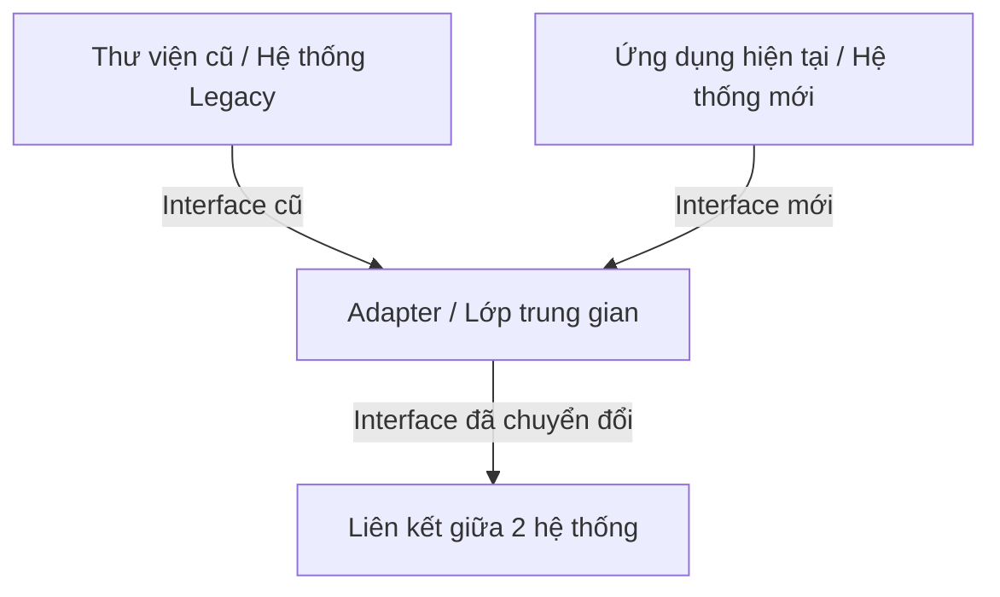

# Adapter Pattern

## Giới thiệu

### Định nghĩa Pattern

Adapter Pattern cho phép các đối tượng với các interface không tương thích có thể tương tác với nhau thông qua một "bộ chuyển đổi".

### Mục đích, ý tưởng chính của Pattern

Adapter Pattern giúp chuyển đổi interface của một lớp thành interface khác mà hệ thống mong muốn. Nó cho phép các lớp làm việc chung với nhau mà bình thường chúng không thể nào tương tác được.

## Đặt vấn đề

Gặp phải tình huống hai hệ thống có sẵn không thể tương tác trực tiếp với nhau do interface không tương thích. Ví dụ muốn tích hợp một thư viện cũ vào ứng dụng hiện tại nhưng interface không khớp.

Ví dụ:



## Giải quyết

Adapter Pattern giúp tạo ra một lớp trung gian, đóng vai trò nối kết và chuyển đổi interface giữa hai hệ thống.

## Cấu trúc

Các thành phần trong Adapter Pattern:

- **Target**: Interface mà client sử dụng.
- **Adapter**: Lớp trung gian, triển khai interface Target và chuyển đổi giao tiếp đến Adaptee.
- **Adaptee**: Lớp cần được adapt để phù hợp với interface Target.
- **Client**: Lớp tương tác với Target.


## Cách triển khai

1. Xác định interface của Target và Adaptee.
2. Tạo lớp Adapter, implement interface Target và chứa tham chiếu đến Adaptee.
3. Trong lớp Adapter, chuyển đổi các phương thức của Target thành các cuộc gọi tới Adaptee.
4. Client sẽ giao tiếp với Target thông qua Adapter.

## Ví dụ áp dụng Adapter Pattern

Bạn đã mô tả rất rõ thông qua việc chuyển đổi hiệu điện thế từ 220v xuống 3v để phù hợp với bóng đèn LED.

Mô hình thể hiện như sau:


### LedInterFace.java

```java
public interface LedInterFace {
    int connect();
}
```

### VietNamPower.java

```java
public class VietNamPower {
    private int electric = 220;

    public int getElectric() {
        return this.electric;
    }
}
```

### AdapterElectric.java

```java
public class AdapterElectric implements LedInterFace{
    VietNamPower adaptee;

    public AdapterElectric(VietNamPower adaptee) {
        this.adaptee = adaptee;
    }

    @Override
    public int connect() {
        int electric = this.downElectric(this.adaptee.getElectric());
        if (electric > 3)
            return -1;
        if (electric == 3)
            return 1;
        return 0;
    }

    private int downElectric(int electric) {
        return electric - 217;
    }
}
```

### Led.java

```java
public class Led {
    public static void main(String[] args) {
        LedInterFace led = new AdapterElectric(new VietNamPower());
        switch (led.connect()) {
            case -1:
                System.out.println("Crash");
                break;
            case 0:
                System.out.println("Not Thing");
                break;
            case 1:


                System.out.println("Light");
                break;
            default:
                System.out.println("Crash");
                break;
        }
    }
}
```

## Kết luận

Adapter Pattern giúp tích hợp và tái sử dụng code dễ dàng. Tuy nhiên, cần cân nhắc khi thêm một lớp trung gian. Sử dụng khi thực sự cần thiết, và đảm bảo nó không làm phức tạp hóa hệ thống.