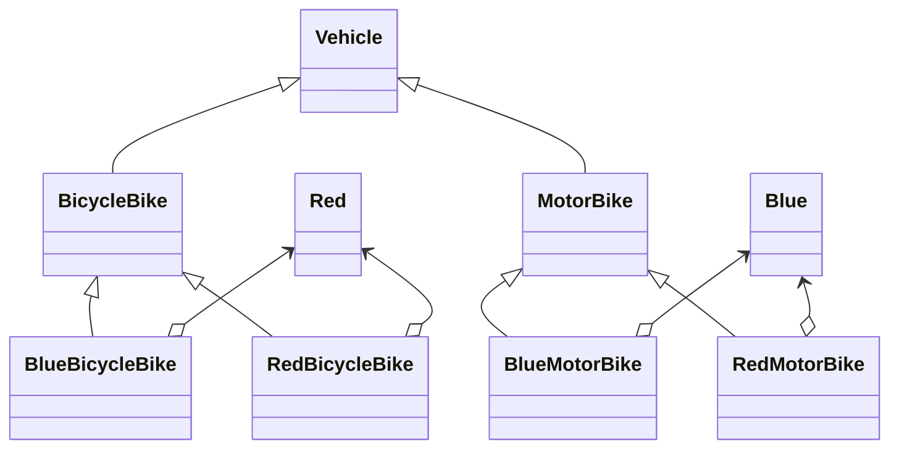
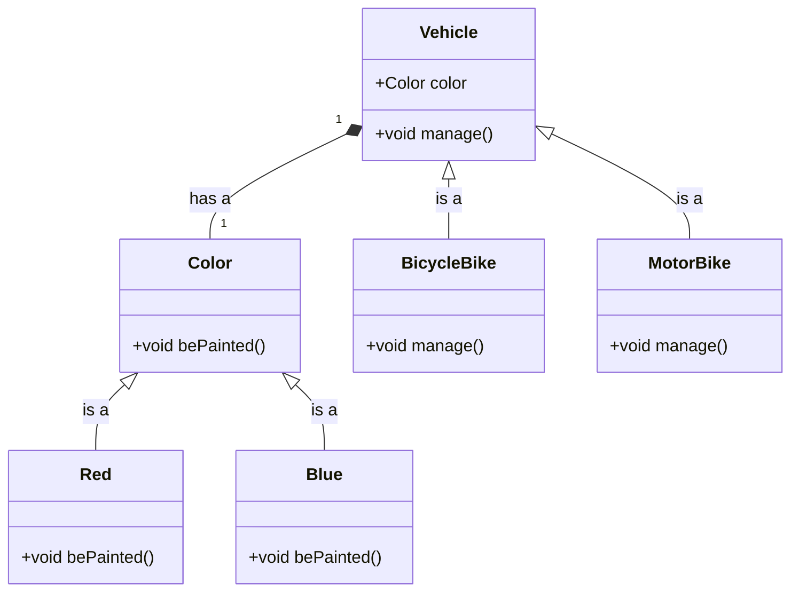
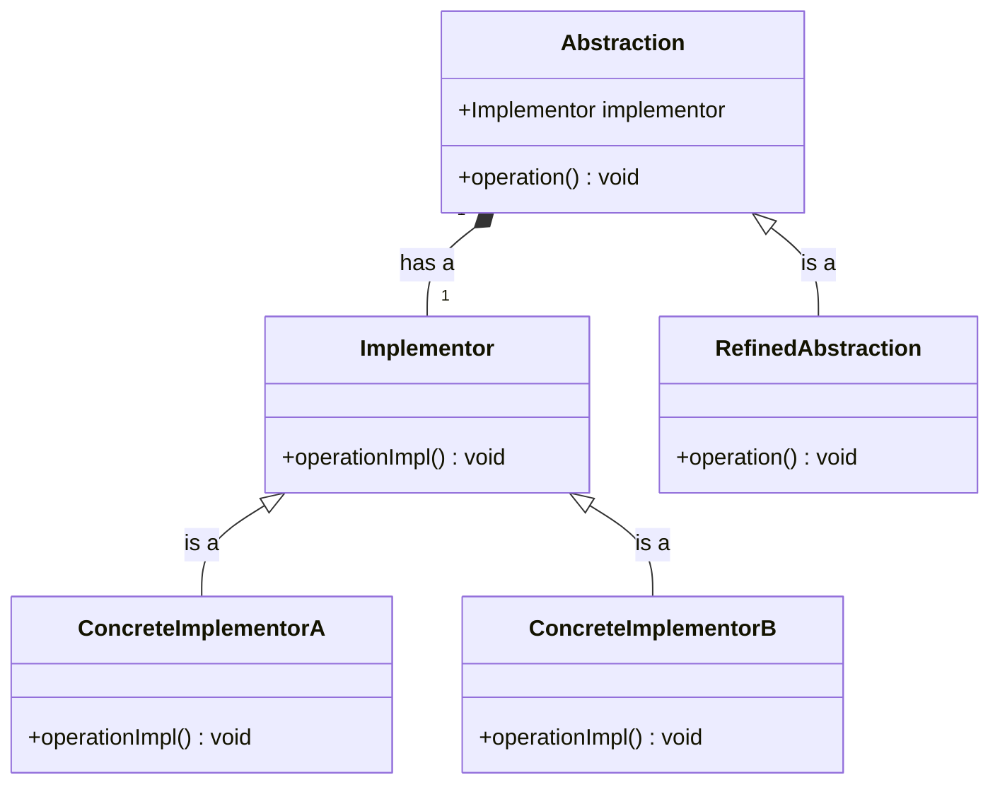

# Bridge Pattern

## Khái niệm

Bridge Pattern (mẫu cầu) là một mẫu thiết kế thuộc nhóm cấu trúc. Mục tiêu chính của mẫu này là tách rời một lớp lớn hoặc một nhóm các lớp có mối quan hệ chặt chẽ với nhau ra thành hai phần có thể phát triển một cách độc lập: abstraction (trừu tượng) và implementation (thực thi).

## Đặt vấn đề

Hãy tưởng tượng bạn có một lớp `Vehicle` với hai subclass là `BicycleBike` và `MotorBike`. Bây giờ, bạn muốn mở rộng tính năng bằng cách thêm màu sắc cho mỗi loại phương tiện, và bạn tạo ra hai thuộc tính là `Red` và `Blue`. Với cách tiếp cận này, bạn sẽ phải tạo ra tổng cộng bốn lớp con như `BlueBicycleBike` và `RedMotorBike`.



Khi bạn muốn thêm một loại phương tiện hoặc một màu sắc mới, bạn sẽ cần tạo thêm nhiều lớp con, làm cho hệ thống trở nên phức tạp và khó kiểm soát.

## Giải pháp

Vấn đề ở đây là chúng ta đang cố gắng tích hợp quá nhiều tính năng vào một lớp trừu tượng, trong khi mỗi tính năng đều có tiềm năng phát triển theo hướng riêng biệt.



Bridge Pattern giải quyết vấn đề này bằng cách tách biệt lớp trừu tượng (abstraction) và các đối tượng thực thi (implementation), sau đó kết nối chúng lại với nhau thông qua một "cầu" (bridge). Trong ví dụ này, một phương tiện sẽ có một thuộc tính màu sắc, tạo ra mối quan hệ "has-a" (có một) thay vì "is-a" (là một).

## Cấu Trúc



1. **The Abstraction** (`Abstraction`): Lớp cơ sở cung cấp mức độ trừu tượng cho việc quản lý các công việc do các đối tượng cụ thể thực hiện (Implementation).
2. **The Implementation** (`Implementor`): Giao diện định nghĩa các tác vụ cần thiết cho lớp trừu tượng. Đây thường là một giao diện xác định các tác vụ cần thiết cho lớp trừu tượng.
3. **Concrete Implementations** (`ConcreteImplementor`): Các lớp này chứa logic cụ thể và thực hiện các tác vụ được định nghĩa bởi `Implementor`.
4. **Refined Abstractions** (`RefinedAbstraction`): Các lớp con của `Abstraction` thực hiện và mở rộng các phương thức được xác định trong lớp `Abstraction`.

## Ví dụ áp dụng Bridge Pattern


Để hiểu rõ hơn về cách Bridge Pattern hoạt động, hãy xem xét ví dụ về một hệ thống ngân hàng cung cấp các loại tài khoản khác nhau:

**Account.java**
```java
public interface Account {
    void openAccount();
}
```

**CheckingAccount.java**
```java
public class CheckingAccount implements Account{
    @Override
    public void openAccount() {
        System.out.println("Opening a Checking Account!");
    }
}
```

**TutorialAccount.java**
```java
public class TutorialAccount implements Account{
    @Override
    public void openAccount() {
        System.out.println("Please select your language");
    }
}
```

**Bank.java**
```java
public abstract class Bank {
    protected Account account;

    public Bank(Account account) {
        this.account = account;
    }

    public abstract void openAccount();
}
```

**MMBank.java**
```java
public class MMBank extends Bank {

    public MMBank(Account account) {
        super(account);
    }

    @Override
    public void openAccount() {
        System.out.println("Welcome to MMBank");
        account.openAccount();
    }
}
```

**TPBank.java**
```java
public class TPBank

 extends Bank {

    public TPBank(Account account) {
        super(account);
    }

    @Override
    public void openAccount() {
        System.out.println("Welcome to TPBank");
        account.openAccount();
    }
}
```

**demo.java**
```java
public class demo {
    public static void main(String[] args) {
        Bank tpBank = new TPBank(new TutorialAccount());
        tpBank.openAccount();

        System.out.println();

        Bank mmBank = new MMBank(new CheckingAccount());
        mmBank.openAccount();
    }
}
```

Kết quả khi chạy chương trình:

```
Welcome to TPBank
Please select your language

Welcome to MMBank
Opening a Checking Account!
```

Như bạn thấy trong ví dụ trên, `Bank` là một lớp trừu tượng kết hợp với interface `Account`. Các lớp cụ thể như `TPBank` và `MMBank` kế thừa từ lớp `Bank` và quyết định cách họ muốn mở tài khoản dựa trên loại tài khoản cụ thể (như `CheckingAccount` hoặc `TutorialAccount`). Nhờ sử dụng Bridge Pattern, chúng ta có thể mở rộng cả hai hệ thống (loại ngân hàng và loại tài khoản) một cách độc lập mà không làm ảnh hưởng đến nhau.

## Kết luận

Bridge Pattern là một mẫu thiết kế hiệu quả giúp tách rời các khía cạnh trừu tượng và thực thi của một lớp, giúp chúng có thể thay đổi và phát triển một cách độc lập. Điều này không chỉ giúp giảm thiểu sự phức tạp khi mở rộng hệ thống mà còn cung cấp khả năng linh hoạt hơn trong việc quản lý và mở rộng code.
