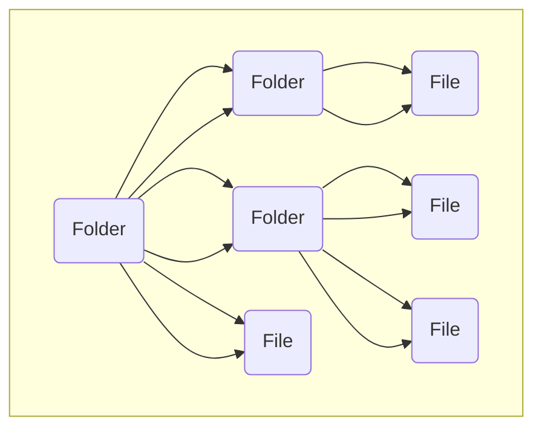
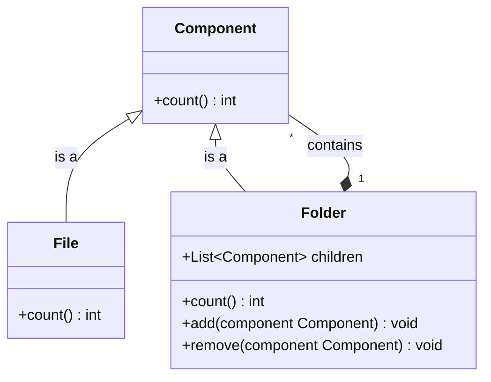
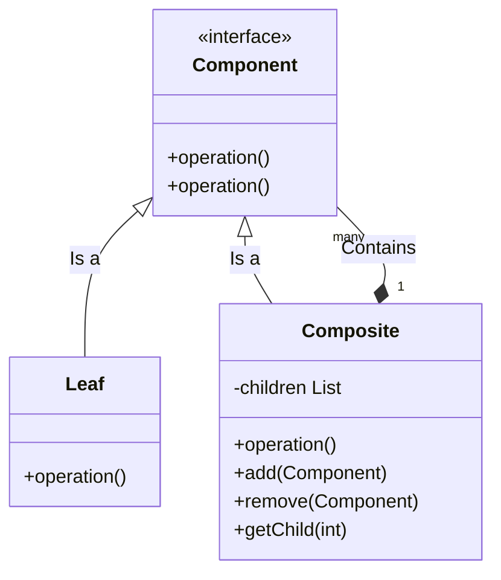

# Composite Pattern

## Khái niệm

**Composite** là một Pattern thuộc nhóm cấu trúc cho phép bạn tổ chức các đối tượng (object) theo cấu trúc cây và làm việc với các cấu trúc này như một đối tượng độc lập.

## Đặt vấn đề

Khi sử Composite Pattern bạn phải chắc chắn rằng mô hình ứng dụng của bạn có thể biểu hiện bằng sơ đồ cây.



Ví dụ như sau: Trong việc lưu trữ trong máy tính có hai dạng chính: `Folder` và `File`. Một `Folder` thì có thể chứa nhiều `Folder` và `File`. Có thể một trong `Folder` chỉ chứa `File` và trong `File` thì chứa nội dụng.

Giờ giả sử ta cần tìm tất cả File trong một Folder. Thử cách tiếp cận thông thường là ta sẽ mở từng Folder con ra và đếm xem co bao nhiêu File vào Folder tiếp theo đếm tiếp. Nhưng trong lập trình nó không hề đơn giản như việc bạn chỉ cần chạy một dòng for. Bạn phải biết trước loại  File và Folder mà sẽ duyệt và mực đồ lòng vào nhau. Tất cả điều đó làm cho cách tiếp cận này trở nên khó khăn hơn.

## Giải pháp

Chúng ta sẽ sử chung Composite Pattern để thực hiện công việc với Folder và File bằng cách tạo một interrface chung với một phương thức count(Đếm)



Cái này hoạt động như sau. Đối với File thì chỉ trả về cộng một, Đối với Folder thì nó sẽ duyệt từng item trong Folder đó, bắt từng item đếm sau cùng tới lượt nó tổng hợp lại và trả về tổng số của Folder. Nếu một các item là Folder thì sao? Thì nó sẽ bắt Folder con đó đi đếm các thành item nằm trong Folder con và trả về tổng số.

Nói đến đây các bạn sẽ nói, ô đây là "Rùa Em" (Đệ Quy). Nhưng với Composite nó sẽ có hiệu quả gì ? Nó sẽ giúp bạn làm việc với các thành phần một cách dể dàng, chỉ cần thông qua interface mà không phải xử lý rác rối sâu đến bên trong. Nhưng lời kêu gọi của bạn sẽ được xử lý chạy dần xuống theo cấu trúc cây.

## Cấu Trúc



- **Component**: interface chung, mô ta các phương thức chung của thành phần trong cây.
- **Leaf**:  Đây là thành phần cơ bản của cây, nó không có các node con.
- **Composite**: lưu trữ tập hợp các Leaf và cài đặt các phương thức của Component.

## Ví dụ áp dụng Composite Pattern


Chúng ta làm ví dụ ở trên nhưng thay đối một ít là ta sẽ xem tổng folder có size bao nhiêu

FileComponent.kt

```kotlin
interface FileComponent {
    fun showProperty()
    fun size() : Long
}
```

FileLeaf.kt

```kotlin
class FileLeaf : FileComponent {

    private var name:String
    private var size:Long

    constructor(name: String, size: Long) {
        this.name = name
        this.size = size
    }


    override fun showProperty() {
        System.out.println(this.name)
    }

    override fun size(): Long {
        return size;
    }
}
```

FolderComposite.kt

```kotlin
class FolderComposite : FileComponent{

    private var files: List<FileComponent>

    constructor(files: List<FileComponent>) {
        this.files = files
    }

    override fun showProperty() {
        for (file in this.files)
        {
            file.showProperty()
        }

    }

    override fun size(): Long {
        var total : Long = 0
        for (file in this.files) {
            total += file.size()
        }
        return total
    }

}
```

Kết quả

```
file 1
file 2
file 3
Total Size: 27
```

## Khi nào nên sử dụng

- Sử dụng khi bạn có thể triển khai dưới cấu trúc dạng cây.
- SỬ dụng khi bạn muốn người sử dụng lại module này sử lý một cách đồng nhất giữa đối tượng đơn giản và đối tượng phức tạp
