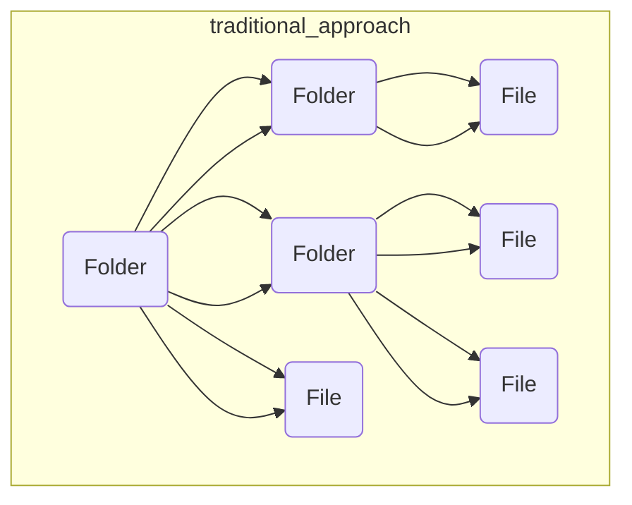
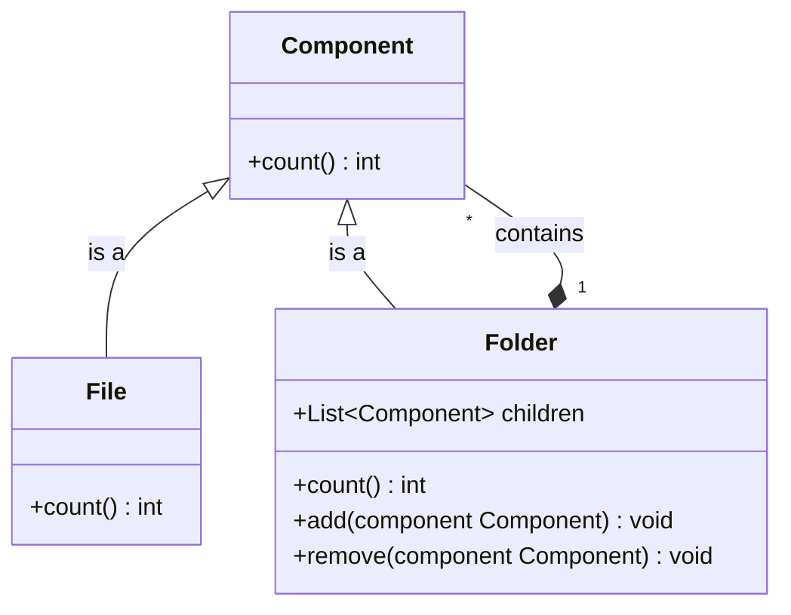
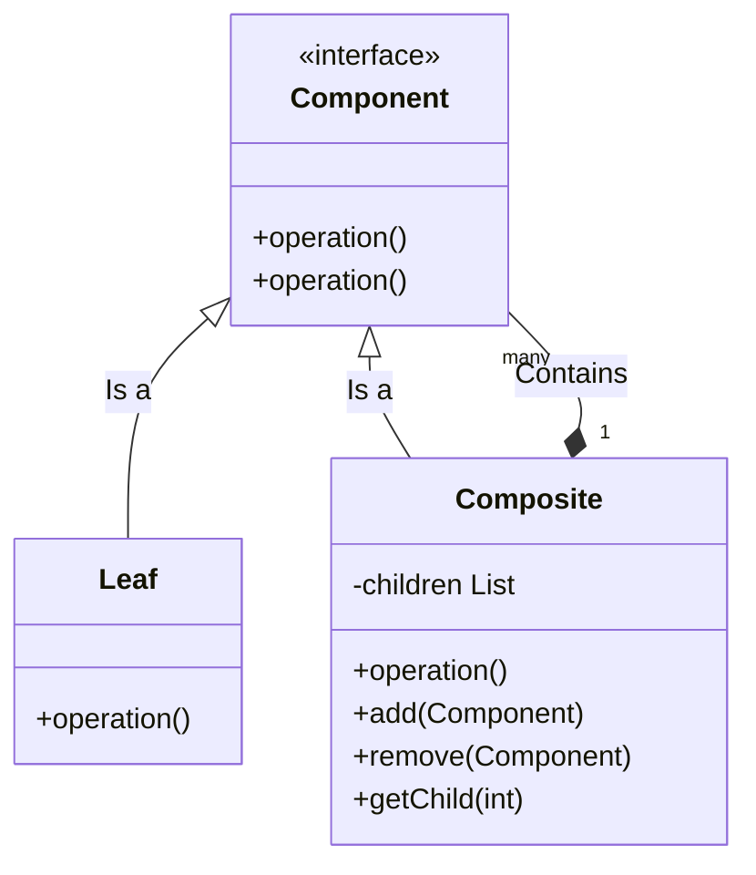

# Composite Pattern

> [!WARNING]
> * Bài này sẽ được cập nhât ở [github sau](https://github.com/nguyenphuc22/Design-Patterns/blob/main/Writerside/topics/Composite.md) và [website sau](https://nguyenphuc22.github.io/Design-Patterns/composite.html).
> * File này sẽ được xoá vào cập nhật version_1


## Giới thiệu

### Định nghĩa Pattern
Composite Pattern là một mẫu thiết kế thuộc nhóm cấu trúc, được sử dụng để tổ chức các đối tượng vào một cấu trúc cây. Mẫu thiết kế này tạo ra một hệ thống phân cấp cho phép người dùng xử lý các đối tượng đơn lẻ và tổ hợp của chúng một cách thống nhất.

### Mục đích
Mục đích chính của Composite Pattern là đơn giản hóa quá trình làm việc với các cấu trúc phức tạp bằng cách cho phép client tương tác với các đối tượng đơn lẻ và tổ hợp theo cùng một cách. Điều này giúp giảm thiểu sự phức tạp khi quản lý và tương tác với cấu trúc cây, làm cho mã nguồn dễ bảo trì và mở rộng hơn.

### Ý tưởng chính của Pattern
Ý tưởng cốt lõi của Composite Pattern nằm ở việc cung cấp một interface chung cho cả hai loại đối tượng: đơn lẻ và tổ hợp. Interface này cho phép client tương tác với mỗi đối tượng một cách riêng lẻ hoặc nhóm các đối tượng lại với nhau như một thể thống nhất mà không cần quan tâm đến đặc điểm nội tại của chúng. Kết quả là, client có thể thêm, xóa hoặc thay đổi các đối tượng trong cấu trúc cây một cách linh hoạt mà không cần viết lại code hoặc hiểu biết sâu sắc về cấu trúc nội bộ.

## Đặt vấn đề

Khi sử Composite Pattern bạn phải chắc chắn rằng mô hình ứng dụng của bạn có thể biểu hiện bằng sơ đồ cây.

Ví dụ như sau: Trong việc lưu trữ trong máy tính có hai dạng chính: `Folder` và `File`. Một `Folder` thì có thể chứa nhiều `Folder` và `File`. Có thể một trong `Folder` chỉ chứa `File` và trong `File` thì chứa nội dụng.



Giờ giả sử ta cần tìm tất cả File trong một Folder. Thử cách tiếp cận thông thường là ta sẽ mở từng Folder con ra và đếm xem co bao nhiêu File vào Folder tiếp theo đếm tiếp. Nhưng trong lập trình nó không hề đơn giản như việc bạn chỉ cần chạy một dòng for. Bạn phải biết trước loại  File và Folder mà sẽ duyệt và mực đồ lòng vào nhau. Tất cả điều đó làm cho cách tiếp cận này trở nên khó khăn hơn.

## Giải pháp

Chúng ta sẽ sử chung Composite Pattern để thực hiện công việc với Folder và File bằng cách tạo một interrface chung với một phương thức count(Đếm)



Cái này hoạt động như sau. Đối với File thì chỉ trả về cộng một, Đối với Folder thì nó sẽ duyệt từng item trong Folder đó, bắt từng item đếm sau cùng tới lượt nó tổng hợp lại và trả về tổng số của Folder. Nếu một các item là Folder thì sao? Thì nó sẽ bắt Folder con đó đi đếm các thành item nằm trong Folder con và trả về tổng số.

Nói đến đây các bạn sẽ nói, ô đây là "Rùa Em" (Đệ Quy). Nhưng với Composite nó sẽ có hiệu quả gì ? Nó sẽ giúp bạn làm việc với các thành phần một cách dể dàng, chỉ cần thông qua interface mà không phải xử lý rác rối sâu đến bên trong. Nhưng lời kêu gọi của bạn sẽ được xử lý chạy dần xuống theo cấu trúc cây.

## Cấu Trúc



- **Component**: interface chung, mô ta các phương thức chung của thành phần trong cây.
- **Leaf**:  Đây là thành phần cơ bản của cây, nó không có các node con.
- **Composite**: lưu trữ tập hợp các Leaf và cài đặt các phương thức của Component.

## Cách triển khai

### **Bước 1: Xây dựng Component**

```java
public abstract class Component {
    protected String name;
    
    public Component(String name) {
        this.name = name;
    }
    
    public abstract void add(Component component);
    public abstract void remove(Component component);
    public abstract void display(int depth);
}
```

### **Bước 2: Xây dựng Leaf**

```java
public class Leaf extends Component {
    public Leaf(String name) {
        super(name);
    }
    
    @Override
    public void add(Component component) {
        // Không thực hiện bất cứ điều gì
    }
    
    @Override
    public void remove(Component component) {
        // Không thực hiện bất cứ điều gì
    }
    
    @Override
    public void display(int depth) {
        System.out.println("-".repeat(depth) + name);
    }
}
```

### **Bước 3: Xây dựng Composite**

```java
import java.util.ArrayList;
import java.util.List;

public class Composite extends Component {
    private List<Component> children = new ArrayList<>();

    public Composite(String name) {
        super(name);
    }
    
    @Override
    public void add(Component component) {
        children.add(component);
    }
    
    @Override
    public void remove(Component component) {
        children.remove(component);
    }
    
    @Override
    public void display(int depth) {
        System.out.println("-".repeat(depth) + name);
        for (Component component : children) {
            component.display(depth + 2);
        }
    }
}
```

### **Bước 4: Sử dụng mẫu Composite**

```java
public class Client {
    public static void main(String[] args) {
        Composite root = new Composite("root");
        root.add(new Leaf("Leaf A"));
        root.add(new Leaf("Leaf B"));
        
        Composite comp = new Composite("Composite X");
        comp.add(new Leaf("Leaf XA"));
        comp.add(new Leaf("Leaf XB"));
        
        root.add(comp);
        
        root.display(1);
    }
}
```

Kết quả:

```
-root
--Leaf A
--Leaf B
--Composite X
---Leaf XA
---Leaf XB
```

## Ví dụ áp dụng Composite Pattern


Chúng ta làm ví dụ ở trên nhưng thay đối một ít là ta sẽ xem tổng folder có size bao nhiêu

FileComponent.kt

```kotlin
interface FileComponent {
    fun showProperty()
    fun size() : Long
}
```

FileLeaf.kt

```kotlin
class FileLeaf : FileComponent {

    private var name:String
    private var size:Long

    constructor(name: String, size: Long) {
        this.name = name
        this.size = size
    }


    override fun showProperty() {
        System.out.println(this.name)
    }

    override fun size(): Long {
        return size;
    }
}
```

FolderComposite.kt

```kotlin
class FolderComposite : FileComponent{

    private var files: List<FileComponent>

    constructor(files: List<FileComponent>) {
        this.files = files
    }

    override fun showProperty() {
        for (file in this.files)
        {
            file.showProperty()
        }

    }

    override fun size(): Long {
        var total : Long = 0
        for (file in this.files) {
            total += file.size()
        }
        return total
    }

}
```

Kết quả

```
file 1
file 2
file 3
Total Size: 27
```

## So sánh Composite Pattern 

### 1. Composite vs Adapter:

- **Composite**: Được sử dụng để biểu diễn và quản lý một nhóm đối tượng như một đối tượng đơn lẻ.
- **Adapter**: Được sử dụng để cho phép hai interfaces không tương thích có thể làm việc cùng nhau mà không cần phải sửa đổi bất kỳ lớp nào.

### 2. Composite vs Decorator:

- **Composite**: Tập trung vào việc tạo ra cấu trúc dạng cây, nơi một nhóm đối tượng và đối tượng đơn lẻ có thể được xử lý theo cùng một cách.
- **Decorator**: Mục tiêu là mở rộng chức năng của một đối tượng mà không cần sửa đổi chúng.

### 3. Composite vs Facade:

- **Composite**: Xây dựng một cấu trúc dạng cây và làm việc với một nhóm đối tượng giống như một đối tượng duy nhất.
- **Facade**: Cung cấp một giao diện đơn giản hoá cho một hệ thống phức tạp, giúp giảm sự phức tạp của việc gọi đến các API hoặc hệ thống phức tạp.

### 4. Composite vs Proxy:

- **Composite**: Biểu diễn và quản lý một nhóm đối tượng dưới dạng cấu trúc cây.
- **Proxy**: Đại diện cho một đối tượng khác và kiểm soát việc truy cập đến đối tượng đó, thường được sử dụng để điều khiển quyền truy cập hoặc tối ưu hóa việc tạo đối tượng.

### Kết luận

Composite Pattern là một mẫu thiết kế hữu ích để xây dựng và quản lý cấu trúc phân cấp dưới dạng cây của các đối tượng. Nó cho phép chúng ta làm việc với một nhóm đối tượng như một đối tượng đơn lẻ, mang lại khả năng tổ chức và quản lý phân cấp một cách linh hoạt và thuận tiện.

#### Ưu điểm:
- **Tích hợp Mạnh**: Composite Pattern giúp tích hợp các đối tượng vào một cấu trúc dạng cây một cách dễ dàng.
- **Linh Hoạt**: Cho phép bạn thêm, xóa hoặc sửa đổi các đối tượng trong cấu trúc một cách linh hoạt mà không làm ảnh hưởng đến toàn bộ cấu trúc.
- **Tính Nhất quán**: Cấu trúc được xây dựng dưới dạng cây giúp việc làm việc với đối tượng đơn lẻ và nhóm đối tượng trở nên nhất quán.

#### Nhược điểm:
- **Quá mức Tổng quát**: Có thể tạo ra quá nhiều lớp và đối tượng nếu mẫu được sử dụng không cẩn thận.

#### Hướng dẫn sử dụng:
- **Nên sử dụng khi**:
    - Bạn muốn biểu diễn và quản lý một nhóm đối tượng dưới dạng cấu trúc cây.
    - Cần làm việc với các đối tượng và nhóm đối tượng theo cùng một cách.
    - Muốn cung cấp một giao diện chung cho cả đối tượng đơn lẻ và nhóm đối tượng.

- **Không nên sử dụng khi**:
    - Không có nhu cầu xây dựng cấu trúc dạng cây hoặc quản lý các đối tượng dưới dạng phân cấp.
    - Cấu trúc dạng cây có thể trở nên quá phức tạp và không cần thiết cho ứng dụng của bạn.

