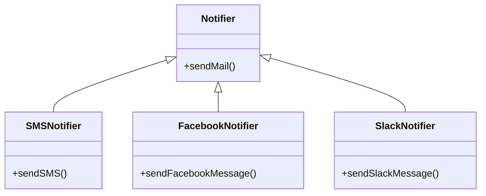
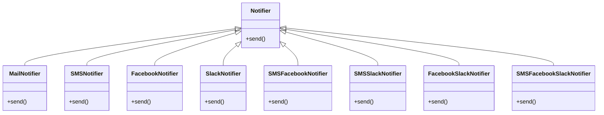
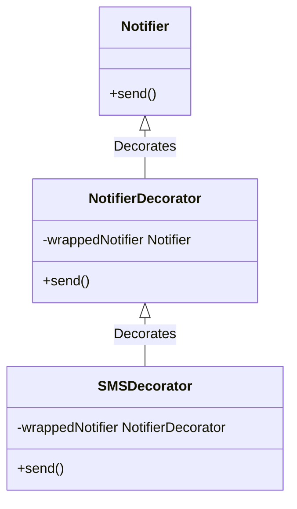
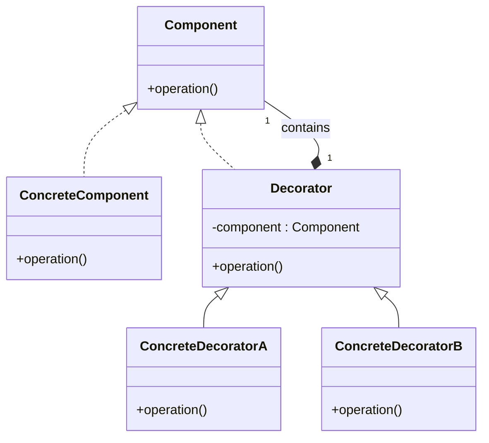

# Decorator Pattern

## Khái Niệm

Trong thế giới lập trình, một thách thức lớn là làm thế nào để mở rộng chức năng của một hệ thống mà không làm rối loạn cấu trúc hiện có. **Decorator Pattern**, một trong những mẫu thiết kế cấu trúc quan trọng, xuất hiện như một giải pháp linh hoạt. Pattern này cho phép "trang trí" thêm hành vi cho đối tượng mà không cần thay đổi cấu trúc nội tại của chúng, hỗ trợ mở rộng chức năng mà vẫn tuân thủ nguyên tắc đóng mở (Open/Closed Principle).

### Tổng quan

- **Định Nghĩa của Pattern**: Decorator Pattern cho phép thêm các tính năng mới cho một đối tượng thông qua một lớp trang trí, mà không cần sửa đổi lớp đó.

- **Mục Đích**: Mẫu thiết kế này hữu ích khi cần mở rộng chức năng đối tượng mà không ảnh hưởng đến các đối tượng khác.

- **Ý Tưởng Cốt Lõi**: Bằng cách sử dụng thành phần (composition), Decorator Pattern thêm "vỏ bọc" cho đối tượng cơ bản, cung cấp hành vi thêm vào và có thể thay đổi tại runtime.

## Đặt Vấn Đề

Hãy tưởng tượng bạn có một lớp Notifier, chuyên trách gửi thông báo qua email. Khi người dùng muốn thêm tính năng thông báo qua SMS, Facebook, và thậm chí là Slack, việc tiếp tục tạo thêm và kế thừa từ lớp Notifier ban đầu dường như là một giải pháp đơn giản.



Tuy nhiên, khi nhu cầu thông báo trở nên đa dạng và phức tạp hơn, việc quản lý số lượng lớn các lớp con trở nên khó khăn và không hiệu quả. Đặc biệt là khi người dùng cần kết hợp nhiều hình thức thông báo cùng một lúc, cấu trúc mã nguồn có thể trở nên cồng kềnh và khó bảo trì.



Đây là lúc mà Decorator Pattern trở nên quan trọng và thiết thực. Pattern này cho phép chúng ta "trang trí" các đối tượng với các chức năng mới mà không cần phải thay đổi cấu trúc nội tại của chúng, mang lại sự linh hoạt và dễ dàng mở rộng mà không làm ảnh hưởng đến các thành phần khác trong hệ thống.

## Giải pháp

Để giải quyết vấn đề mở rộng chức năng một cách hiệu quả, Decorator Pattern cung cấp một giải pháp linh hoạt. Thay vì tạo ra một loạt các lớp con, mỗi lớp với một chức năng cụ thể, chúng ta có thể sử dụng mô hình "trang trí" này để bổ sung chức năng mới.

Xét về trường hợp thêm chức năng SMS, Decorator Pattern cho phép chúng ta "bọc" đối tượng `Notifier` ban đầu trong một lớp `NotifierDecorator`, sau đó thêm một lớp `SMSDecorator` bổ sung chức năng gửi SMS. `SMSDecorator` sẽ không thay thế lớp `Notifier` gốc mà là mở rộng chức năng của nó. Khi phương thức `send()` được gọi trên `SMSDecorator`, nó sẽ thực hiện cả hành động gửi email thông qua `Notifier` gốc cùng với việc gửi tin nhắn SMS mới được thêm vào.



Mô hình này không chỉ đơn giản hóa quá trình quản lý mã nguồn bằng cách giảm thiểu số lượng lớp cần phải xử lý, mà còn cung cấp sự linh hoạt để dễ dàng thêm hoặc bớt các "vỏ bọc" mà không ảnh hưởng tới hệ thống hiện có.

Hãy xem xét một ví dụ cụ thể về việc áp dụng Decorator Pattern:

```java
// Interface chung cho tất cả các thông báo
public interface Notifier {
    void send(String message);
}

// Lớp cơ bản thực hiện việc gửi thông báo qua email
public class EmailNotifier implements Notifier {
    public void send(String message) {
        // Gửi thông báo qua email
    }
}

// Decorator cơ bản
public abstract class NotifierDecorator implements Notifier {
    protected Notifier wrappedNotifier;

    public NotifierDecorator(Notifier notifier) {
        this.wrappedNotifier = notifier;
    }

    public void send(String message) {
        wrappedNotifier.send(message);
    }
}

// Thêm chức năng gửi SMS vào thông báo
public class SMSDecorator extends NotifierDecorator {
    public SMSDecorator(Notifier notifier) {
        super(notifier);
    }

    @Override
    public void send(String message) {
        super.send(message); // Gửi email
        // Thêm mã để gửi SMS ở đây
    }
}
```

Trong ví dụ trên, chúng ta tạo ra một `SMSDecorator` mới từ `EmailNotifier` và bổ sung chức năng gửi tin nhắn SMS. Khi một thông báo cần được gửi, `SMSDecorator` sẽ gọi cả hai phương thức `send()` - từ `EmailNotifier` và từ mã SMS được thêm vào. Như vậy, Decorator Pattern không chỉ giải quyết vấn đề mở rộng mà còn giữ cho cấu trúc mã nguồn gọn gàng và dễ quản lý.

Sự linh hoạt mà Decorator Pattern cung cấp là một trong những lợi ích chính của nó. Bạn không chỉ có thể thêm các chức năng mới một cách dễ dàng mà còn có thể xóa bỏ hoặc thay thế chúng mà không cần phải sửa đổi các lớp đã tồn tại. Điều này làm giảm đáng kể nguy cơ phá vỡ hệ thống hiện tại khi mở rộng hoặc cập nhật chức năng.

Tuy nhiên, việc áp dụng Decorator Pattern cũng đòi hỏi phải cân nhắc một cách cẩn thận. Mỗi "vỏ bọc" mới thêm vào có thể làm tăng độ phức tạp của quá trình debug và theo dõi mã nguồn, đặc biệt là khi có nhiều lớp trang trí được áp dụng cùng một lúc. Đồng thời, cần phải đảm bảo rằng mọi thành viên trong đội ngũ phát triển đều hiểu rõ về pattern này để có thể sử dụng nó một cách hiệu quả.

### Cấu Trúc Decorator Pattern



1. **Component**: Đây là interface chung cho tất cả đối tượng, cả cơ bản và trang trí, trong mẫu này. Nó quy định các phương thức chung cần có.

2. **ConcreteComponent**: Đây là lớp triển khai interface `Component`. Nó định nghĩa một đối tượng cơ bản có thể có chức năng được "trang trí" bởi Decorators.

3. **Decorator**: Lớp trung gian này nắm giữ một tham chiếu đến một đối tượng `Component` và cung cấp giao diện tương tự như `Component`. Mục đích của nó là để kế thừa từ lớp `Component` và mở rộng chức năng của nó.

4. **ConcreteDecorator**: Những lớp này thực hiện việc trang trí cụ thể. Mỗi `ConcreteDecorator` thêm các chức năng hoặc trách nhiệm mới cho `Component` mà nó trang trí.

Các thành phần này tương tác với nhau như sau: `ConcreteComponent` là đối tượng cơ bản được trang trí. `Decorator` chứa một tham chiếu đến `Component` và định nghĩa giao diện phù hợp với `Component`. `ConcreteDecorator` thực hiện các phương thức của `Decorator` và thêm chức năng mới. Khi một phương thức trong `Decorator` được gọi, nó chuyển tiếp yêu cầu đến đối tượng `Component` mà nó trang trí, có thể thực hiện thêm các hành động trước hoặc sau khi chuyển tiếp yêu cầu.

Cấu trúc này giúp tạo ra các đối tượng với chức năng mở rộng một cách linh hoạt, mà không làm thay đổi cấu trúc nội tại hoặc mã nguồn của đối tượng gốc.


### Ví dụ Áp Dụng Decorator Pattern

Hãy xem xét một ví dụ khác về Decorator Pattern, lần này trong một ngữ cảnh khác: một ứng dụng quản lý cà phê. Trong ví dụ này, chúng ta có một lớp cơ bản `Coffee` cùng với một số lớp trang trí (decorators) như `MilkDecorator`, `SugarDecorator`, và `WhipDecorator` để thêm các thành phần khác nhau vào cà phê.

Cấu trúc cơ bản của `Coffee` được xác định như sau:

```java
interface Coffee {
    String getDescription();
    double getCost();
}

class SimpleCoffee implements Coffee {
    @Override
    public String getDescription() {
        return "Simple Coffee";
    }

    @Override
    public double getCost() {
        return 2.0;
    }
}
```

Chúng ta tiếp tục với việc tạo các lớp trang trí:

```java
abstract class CoffeeDecorator implements Coffee {
    protected Coffee decoratedCoffee;

    public CoffeeDecorator(Coffee coffee) {
        this.decoratedCoffee = coffee;
    }

    public String getDescription() {
        return decoratedCoffee.getDescription();
    }

    public double getCost() {
        return decoratedCoffee.getCost();
    }
}

class MilkDecorator extends CoffeeDecorator {
    public MilkDecorator(Coffee coffee) {
        super(coffee);
    }

    @Override
    public String getDescription() {
        return super.getDescription() + ", Milk";
    }

    @Override
    public double getCost() {
        return super.getCost() + 0.5;
    }
}

class SugarDecorator extends CoffeeDecorator {
    public SugarDecorator(Coffee coffee) {
        super(coffee);
    }

    @Override
    public String getDescription() {
        return super.getDescription() + ", Sugar";
    }

    @Override
    public double getCost() {
        return super.getCost() + 0.2;
    }
}
```

Cuối cùng, chúng ta sử dụng Decorator Pattern để tạo một ly cà phê theo yêu cầu:

```java
public class CoffeeShop {
    public static void main(String[] args) {
        Coffee myCoffee = new SimpleCoffee();
        myCoffee = new MilkDecorator(myCoffee);
        myCoffee = new SugarDecorator(myCoffee);

        System.out.println("Description: " + myCoffee.getDescription());
        System.out.println("Cost: $" + myCoffee.getCost());
    }
}
```

Kết quả:

```
Description: Simple Coffee, Milk, Sugar
Cost: $2.7
```

Trong ví dụ này, Decorator Pattern cho phép chúng ta thêm hoặc thay đổi chức năng của các đối tượng `Coffee` mà không cần thay đổi cấu trúc của lớp cơ bản. Điều này cung cấp sự linh hoạt tối đa trong việc tạo ra các biến thể của sản phẩm mà không phải viết lại mã nguồn hay tạo ra nhiều lớp con khác nhau.

## Khi nào Áp dụng

Sử dụng Decorator Pattern khi bạn muốn:

1. Gán thêm các hành vi vào đối tượng mà không cần thay đổi đối tượng.
2. Mở rộng chức năng một cách linh hoạt và hiệu quả mà không làm tăng độ phức tạp của mã nguồn.

Decorator Pattern là một giải pháp tuyệt vời cho việc mở rộng chức năng mà không vi phạm nguyên tắc thiết kế, đồng thời
