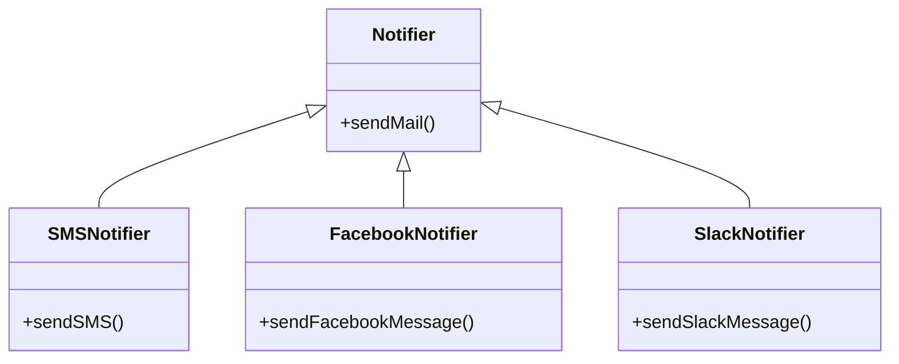
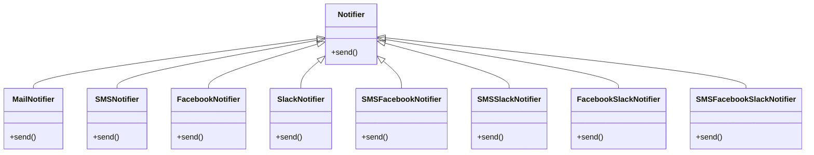
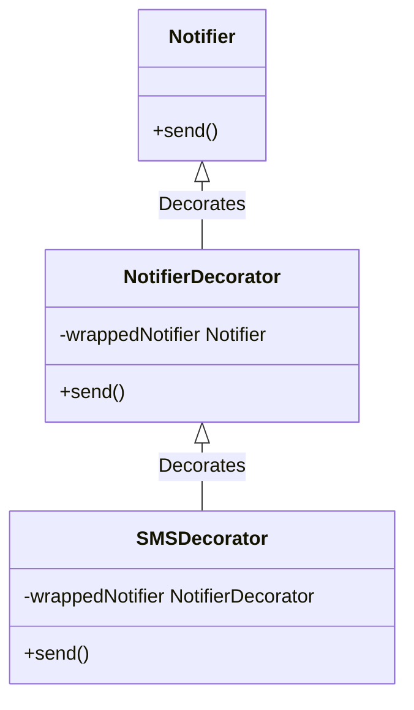
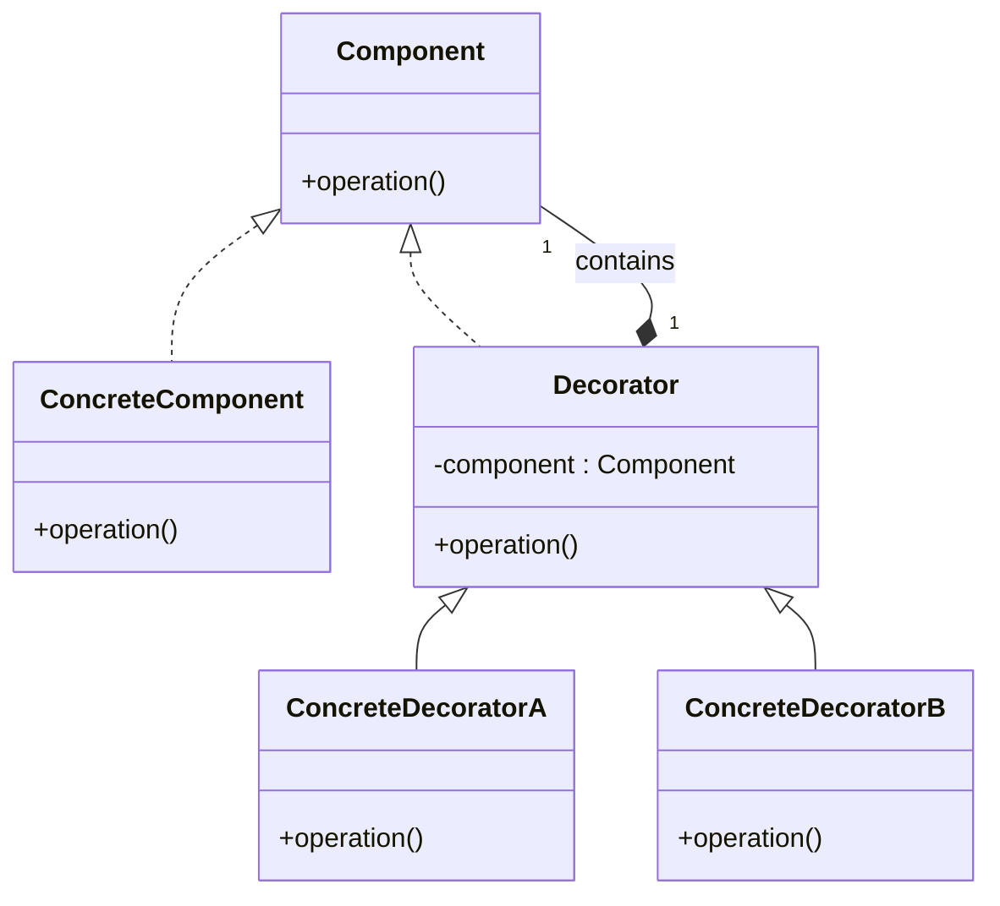

# Decorator Pattern

## Khái Niệm

**Decorator Pattern** nằm trong số những mẫu thiết kế cấu trúc (Structural Pattern) quan trọng. Mẫu thiết kế này cung cấp một giải pháp linh hoạt để "trang trí" thêm hành vi cho đối tượng mà không can thiệp vào cấu trúc nội tại của chúng, qua đó giúp mở rộng chức năng mà không vi phạm nguyên tắc đóng mở (Open/Closed Principle).

### Giới Thiệu

- **Định Nghĩa của Pattern**: Decorator Pattern là phương pháp mà qua đó bạn có thể thêm các tính năng mới cho một đối tượng mà không cần thay đổi định nghĩa của lớp đó, thông qua một lớp trang trí.

- **Mục Đích**: Mẫu thiết kế này được sử dụng khi bạn cần mở rộng chức năng của một đối tượng mà không muốn ảnh hưởng đến các đối tượng khác hoặc muốn giữ khả năng tái sử dụng của đối tượng đó.

- **Ý Tưởng Cốt Lõi**: Cốt lõi của Decorator Pattern là việc sử dụng thành phần (composition) để thêm "vỏ bọc" cho đối tượng cơ bản. Vỏ bọc này không chỉ cung cấp thêm hành vi mà còn có thể được dỡ bỏ hoặc thay thế tùy theo nhu cầu tại runtime, mang lại tính linh hoạt cao.

## Đặt Vấn Đề

Trong thế giới lập trình, việc mở rộng chức năng của một hệ thống thường đem lại sự thách thức đáng kể. Hãy tưởng tượng bạn có một lớp `Notifier`, chuyên trách gửi thông báo qua email. Khi người dùng muốn thêm tính năng thông báo qua SMS, Facebook, và thậm chí là Slack, việc tiếp tục tạo thêm và kế thừa từ lớp `Notifier` ban đầu dường như là một giải pháp đơn giản.



Tuy nhiên, khi nhu cầu thông báo trở nên đa dạng và phức tạp hơn, việc quản lý số lượng lớn các lớp con trở nên khó khăn và không hiệu quả. Đặc biệt là khi người dùng cần kết hợp nhiều hình thức thông báo cùng một lúc, cấu trúc mã nguồn có thể trở nên cồng kềnh và khó bảo trì.



Đây là lúc mà Decorator Pattern trở nên quan trọng và thiết thực. Pattern này cho phép chúng ta "trang trí" các đối tượng với các chức năng mới mà không cần phải thay đổi cấu trúc nội tại của chúng, mang lại sự linh hoạt và dễ dàng mở rộng mà không làm ảnh hưởng đến các thành phần khác trong hệ thống.

## Giải pháp

Để giải quyết vấn đề mở rộng chức năng một cách hiệu quả, Decorator Pattern cung cấp một giải pháp linh hoạt. Thay vì tạo ra một loạt các lớp con, mỗi lớp với một chức năng cụ thể, chúng ta có thể sử dụng mô hình "trang trí" này để bổ sung chức năng mới.

Xét về trường hợp thêm chức năng SMS, Decorator Pattern cho phép chúng ta "bọc" đối tượng `Notifier` ban đầu trong một lớp `NotifierDecorator`, sau đó thêm một lớp `SMSDecorator` bổ sung chức năng gửi SMS. `SMSDecorator` sẽ không thay thế lớp `Notifier` gốc mà là mở rộng chức năng của nó. Khi phương thức `send()` được gọi trên `SMSDecorator`, nó sẽ thực hiện cả hành động gửi email thông qua `Notifier` gốc cùng với việc gửi tin nhắn SMS mới được thêm vào.



Mô hình này không chỉ đơn giản hóa quá trình quản lý mã nguồn bằng cách giảm thiểu số lượng lớp cần phải xử lý, mà còn cung cấp sự linh hoạt để dễ dàng thêm hoặc bớt các "vỏ bọc" mà không ảnh hưởng tới hệ thống hiện có.

Hãy xem xét một ví dụ cụ thể về việc áp dụng Decorator Pattern:

```java
// Interface chung cho tất cả các thông báo
public interface Notifier {
    void send(String message);
}

// Lớp cơ bản thực hiện việc gửi thông báo qua email
public class EmailNotifier implements Notifier {
    public void send(String message) {
        // Gửi thông báo qua email
    }
}

// Decorator cơ bản
public abstract class NotifierDecorator implements Notifier {
    protected Notifier wrappedNotifier;

    public NotifierDecorator(Notifier notifier) {
        this.wrappedNotifier = notifier;
    }

    public void send(String message) {
        wrappedNotifier.send(message);
    }
}

// Thêm chức năng gửi SMS vào thông báo
public class SMSDecorator extends NotifierDecorator {
    public SMSDecorator(Notifier notifier) {
        super(notifier);
    }

    @Override
    public void send(String message) {
        super.send(message); // Gửi email
        // Thêm mã để gửi SMS ở đây
    }
}
```

Trong ví dụ trên, chúng ta tạo ra một `SMSDecorator` mới từ `EmailNotifier` và bổ sung chức năng gửi tin nhắn SMS. Khi một thông báo cần được gửi, `SMSDecorator` sẽ gọi cả hai phương thức `send()` - từ `EmailNotifier` và từ mã SMS được thêm vào. Như vậy, Decorator Pattern không chỉ giải quyết vấn đề mở rộng mà còn giữ cho cấu trúc mã nguồn gọn gàng và dễ quản lý.

Sự linh hoạt mà Decorator Pattern cung cấp là một trong những lợi ích chính của nó. Bạn không chỉ có thể thêm các chức năng mới một cách dễ dàng mà còn có thể xóa bỏ hoặc thay thế chúng mà không cần phải sửa đổi các lớp đã tồn tại. Điều này làm giảm đáng kể nguy cơ phá vỡ hệ thống hiện tại khi mở rộng hoặc cập nhật chức năng.

Tuy nhiên, việc áp dụng Decorator Pattern cũng đòi hỏi phải cân nhắc một cách cẩn thận. Mỗi "vỏ bọc" mới thêm vào có thể làm tăng độ phức tạp của quá trình debug và theo dõi mã nguồn, đặc biệt là khi có nhiều lớp trang trí được áp dụng cùng một lúc. Đồng thời, cần phải đảm bảo rằng mọi thành viên trong đội ngũ phát triển đều hiểu rõ về pattern này để có thể sử dụng nó một cách hiệu quả.

### Cấu Trúc Decorator Pattern



1. **Component**: Đây là interface chung cho tất cả đối tượng, cả cơ bản và trang trí, trong mẫu này. Nó quy định các phương thức chung cần có.

2. **ConcreteComponent**: Đây là lớp triển khai interface `Component`. Nó định nghĩa một đối tượng cơ bản có thể có chức năng được "trang trí" bởi Decorators.

3. **Decorator**: Lớp trung gian này nắm giữ một tham chiếu đến một đối tượng `Component` và cung cấp giao diện tương tự như `Component`. Mục đích của nó là để kế thừa từ lớp `Component` và mở rộng chức năng của nó.

4. **ConcreteDecorator**: Những lớp này thực hiện việc trang trí cụ thể. Mỗi `ConcreteDecorator` thêm các chức năng hoặc trách nhiệm mới cho `Component` mà nó trang trí.

Các thành phần này tương tác với nhau như sau: `ConcreteComponent` là đối tượng cơ bản được trang trí. `Decorator` chứa một tham chiếu đến `Component` và định nghĩa giao diện phù hợp với `Component`. `ConcreteDecorator` thực hiện các phương thức của `Decorator` và thêm chức năng mới. Khi một phương thức trong `Decorator` được gọi, nó chuyển tiếp yêu cầu đến đối tượng `Component` mà nó trang trí, có thể thực hiện thêm các hành động trước hoặc sau khi chuyển tiếp yêu cầu.

Cấu trúc này giúp tạo ra các đối tượng với chức năng mở rộng một cách linh hoạt, mà không làm thay đổi cấu trúc nội tại hoặc mã nguồn của đối tượng gốc.


## Ví dụ áp dụng Decorator Pattern

Ta sẽ lấy ví dụ ở trên nên mình không giải thích nữa.

Notifier.kt

```kotlin
interface Notifier {
    fun send(message : String)
}
```

NotifierConcrete.kt

```kotlin
class NotifierConcrete : Notifier {

    override fun send(message: String) {
        println(message)
    }

}
```

NotifierBaseDecoretor.kt

```kotlin
abstract class NotifierBaseDecorator : Notifier {

    var notifier : Notifier

    constructor(notifier: Notifier) {
        this.notifier = notifier
    }


    override fun send(message: String) {
        notifier.send(message)
    }
}
```

Notifier_FB.kt

```kotlin
class Notifier_FB : NotifierBaseDecorator {

    constructor(notifier: Notifier) : super(notifier)

    override fun send(message: String) {
        System.out.println("Thông báo từ Facebook")
        super.send(message)

    }

}
```

Notifier_Slack.kt

```kotlin
class Notifier_Slack : NotifierBaseDecorator {

    constructor(notifier: Notifier) : super(notifier)

    override fun send(message: String) {
        System.out.println("Thông báo từ Slack")
        super.send(message)
    }
}
```

Notifier_SMS.kt

```kotlin
class Notifier_SMS : NotifierBaseDecorator {

    constructor(notifier: Notifier) : super(notifier)

    override fun send(message: String) {
        System.out.println("Thông báo qua SMS")
        super.send(message)
    }
}
```

main.kt

```kotlin
fun main(args: Array<String>) {
    var message : String = "Cháy nhà rồi!"

    var facebook = Notifier_FB(NotifierConcrete())
    facebook.send(message)
    System.out.println("------------------------------------")

    var slack = Notifier_Slack(NotifierConcrete())
    slack.send(message)
    System.out.println("------------------------------------")

    var sms = Notifier_SMS(NotifierConcrete())
    sms.send(message)
    System.out.println("------------------------------------")

    var sms_fb_slack = Notifier_SMS(Notifier_FB(Notifier_Slack(NotifierConcrete())))
    sms_fb_slack.send(message)

}
```

Kết quả:

```
Thông báo từ Facebook

Cháy nhà rồi!
------------------------------------

Thông báo từ Slack

Cháy nhà rồi!
------------------------------------

Thông báo qua SMS

Cháy nhà rồi!
------------------------------------

Thông báo qua SMS
Thông báo từ Facebook
Thông báo từ Slack
Cháy nhà rồi!

Process finished with exit code 0
```

## Khi nào Áp dụng

Sử dụng khi bạn cần gán thêm các hành vi vào đối tượng mà không cần phải thay đổi đối tượng.

Sử dụng khi việc mở rộng bằng kế thừa quá khó, làm cho code bạn trở nên phức tạp.
