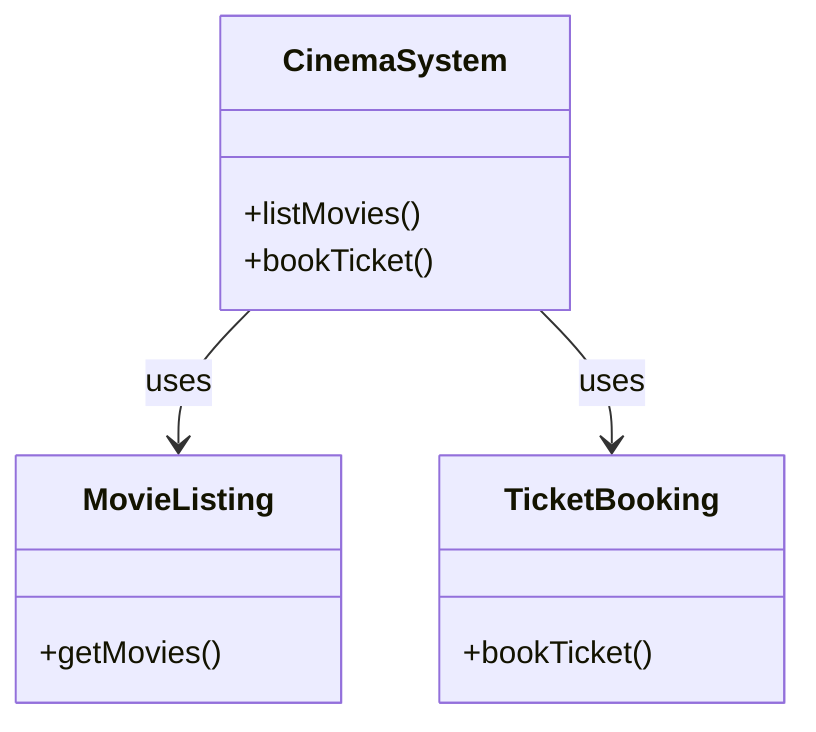
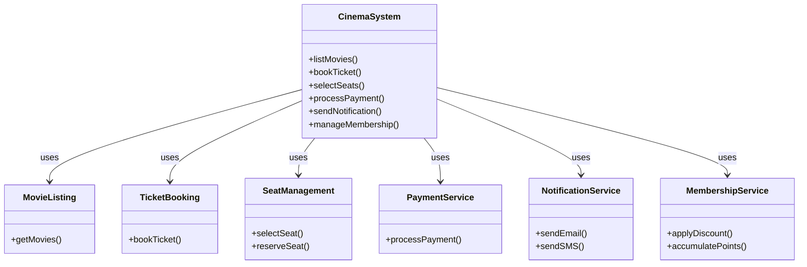
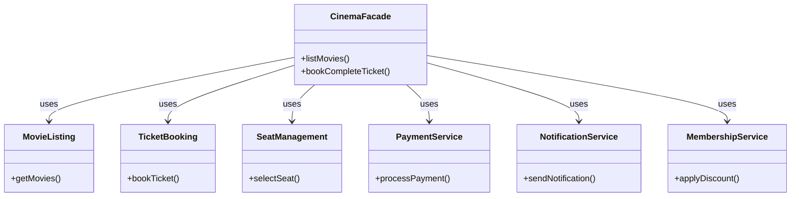
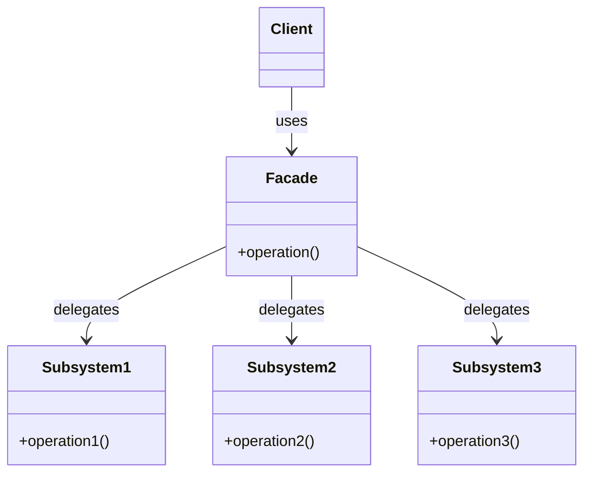
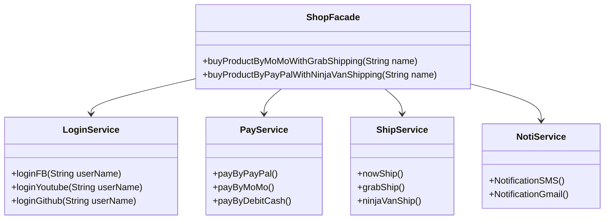

# Facade

## Khái Niệm

Khi làm việc với các hệ thống phần mềm lớn và phức tạp, việc cung cấp một giao diện đơn giản cho người dùng là một yếu tố quan trọng để đảm bảo sự tiện lợi và dễ dàng trong quá trình sử dụng. Đây chính là nơi Facade Pattern, một mẫu thiết kế cấu trúc phổ biến, thể hiện vai trò của mình. Facade Pattern giúp tạo ra một giao diện đơn giản cho một hệ thống phức tạp, giống như cách một "mặt tiền" che giấu sự rối ren và phức tạp bên trong.

### Tổng quan

- **Định Nghĩa của Pattern:** Facade Pattern cung cấp một giao diện đơn giản để tương tác với một hệ thống phức tạp, giúp che giấu sự phức tạp và các chi tiết kỹ thuật không cần thiết khỏi người dùng.

- **Mục Đích:** Mẫu thiết kế này hữu ích khi cần cung cấp một giao diện đơn giản cho các hệ thống lớn và phức tạp, giúp người dùng dễ dàng tương tác mà không cần hiểu sâu về chi tiết bên trong.

- **Ý Tưởng Cốt Lõi:** Facade Pattern tạo ra một lớp "mặt tiền" đơn giản, qua đó tất cả các yêu cầu từ phía người dùng đều được chuyển hướng một cách gọn gàng và hiệu quả. Qua đó, người dùng có thể tương tác với hệ thống một cách dễ dàng hơn mà không cần lo lắng về các chi tiết phức tạp bên trong.

## Đặt vấn đề

Hãy tưởng tượng bạn đang phát triển một hệ thống quản lý rạp chiếu phim. Ban đầu, hệ thống chỉ cần quản lý các chức năng cơ bản như hiển thị danh sách phim đang chiếu và đặt vé. Bạn sử dụng các lớp như `MovieListing` để quản lý danh sách phim và `TicketBooking` để xử lý việc đặt vé.



Khi nhu cầu ngày càng tăng, hệ thống cần tích hợp thêm nhiều chức năng phức tạp như quản lý ghế ngồi, thanh toán trực tuyến, thông báo qua email hoặc SMS, và quản lý ưu đãi thành viên. Điều này dẫn đến việc phát triển thêm nhiều lớp và dịch vụ mới: `SeatManagement`, `PaymentService`, `NotificationService`, và `MembershipService`.

- `SeatManagement` để quản lý ghế ngồi.
- `PaymentService` để xử lý các giao dịch thanh toán.
- `NotificationService` để gửi thông báo.
- `MembershipService` để quản lý các ưu đãi cho thành viên.



Với sự phát triển này, hệ thống trở nên phức tạp và khó quản lý. Người dùng, đặc biệt là nhân viên rạp chiếu phim, phải đối mặt với quy trình phức tạp khi thực hiện từng công việc như đặt vé, chọn ghế, xác nhận thanh toán, và gửi thông báo. Sự phức tạp này không chỉ làm tăng khả năng sai sót mà còn làm giảm hiệu quả và tốc độ phục vụ.

Ban đầu, giao diện người dùng chỉ cần làm quen với hai chức năng chính: `MovieListing` và `TicketBooking`. Khi thêm chức năng mới, người dùng phải học cách sử dụng nhiều hệ thống con hơn, mỗi hệ thống có giao diện và cách thức hoạt động khác nhau.

Quy trình làm việc trở nên phức tạp hơn với các bước đặt vé, chọn ghế, thanh toán, gửi thông báo, và áp dụng ưu đãi thành viên. Mỗi giao dịch yêu cầu tương tác với nhiều hệ thống con, tăng khả năng xảy ra sai sót và làm giảm tốc độ phục vụ. Điều này cũng làm tăng khó khăn trong quản lý và bảo trì hệ thống, đồng thời yêu cầu đào tạo và hỗ trợ nhân viên một cách liên tục.

Tóm lại, sự phức tạp tăng lên không chỉ ảnh hưởng đến người dùng cuối mà còn đặt gánh nặng lên nhân viên và quản lý hệ thống. Đây chính là thách thức mà Facade Pattern có thể giải quyết, giúp đơn giản hóa quy trình bằng cách cung cấp một giao diện thống nhất, giảm thiểu sự phức tạp và cải thiện hiệu quả tổng thể của hệ thống.

## Giái pháp

Để giải quyết những thách thức trong quản lý rạp chiếu phim, chúng ta có thể sử dụng Facade Pattern. Mô hình này tạo ra một giao diện đơn giản, giúp truy cập dễ dàng vào các hệ thống phụ trợ khác nhau, giảm bớt sự phức tạp và nâng cao trải nghiệm người dùng. Cách thức áp dụng Facade Pattern như sau:

1. **Tạo Lớp Facade**: Chúng ta xây dựng một lớp `CinemaFacade`, hoạt động như một trung tâm liên kết, điều phối các tương tác giữa người dùng và chức năng của hệ thống.

2. **Tích Hợp Dịch Vụ**: `CinemaFacade` sẽ kết nối với các dịch vụ như `MovieListing`, `TicketBooking`, `SeatManagement`, `PaymentService`, `NotificationService`, và `MembershipService`. Mục đích là che giấu những chi tiết kỹ thuật phức tạp, cung cấp một giao diện sử dụng đơn giản cho người dùng.

3. **Đơn Giản Hóa Giao Diện Người Dùng**: Người dùng không cần phải hiểu sâu về từng hệ thống phụ trợ. Thay vào đó, họ chỉ cần tương tác với `CinemaFacade`. Ví dụ, khi đặt vé, người dùng chỉ cần sử dụng một phương thức trên `CinemaFacade`, và các bước như chọn ghế, thanh toán, thông báo sẽ được tự động xử lý bên trong.




Sơ đồ trên đây minh họa cách `CinemaFacade` tích hợp vào hệ thống, đơn giản hóa quy trình làm việc và tạo điều kiện thuận lợi cho người dùng. Mô hình này không chỉ làm giảm độ phức tạp mà còn tăng hiệu quả hoạt động của hệ thống, giảm thiểu lỗi và cải thiện tốc độ phục vụ.

## Cấu Trúc



### Các Thành Phần

1. **Facade**: Một lớp duy nhất đóng vai trò là giao diện chính cho hệ thống con phức tạp. Facade biết chức năng nào của hệ thống con cần được kích hoạt để xử lý yêu cầu.

2. **Hệ thống con (Subsystems)**: Các lớp cấu thành hệ thống, mỗi lớp cung cấp chức năng đặc biệt. Chúng có thể làm việc độc lập hoặc tương tác với nhau.

### Tổ Chức và Tương Tác

- **Facade** cung cấp một giao diện đơn giản đến một hoặc nhiều hệ thống con phức tạp. Khi một yêu cầu đến từ client, Facade sẽ xác định xem cần kích hoạt chức năng nào từ hệ thống con để xử lý yêu cầu đó.
- **Hệ thống con** không biết về sự tồn tại của Facade; chúng xử lý các nhiệm vụ được giao mà không cần biết liệu yêu cầu đến từ Facade hay trực tiếp từ client.
- Facade có thể chọn một hoặc nhiều chức năng từ mỗi hệ thống con để hoàn thành yêu cầu, giúp giảm sự phức tạp và tương tác trực tiếp mà client cần thực hiện với hệ thống.

## Ví dụ áp dụng Facede

Trong ví dụ này, chúng ta xem xét một ứng dụng mua sắm trực tuyến, nơi mà người dùng cần thực hiện nhiều bước để mua một sản phẩm: đăng nhập, thanh toán, vận chuyển, và nhận thông báo. Mỗi bước này được xử lý bởi một service riêng biệt (LoginService, PayService, ShipService, NotiService). ShopFacade được tạo ra như một lớp facade, cung cấp một phương thức đơn giản để xử lý tất cả các bước này, giúp người dùng không cần trực tiếp tương tác với từng service.

### Sơ đồ



Sơ đồ này thể hiện mối quan hệ giữa ShopFacade và các service khác nhau. ShopFacade đóng vai trò trung gian, gọi đến các phương thức cần thiết của các service khác.

#### Ví dụ Code

LoginService.java

```java
public class LoginService {

    public void loginFB(String userName) {
        System.out.println(userName + "Login Facebook");
    }

    public void loginYoutube(String userName) {
        System.out.println(userName + "Login Youtube");
    }

    public void loginGithub(String userName) {
        System.out.println(userName + "Login Github");
    }
}
```

PayService.java

```java
public class PayService {

    public void payByPayPal() {
        System.out.println("Pay by PayPal");
    }

    public void payByMoMo() {
        System.out.println("Pay by MoMo");
    }

    public void payByDebitCash() {
        System.out.println("Pay by Debit Cash");
    }

}
```

ShipService.java

```java
public class ShipService {

    public void nowShip()
    {
        System.out.println("Now Ship");
    }

    public void grabShip()
    {
        System.out.println("Grab Ship");
    }

    public void ninjaVanShip()
    {
        System.out.println("Ninja Van Ship");
    }

}
```

NotiService.java

```java
public class NotiService {

    public void NotificationSMS() {
        System.out.println("Notification SMS");
    }

    public void NotificationGmail() {
        System.out.println("Notification Gmail");
    }

}
```

ShopFacade.java

```java
public class ShopFacade {

    private LoginService loginService;
    private PayService payService;
    private ShipService shipService;
    private NotiService notiService;

    public ShopFacade() {
        this.loginService = new LoginService();
        this.payService = new PayService();
        this.shipService = new ShipService();
        this.notiService = new NotiService();
    }

    public void buyProductByMoMoWithGrabShipping(String name) {
        loginService.loginFB(name);
        payService.payByMoMo();
        shipService.grabShip();
        notiService.NotificationSMS();
    }

    public void buyProductByPayPalWithNinjaVanShipping(String name) {
        loginService.loginGithub(name);
        payService.payByPayPal();
        shipService.ninjaVanShip();
        notiService.NotificationGmail();
    }
}
```

Demo.java

```java
public class Demo {
    public static void main(String[] args) {
        ShopFacade shopFacade = new ShopFacade();
        shopFacade.buyProductByMoMoWithGrabShipping("Nick");
        System.out.println();
        shopFacade.buyProductByPayPalWithNinjaVanShipping("Nick");
    }
}
```

Kết quả

```
NickLogin Facebook
Pay by MoMo
Grab Ship
Notification SMS

NickLogin Github
Pay by PayPal
Ninja Van Ship
Notification Gmail
```

## Khi nào áp dụng

Sử dụng khi bạn muốn có một interface đơn giản để sử dụng một chức năng phức tạo nào đó của thư viện

Khi bạn muốn phân lớp cá hệ thống con.

