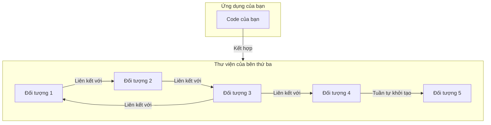
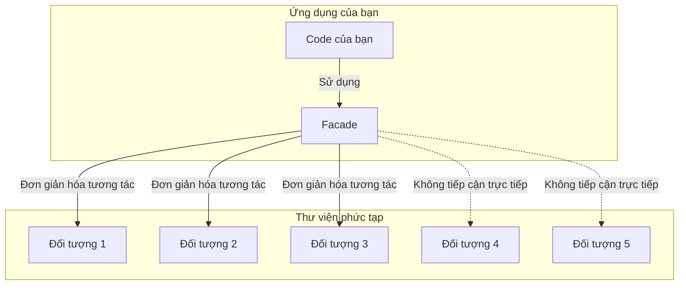
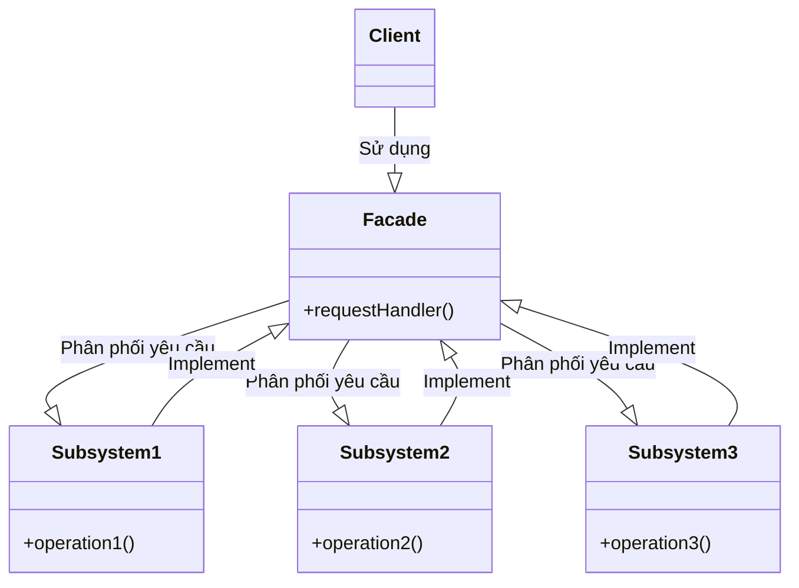

# Facade

## Khái Niệm

Khi làm việc với các hệ thống phần mềm lớn và phức tạp, việc cung cấp một giao diện đơn giản cho người dùng là một yếu tố quan trọng để đảm bảo sự tiện lợi và dễ dàng trong quá trình sử dụng. Đây chính là nơi Facade Pattern, một mẫu thiết kế cấu trúc phổ biến, thể hiện vai trò của mình. Facade Pattern giúp tạo ra một giao diện đơn giản cho một hệ thống phức tạp, giống như cách một "mặt tiền" che giấu sự rối ren và phức tạp bên trong.

### Tổng quan

- **Định Nghĩa của Pattern:** Facade Pattern cung cấp một giao diện đơn giản để tương tác với một hệ thống phức tạp, giúp che giấu sự phức tạp và các chi tiết kỹ thuật không cần thiết khỏi người dùng.

- **Mục Đích:** Mẫu thiết kế này hữu ích khi cần cung cấp một giao diện đơn giản cho các hệ thống lớn và phức tạp, giúp người dùng dễ dàng tương tác mà không cần hiểu sâu về chi tiết bên trong.

- **Ý Tưởng Cốt Lõi:** Facade Pattern tạo ra một lớp "mặt tiền" đơn giản, qua đó tất cả các yêu cầu từ phía người dùng đều được chuyển hướng một cách gọn gàng và hiệu quả. Qua đó, người dùng có thể tương tác với hệ thống một cách dễ dàng hơn mà không cần lo lắng về các chi tiết phức tạp bên trong.

## Đặt vấn đề

Hãy tưởng tượng bạn sử dụng một thư viện của bên thứ ba. Mọi chuyện sẽ không có gì cho đến khi bạn làm việc với một loạt các đối tượng trong thư viện và chúng liên kết với nhau rất phức tạp và có tuần tự khởi tạo.



Kết quả, khi đã kết hợp code của mình và thư viện thành công, thì code của ứng dụng của bạn trở nên phức tạp, khó mở rộng và bảo trì.

## Giái pháp



Facade Pattern sẽ giúp bạn trọng việc này, pattern này sẽ giúp bạn liên kết với nhiều đối tượng trong thư viện thứ ba và chỉ cung cấp cho bạn các interface đơn giản để sử dụng. Lưu ý, pattern này chỉ cung cấp một số chức năng mà người dùng thật sự  cần.

## Cấu Trúc




- Facede: Phân phối yêu của Client đến các Subsystems đảm nhận công việc.
- Subsystems: cài đặt các phương thức của mình và implement Facede.
- Client: người sử dụng Facade để tương tác với subsystem.

## Ví dụ áp dụng Facede


LoginService.java

```java
public class LoginService {

    public void loginFB(String userName) {
        System.out.println(userName + "Login Facebook");
    }

    public void loginYoutube(String userName) {
        System.out.println(userName + "Login Youtube");
    }

    public void loginGithub(String userName) {
        System.out.println(userName + "Login Github");
    }
}
```

PayService.java

```java
public class PayService {

    public void payByPayPal() {
        System.out.println("Pay by PayPal");
    }

    public void payByMoMo() {
        System.out.println("Pay by MoMo");
    }

    public void payByDebitCash() {
        System.out.println("Pay by Debit Cash");
    }

}
```

ShipService.java

```java
public class ShipService {

    public void nowShip()
    {
        System.out.println("Now Ship");
    }

    public void grabShip()
    {
        System.out.println("Grab Ship");
    }

    public void ninjaVanShip()
    {
        System.out.println("Ninja Van Ship");
    }

}
```

NotiService.java

```java
public class NotiService {

    public void NotificationSMS() {
        System.out.println("Notification SMS");
    }

    public void NotificationGmail() {
        System.out.println("Notification Gmail");
    }

}
```

ShopFacade.java

```java
public class ShopFacade {

    private LoginService loginService;
    private PayService payService;
    private ShipService shipService;
    private NotiService notiService;

    public ShopFacade() {
        this.loginService = new LoginService();
        this.payService = new PayService();
        this.shipService = new ShipService();
        this.notiService = new NotiService();
    }

    public void buyProductByMoMoWithGrabShipping(String name) {
        loginService.loginFB(name);
        payService.payByMoMo();
        shipService.grabShip();
        notiService.NotificationSMS();
    }

    public void buyProductByPayPalWithNinjaVanShipping(String name) {
        loginService.loginGithub(name);
        payService.payByPayPal();
        shipService.ninjaVanShip();
        notiService.NotificationGmail();
    }
}
```

Demo.java

```java
public class Demo {
    public static void main(String[] args) {
        ShopFacade shopFacade = new ShopFacade();
        shopFacade.buyProductByMoMoWithGrabShipping("Nick");
        System.out.println();
        shopFacade.buyProductByPayPalWithNinjaVanShipping("Nick");
    }
}
```

Kết quả

```
NickLogin Facebook
Pay by MoMo
Grab Ship
Notification SMS

NickLogin Github
Pay by PayPal
Ninja Van Ship
Notification Gmail
```

## Khi nào áp dụng

Sử dụng khi bạn muốn có một interface đơn giản để sử dụng một chức năng phức tạo nào đó của thư viện

Khi bạn muốn phân lớp cá hệ thống con.

