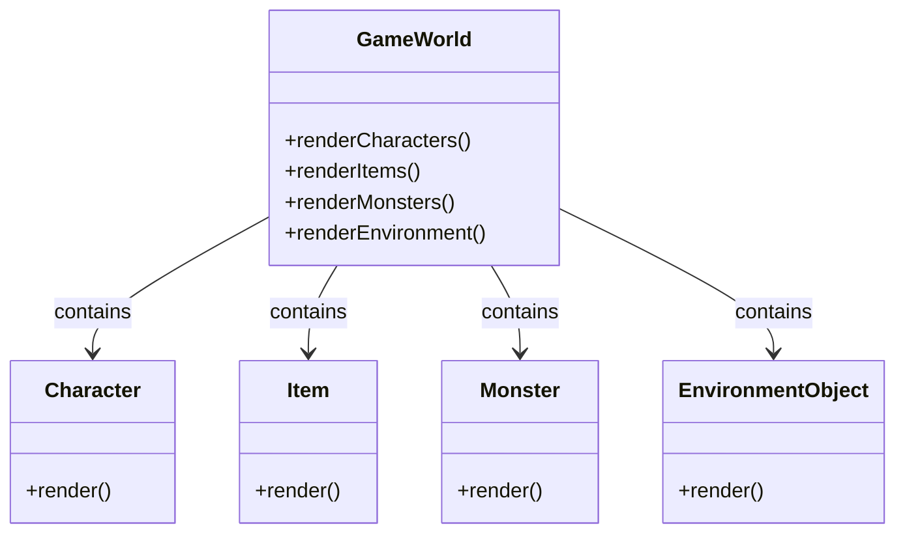
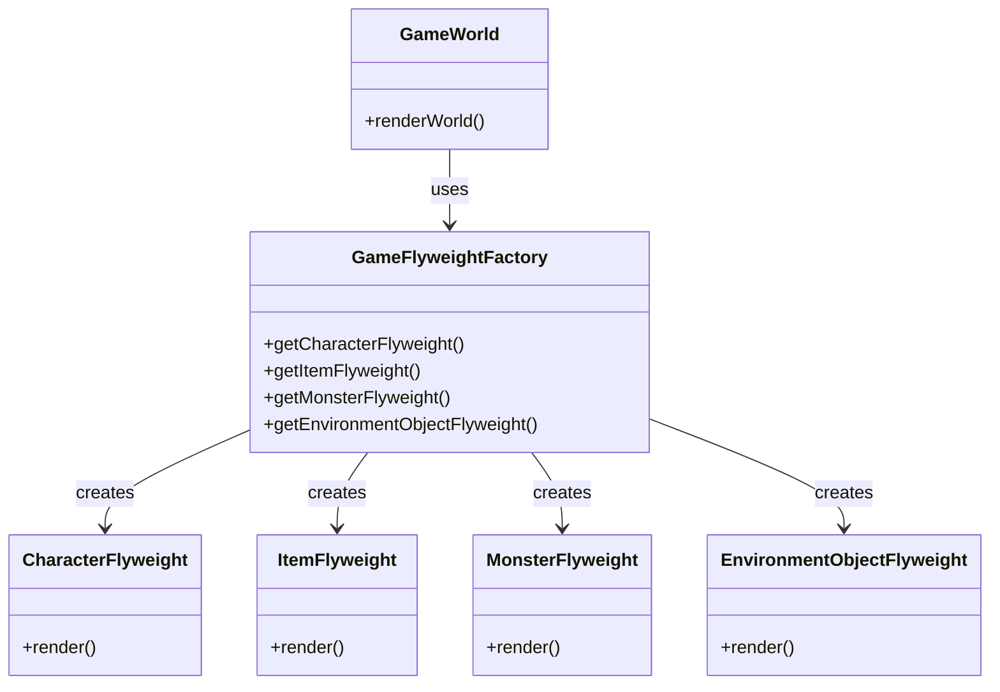

# Flyweight Pattern

## Khái Niệm

Khi làm việc với các hệ thống phần mềm lớn và phức tạp, việc quản lý hiệu quả bộ nhớ và tài nguyên là vô cùng quan trọng. Đây là nơi mà mẫu thiết kế Flyweight, một mẫu thiết kế cấu trúc, thể hiện vai trò của mình. Flyweight Pattern giúp giảm bớt lượng bộ nhớ cần thiết cho ứng dụng bằng cách chia sẻ những đối tượng tương tự nhau đến mức tối đa.

### Tổng quan

- **Định Nghĩa của Pattern:** Flyweight Pattern là một mẫu thiết kế sử dụng chia sẻ để hỗ trợ một lượng lớn đối tượng nhỏ mà không làm giảm hiệu suất. Mẫu này giúp giảm thiểu việc sử dụng bộ nhớ bằng cách chia sẻ càng nhiều trạng thái giữa các đối tượng càng tốt.

- **Mục Đích:** Mẫu thiết kế này hữu ích khi cần tạo ra một số lượng lớn đối tượng nhỏ trong một hệ thống, nơi mà việc sử dụng bộ nhớ và tài nguyên là một vấn đề cần được xem xét kỹ lưỡng.

- **Ý Tưởng Cốt Lõi:** Flyweight Pattern tập trung vào việc tạo ra các đối tượng "flyweight" mà chia sẻ trạng thái chung để giảm thiểu việc sử dụng bộ nhớ. Trong mô hình này, mỗi đối tượng flyweight đều có thể đại diện cho nhiều đối tượng khác, giúp tiết kiệm tài nguyên mà không ảnh hưởng đến tính toàn vẹn và hiệu suất của ứng dụng.

## Đặt vấn đề

Hãy tưởng tượng bạn đang phát triển một trò chơi trực tuyến đa người chơi (MMO) với một thế giới rộng lớn, nơi người chơi có thể tương tác với nhau và môi trường xung quanh. Trong trò chơi này, có hàng ngàn đối tượng khác nhau như nhân vật, vật phẩm, quái vật, và các yếu tố môi trường (cây, đá, nhà cửa).



Ban đầu, mỗi đối tượng trong trò chơi này được xử lý như một thực thể riêng biệt. Mỗi nhân vật, vật phẩm, quái vật, và yếu tố môi trường đều có bộ dữ liệu riêng, bao gồm hình ảnh, vị trí, và trạng thái. Điều này làm cho hệ thống yêu cầu một lượng lớn bộ nhớ và tài nguyên xử lý để duy trì trạng thái và hiển thị của hàng ngàn đối tượng cùng một lúc.

- Các nhân vật có thể chia sẻ nhiều thuộc tính chung như hình dáng cơ bản, bộ kỹ năng, và trang bị.
- Vật phẩm và quái vật cũng tương tự, với nhiều đặc điểm chung nhưng lại được biểu diễn như các đối tượng độc lập.
- Các yếu tố môi trường như cây cối, đá, và nhà cửa có thể xuất hiện nhiều lần trong trò chơi, nhưng mỗi lần lại được tải như một đối tượng riêng.

Vấn đề này gây ra sự chậm trễ trong quá trình tải trò chơi và cả trong lúc chơi, ảnh hưởng đến trải nghiệm người chơi. Đặc biệt trong môi trường MMO, nơi sự mượt mà và phản hồi nhanh là yếu tố quan trọng, việc tối ưu hóa hiệu suất và bộ nhớ trở thành một yêu cầu cấp thiết.

Đây chính là lúc Flyweight Pattern có thể được áp dụng. Mẫu thiết kế này giúp tối ưu hóa việc sử dụng bộ nhớ bằng cách chia sẻ các đối tượng có thuộc tính chung, giảm bớt số lượng đối tượng cần tải và quản lý. Điều này không chỉ giúp tăng cường hiệu suất mà còn cải thiện trải nghiệm người chơi, đặc biệt trong một môi trường trực tuyến đa người chơi.

## Giải pháp


Để giải quyết những thách thức trong quản lý trò chơi trực tuyến đa người chơi, việc sử dụng Flyweight Pattern là một lựa chọn hợp lý. Mô hình này tập trung vào việc tối ưu hóa bộ nhớ và hiệu suất bằng cách chia sẻ các đối tượng chung giữa nhiều thực thể. Cách thức áp dụng Flyweight Pattern như sau:

1. **Xác định Đối tượng Flyweight**: Phân tích và xác định những phần thông tin có thể được chia sẻ giữa các đối tượng. Trong trò chơi MMO, điều này có thể bao gồm dữ liệu về hình ảnh, animations, bản đồ, đặc điểm của nhân vật, vật phẩm, và yếu tố môi trường.

2. **Tạo Flyweight Factory**: Xây dựng một `GameFlyweightFactory` để quản lý việc tạo và tái sử dụng các đối tượng Flyweight. Factory này sẽ cung cấp một cách để lấy hoặc tạo đối tượng Flyweight dựa trên các thông tin cần thiết.

3. **Áp dụng Flyweight trong Game World**: Trong lớp `GameWorld`, thay vì tạo ra hàng ngàn thực thể riêng lẻ, sử dụng `GameFlyweightFactory` để tạo hoặc lấy các đối tượng Flyweight. Điều này giúp giảm lượng bộ nhớ cần thiết và tối ưu hóa hiệu suất khi hiển thị và quản lý các đối tượng trong trò chơi.



Sơ đồ trên minh họa cách `GameFlyweightFactory` được tích hợp vào `GameWorld`, giúp giảm bớt việc tạo và quản lý đối tượng riêng biệt cho mỗi thực thể trong trò chơi. Mô hình này không chỉ giúp giảm thiểu lượng bộ nhớ cần thiết mà còn tối ưu hóa quá trình xử lý, mang lại trải nghiệm mượt mà và hiệu quả hơn cho người chơi.

## Ví dụ áp dụng Flyweight Pattern

```java
// Giả sử đây là một ví dụ về việc sử dụng Flyweight Pattern trong việc quản lý các đối tượng hình vẽ trong một ứng dụng đồ họa.

public interface Shape {
    void draw();
}

public class Circle implements Shape {
    private String color;
    // Constructor và các phương thức get/set tại đây

    @Override
    public void draw() {
        // Triển khai phương thức vẽ
    }
}

public class FlyweightFactory {
    private static final Map<String, Shape> shapes = new HashMap<>();

    public static Shape getCircle(String color) {
        if (shapes.containsKey(color)) {
            return shapes.get(color);
        }

        Shape newCircle = new Circle(color);
        shapes.put(color, newCircle);
        return newCircle;
    }
}

// Trong code client
public class FlyweightExample {
    public static void main(String[] args) {
        Shape circle1 = FlyweightFactory.getCircle("Red");
        Shape circle2 = FlyweightFactory.getCircle("Green");
        // Sử dụng circle1 và circle2
    }
}
```

## Khi nào áp dụng

Flyweight Pattern nên được sử dụng khi ứng dụng của bạn cần tạo ra một số lượng lớn các đối tượng, đặc biệt là khi các đối tượng này có trạng thái nội tại tương tự hoặc không đổi, và việc này làm tăng chi phí về mặt bộ nhớ đáng kể. Điều này đặc biệt