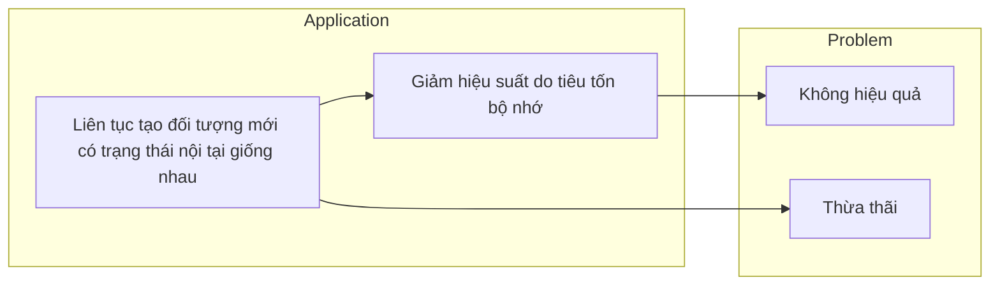
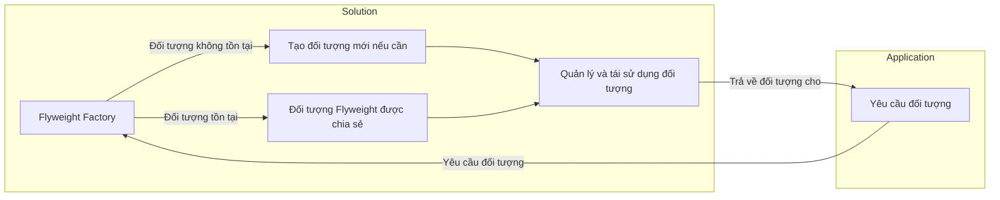
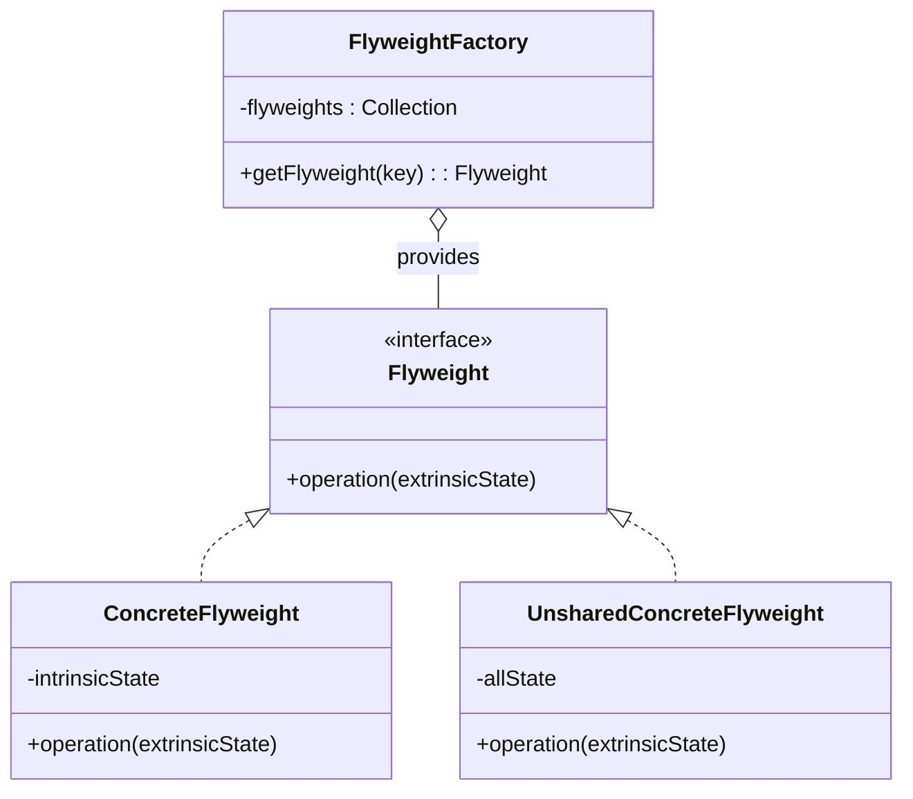

# Flyweight Pattern

## Khái niệm

Flyweight Pattern là một mẫu thiết kế cấu trúc giúp giảm thiểu tài nguyên bộ nhớ được sử dụng bằng cách chia sẻ đối tượng giữa các ngữ cảnh khác nhau. Nó được áp dụng trong các trường hợp cần tạo một số lượng lớn đối tượng có trạng thái nội tại tương tự, giúp tiết kiệm bộ nhớ bằng cách chia sẻ những đối tượng này thay vì tạo mới mỗi lần cần sử dụng.

## Đặt vấn đề



Trong các ứng dụng cần sử dụng lượng lớn đối tượng, việc này có thể tiêu tốn một lượng lớn bộ nhớ và làm giảm hiệu suất của ứng dụng. Đặc biệt, khi đối tượng có trạng thái nội tại giống nhau hoặc không đổi, việc tạo mới liên tục là không hiệu quả và không cần thiết.

## Giải pháp



Flyweight Pattern giải quyết vấn đề này bằng cách chia sẻ các đối tượng thông qua một cơ chế quản lý, giúp việc tạo và lưu trữ các đối tượng được hiệu quả hơn. Thay vì mỗi lần cần một đối tượng, bạn chỉ cần yêu cầu từ "Flyweight Factory" - nếu đối tượng đã tồn tại, nó sẽ được trả về cho bạn; nếu không, một đối tượng mới sẽ được tạo và lưu trữ để sử dụng lần sau.

## Cấu Trúc



- **Flyweight**: Đây có thể là một interface hoặc abstract class, định nghĩa các phương thức mà một "flyweight" cần phải có.
- **ConcreteFlyweight**: Triển khai các phương thức của Flyweight. Đối tượng của lớp này phải có trạng thái nội tại không thay đổi để có thể được chia sẻ.
- **UnsharedConcreteFlyweight**: Triển khai các phương thức của Flyweight nhưng không thể chia sẻ. Đối tượng này sẽ có trạng thái bên ngoài hoặc thay đổi.
- **FlyweightFactory**: Sử dụng Factory Pattern để quản lý và trả về các đối tượng Flyweight. Nó lưu trữ một pool của các đối tượng Flyweight để tái sử dụng.

## Ví dụ áp dụng Flyweight Pattern

```java
// Giả sử đây là một ví dụ về việc sử dụng Flyweight Pattern trong việc quản lý các đối tượng hình vẽ trong một ứng dụng đồ họa.

public interface Shape {
    void draw();
}

public class Circle implements Shape {
    private String color;
    // Constructor và các phương thức get/set tại đây

    @Override
    public void draw() {
        // Triển khai phương thức vẽ
    }
}

public class FlyweightFactory {
    private static final Map<String, Shape> shapes = new HashMap<>();

    public static Shape getCircle(String color) {
        if (shapes.containsKey(color)) {
            return shapes.get(color);
        }

        Shape newCircle = new Circle(color);
        shapes.put(color, newCircle);
        return newCircle;
    }
}

// Trong code client
public class FlyweightExample {
    public static void main(String[] args) {
        Shape circle1 = FlyweightFactory.getCircle("Red");
        Shape circle2 = FlyweightFactory.getCircle("Green");
        // Sử dụng circle1 và circle2
    }
}
```

## Khi nào áp dụng

Flyweight Pattern nên được sử dụng khi ứng dụng của bạn cần tạo ra một số lượng lớn các đối tượng, đặc biệt là khi các đối tượng này có trạng thái nội tại tương tự hoặc không đổi, và việc này làm tăng chi phí về mặt bộ nhớ đáng kể. Điều này đặc biệt