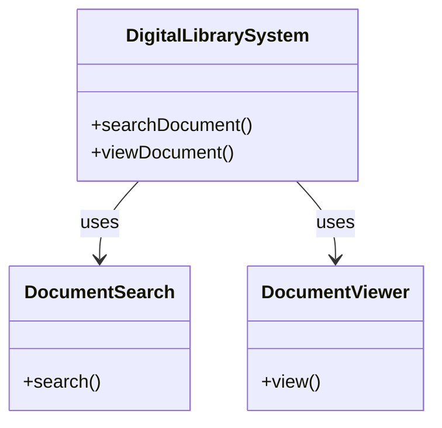
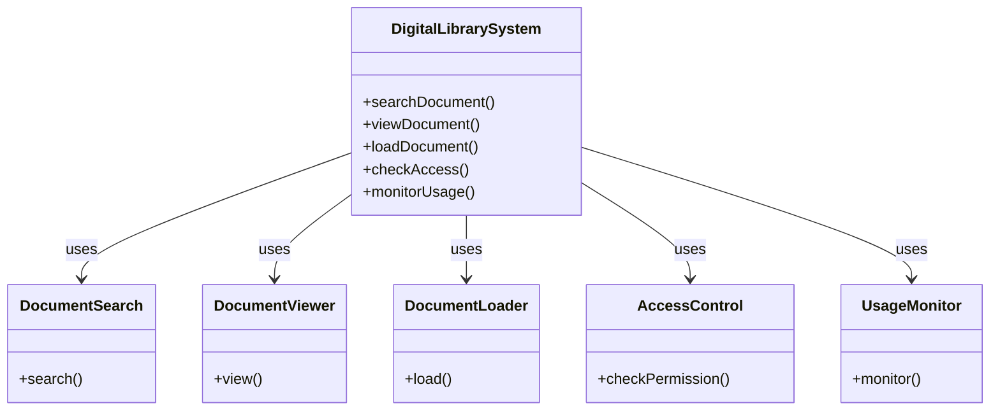
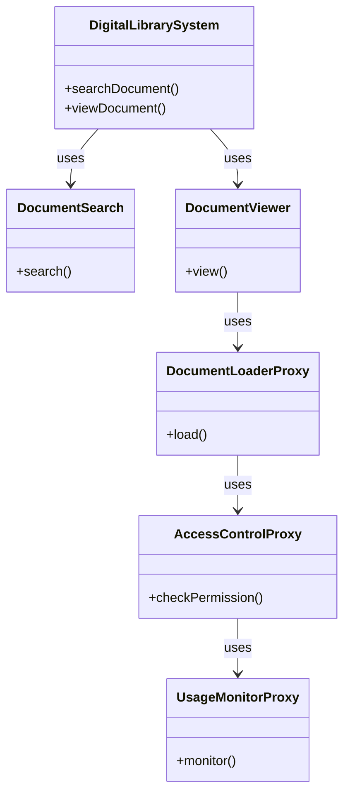
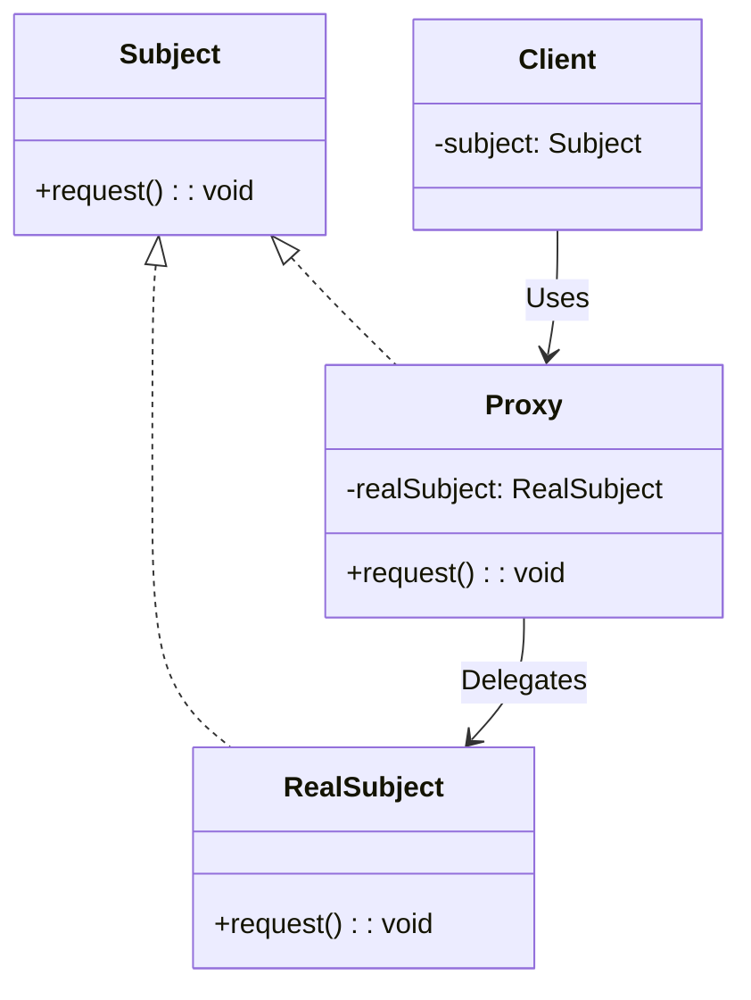

# Proxy Pattern

## Khái Niệm

Trong lĩnh vực phần mềm, một trong những thách thức là làm thế nào để quản lý truy cập đến các nguồn lực và dịch vụ một cách hiệu quả. Đây là nơi mà Proxy Pattern, một phương pháp thiết kế phổ biến, trở nên rất hữu ích. Nó không chỉ giúp điều chỉnh quyền truy cập mà còn cung cấp các tính năng bổ sung như khởi tạo khi cần (lazy initialization), bảo mật, và ghi nhật ký, mà không cần thay đổi đối tượng ban đầu.

### Tổng quan

- **Định Nghĩa của Pattern:** Proxy Pattern tạo ra một đại diện, hay còn gọi là 'proxy', để quản lý việc truy cập vào một đối tượng khác. Điều này giúp kiểm soát cách đối tượng này được dùng và truy cập trong hệ thống.

- **Mục Đích:** Mẫu thiết kế này rất hữu ích để kiểm soát hoặc mở rộng chức năng của một đối tượng mà không cần phải sửa đổi mã nguồn gốc của nó. Nó thường được dùng trong việc quản lý tài nguyên, cải thiện bảo mật và tăng hiệu suất.

- **Ý Tưởng Cốt Lõi:** Proxy Pattern chủ yếu là việc tạo ra một lớp trung gian, hay 'proxy', giúp quản lý truy cập một cách chặt chẽ đến đối tượng gốc. Nó không chỉ kiểm soát quyền truy cập mà còn cung cấp cơ hội để cải thiện hiệu suất và bảo mật thông qua các phương pháp như khởi tạo khi cần và kiểm soát truy cập.


## Đặt Vấn Đề 

Tưởng tượng bạn đang xây dựng một hệ thống thư viện số cho việc lưu trữ và truy cập các tài liệu quan trọng. Ban đầu, hệ thống này chỉ đơn giản gồm các chức năng cơ bản như tìm kiếm tài liệu (`DocumentSearch`) và xem tài liệu (`DocumentViewer`).



Khi hệ thống phát triển, bạn muốn thêm vào các tính năng như kiểm soát quyền truy cập dựa trên vai trò người dùng, tải tài liệu từ các nguồn ngoại tuyến, và giám sát việc sử dụng tài liệu. Điều này dẫn đến việc phải phát triển thêm nhiều lớp và dịch vụ mới, làm tăng độ phức tạp của hệ thống.

### Khó Khăn và Vấn Đề
- **Hiệu Suất**: Tải tài liệu lớn hoặc từ nguồn ngoại tuyến có thể làm chậm hệ thống, đặc biệt khi nhiều người dùng cùng truy cập.
- **Bảo Mật**: Kiểm soát quyền truy cập và bảo vệ thông tin nhạy cảm trở nên khó khăn và phức tạp.
- **Quản Lý Tài Nguyên**: Theo dõi và giám sát việc sử dụng tài liệu đòi hỏi cơ chế phức tạp và tốn kém tài nguyên hệ thống.




Khi không sử dụng Proxy Pattern, mỗi tương tác với hệ thống - từ tìm kiếm đến xem và tải tài liệu - có thể trở nên chậm chạp và không an toàn. Việc xử lý trực tiếp mọi yêu cầu cũng làm tăng khả năng quá tải hệ thống và gặp phải các vấn đề bảo mật.

## Giải pháp

Để tối ưu hóa hệ thống thư viện số đang ngày càng phức tạp và đa năng, việc áp dụng Proxy Pattern là một giải pháp hữu hiệu. Proxy Pattern giúp kiểm soát tương tác với hệ thống, nâng cao hiệu suất, và tăng cường bảo mật. Dưới đây là cách thức triển khai Proxy Pattern:

1. **Tạo Proxy Classes**: Các lớp proxy như `DocumentLoaderProxy`, `AccessControlProxy`, và `UsageMonitorProxy` được thiết kế để kiểm soát và quản lý quyền truy cập đến các tài nguyên. Các lớp này hoạt động như trung gian, xử lý các tác vụ phức tạp và nhạy cảm.

2. **Cải Thiện Hiệu Suất và Bảo Mật**: Các lớp Proxy có thể cache dữ liệu, thực hiện xác thực, và giám sát quyền truy cập. Điều này giúp giảm thiểu tải không cần thiết và tăng tốc độ xử lý, đồng thời bảo vệ thông tin nhạy cảm.

3. **Đơn Giản Hóa Quy Trình**: Việc sử dụng Proxy giúp giảm độ phức tạp trong việc quản lý các chức năng của hệ thống, tạo điều kiện thuận lợi cho việc mở rộng và bảo trì.

Sơ đồ sau đây minh họa cách thức các Proxy được tích hợp và hoạt động trong hệ thống:



Trong sơ đồ này, `DigitalLibrarySystem` tương tác trực tiếp với `DocumentSearch` và `DocumentViewer`. Khi cần tải và xem tài liệu, `DocumentViewer` sẽ thông qua `DocumentLoaderProxy`. Proxy này tiếp tục giao tiếp với `AccessControlProxy` để kiểm tra quyền truy cập và `UsageMonitorProxy` để theo dõi sử dụng, đảm bảo quá trình này được thực hiện một cách an toàn và hiệu quả.

## Cấu Trúc



- **Subject**: là một interface định nghĩa các phương thức chung của Proxy và RealSubject.
- **Proxy**: Lớp Proxy duy trì tham chiếu đến RealSubject. Sau khi hoàn thành quá trình xử lý RealSubject (Khởi tạo, quản lý bộ nhớ,....), nó chuyển các yêu cầu đến RealSubject.
- **RealSubject**: lớp thực sự thực hiện các thao tác. Đây là đối tượng Proxy đại diện.
- **Client**: Đối tượng sử dụng RealSubject nhưng thông qua Proxy.

## Ví dụ áp dụng Decorator Pattern

Video.kt

```kotlin
interface Video {
    fun showVideo()
}
```

RealVideo.kt

```kotlin
class RealVideo : Video {

    var url : String

    constructor(url: String) {
        this.url = url
        println("Video loaded: ${this.url}")
    }


    override fun showVideo() {
        println("Video Showed: ${this.url}")
    }

}
```

ProxyVideo.kt

```kotlin
class ProxyVideo : Video {


    private var realVideo : RealVideo ? = null
    private var url: String

    constructor(url: String) {
        this.url = url
    }


    override fun showVideo() {
        if (realVideo == null) {
            realVideo = RealVideo(this.url)
        } else {
            println("Video already exits:${this.url}")
        }
        realVideo?.showVideo()
    }
}
```

main.kt

```kotlin
fun main(args: Array<String>) {
    var proxyVideo : ProxyVideo
    proxyVideo = ProxyVideo("hoclaptrinh.mp4")
    proxyVideo.showVideo()
    println()
    proxyVideo.showVideo()
}
```

Kết quả

```
Video loaded: hoclaptrinh.mp4
Video Showed: hoclaptrinh.mp4

Video already exits:hoclaptrinh.mp4
Video Showed: hoclaptrinh.mp4

Process finished with exit code 0
```

## Khi nào áp dụng

Lazy initialization (virtual proxy).Khi bạn có một lớp rất nặng, mất rất nhiều tài nguyên khởi tạo và vận hành nó nhưng thỉnh thoảng bạn mới cần đến.

Accesss control (protection proxy). Khi bạn chỉ muốn các đội tượng đặc biệt sử dụng dịch vụ một đối tượng nào đó,

Điều khiển một dịch vụ từ xa (remote proxy). Đây là khi đối tượng dịch vụ đặt trên server ở xa.

Logging requests (Logging proxy). Khi bạn muốn lưu lại các request của đối tượng.

Caching request results (caching proxy). Lưu trữ kết quả request và quản lý vòng đời của bộ nhớ.


