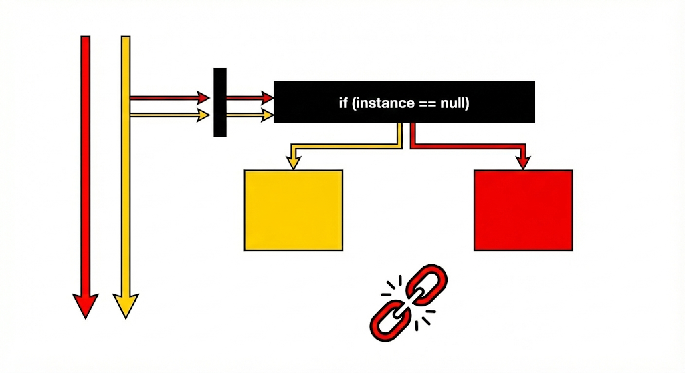

# Singleton Pattern Example

Thư mục này minh họa quá trình phát triển Singleton Pattern từ cơ bản đến hoàn thiện, giúp bạn hiểu rõ **tại sao** chúng ta cần các kỹ thuật phức tạp như `synchronized` hay `volatile`.

## 1. Mức độ cơ bản: `BasicSingleton.java` (Naive)
Đây là cách cài đặt đơn giản nhất (Lazy Initialization):
- Kiểm tra `if (instance == null)` thì tạo mới.
- **Vấn đề**: Không an toàn khi chạy đa luồng (Non Thread-safe).

### Tại sao lỗi? (Race Condition)
Khi 2 luồng (Thread A và Thread B) cùng chạy đến dòng kiểm tra `if (instance == null)` **cùng một thời điểm**:
1. Thread A thấy `null`, lọt vào trong để tạo mới.
2. Thread B (chưa kịp thấy A tạo xong) cũng thấy `null`, và cũng lao vào tạo mới.
3. -> **Kết quả**: 2 đối tượng khác nhau được tạo ra. Singleton bị vỡ!



**Minh chứng từ Demo (`SingletonDemo.java`):**
```text
==========================================
   DEMO 1: Basic Singleton (Cố tình làm lỗi)   
==========================================
Thread-Basic-2 nhận được: ... | Hash: 572391714
Thread-Basic-1 nhận được: ... | Hash: 1149800592
=> HashCode khác nhau chứng tỏ đây là 2 object riêng biệt!
```

## 2. Giải pháp: `ThreadSafeSingleton.java`
Để khắc phục, chúng ta sử dụng kỹ thuật **Double-Checked Locking**:
1. Keyword `synchronized`: Đảm bảo chỉ 1 luồng được phép tạo object tại một thời điểm.
2. Keyword `volatile`: Đảm bảo khi instance được khởi tạo, các luồng khác sẽ "nhìn thấy" ngay lập tức sự thay đổi đó trong bộ nhớ.

**Kết quả sau khi fix:**
```text
==========================================
   DEMO 2: Thread-Safe Singleton (Đa luồng)  
==========================================
Thread 1 nhận được: LUONG_1
Thread 2 nhận được: LUONG_1
=> Cả 2 luồng đều nhận về cùng một instance duy nhất.
```

## 3. Ví dụ thực tế: `DatabaseConnection.java`
Mô phỏng 1 class quản lý kết nối cơ sở dữ liệu. Trong thực tế, việc tạo connection rất tốn kém tài nguyên, nên Singleton là lựa chọn hoàn hảo để chỉ tạo 1 kết nối và dùng chung cho toàn bộ app.

## Cách chạy demo

Bạn có thể chạy file `SingletonDemo.java` trực tiếp trong IntelliJ IDEA hoặc dùng lệnh Gradle:

```bash
./gradlew run
```
